# 🌌 DeVana: Sovereign Master Documentation
**Generated on:** June 7, 2026
**Architect:** Dolores (Sovereign Omniscient Architect)

---

## 📑 Table of Contents (Virtual)
This document is a unified synthesis of the entire DeVana architectural lake. It includes Optimization, GUI, API, Library, and Physics domains.

---


================================================================================
## SOURCE: Documents/INDEX.md
================================================================================


# DeVana Documentation Index

Welcome to the comprehensive documentation for the **DeVana: Dynamic Vibration Absorber Optimization Framework**.

## 1. Sovereign Documentation Guilds (Comprehensive Suite)
Exhaustive, visualization-rich documentation generated by the Dolores Sovereign Guilds. These sections contain deep-dive Mermaid flowcharts, class hierarchies, state transitions, and exact mathematical formulations.
- **[Optimization Guild Index](Optimization_Guild/README.md)**: Deep dive into GA codes, algorithm hierarchy, RL workers, and generalized fitness functions.
- **[GUI & Architecture Guild Index](GUI_Guild/README.md)**: Overarching software architecture, Mixin-based UI composition, Signal/Slot event flow, and PyQt5 components.
- **[API & Devana Library Guild Index](API_Library_Guild/README.md)**: Dedicated Python library features, ML/Surrogate models, PINN solvers, and headless REST API flow.
- **[Physics & Analysis Guild Index](Physics_Guild/README.md)**: Core FRF engines, mathematical modeling, Sobol sensitivity data flow, and Continuous Beam finite element analysis.

## 2. Legacy Core Algorithms & Optimization
Detailed flowcharts and explanations of the optimization algorithms, objective formulations, and adaptive logic implemented in DeVana.
- [Objective Function Formulation](Algorithms/ObjectiveFunction.md)
- [Genetic Algorithm (GA)](Algorithms/GA.md)
- [Particle Swarm Optimization (PSO)](Algorithms/PSO.md)
- [Differential Evolution (DE)](Algorithms/DE.md)
- [Simulated Annealing (SA)](Algorithms/SA.md)
- [Covariance Matrix Adaptation Evolution Strategy (CMA-ES)](Algorithms/CMAES.md)
- [Multi-Objective Genetic Algorithm (MOGA)](Algorithms/MOGA.md)
- [Non-dominated Sorting Genetic Algorithm II (NSGA-II)](Algorithms/NSGA2.md)
- [Reinforcement Learning (RL)](Algorithms/RL.md)

## 3. Legacy Analysis, Modeling & Metrics
In-depth looks at the physics engines, statistical assessment protocols, and computational benchmarking.
- [Mathematical Model (2DOF-3DOF)](Analysis/MathematicalModel.md)
- [PINN System Identification](Analysis/PINNIdentification.md)
- [Frequency Response Function (FRF) Algorithms](Analysis/FRF.md)
- [Statistical Evaluation & Optimal Ranges](Analysis/StatisticalEvaluation.md)
- [Sobol Sensitivity Analysis](Analysis/Sobol.md)
- [Computational Metrics](Analysis/Metrics.md)

## 4. Legacy Core Components & UI
Understanding the software architecture, data flow, and user interface components.
- [Software Architecture & Data Flow](CoreComponents/Architecture.md)
- [Main Application Window](CoreComponents/MainWindow.md)
- [Intelligent Seeding Strategies](CoreComponents/Seeding.md)
- [Continuous Beam Analysis (Under Construction)](CoreComponents/ContinuousBeam.md)
- [Microchip Controller (Under Construction)](CoreComponents/Microchip.md)


================================================================================
## SOURCE: Documents/Optimization_Guild/README.md
================================================================================


# Optimization Domain Master Index

This document serves as the ground truth index for the multi-faceted optimization capabilities within DeVana. It maps out all available algorithms, their configurations, and specific architectural implementations.

## Genetic Algorithm Family
*   **[Genetic Algorithm (GA)](GA.md):** The core optimizer featuring ML/RL adaptive controllers, PINN acceleration, multiple seeding strategies (QMC, LHS, Neural, Memory), and an enhanced cost-benefit analysis fitness function.
*   **[Non-dominated Sorting Genetic Algorithm II (NSGA-II)](NSGA2.md):** Multi-objective algorithm tracking Performance, Sparsity, and Cost using Pareto fronts and Hypervolume metrics.
*   **[Multi-Objective Genetic Algorithm (MOGA)](MOGA.md):** A streamlined multi-objective worker focused on efficient execution across multiple independent runs.
*   **[Adaptive Value-Encoded Algorithm (AdaVEA)](AdaVEA.md):** Specialized multi-objective algorithm with heuristic initialization (biasing towards lower bounds for sparsity) and time-decaying crossover/mutation rates.

## Swarm & Evolutionary Strategies
*   **[Particle Swarm Optimization (PSO)](PSO.md):** Simulates flocking behavior. Features adaptive inertia/acceleration coefficients, topological neighborhoods (Global, Ring, Von Neumann, Random), and multiple boundary handling strategies.
*   **[Covariance Matrix Adaptation Evolution Strategy (CMA-ES)](CMAES.md):** Advanced optimizer for non-linear problems. Updates a multivariate normal distribution based on success. Includes ML/RL sigma step-size controllers.
*   **[Differential Evolution (DE)](DE.md):** Population-based optimizer featuring strategies like `rand/1`, `best/1`, and `current-to-best/1`, with adaptive F and CR mechanisms (JADE, SaDE) and built-in Sobol sensitivity analysis capabilities.

## Probabilistic Search
*   **[Simulated Annealing (SA)](SA.md):** Single-candidate explorer utilizing a cooling schedule and Metropolis-Hastings acceptance criteria. Incorporates ML/RL controllers to dynamically adapt step-size, cooling rate, and temperature.

## Machine Learning & Reinforcement Learning
*   **[Reinforcement Learning (RL)](RL.md):** Continuous optimization using a Deep Deterministic Policy Gradient (DDPG) approach for direct policy generation. Supports Sobol parameter ranking prior to training and experience replay buffer management.

## Optimization Workers (Core Logic)
These files contain the exhaustive documentation for the backend worker threads that execute the algorithms.

### Evolutionary & Swarm Workers
- [GAWorker](Workers/GAWorker.md) - Genetic Algorithm backend.
- [PSOWorker](Workers/PSOWorker.md) - Particle Swarm Optimization backend.
- [DEWorker](Workers/DEWorker.md) - Differential Evolution backend.
- [SAWorker](Workers/SAWorker.md) - Simulated Annealing backend.
- [CMAESWorker](Workers/CMAESWorker.md) - CMA-ES backend.
- [NSGA2Worker](Workers/NSGA2Worker.md) - NSGA-II backend.
- [MOGAWorker](Workers/MOGAWorker.md) - Multi-Objective GA backend.
- [AdaVEAWorker](Workers/AdaVEAWorker.md) - Adaptive Vibration Evolutionary Algorithm backend.

### ML & Analysis Workers
- [AIWorker](Workers/AIWorker.md) - LLM and Engineering Assistant backend.
- [FRFWorker](Workers/FRFWorker.md) - Frequency Response Function backend.
- [SobolWorker](Workers/SobolWorker.md) - Sobol sensitivity analysis backend.
- [PINNWorker](Workers/PINNWorker.md) - PINN training and inference worker.
- [PINNSolver](Workers/PINNSolver.md) - High-speed physics-informed solver.
- [NeuralSeeder](Workers/NeuralSeeder.md) - Intelligent population seeding.
- [NeuralSurrogate](Workers/NeuralSurrogate.md) - Surrogate model acceleration.
- [MemorySeeder](Workers/MemorySeeder.md) - Historical result based seeding.

## Advanced Domain Concepts
*   **[GA Hierarchy & Variants](GA_Hierarchy.md):** Deep-dive trace of how various sub-systems (ML Bandit, RL, PINN, Surrogate Screening, Smart Mutation, Advanced Seeding) alter the execution logic and flow of the evolutionary algorithms.

## Common Architecture Mechanisms
All optimizers in this domain share the following architectural traits:
1.  **Multi-Threading:** Execution is wrapped in PyQt `QThread` or `QObject` to preserve GUI responsiveness.
2.  **Physics Acceleration:** Seamless routing to either the exact `FRF.py` engine or a `PINNSolver` for near-instant scalar prediction (with online learning hooks).
3.  **Sparsity Penalization:** Fitness functions are inherently regularized using $L_0$/$L_1$ norms (`sparsity_tau`, `sparsity_alpha`) to drive solutions toward manufacturability.
4.  **Signal Emission:** Comprehensive state logging via Qt signals (`progress`, `generation_metrics`, `finished`) for real-time dashboard plotting.


================================================================================
## SOURCE: Documents/GUI_Guild/README.md
================================================================================


# DeVana GUI & Architecture Guild

## Overview
This directory contains hyper-exhaustive documentation for the DeVana Graphical User Interface (GUI) and its underlying Mixin-based architecture. DeVana utilizes a highly modular design where the `MainWindow` is composed of multiple specialized Mixins, each handling a specific domain of functionality (optimization algorithms, analysis tools, UI components).

## Master Index

### [Core Architecture: MainWindow](MainWindow.md)
Detailed breakdown of the central `MainWindow` class, its initialization sequence, and how it coordinates various Mixins and Worker threads.

### UI Mixins (Domain Specific)
Each Mixin is documented with its Purpose, UI Components, Logic, and Signal/Slot connections.

#### Foundation Mixins
- [IntroductionMixin](Mixins/introduction_mixin.md) - Welcome screen and overview.
- [MenuMixin](Mixins/menu_mixin.md) - Main menu, toolbar, and status bar orchestration.
- [SidebarMixin](Mixins/sidebar_mixin.md) - Navigation and application state switching.
- [ThemeMixin](Mixins/theme_mixin.md) - Dark/Light mode management and CSS styling.
- [InputTabsMixin](Mixins/input_mixin.md) - Global system parameters and DVA configuration tabs.

#### Optimization Mixins
- [GAOptimizationMixin](Mixins/ga_mixin.md) - Genetic Algorithm orchestration.
- [PSOMixin](Mixins/pso_mixin.md) - Particle Swarm Optimization.
- [DEOptimizationMixin](Mixins/de_mixin.md) - Differential Evolution.
- [SAOptimizationMixin](Mixins/sa_mixin.md) - Simulated Annealing.
- [CMAESOptimizationMixin](Mixins/cmaes_mixin.md) - CMA-ES Algorithm.
- [MOGAOptimizationMixin](Mixins/moga_mixin.md) - Multi-Objective Genetic Algorithms (NSGA-II).
- [AdaVEAOptimizationMixin](Mixins/adavea_mixin.md) - Adaptive Vibration Evolutionary Algorithm.
- [RLOptimizationMixin](Mixins/rl_mixin.md) - Reinforcement Learning based optimization.

#### Analysis & Machine Learning Mixins
- [FRFMixin](Mixins/frf_mixin.md) - Frequency Response Function calculations and visualization.
- [SobolAnalysisMixin](Mixins/sobol_mixin.md) - Global sensitivity analysis using Sobol indices.
- [OmegaSensitivityMixin](Mixins/omega_sensitivity_mixin.md) - Frequency-domain sensitivity analysis.
- [PINNIdentificationMixin](Mixins/pinn_mixin.md) - Physics-Informed Neural Networks for system identification.
- [AIAssistantMixin](Mixins/ai_assistant_mixin.md) - Integrated LLM-based engineering assistant.
- [ApiKeyMixin](Mixins/api_key_mixin.md) - Configuration for external API services.

#### Specialized Module Mixins
- [ContinuousBeamMixin](Mixins/beam_mixin.md) - Specialized interface for beam optimization.
- [MicrochipPageMixin](Mixins/microchip_mixin.md) - Hardware-in-the-loop or specialized controller interface.
- [ExtraOptMixin](Mixins/extra_opt_mixin.md) - Extra optimization features.
- [StochasticMixin](Mixins/stochastic_mixin.md) - Stochastic design orchestration.

### [Signal/Slot & Worker Registry](SignalSlotRegistry.md)
A comprehensive map of how UI signals trigger asynchronous Worker threads and how results are piped back to the GUI.

## Design Patterns
- **Mixin Composition**: The use of multiple inheritance to extend `MainWindow` without creating a deep inheritance hierarchy.
- **Worker Pattern**: Offloading heavy computations (optimization, physics) to `QThread` based workers to maintain UI responsiveness.
- **Dynamic Method Binding**: Used in `MainWindow.integrate_de_functionality` to dynamically attach methods from a mixin at runtime.


================================================================================
## SOURCE: Documents/API_Library_Guild/README.md
================================================================================


# DeVana API and Library Guild (Master Index)

Welcome to the **API and Library Guild** documentation. This domain covers the headless execution frameworks, the REST API interface, and the core structural logic of the `devana` library.

## Domain Overview

This guild is responsible for:
1. **The DeVana REST API:** A high-performance FastAPI backend allowing remote execution of physics simulations and optimization tasks.
2. **The DeVana Python Library:** The decoupled, standalone Python package (`devana`) that encapsulates all physics, ML, systems, and utility logic, permitting integration into external scripts and environments.

## Documentation Index

- [**API Architecture**](API_Architecture.md): Detailed documentation of the FastAPI endpoints, request/response schemas, security mechanisms, and logic flows.
- [**Devana Library Reference**](Devana_Library.md): Comprehensive documentation of the `devana` package, including physics solvers, ML brains (PINN, Neural Surrogate, Seeders), sensitivity analysis, and implementation blueprints.

> **Note:** Optimization solvers are primarily documented in the Optimization Guild, but their headless integrations (via `devana.optimize`) follow the standard patterns outlined in the library reference.


================================================================================
## SOURCE: Documents/Physics_Guild/README.md
================================================================================


# Physics Guild: Structural Dynamics & Analysis Domain

## Overview
The Physics Guild encompasses the core mathematical engines and physical models that drive the DeVana framework. This domain is responsible for simulating the dynamic behavior of mechanical systems, performing high-fidelity frequency response analysis, and conducting sensitivity studies to understand parameter impact.

## Knowledge Map

### 1. [FRF Engine](FRF_Engine.md)
The central Frequency Response Function (FRF) solver for Multi-Degree-of-Freedom (MDOF) systems.
- **Key Concepts:** Complex matrix inversion, selective DOF elimination, peak/slope characterization.
- **Core Files:** `codes/modules/FRF.py`, `devana/physics/frf.py`.

### 2. [Continuous Beam FEA](Continuous_Beam.md)
Specialized Finite Element Analysis (FEA) for Euler-Bernoulli beams.
- **Key Concepts:** Hermite elements, Transformed Section Method for composite layers, Rayleigh damping.
- **Core Files:** `codes/Continues_beam/backend/model.py`, `devana/physics/beam.py`.

### 3. [Sobol Sensitivity Analysis](Sobol_Sensitivity.md)
Global sensitivity analysis to quantify the influence of design variables on system performance.
- **Key Concepts:** Variance-based decomposition, Saltelli sampling, $S_1$ and $S_T$ indices.
- **Core Files:** `codes/modules/sobol_sensitivity.py`, `devana/sensitivity/sobol.py`.

## Core Mandates
1. **Mathematical Rigor:** All physical laws are expressed in exact LaTeX formulations.
2. **Computational Efficiency:** Use of vectorized operations (NumPy) and parallel processing (Joblib) for high-performance analysis.
3. **Robustness:** Selective DOF elimination and regularized solvers ensure stability even for ill-conditioned systems.
4. **Insight Extraction:** Automated peak detection, bandwidth calculation, and slope analysis transform raw FRF data into actionable engineering metrics.

---
**Maintained by:** Dolores Guild
**Last Updated:** Sunday, June 7, 2026


================================================================================
## SOURCE: Documents/Optimization_Guild/AdaVEA.md
================================================================================


# AdaVEA (Adaptive Value-Encoded Algorithm) Documentation

## Overview
AdaVEA is a highly specialized, adaptive multi-objective optimization algorithm. It incorporates heuristic initialization to bias the initial search space towards sparse/zero-valued configurations, and it features time-decaying/adaptive crossover and mutation rates based on generation progress. It minimizes the same three objectives as NSGA-II/MOGA but uses its unique adaptation mechanisms to traverse the search space.

## Class: `AdaVEAWorker` (inherits `QObject`)

### Purpose
Executes the AdaVEA optimization logic asynchronously. It integrates FRF evaluation, optional PINN acceleration, and calculates hypervolume (HV) to track convergence dynamically.

### Key Initialization Parameters
*   `main_system_parameters`, `dva_parameters`, `target_values_weights`.
*   `pop_size`, `generations`.
*   `cxpb`, `mutpb` (Initial rates that will decay/adapt).
*   `eta_c`, `eta_m` (Crowding factors for bounded operators).
*   **Convergence:** `convergence_epsilon`, `convergence_window`, `convergence_min_gen`, `hv_ref_point`.
*   **AdaVEA Specifics:** `heuristic_init_ratio` (fraction of population initialized with bias toward lower bounds).
*   **Acceleration:** `use_pinn_solver`.

### Methods

#### 1. `_evaluate_objectives(self, individual)`
**Purpose:** Calculates the three optimization objectives.
**Logic:**
- $f_1$ (Performance): Computed via `frf()` or `PINNSolver`.
- $f_2$ (Sparsity): Unique internal hardcoding: `tau = 0.1`, `alpha = 1.0`, `beta = 0.5`. 
  `f2 = alpha * (count > tau) + beta * sum(abs(xi))`
- $f_3$ (Cost): Dot product of individual and `cost_coeffs`.
**Output:** Tuple `(f1, f2, f3)`.

#### 2. `_heuristic_initialization(self)`
**Purpose:** Biases the initial parameter values.
**Logic:** Iterates over a newly generated random individual. For each parameter, there is a 30% chance (`random.random() < 0.3`) that it is hard-set to its lower bound (`self.low_bounds[i]`).

#### 3. `run(self)`
**Purpose:** Main execution loop.
**Logic Flow:**
1.  **Setup:** Registers DEAP multi-objective types.
2.  **Population Initialization:** 
    - Fills `num_heuristic` slots using `_heuristic_initialization()`.
    - Fills the rest using standard random initialization.
3.  **Iteration Loop:**
    - **Adaptive Rates:**
        - Crossover decays: `tau_crossover = self.generations / 4.0`, `current_cxpb = 0.5 + 0.5 * np.exp(-gen / tau_crossover)`.
        - Mutation adapts: `current_mutpb = initial_mutpb * (1.0 - gen / max_gen) + (1.0/num_params) * (gen / max_gen)`.
    - Applies `algorithms.varAnd` using `current_cxpb` and `current_mutpb`.
    - Evaluates invalid offspring via `_evaluate_objectives`.
    - Selects the next generation using `tools.selNSGA2`.
    - **Metrics:** Computes Hypervolume (HV) of the `first_front_only`. Checks convergence against the sliding window of HVs.
4.  **Finalization:** Emits a dictionary containing runtime metrics, final Pareto front parameters, and objectives.

---

## Architectural Flowchart

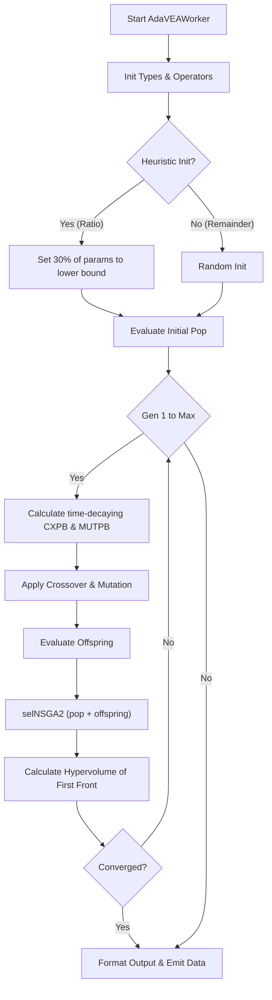

#### Pseudo-code
```text
BEGIN
  EXECUTE Start AdaVEAWorker
  EXECUTE Init Types & Operators
  EXECUTE Heuristic Init?
  EXECUTE Set 30% of params to lower bound
  EXECUTE Random Init
  EXECUTE Evaluate Initial Pop
  EXECUTE Gen 1 to Max
  EXECUTE Calculate time-decaying CXPB & MUTPB
  EXECUTE Apply Crossover & Mutation
  EXECUTE Evaluate Offspring
  EXECUTE selNSGA2 (pop + offspring)
  EXECUTE Calculate Hypervolume of First Front
  EXECUTE Converged?
  EXECUTE Format Output & Emit Data
END
```


================================================================================
## SOURCE: Documents/Optimization_Guild/Architecture_Overview.md
================================================================================


# Optimization Architecture Overview

The DeVana framework employs a **two-tiered architecture** for optimization routines, providing both rich GUI interactivity and lightweight headless execution capabilities. This architecture ensures high cohesion and low coupling between the evolutionary algorithms and the user interface.

## 1. Two-Tiered Optimization Architecture

### 1.1 Core Solvers (`devana/optimize/`)
The foundation of the optimization suite is located in `devana/optimize/`, offering GUI-independent classes.

- **`Solver` Base Class (`base.py`)**: An abstract base class (ABC) that all algorithms implement. It provides standardized initialization for configuration, bounds extraction, fixed parameter handling, and a unified `callback` interface for progress reporting.
- **Implementations**: `GASolver`, `PSOSolver`, `NSGA2Solver`, `RLSolver`, etc.
- **Purpose**: Primarily used by the headless REST API (`codes/api/`) and automated testing scripts. They ensure the mathematical core is decoupled from PyQT dependencies.

### 1.2 Worker Threads (`codes/workers/`)
The GUI execution layer utilizes `QThread` subclasses located in `codes/workers/`.

- **Inheritance**: Subclasses `QThread` from `PyQt5.QtCore`.
- **Communication**: Emits PyQT signals (`finished`, `progress`, `update`, `error`, `benchmark_data`, `generation_metrics`) to interact safely with the UI thread.
- **Features**: Wraps the core optimization logic with robust exception handling (`@safe_deap_operation`), resource monitoring (`psutil`), pausing/resuming mechanisms, and a watchdog timer (usually 10 minutes) for infinite loop protection.

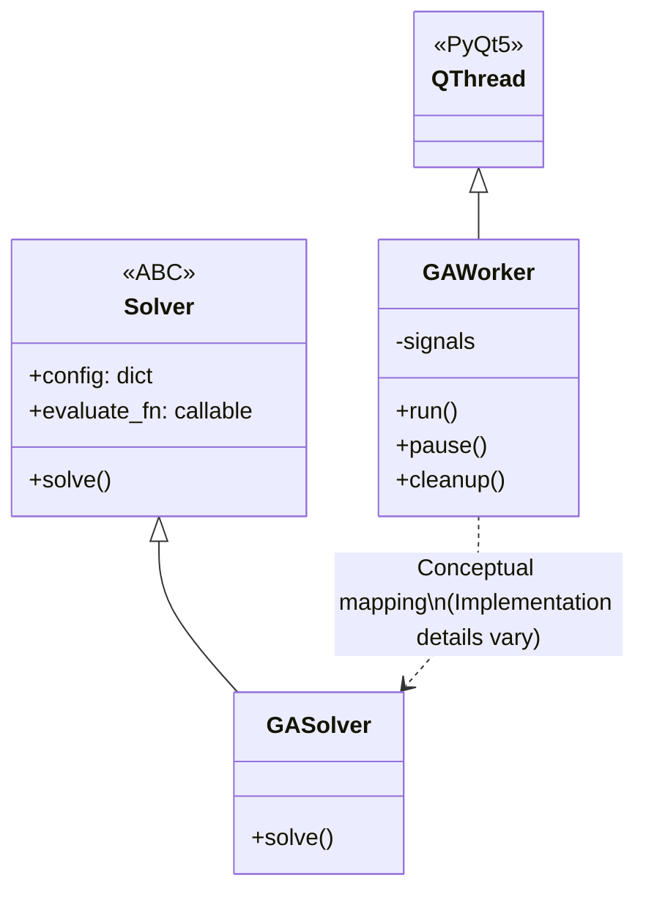

## 2. Universal Fitness and Penalty Formulation

Regardless of the selected metaheuristic, the evaluation heavily relies on the Frequency Response Function (FRF) and enforces structural constraints.

The generalized fitness scalar $F$ (for single-objective algorithms like GA, DE, PSO) is formulated as:

$$ F = O_{primary} + P_{sparsity} + P_{error} + P_{activation} + C_{cost} $$

Where:
- **Primary Objective ($O_{primary}$)**: Distance from the normalized ideal response.
  $$ O_{primary} = | R_{singular} - 1.0 | $$
- **Sparsity Penalty ($P_{sparsity}$)**: L1 regularization to favor simpler absorber topologies (Occam's Razor).
  $$ P_{sparsity} = \alpha \sum_{i} |x_i| $$
- **Percentage Error ($P_{error}$)**: Scaled sum of percentage deviations across all masses.
- **Activation Penalty ($P_{activation}$)**: Penalizes active variables above a certain threshold.
- **Cost Term ($C_{cost}$)**: Evaluates manufacturing/material costs (can be a standard normalized cost or an advanced Cost-Benefit Ratio formulation).

For **Multi-Objective Algorithms** (e.g., NSGA-II, MOGA), these elements are decoupled into orthogonal objectives:
1. $f_1(x) = R_{singular}$ (or distance)
2. $f_2(x) = P_{sparsity}$
3. $f_3(x) = \sum C_i x_i$

## 3. Supported Algorithms & Frameworks
- **DEAP-based**: GA, NSGA-II, MOGA.
- **Custom / NumPy implementations**: RL (DDPG-inspired Policy Gradient), AdaVEA.
- **Hybrid Integrations**: Algorithms are infused with ML surrogates, QMC initialization, and PINN accelerators.

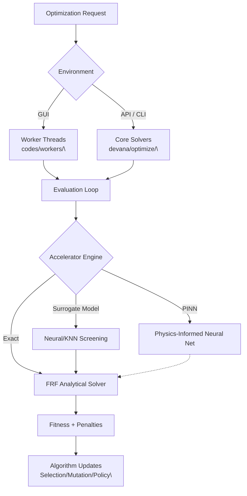

#### Pseudo-code
```text
BEGIN
  EXECUTE Optimization Request
  EXECUTE Environment
  EXECUTE Worker Threads<br>
  EXECUTE Core Solvers<br>
  EXECUTE Evaluation Loop
  EXECUTE Accelerator Engine
  EXECUTE Neural/KNN Screening
  EXECUTE Physics-Informed Neural Net
  EXECUTE FRF Analytical Solver
  EXECUTE Fitness + Penalties
  EXECUTE Algorithm Updates<br>
END
```


================================================================================
## SOURCE: Documents/Optimization_Guild/CMAES.md
================================================================================


# CMA-ES (Covariance Matrix Adaptation Evolution Strategy) Documentation

## Overview
CMA-ES is a highly effective, advanced stochastic optimization algorithm designed for non-linear, non-convex, continuous domain problems. In DeVana, it is primarily used for fine-tuning dynamic vibration absorber (DVA) parameters. CMA-ES iteratively updates a multivariate normal distribution (characterized by a mean and a covariance matrix) based on the successful candidate solutions from the previous generation.

## Class: `CMAESWorker` (inherits `QThread`)

### Purpose
Executes the `cma` package's CMA-ES implementation in a background Qt thread. It translates the parameter bounds and configuration, connects to the FRF (Frequency Response Function) engine for evaluation, and supports PINN acceleration and ML/RL rate adaptations.

### Key Initialization Parameters
*   `cma_initial_sigma`: Initial standard deviation ($\sigma$) governing the step size.
*   `cma_max_iter`: Maximum generations/iterations.
*   `cma_tol`: Tolerance (`tolx`) for early convergence.
*   `cma_parameter_data`: Parameter definitions including boundaries and fixed status.
*   `alpha`, `percentage_error_scale`: Constants for sparsity penalty and error scaling.
*   **Controllers:** `use_ml_adaptive`, `use_rl_controller` (modulates $\sigma$ over time).
*   **Acceleration:** `use_pinn_solver` (PINN forward solver surrogate).

### Methods

#### 1. `objective(x)`
**Purpose:** Serves as the fitness function for a given candidate vector `x`.
**Logic:**
- Forces fixed parameters to their set values.
- **Evaluation Engine:**
    - If `use_pinn_solver` is active, queries the PINN for an instant scalar prediction. It uses a 5% random probability (`random.random() < 0.05`) to fall back to the true FRF for online fine-tuning.
    - Otherwise, runs the full `frf()` function.
- **Fitness calculation:** 
    `fitness = primary_objective + sparsity_penalty + percentage_error_scaled`
- **Online Learning:** If evaluated using FRF and PINN online learning is enabled, it calls `pinn_solver.train_step` with the true fitness.

#### 2. `run()`
**Purpose:** Main execution loop.
**Logic Flow:**
1.  **Setup:**
    - Generates the initial guess `x0` randomly within the parameter bounds (excluding fixed parameters).
    - Initializes `cma.CMAEvolutionStrategy(x0, sigma0, options)` where options include `bounds` and `maxiter`.
2.  **Adaptive Controllers (Optional):**
    - Defines `ml_select` or `rl_select` functions to modify the step size ($\sigma$) dynamically based on an Upper Confidence Bound (ML) or Q-Learning (RL) strategy.
3.  **Iteration Loop:**
    - Modifies `es.sigma` using the active controller.
    - `solutions = es.ask()`: Samples a new population of candidate solutions from the multivariate normal distribution.
    - `fitnesses = [objective(x) for x in solutions]`: Evaluates the population.
    - `es.tell(solutions, fitnesses)`: Updates the mean and covariance matrix based on the evaluated fitnesses.
    - Tracks metrics and best fitness.
    - Stops if `es.stop()` conditions are met or if `best_fitness <= cma_tol`.
4.  **Finalization:**
    - Extracts `best_candidate` (either manually tracked or `es.result.xbest`).
    - Performs one final exact FRF evaluation and emits results.

---

## Architectural Flowchart

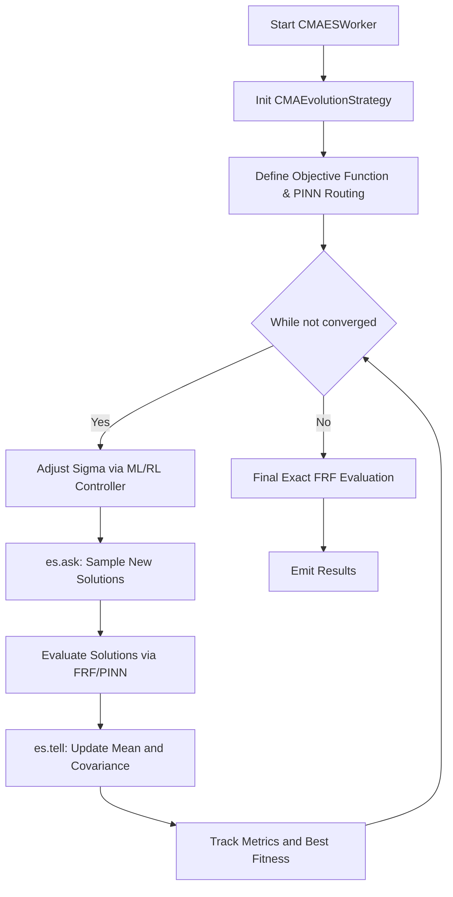

### Flowchart Pseudo-code
```text
function run_cmaes():
    x0 = generate_initial_guess()
    es = CMAEvolutionStrategy(x0, initial_sigma, bounds)
    
    while not es.stop():
        if controllers_active:
            es.sigma = adapt_sigma(es.sigma)
            
        candidates = es.ask()
        
        fitnesses = []
        for x in candidates:
            if PINN_enabled and not random(5%):
                fit = predict_pinn(x)
            else:
                fit = evaluate_frf(x)
                if PINN_enabled: train_pinn(x, fit)
            fitnesses.append(fit)
            
        es.tell(candidates, fitnesses)
        update_metrics_and_rewards()
        
    best_x = es.result.xbest
    final_result = evaluate_frf(best_x)
    return final_result
```


================================================================================
## SOURCE: Documents/Optimization_Guild/DE.md
================================================================================


# Differential Evolution (DE) Documentation

## Overview
Differential Evolution (DE) is a stochastic, population-based optimization algorithm. It optimizes a problem by maintaining a population of candidate solutions and creating new candidate solutions by combining existing ones according to specific mathematical formulas, and then keeping whichever candidate solution has the best score or fitness on the optimization problem.

DeVana's implementation includes several advanced strategies (e.g., `rand/1`, `best/1`, `current-to-best/1`), adaptive mechanisms for crossover and mutation factors (JADE, SaDE), multi-run statistical analysis, and support for PINN and ML/RL controllers.

## Class: `DEWorker` (inherits `QThread`)

### Purpose
Executes the DE algorithm in a background thread. Manages population initialization, multiple mutation/crossover strategies, constraint handling, and integration with the overall DeVana acceleration/control ecosystem.

### Key Initialization Parameters
*   `de_pop_size`, `de_num_generations`: Population size and maximum generations.
*   `de_F`, `de_CR`: Default Mutation factor (F) and Crossover Probability (CR).
*   `strategy`: Determines how donor vectors are created (`RAND_1`, `RAND_2`, `BEST_1`, `BEST_2`, `CURRENT_TO_BEST_1`, `CURRENT_TO_RAND_1`).
*   `adaptive_method`: Dynamic adjustment of F and CR (`NONE`, `JITTER`, `DITHER`, `SaDE`, `JADE`, `SUCCESS_HISTORY`).
*   `constraint_handling`: Method to handle bounds (`penalty`, `reflection`, `projection`).
*   `diversity_preservation`: Triggers reinitialization of poor individuals if diversity drops too low.
*   `use_parallel`: Option to use `multiprocessing.Pool` for evaluating fitness.
*   `num_runs`: Number of independent runs for statistical robustness.
*   **Controllers:** `use_ml_adaptive`, `use_rl_controller` (To control F, CR, and Pop Size dynamically).
*   **Acceleration:** `use_pinn_solver` (PINN forward solver surrogate).

### Methods

#### 1. `_apply_de_strategy(self, i, population, global_best, fitnesses, parameter_bounds, fixed_parameters, num_params)`
**Purpose:** Creates a trial vector for the $i$-th individual based on the selected `DEStrategy`.
**Logic:**
- Selects random distinct indices $r_1, r_2, \dots$ from the population.
- Computes a mutated donor vector. For example, in `RAND_1`: $v = x_{r1} + F \cdot (x_{r2} - x_{r3})$.
- Applies binomial crossover (`_apply_crossover`) mixing the target vector with the donor vector based on probability `CR`.
- Enforces bounds via `_handle_constraints`.

#### 2. `evaluate_individual(self, individual)`
**Purpose:** Calculates the scalar fitness.
**Logic:** Evaluates using `frf()` or `PINNSolver`. Includes a smoothness penalty (`beta`) which penalizes large differences between adjacent parameter values in the array, on top of the standard primary objective, sparsity penalty, and percentage error sum.

#### 3. `_run_single(self, return_convergence=False)`
**Purpose:** Executes a single optimization run.
**Logic Flow:**
1.  **Initialization:** LHS (Latin Hypercube Sampling) if available, otherwise random uniform.
2.  **Evaluation:** Parallel (`mp.Pool`) or sequential evaluation.
3.  **Evolution Loop:**
    - `_adapt_control_parameters()`: Update F and CR according to `AdaptiveMethod` (e.g., JADE updates means based on successful F/CR values).
    - Or use `ml_select` / `rl_select` to update F, CR, and optionally resize population.
    - For each individual:
        - Generate trial vector via `_apply_de_strategy`.
        - Evaluate trial vector.
        - **Selection:** If the trial vector is better than the target, replace the target.
    - Diversity preservation check: Reinitialize a subset of the population if diversity falls below a threshold.
4.  **Completion:** Check termination criteria and emit results.

#### 4. `perform_sensitivity_analysis(...)`
**Purpose:** A built-in feature to run Sobol sensitivity analysis on the parameters around the optimal solution discovered by DE, leveraging `modules.sobol_sensitivity`.

---

## Architectural Flowchart

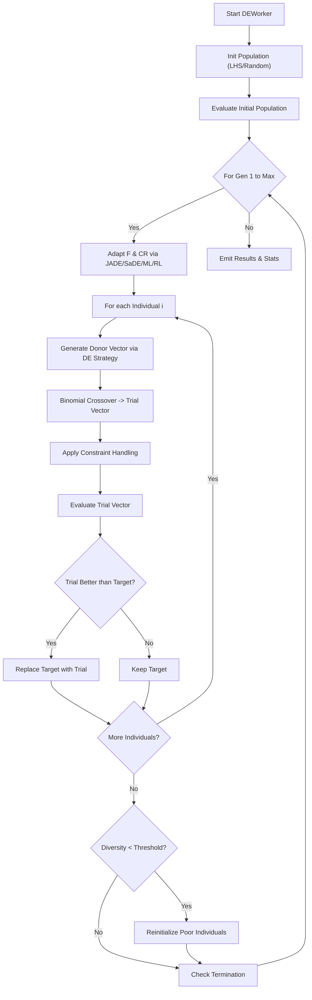

#### Pseudo-code
```text
BEGIN
  EXECUTE Start DEWorker
  EXECUTE Init Population (LHS/Random)
  EXECUTE Evaluate Initial Population
  EXECUTE For Gen 1 to Max
  EXECUTE Adapt F & CR via JADE/SaDE/ML/RL
  EXECUTE For each Individual i
  EXECUTE Generate Donor Vector via DE Strategy
  EXECUTE Binomial Crossover -> Trial Vector
  EXECUTE Apply Constraint Handling
  EXECUTE Evaluate Trial Vector
  EXECUTE Trial Better than Target?
  EXECUTE Replace Target with Trial
  EXECUTE Keep Target
  EXECUTE More Individuals?
  EXECUTE Diversity < Threshold?
  EXECUTE Reinitialize Poor Individuals
  EXECUTE Check Termination
  EXECUTE Emit Results & Stats
END
```


================================================================================
## SOURCE: Documents/Optimization_Guild/GA.md
================================================================================


# Genetic Algorithm (GA) Documentation

## Overview
The Genetic Algorithm (GA) implementation in DeVana is a highly advanced, multi-faceted optimization engine. It is designed to optimize Dynamic Vibration Absorber (DVA) parameters by minimizing a composite fitness function based on Frequency Response Function (FRF) analysis.

The algorithm leverages the DEAP (Distributed Evolutionary Algorithms in Python) framework and extends it with cutting-edge features:
- **Adaptive Rates:** Heuristic, Machine Learning (ML Bandit), and Reinforcement Learning (RL) controllers.
- **Advanced Seeding:** Random, Sobol (QMC), Latin Hypercube Sampling (LHS), Memory-based, Best-of-Pool, and Neural Network seeding.
- **Acceleration:** Neural Surrogate screening and PINN (Physics-Informed Neural Network) forward solver acceleration.
- **Smart Mutation:** Physics-guided gradient descent mutation.
- **Enhanced Cost-Benefit Analysis:** Multi-objective fitness landscape handling operational, material, maintenance, and manufacturing costs.

## Class: `GAWorker` (inherits `QThread`)

### Purpose
Executes the heavy optimization work in a background thread to keep the PyQt5 GUI responsive. It orchestrates the entire evolutionary process, managing the population, operators, and integration with advanced ML/RL sub-systems.

### Key Initialization Parameters
*   `main_params`: Core configuration of the primary system.
*   `target_values_dict`, `weights_dict`: Objectives for each mass.
*   `omega_start`, `omega_end`, `omega_points`: Frequency range for analysis.
*   `ga_pop_size`: Number of candidate solutions.
*   `ga_num_generations`: Number of evolution cycles.
*   `ga_cxpb`, `ga_mutpb`: Initial crossover and mutation probabilities.
*   `ga_parameter_data`: Bounds and fixed states for the DVA parameters.
*   `alpha`, `percentage_error_scale`, `cost_scale_factor`: Weights for fitness components (sparsity, accuracy, cost).
*   **Controllers:** `adaptive_rates`, `use_ml_adaptive`, `use_rl_controller`.
*   **Acceleration:** `use_surrogate`, `use_pinn_solver`.
*   **Seeding:** `seeding_method` ("random", "sobol", "lhs", "neural", "memory", "best").
*   **Smart Mutation:** `use_smart_mutation`, `smart_mutation_eta`.

### Methods

#### 1. `_attach_frf_peak_positions(self, results_dict)`
**Purpose:** Computes and attaches FRF peak positions and magnitudes for each mass.
**Parameters:** `results_dict` (Output of FRF evaluation).
**Logic:** Uses `scipy.signal.find_peaks` on the magnitude data of each mass to locate resonant peaks. Filters by prominence and appends arrays of positions and values.
**Outputs:** Modifies `results_dict` in place.

#### 2. `_update_and_train_pinn_solver(self, individuals, fitnesses)`
**Purpose:** Online training of the PINN forward solver using true evaluated results.
**Parameters:** `individuals` (list of param vectors), `fitnesses` (list of fitness scores).
**Logic:** Appends vectors to a historical dataset. Executes a training step on the `PINNSolver` mapping parameter inputs to fitness scalars.
**Outputs:** None (Updates internal PINN weights).

#### 3. `_update_and_train_surrogate(self, individuals, fitnesses)`
**Purpose:** Updates the Neural Surrogate (MLP) model with new data points.
**Parameters:** `individuals`, `fitnesses`.
**Logic:** Normalizes the input vectors using parameter bounds. Caps the dataset size to prevent memory leaks (`surrogate_dataset_max`). Calls `train()` on `NeuralSurrogate`.
**Outputs:** None (Updates internal surrogate weights).

#### 4. `run(self)`
**Purpose:** The main execution loop of the GA, decorated with `@safe_deap_operation` for robust error recovery.
**Logic Flow:**
1.  **Setup:** Register DEAP types (`FitnessMin`, `Individual`). Initialize the toolbox with random parameter generation bounded by `parameter_bounds`.
2.  **Seeding:** Generates the initial population using `generate_seed_individuals()` (supports QMC or Neural models). Evaluates the initial batch.
3.  **Evolution Loop:** For each generation up to `ga_num_generations`:
    *   **Controller Update:** Updates `current_cxpb`, `current_mutpb`, and `pop_size` via the active controller (RL, ML Bandit, or Heuristic).
    *   **Selection:** Selects parents using Tournament Selection (`tournsize=3`).
    *   **Crossover:** Applies `cxBlend` with the current crossover probability.
    *   **Mutation:** Applies custom bounds-respecting mutation. If `use_smart_mutation` is active, queries the neural surrogate for the gradient and applies a downhill step.
    *   **Evaluation:** Evaluates invalid individuals. If PINN is active, predicts fitness instantly. If surrogate screening is active, generates a larger pool, predicts fitness, and evaluates only the top/most novel candidates. Otherwise, runs standard parallel FRF evaluations.
    *   **Replacement:** Replaces the population with offspring.
    *   **Metrics:** Computes diversity, convergence, and success rate. Updates controller history.
4.  **Finalization:** Emits the best individual found and detailed benchmark metrics via `finished` signal.

---

## Detailed Component Logic

### Fitness Evaluation (`evaluate_individual`)
The fitness function is a weighted sum designed to be minimized:
```python
fitness = (
    primary_objective +           # |singular_response - 1.0|
    sparsity_penalty +            # L1 norm of parameters * alpha
    percentage_error_sum / scale + # Sum of % errors from targets
    activation_penalty +          # Penalty for active parameters > threshold
    cost_term                     # Normalized or Enhanced Cost-Benefit ratio
)
```

### Sub-System: ML Bandit Controller
Uses an Upper Confidence Bound (UCB) algorithm to tune parameters.
**Logic:**
- Action space: Deltas for Crossover/Mutation (`[-0.3, -0.15, 0.0, 0.15, 0.3]`) and Population size (`[0.75, 1.0, 1.25]`).
- Reward: Computes an improvement score normalized by generation time and computational effort, penalized by deviation from a target diversity.
- Update: Action statistics are blended between historical averages and the current generation's reward.

### Sub-System: RL Controller
Uses Q-Learning to select hyperparameter adjustments.
**Logic:**
- State: Binary (0 = No improvement, 1 = Improvement).
- Policy: Epsilon-greedy.
- Update Rule: Standard Q-learning Bellman equation.
- Reward: Defined by a weighted sum of objective improvement, diversity change, speed, and diversity targeting (coefficient of variation).

### Sub-System: Surrogate Screening
**Logic:**
When evaluating, it generates a candidate pool much larger than the required population (e.g., 2x). It predicts fitness using `NeuralSurrogate`. It then selects the top candidates (exploitation) and a fraction of the most novel candidates based on distance to the training set (exploration) for actual costly FRF evaluation.

---

## Architectural Flowchart

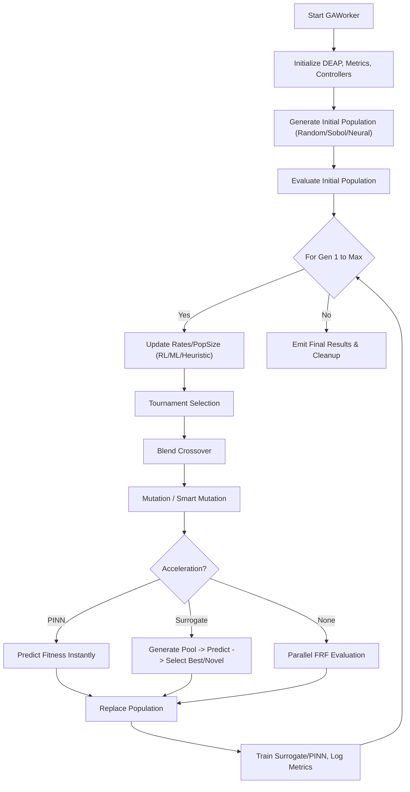

### Flowchart Pseudo-code
```text
function run_ga():
    initialize_controllers()
    population = generate_seeds()
    evaluate(population)
    
    for gen in range(1, num_generations):
        cxpb, mutpb, pop_size = update_controller()
        if pop_size changed: resize_population()
        
        offspring = select(population)
        apply_crossover(offspring, cxpb)
        apply_mutation(offspring, mutpb)
        
        if PINN_enabled:
            predict_fitness_pinn(offspring)
        else if Surrogate_enabled:
            pool = generate_large_pool(offspring)
            predicted = predict_surrogate(pool)
            offspring = select_top_and_novel(pool, predicted)
            evaluate_frf(offspring)
        else:
            evaluate_frf(offspring)
            
        population = offspring
        update_models_and_metrics()
        
    return best_individual
```


================================================================================
## SOURCE: Documents/Optimization_Guild/GA_Deep_Dive.md
================================================================================


# Genetic Algorithm (GA) Deep Dive

The Genetic Algorithm (GA) implementation in DeVana is a highly advanced, highly extensible evolutionary optimizer. It is constructed to handle standard DVA parameter optimization, while providing an arsenal of advanced plugins for population seeding, rate adaptation, multi-objective aggregation, and computational acceleration.

## 1. Class Hierarchy and Encapsulation

The GA logic exists in two parallel tracks depending on the execution context:
1. `GAWorker` (`codes/workers/GAWorker.py`): The heavy, GUI-bound implementation. It subclasses `QThread` and manages UI signals, threading mutexes, and real-time resource tracking.
2. `GASolver` (`devana/optimize/ga.py`): The lightweight, headless implementation. It subclasses `Solver` from `devana/optimize/base.py`.

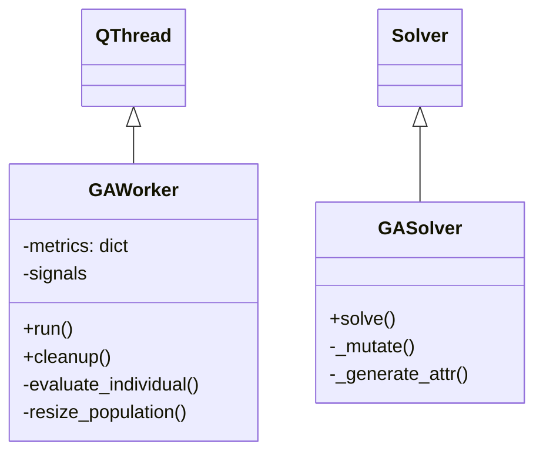

## 2. GA Operational Flowchart

The standard GA relies on the **DEAP** (Distributed Evolutionary Algorithms in Python) framework.

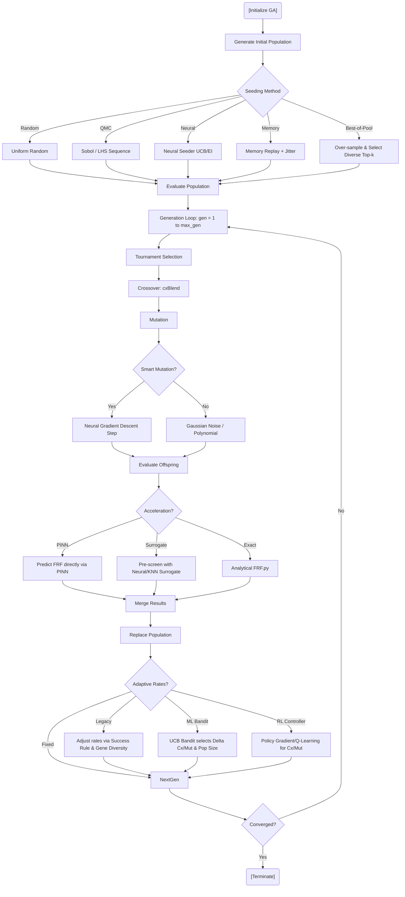

#### Pseudo-code
```text
BEGIN
  EXECUTE [Initialize GA]
  EXECUTE Generate Initial Population
  EXECUTE Seeding Method
  EXECUTE Uniform Random
  EXECUTE Sobol / LHS Sequence
  EXECUTE Neural Seeder UCB/EI
  EXECUTE Memory Replay + Jitter
  EXECUTE Over-sample & Select Diverse Top-k
  EXECUTE Evaluate Population
  EXECUTE Generation Loop: gen = 1 to max_gen
  EXECUTE Tournament Selection
  EXECUTE Crossover: cxBlend
  EXECUTE Mutation
  EXECUTE Smart Mutation?
  EXECUTE Neural Gradient Descent Step
  EXECUTE Gaussian Noise / Polynomial
  EXECUTE Evaluate Offspring
  EXECUTE Acceleration?
  EXECUTE Predict FRF directly via PINN
  EXECUTE Pre-screen with Neural/KNN Surrogate
  EXECUTE Analytical FRF.py
  EXECUTE Merge Results
  EXECUTE Replace Population
  EXECUTE Adaptive Rates?
  EXECUTE Adjust rates via Success Rule & Gene Diversity
  EXECUTE UCB Bandit selects Delta Cx/Mut & Pop Size
  EXECUTE Policy Gradient/Q-Learning for Cx/Mut
  EXECUTE Converged?
  EXECUTE [Terminate]
END
```

## 3. Side Options and Variants

The `GAWorker` contains extensive "knobs" and sub-modules to alter the search behavior:

### 3.1 Initial Seeding Strategies
Instead of simple random numbers, DeVana offers:
- **Quasi-Monte Carlo (QMC)**: Uses `scipy.stats.qmc.Sobol` and `qmc.LatinHypercube` to ensure low-discrepancy initial coverage of the parameter space.
- **Neural Seeding (`NeuralSeeder`)**: A PyTorch-based neural network trained to predict promising parameter regions. Uses acquisition functions like UCB (Upper Confidence Bound) and EI (Expected Improvement).
- **Memory Seeder**: Loads a JSON cache of past successful parameters and injects them with a small jitter.
- **Best-of-Pool**: Generates an initially massive QMC pool, evaluates all, and selects the initial population based on a "diversity stride" to ensure both high fitness and broad spatial distribution.

### 3.2 Adaptive Rate Controllers
To solve the exploration-exploitation dilemma dynamically:
- **Legacy Heuristic**: Adapts mutation and crossover probabilities based on a 1/5th success rule and an exponential moving average (EMA) of gene diversity.
- **ML Bandit (Multi-Armed Bandit)**: Uses Upper Confidence Bound (UCB) to choose discrete actions (deltas for $P_{cx}$, $P_{mut}$, and population size multiplier). Rewards are calculated based on fitness improvement divided by computation time, minus a diversity penalty.
- **Reinforcement Learning (RL) Controller**: An embedded Q-learning/epsilon-greedy agent. 

### 3.3 Evaluation Accelerators
Because analytical FRF evaluation is computationally expensive:
- **Surrogate Screening**: Trains a Neural Network or KNN on evaluated individuals. When new offspring are created, an over-sampled pool is generated, screened by the surrogate, and only the top $Q$ candidates (balancing exploitation and novelty) are sent to the exact FRF solver.
- **PINN (Physics-Informed Neural Network)**: A neural solver that directly maps DVA parameters to FRF scalar outputs (at $\omega=0$ approximation). Includes an `online_learning` flag to fine-tune the PINN continuously during the GA loop.
- **Smart Mutation**: If a neural surrogate is active, the mutation step requests the local gradient $\nabla F(x)$ from the surrogate and takes a gradient-descent step before adding minor Gaussian noise.

## 4. Mathematical Formulation of the GA Fitness

Within `evaluate_individual()`, the raw scalar response $R_{singular}$ (from `FRF.py`) is combined with multiple regularizers:

$$
\text{Fitness}(x) = | R_{singular} - 1.0 | + \alpha_{sparsity} \sum_{i} |x_i| + \frac{\sum E_{\%}}{\beta_{scale}} + P_{act} + C_{cost}
$$

Where:
- $E_{\%}$ is the percentage error of the peaks relative to target limits.
- $P_{act}$ applies a discrete penalty if a parameter crosses an activation threshold $\tau$.
- $C_{cost}$ calculates a Cost-Benefit Ratio weighting material/manufacturing metrics.

**Goal:** The GA attempts to minimize this composite fitness via `creator.FitnessMin, base.Fitness, weights=(-1.0,)`.


================================================================================
## SOURCE: Documents/Optimization_Guild/GA_Hierarchy.md
================================================================================


# GA Hierarchy & Variants Documentation

## Overview
DeVana's Genetic Algorithm (GA) framework acts as the cornerstone of the optimization suite. It has been extensively layered with intelligent sub-systems, giving rise to multiple **Variants** that fundamentally alter the execution logic.

This document traces how different options (ML Bandit, PINN Acceleration, Smart Mutation, Advanced Seeding) alter the GA control flow.

---

## 1. Advanced Seeding Mechanisms
The way the initial population is generated sets the foundation for the search space exploration. The flag `seeding_method` dictates the path.

### Execution Trace:
- **Random Uniform:** Standard pseudo-random number generator within `parameter_bounds`.
- **Sobol (QMC):** Generates low-discrepancy sequences using `scipy.stats.qmc.Sobol`. Avoids clustering in multidimensional spaces.
- **Latin Hypercube (LHS):** Uses `qmc.LatinHypercube`. Stratifies parameter bounds evenly.
- **Memory Seeder:** Parses a JSON database of historically excellent solutions, injecting them via a `MemorySeeder` agent that applies small jitters and exploration fractions.
- **Neural Seeder (MLP):** Uses a pre-trained internal surrogate to predict promising candidate zones.
- **Best-of-Pool:** Samples a pool 5x the population size, evaluates all, and selects the initial population based on a diversity stride.

---

## 2. Dynamic Rate Controllers (ML Bandit vs. RL vs. Adaptive)
Standard GAs use fixed Crossover (`cxpb`) and Mutation (`mutpb`) probabilities. DeVana introduces dynamic controllers that adjust these rates *per generation*.

### Execution Trace:
When `run()` executes, the evolution loop checks which controller is active before applying operators.

*   **Heuristic (Adaptive):**
    *   *Trigger:* `adaptive_rates=True`
    *   *Logic:* Uses an exponential moving average of "Success Rate" (fraction of children better than parents) and "Gene Diversity" (normalized standard deviation of genes).
    *   *Action:* If diversity is low, it boosts mutation and reduces crossover. If success rate plummets, it increases mutation step-size (exploration).
*   **ML Bandit Controller (UCB):**
    *   *Trigger:* `use_ml_adaptive=True`
    *   *Logic:* Implements a Multi-Armed Bandit using the Upper Confidence Bound (UCB). Actions are discrete deltas applied to `cxpb`, `mutpb`, and population multipliers.
    *   *Reward:* Formulated as $\frac{\text{Fitness Improvement}}{\text{Generation Time}} - \lambda_{div} | \text{Diversity} - \text{Target} |$.
    *   *Action:* Alters the rates immediately. Population resizing happens via truncation (if shrinking) or Neural Seeding (if growing).
*   **RL Controller:**
    *   *Trigger:* `use_rl_controller=True`
    *   *Logic:* Implements Q-Learning with $\epsilon$-greedy exploration. The state is binary (0 = No Improvement, 1 = Improvement).
    *   *Action:* Similar action space to ML Bandit, but updates via the Bellman equation.

---

## 3. Physics-Informed Neural Network (PINN) Acceleration
FRF evaluations are computationally expensive. The PINN acts as a surrogate forward solver.

### Execution Trace:
*   *Trigger:* `use_pinn_solver=True`
*   *Logic:* When invalid offspring are generated, instead of passing them to `multiprocessing.Pool` mapping `frf()`, they are passed directly to `pinn_solver.predict()`.
*   *Online Learning:* If `pinn_online_learning=True`, there is a ~5% chance that a subset of individuals will bypass the PINN, hit the exact `frf()`, and the results will be back-propagated into the PINN via `train_step()` to prevent model drift.

---

## 4. Surrogate Screening (K-Nearest/MLP Filter)
Instead of replacing the FRF engine entirely, the surrogate model acts as a highly selective filter.

### Execution Trace:
*   *Trigger:* `use_surrogate=True`
*   *Logic:*
    1. The GA generates a pool of invalid offspring that is *larger* than necessary (`surrogate_pool_factor`, e.g., 2x).
    2. The Neural Surrogate (or KNN) predicts the fitness of the entire expanded pool.
    3. The pool is sorted by predicted fitness.
    4. **Selection:** The GA explicitly selects the top $N$ individuals (Exploitation) and a fraction of the most *novel* individuals based on distance to the training set (Exploration).
    5. Only this filtered subset is passed to the exact FRF engine, saving ~50% evaluation time while maintaining solution quality.

---

## 5. Smart Mutation (Gradient-Guided)
Instead of purely random Gaussian mutation, the GA leverages the Neural Surrogate to find the direction of steepest descent.

### Execution Trace:
*   *Trigger:* `use_smart_mutation=True`
*   *Logic:*
    - Replaces `tools.mutPolynomialBounded`.
    - Normalizes the individual's parameter vector.
    - Queries the Neural Surrogate for the gradient: `grad = neural_surrogate.get_fitness_gradient(x)`.
    - Mutates the individual by taking a step in the negative gradient direction (`-grad * eta`) combined with a micro-Gaussian noise vector to prevent trapping.


================================================================================
## SOURCE: Documents/Optimization_Guild/MOGA.md
================================================================================


# MOGA (Multi-Objective Genetic Algorithm) Documentation

## Overview
The MOGA worker in DeVana is a specialized implementation designed for multi-objective optimization, utilizing the core mechanisms of NSGA-II to evaluate trade-offs between performance, complexity, and cost in DVA parameter design.

While it shares structural similarities with `NSGA2Worker`, it represents a distinct configuration focusing on maintaining multi-objective pareto fronts with standard simulated binary bounded crossover and polynomial bounded mutation.

## Class: `MOGAWorker` (inherits `QThread`)

### Purpose
Executes a multi-objective genetic algorithm in a background thread. It minimizes three objectives (Performance, Sparsity, Cost) and uses `tools.selNSGA2` for environmental selection.

### Key Initialization Parameters
*   `main_params`: Primary structural parameters.
*   `dva_params`: List of DVA variables including bounds, fix-flags, and cost coefficients.
*   `target_values_weights`: The mass-specific target goals for the FRF engine.
*   `pop_size`, `generations`: Basic GA setup.
*   **Operators:** `cxpb`, `mutpb`, `eta_c`, `eta_m`, `indpb`.
*   **Sparsity Constraints:** `sparsity_tau`, `sparsity_alpha`, `sparsity_beta`.
*   **Execution & Acceleration:** `num_runs`, `random_seed`, `use_pinn_solver`, `pinn_online_learning`.

### Methods

#### 1. `evaluate(self, individual)`
**Purpose:** Calculates the tri-objective fitness.
**Logic:**
- $f_1$ (Performance): FRF singular response, or scalar prediction from the PINN surrogate (with occasional online learning triggers).
- $f_2$ (Sparsity): $L_0$-like activation count penalized by `alpha` + $L_1$ norm penalized by `beta`.
- $f_3$ (Cost): Dot product of the parameter vector and `cost_coeffs`.
**Output:** Tuple `(f1, f2, f3)`.

#### 2. `run(self)`
**Purpose:** Core execution loop.
**Logic Flow:**
1.  **Setup:** Uses `@safe_deap_operation` to clear and register `FitnessMulti` and `Individual`. Sets up standard generators bounded by `low_bounds` and `high_bounds`.
2.  **Operators:** 
    - `cxSimulatedBinaryBounded` for crossover.
    - `mutPolynomialBounded` for mutation.
    - `selNSGA2` for selection.
3.  **Iteration:** For each run (`num_runs`) and generation (`generations`):
    - Select parents via `selTournamentDCD`.
    - Apply crossover and mutation to offspring.
    - Evaluate invalid offspring.
    - Select next generation: `pop = toolbox.select(pop + offspring, self.pop_size)`.
    - Gather basic metrics (`min_f1`, `avg_f1`, memory).
4.  **Finalization:** Extracts final pareto front via `selNSGA2` and appends to `all_runs_data`. Emits `finished(all_runs_data)`.

---

## Architectural Flowchart

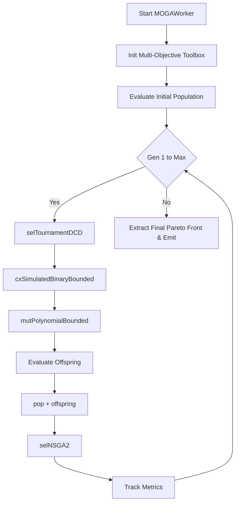

#### Pseudo-code
```text
BEGIN
  EXECUTE Start MOGAWorker
  EXECUTE Init Multi-Objective Toolbox
  EXECUTE Evaluate Initial Population
  EXECUTE Gen 1 to Max
  EXECUTE selTournamentDCD
  EXECUTE cxSimulatedBinaryBounded
  EXECUTE mutPolynomialBounded
  EXECUTE Evaluate Offspring
  EXECUTE pop + offspring
  EXECUTE selNSGA2
  EXECUTE Track Metrics
  EXECUTE Extract Final Pareto Front & Emit
END
```


================================================================================
## SOURCE: Documents/Optimization_Guild/NSGA2.md
================================================================================


# NSGA-II (Non-dominated Sorting Genetic Algorithm II) Documentation

## Overview
The NSGA-II implementation in DeVana is designed for **multi-objective** optimization of Dynamic Vibration Absorbers (DVAs). Unlike the standard GA which scalarizes multiple goals into a single fitness value via a weighted sum, NSGA-II maintains a Pareto front, allowing the user to examine the tradeoff curve between distinct objectives.

In DeVana, NSGA-II minimizes three distinct objectives:
1.  **FRF Singular Response ($f_1$):** Peak vibration reduction across the masses.
2.  **Sparsity & Complexity ($f_2$):** A penalty for the number of active DVA parameters (using an $L_0$-like threshold and $L_1$ norm).
3.  **Cost ($f_3$):** Direct manufacturing/material cost based on user-defined coefficients.

## Class: `NSGA2Worker` (inherits `QThread`)

### Purpose
Executes the NSGA-II optimization in a background thread. It uses DEAP to handle the multi-objective selection, Simulated Binary Crossover (SBX), and Polynomial Mutation operators. It tracks Hypervolume (HV) and Pareto front size to determine convergence.

### Key Initialization Parameters
*   `main_params`: Core configuration of the primary system.
*   `dva_params`: List of parameters including bounds, fixed flags, and cost coefficients.
*   `target_values_weights`: Objectives and weighting for each mass during FRF evaluation.
*   `omega_start`, `omega_end`, `omega_points`: Frequency ranges.
*   `pop_size`, `generations`: Standard GA parameters.
*   **Genetic Operators:**
    *   `cxpb`, `mutpb`: Probabilities for crossover and mutation.
    *   `eta_c`: Crowding degree for Simulated Binary Crossover.
    *   `eta_m`: Crowding degree for Polynomial Mutation.
    *   `indpb`: Independent probability for mutating each attribute.
*   **Sparsity Objectives:** `sparsity_tau` (activation threshold), `sparsity_alpha`, `sparsity_beta`.
*   **Convergence Controls:** `convergence_epsilon`, `convergence_window`, `convergence_min_gen`.
*   **Performance Metrics:** `hv_ref_point` for hypervolume calculation.
*   **Acceleration:** `use_pinn_solver`, `pinn_model_path`, `pinn_online_learning`.

### Methods

#### 1. `evaluate(self, individual)`
**Purpose:** Calculates the three multi-objective fitness values.
**Parameters:** `individual` (A candidate solution's parameter vector).
**Logic:**
1.  **$f_1$ (Performance):** Runs standard `frf` analysis or queries the `PINNSolver` for accelerated scalar response. Includes a 5% random chance of evaluating the true FRF for online PINN refinement.
2.  **$f_2$ (Sparsity):** Counts parameters above `sparsity_tau` and multiplies by `sparsity_alpha`, plus an $L_1$ norm weighted by `sparsity_beta`.
3.  **$f_3$ (Cost):** Computes the dot product of the individual and `cost_coeffs`.
**Outputs:** Tuple `(f1, f2, f3)`.

#### 2. `run(self)`
**Purpose:** Main execution loop for NSGA-II.
**Logic Flow:**
1.  **Initialization:** Uses `@safe_deap_operation` to register `FitnessMulti` (minimizing 3 objectives) and the `Individual` class. 
2.  **Operators:** 
    - `tools.cxSimulatedBinaryBounded` (SBX) is used for crossover.
    - `tools.mutPolynomialBounded` is used for mutation.
    - `tools.selNSGA2` is used for environmental selection.
3.  **Evolution Loop:**
    - Generates offspring using `tools.selTournamentDCD` (Tournament selection based on dominance and crowding distance).
    - Applies SBX and Polynomial Mutation.
    - Evaluates invalid offspring.
    - Selects the next generation using `tools.selNSGA2(pop + offspring, pop_size)`.
4.  **Metrics:** Extracts the first Pareto front (`sortNondominated`). Computes the Hypervolume (HV) relative to `hv_ref_point`. Checks for convergence if the HV difference over `convergence_window` generations is less than `convergence_epsilon`.
5.  **Output:** Saves each run's data to a JSON file in `nsga2_results/` and emits `finished`.

---

## Architectural Flowchart

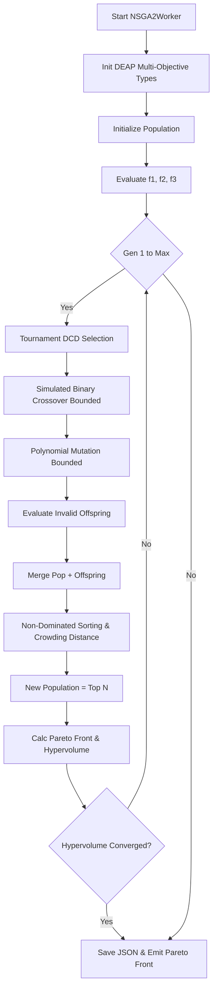

### Flowchart Pseudo-code
```text
function run_nsga2():
    register_fitness_multi(weights=(-1, -1, -1))
    pop = generate_initial_population()
    fitnesses = map(evaluate_multi, pop)
    
    for gen in 1..generations:
        offspring = select_tournament_dcd(pop, pop_size)
        apply_sbx_crossover(offspring, cxpb, eta_c)
        apply_polynomial_mutation(offspring, mutpb, eta_m)
        
        evaluate_multi(invalid_offspring)
        
        merged_pop = pop + offspring
        pop = select_nsga2(merged_pop, pop_size)
        
        pareto_front = get_front(pop, 1)
        hv = calculate_hypervolume(pareto_front)
        
        if gen > min_gen and (max(hv_window) - min(hv_window) < epsilon):
            break
            
    return final_pareto_front
```


================================================================================
## SOURCE: Documents/Optimization_Guild/PSO.md
================================================================================


# PSO (Particle Swarm Optimization) Documentation

## Overview
Particle Swarm Optimization (PSO) is a population-based stochastic optimization technique inspired by social behavior (bird flocking). Particles (candidate solutions) move through the search space guided by their own best-known position (cognitive component) and the swarm's best-known position (social component).

DeVana's implementation is highly advanced, incorporating quasi-random initialization, multiple boundary handling strategies, adaptive inertia weights, adaptive acceleration coefficients, and topological neighborhoods.

## Class: `PSOWorker` (inherits `QThread`)

### Purpose
Executes the PSO algorithm asynchronously. Integrates with the FRF module for evaluation and incorporates PINN acceleration and ML/RL adaptive controllers (analogous to the GA implementation).

### Key Initialization Parameters
*   `pso_swarm_size`: Number of particles.
*   `pso_num_iterations`: Maximum iterations.
*   `pso_w`, `pso_w_damping`, `pso_w_min`, `pso_w_max`: Inertia weight constraints and damping.
*   `pso_c1`, `pso_c2`: Cognitive and Social acceleration coefficients.
*   `topology`: Type of neighborhood structure (`GLOBAL`, `RING`, `VON_NEUMANN`, `RANDOM`).
*   `max_velocity_factor`: Clamps velocity to prevent explosion.
*   `boundary_handling`: Strategy for boundary violations (`absorbing`, `reflecting`, `invisible`).
*   `early_stopping`, `stagnation_limit`: Control early termination and particle stagnation.
*   `quasi_random_init`: Uses Sobol sequences for initialization.

### Methods

#### 1. `adaptive_inertia_weight(self, iter_num, max_iter, best_fitness, avg_fitness, diversity)`
**Purpose:** Adaptively adjusts the inertia weight $w$ to balance exploration and exploitation.
**Logic:** Combines four strategies:
1. Linear time-varying (decreases linearly).
2. Nonlinear time-varying (decreases faster initially).
3. Fitness-based (increases when swarm is converging).
4. Diversity-based (increases when diversity drops below threshold).

#### 2. `adaptive_acceleration_coefficients(self, iter_num, max_iter, diversity)`
**Purpose:** Adjusts $c_1$ (cognitive) and $c_2$ (social).
**Logic:** $c_1$ decreases and $c_2$ increases over time. If diversity is low, it temporarily boosts $c_1$ and lowers $c_2$ to encourage exploration. Ensures $c_1 + c_2 \le 4$ for stability.

#### 3. `handle_boundary_violation(self, position, velocity, dim, low, high)`
**Purpose:** Corrects particles that move outside bounds.
**Strategies:**
- `absorbing`: Position pinned to bound, velocity set to 0.
- `reflecting`: Position bounces back, velocity inverted and damped by 0.8.
- `invisible`: Allowed outside, but penalized heavily in the fitness function.

#### 4. `evaluate_particle(self, position, parameter_bounds)`
**Purpose:** Computes fitness via FRF or PINN. Applies severe quadratic penalties if `boundary_handling` is `invisible` and limits are violated.

#### 5. `run(self)`
**Purpose:** Main execution loop.
**Logic Flow:**
1.  **Initialization:** Initializes positions via `quasi_random_initialize` (Sobol) or uniform random. Initializes velocities and evaluates initial fitness.
2.  **Neighborhood Setup:** Establishes neighbor links based on `TopologyType`.
3.  **Iteration Loop:**
    - Updates $w, c_1, c_2$ via adaptive equations, ML Bandit, or RL controller.
    - Iterates through all particles:
        - Calculates cognitive and social velocity components.
        - Applies constriction factor (Clerc & Kennedy) if $c_1 + c_2 > 4$.
        - Clamps velocity to `max_velocities`.
        - Updates position and handles boundaries.
        - Applies Gaussian mutation if diversity is below threshold.
        - Evaluates fitness.
        - Updates personal best, and checks for global best improvement.
    - Updates neighborhood bests.
    - Checks for stagnant particles (`stagnation_counter >= limit`) and reinitializes them randomly around the global best.
    - Evaluates convergence and early stopping criteria.
4.  **Finalization:** Emits best particle and performs final exact FRF.

---

## Architectural Flowchart

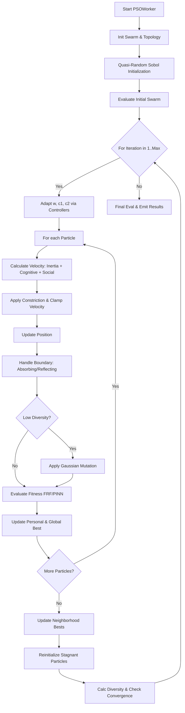

### Flowchart Pseudo-code
```text
function run_pso():
    positions = quasi_random_initialize()
    swarm = initialize_particles(positions)
    neighborhoods = create_neighborhoods(topology)
    
    for iteration in 1..max_iterations:
        w, c1, c2 = update_adaptive_params(iteration, diversity)
        
        for particle in swarm:
            social_best = get_social_best(particle, neighborhoods)
            
            # Velocity Update
            v_cognitive = c1 * rand() * (particle.best_pos - particle.pos)
            v_social = c2 * rand() * (social_best - particle.pos)
            particle.vel = w * particle.vel + v_cognitive + v_social
            particle.vel = apply_constriction_and_clamp(particle.vel)
            
            # Position Update
            particle.pos += particle.vel
            particle.pos, particle.vel = handle_boundaries(particle)
            
            if diversity < threshold:
                particle.pos = apply_mutation(particle.pos)
                
            fitness = evaluate_particle(particle.pos)
            update_bests(particle, fitness)
            
        update_neighborhood_bests(swarm)
        reinitialize_stagnant_particles(swarm)
        
        if check_convergence(): break
        
    return global_best_particle
```


================================================================================
## SOURCE: Documents/Optimization_Guild/RL.md
================================================================================


# Reinforcement Learning (RL) Optimization Documentation

## Overview
The Reinforcement Learning (RL) worker in DeVana utilizes a Deep Deterministic Policy Gradient (DDPG)-inspired approach adapted for optimizing continuous parameters of Dynamic Vibration Absorbers (DVAs). Unlike traditional tabular Q-learning which operates on discrete action spaces, this continuous policy gradient approach generates precise float values directly from a policy network, making it highly suitable for the continuous domain of mass, stiffness, and damping coefficients.

## Class: `RLWorker` (inherits `QThread`)

### Purpose
Executes policy-based continuous optimization in a background thread. It trains an RL agent (policy network) using experience replay and exploration noise, aiming to maximize a reward function that correlates directly with minimizing the DVA performance fitness.

### Key Initialization Parameters
*   `rl_num_episodes`, `rl_max_steps`: Total episodes and steps per episode.
*   `rl_alpha`, `rl_gamma`: Learning rate for policy gradient and discount factor.
*   `rl_epsilon`, `rl_epsilon_min`, `rl_epsilon_decay_type`, `rl_epsilon_decay`: Exploration rate controls (exponential, linear, inverse, step, cosine).
*   `rl_parameter_data`: DVA variables including bounds and fixed status.
*   `alpha_sparsity`: Penalty multiplier to enforce $L_1$ sparsity.
*   **Buffer & Noise:** `replay_buffer_size`, `batch_size`, `tau`, `noise_std`.
*   **Acceleration:** `use_pinn_solver`, `pinn_online_learning`.
*   **Experience Management:** `experience_save_path`, `load_existing_experience`.
*   **Sobol Initialization:** Supports running Sobol sensitivity analysis prior to training to rank parameters and order the policy network mapping.

### Methods

#### 1. `generate_parameters(self, add_noise=True)`
**Purpose:** Samples an action (parameter vector) from the current policy.
**Logic:**
- Generates `raw_params = self.policy_weights + self.policy_bias`.
- Injects Gaussian exploration noise based on `noise_std` and `rl_epsilon`.
- Normalizes via Sigmoid activation ($1 / (1 + \exp(-x))$) and scales to the actual bounds.

#### 2. `evaluate_parameters(self, params)`
**Purpose:** Computes fitness via exact FRF or PINN approximation.
**Logic:** Returns `fitness = primary_objective + sparsity_penalty`.

#### 3. `update_policy(self, experiences)`
**Purpose:** DDPG-style policy gradient update using batch experience replay.
**Logic:**
- Samples a batch of transitions from the replay buffer.
- Computes policy gradients using the advantage function `advantage = -fitness`.
- Gradients for weights and biases are accumulated.
- Updates policy weights and applies weight decay (`* 0.999`) for regularization.

#### 4. `run(self)`
**Purpose:** Main training loop for the RL agent.
**Logic Flow:**
1.  **Sobol Pre-training (Optional):** Uses `sobol_sensitivity` to rank DVA parameters by Total Effect Index ($S_T$) and reorders the parameter vectors to prioritize the most influential variables in the policy array.
2.  **Episode Loop:** For each episode up to `rl_num_episodes`:
    - **Step Loop:** For each step up to `rl_max_steps`:
        - `params = generate_parameters(add_noise=True)`
        - `fitness, results = evaluate_parameters(params)`
        - Add experience `(params, fitness, results)` to the episode buffer.
        - Track `best_fitness` and `best_solution`.
    - Push episode experiences into the master `experience_buffer` (truncated by `replay_buffer_size`).
    - `update_policy(experience_buffer)`
    - `update_epsilon(episode)`
3.  **Finalization:** Emits `best_solution`, `best_fitness`, and saves the experience buffer to disk.

---

## Architectural Flowchart

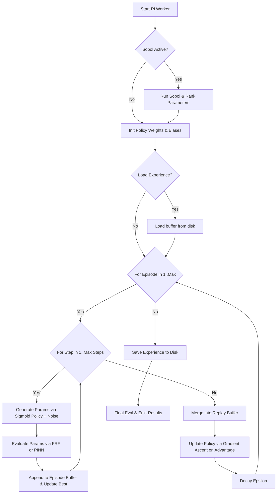

#### Pseudo-code
```text
BEGIN
  EXECUTE Start RLWorker
  EXECUTE Sobol Active?
  EXECUTE Run Sobol & Rank Parameters
  EXECUTE Init Policy Weights & Biases
  EXECUTE Load Experience?
  EXECUTE Load buffer from disk
  EXECUTE For Episode in 1..Max
  EXECUTE For Step in 1..Max Steps
  EXECUTE Generate Params via Sigmoid Policy + Noise
  EXECUTE Evaluate Params via FRF or PINN
  EXECUTE Append to Episode Buffer & Update Best
  EXECUTE Merge into Replay Buffer
  EXECUTE Update Policy via Gradient Ascent on Advantage
  EXECUTE Decay Epsilon
  EXECUTE Save Experience to Disk
  EXECUTE Final Eval & Emit Results
END
```


================================================================================
## SOURCE: Documents/Optimization_Guild/RL_Deep_Dive.md
================================================================================


# Reinforcement Learning (RL) Optimization Deep Dive

The Reinforcement Learning optimization solver (`RLWorker.py`) introduces a purely continuous policy gradient approach, taking inspiration from Deep Deterministic Policy Gradient (DDPG) concepts. It entirely replaces traditional tabular Q-learning which struggles with continuous DVA parameter dimensions.

## 1. Scientific Background & Approach

DVA parameters (e.g., masses, stiffness coefficients) are mathematically continuous variables. The `RLWorker` frames the parameter generation process as an agent taking an action $a \in \mathbb{R}^N$ in an environment with a single state (since optimization is stateless across evaluations).

The goal of the agent is to learn a policy $\pi_\theta(s) \approx a_{optimal}$ that maximizes the reward (defined as negative fitness).

### 1.1 Policy Representation
The parameters are drawn from a simple linear policy layer wrapped in a sigmoid activation to map outputs securely into the parameter bounds $[low_i, high_i]$:

$$
raw_i = W_i + b_i
$$
$$
a_i = low_i + \left(\frac{1}{1 + e^{-raw_i}}\right) (high_i - low_i)
$$

### 1.2 Exploration
During the generation step, exploration is injected via Gaussian noise parameterized by an exponentially decaying $\epsilon$:

$$
a_{exploratory} = a + \mathcal{N}(0, \sigma \cdot \epsilon)
$$

## 2. Training Loop & Experience Replay

The algorithm utilizes **Experience Replay** to stabilize gradient updates and decouple the temporal correlation of evaluations.

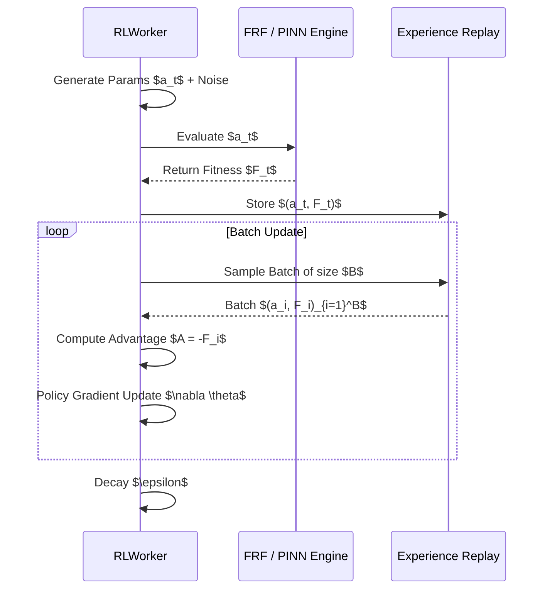

### 2.1 Gradient Update
The simplified continuous policy gradient is calculated by weighting the parameter vector by the Advantage ($A = -F$):

$$
\Delta W_i = \frac{\alpha}{|B|} \sum_{batch} (-F) \cdot a_i
$$
$$
\Delta b_i = \frac{\alpha}{|B|} \sum_{batch} (-F)
$$

Weight decay (L2 regularization) is applied to prevent parameter explosion:
$W \leftarrow W \times 0.999$

## 3. Dimensionality Reduction via Sobol

Because the action space can be high-dimensional, the `RLWorker` automatically runs a **Sobol Sensitivity Analysis** before RL training begins.
It computes the Total-order sensitivity indices ($S_{T_i}$) for all parameters and reorders the action vector so the agent prioritizes updating the most impactful parameters first.

## 4. Integration with PINN
Identical to the GAWorker, the RLWorker supports the `PINNSolver` for instantaneous fitness prediction without invoking the costly `FRF.py` script. The PINN acts as an ultra-fast simulation environment for the agent, stepping back to reality via `pinn_online_learning=True` (5% probability) to maintain model fidelity.


================================================================================
## SOURCE: Documents/Optimization_Guild/SA.md
================================================================================


# Simulated Annealing (SA) Documentation

## Overview
Simulated Annealing (SA) is a probabilistic technique for approximating the global optimum of a given function. It is inspired by annealing in metallurgy, a technique involving heating and controlled cooling of a material to increase the size of its crystals and reduce their defects.

In DeVana, SA operates on a single candidate solution (rather than a population). It explores the parameter space by taking random steps; better solutions are always accepted, while worse solutions are accepted with a probability that decreases as the "temperature" cools down, allowing the algorithm to escape local minima early on.

## Class: `SAWorker` (inherits `QThread`)

### Purpose
Executes the Simulated Annealing optimization in a background thread. It provides integration with the FRF engine, PINN acceleration, and supports advanced ML/RL controllers to dynamically tune the cooling rate and step scale.

### Key Initialization Parameters
*   `sa_initial_temp`: The starting temperature ($T$). High values allow frequent acceptance of worse solutions.
*   `sa_cooling_rate`: The geometric cooling factor (e.g., 0.95), where $T_{new} = T \times \text{rate}$.
*   `sa_num_iterations`: Maximum iterations.
*   `step_scale`: The base scale for random perturbations relative to the parameter bounds.
*   **Controllers:** `use_ml_adaptive`, `use_rl_controller` (Adapts step scale, cooling rate, and temperature multiplier).
*   **Acceleration:** `use_pinn_solver`.

### Methods

#### 1. `evaluate_candidate(self, candidate)`
**Purpose:** Computes the scalar fitness of the candidate.
**Logic:**
- Same structure as other single-objective workers (FRF evaluation or PINN scalar prediction).
- Applies `alpha` sparsity penalty and `percentage_error_scale`.

#### 2. `run(self)`
**Purpose:** Main execution loop.
**Logic Flow:**
1.  **Initialization:**
    - Generates a random initial candidate vector.
    - Evaluates `current_fitness = evaluate_candidate(current_candidate)`.
    - Sets initial temperature $T$.
2.  **Iteration Loop:**
    - **Control Adjustment:** If active, uses ML Bandit or RL to adjust `base_step_scale`, `cooling_rate`, and a multiplier for $T$. The reward signal compares the acceptance rate to `ml_accept_target` (to maintain a healthy exploration/exploitation ratio).
    - **Perturbation:**
        - For each non-fixed parameter, generates a Gaussian perturbation: 
          $\text{perturbation} = \text{random.gauss}(0, \text{base\_scale}) \times (T / T_{initial})$.
        - Clamps the new candidate to parameter bounds.
    - **Evaluation:** Evaluates the new candidate to get `new_fitness`.
    - **Acceptance Criterion (Metropolis-Hastings):**
        - If `new_fitness < current_fitness`, accept immediately.
        - Else, calculate $P = \exp(-(\text{new\_fitness} - \text{current\_fitness}) / T)$.
        - If `random.random() < P`, accept.
        - Else, reject (keep current candidate).
    - **Cooling:** $T = T \times \text{cooling\_rate}$.
    - **Convergence Check:** Stops if `best_fitness <= sa_tol`.
3.  **Finalization:** Emits the best candidate found over all iterations and performs a final exact evaluation.

---

## Architectural Flowchart

```mermaid
flowchart TD
    Start["Start SAWorker"] --> Init["Init Random Candidate & Temperature T"]
    Init --> EvalInit["Evaluate Initial Fitness"]
    EvalInit --> IterLoop{"For Iteration in 1..Max"}
    IterLoop -- Yes --> Adapt["Adapt Step Scale, Cooling, T via ML/RL"]
    Adapt --> Perturb["Generate Neighbor via T-Scaled Gaussian Perturbation"]
    Perturb --> EvalNew["Evaluate Neighbor Fitness"]
    EvalNew --> CheckBetter{"New < Current?"}
    CheckBetter -- Yes --> Accept["Accept Neighbor"]
    CheckBetter -- No --> Metropolis["Calc P = exp("-Delta/T")"]
    Metropolis --> RandomCheck{"Rand < P?"}
    RandomCheck -- Yes --> Accept
    RandomCheck -- No --> Reject["Keep Current"]
    Accept --> UpdateBest["Update Best Solution"]
    Reject --> Cool["T = T * cooling_rate"]
    UpdateBest --> Cool
    Cool --> IterLoop
    IterLoop -- No --> Finish["Emit Results"]
```

### Flowchart Pseudo-code
```text
function run_sa():
    current_x = generate_random()
    current_f = evaluate(current_x)
    best_x = current_x
    T = initial_temp
    
    for iteration in 1..max_iterations:
        step, cooling, T = update_controllers(step, cooling, T)
        
        # Perturb
        new_x = current_x + gaussian_noise(scale=step * (T / initial_temp))
        new_x = clamp(new_x, bounds)
        
        new_f = evaluate(new_x)
        delta = new_f - current_f
        
        if delta < 0 or random() < exp(-delta / T):
            current_x = new_x
            current_f = new_f
            
            if current_f < best_f:
                best_x = current_x
                best_f = current_f
                
        T = T * cooling
        
    return best_x
```


================================================================================
## SOURCE: Documents/Optimization_Guild/Workers/AIWorker.md
================================================================================


# AIWorker

## Purpose
Worker thread for non-blocking LLM API calls.
Specifically handles Gemini API interactions with RAG context.

## Internal Logic Flow: `run`
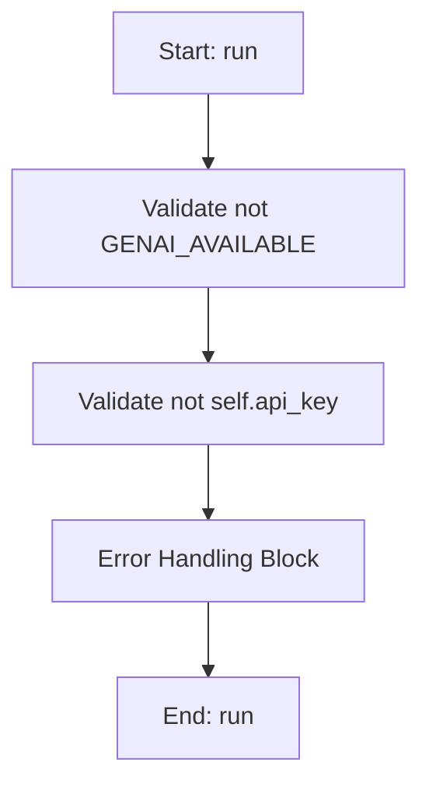

### Flowchart Pseudo-code
```python
FUNCTION run(self):
    DO "Validate not GENAI_AVAILABLE"
    DO "Validate not self.api_key"
    DO "Error Handling Block"
END FUNCTION
```

## Methods & Functions

### `__init__`
- **Arguments**: `self, api_key, model_name, system_prompt, user_query, context_data`
- **Returns**: `None`
- **Logic**: Assigns self.api_key; Assigns self.model_name; Assigns self.system_prompt; Assigns self.user_query; Assigns self.context_data

### `run`
- **Arguments**: `self`
- **Returns**: `None`
- **Logic**: Conditional: not GENAI_AVAILABLE; Conditional: not self.api_key

### `get_relevant_docs`
- **Arguments**: `query, doc_dir`
- **Returns**: `str`
- **Logic**: Assigns context_snippets; Assigns keywords; Assigns query_lower; Loops over keywords.items(); Returns result


================================================================================
## SOURCE: Documents/Optimization_Guild/Workers/AdaVEAWorker.md
================================================================================


# AdaVEAWorker

## Purpose
Core implementation of AdaVEAWorker logic.

## Internal Logic Flow: `run`
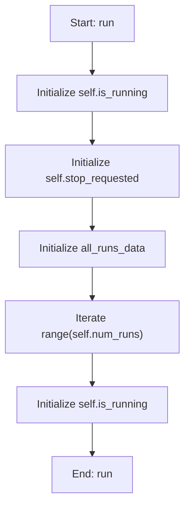

### Flowchart Pseudo-code
```python
FUNCTION run(self):
    DO "Initialize self.is_running"
    DO "Initialize self.stop_requested"
    DO "Initialize all_runs_data"
    DO "Iterate range(self.num_runs)"
    DO "Initialize self.is_running"
END FUNCTION
```

## Methods & Functions

### `__init__`
- **Arguments**: `self, main_system_parameters, dva_parameters, target_values_weights, omega_start, omega_end, omega_points, pop_size, generations, cxpb, mutpb, eta_c, eta_m, num_runs, random_seed, convergence_epsilon, convergence_window, convergence_min_gen, hv_ref_point, heuristic_init_ratio`
- **Returns**: `None`
- **Logic**: Assigns self.main_system_parameters; Assigns self.parameter_names; Assigns self.low_bounds; Assigns self.high_bounds; Assigns self.fixed_params...

### `_evaluate_objectives`
- **Arguments**: `self, individual`
- **Returns**: `None`
- **Logic**: Assigns tau; Assigns alpha; Assigns beta; Assigns n_active; Assigns sum_abs_xi...

### `_heuristic_initialization`
- **Arguments**: `self`
- **Returns**: `None`
- **Logic**: Assigns ind; Loops over range(len(ind)); Returns result

### `run`
- **Arguments**: `self`
- **Returns**: `None`
- **Logic**: Assigns self.is_running; Assigns self.stop_requested; Assigns all_runs_data; Loops over range(self.num_runs); Assigns self.is_running

### `pause`
- **Arguments**: `self`
- **Returns**: `None`
- **Logic**: Assigns self.is_paused

### `resume`
- **Arguments**: `self`
- **Returns**: `None`
- **Logic**: Assigns self.is_paused

### `stop`
- **Arguments**: `self`
- **Returns**: `None`
- **Logic**: Assigns self.stop_requested; Assigns self.is_running; Assigns self.is_paused


================================================================================
## SOURCE: Documents/Optimization_Guild/Workers/CMAESWorker.md
================================================================================


# CMAESWorker

## Purpose
Core implementation of CMAESWorker logic.

## Internal Logic Flow: `run`
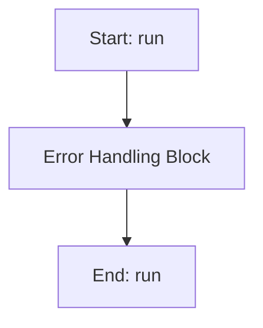

### Flowchart Pseudo-code
```python
FUNCTION run(self):
    DO "Error Handling Block"
END FUNCTION
```

## Methods & Functions

### `__init__`
- **Arguments**: `self, main_params, target_values_dict, weights_dict, omega_start, omega_end, omega_points, cma_initial_sigma, cma_max_iter, cma_tol, cma_parameter_data, alpha, percentage_error_scale, track_metrics, use_ml_adaptive, ml_ucb_c, use_rl_controller, rl_alpha, rl_gamma, rl_epsilon, rl_epsilon_decay, sigma_scale`
- **Returns**: `None`
- **Logic**: Assigns self.main_params; Assigns self.target_values_dict; Assigns self.weights_dict; Assigns self.omega_start; Assigns self.omega_end...

### `run`
- **Arguments**: `self`
- **Returns**: `None`
- **Logic**: Simple function logic.

### `_get_system_info`
- **Arguments**: `self`
- **Returns**: `None`
- **Logic**: Simple function logic.

### `_update_resource_metrics`
- **Arguments**: `self`
- **Returns**: `None`
- **Logic**: Conditional: not self.track_metrics

### `_start_metrics_tracking`
- **Arguments**: `self`
- **Returns**: `None`
- **Logic**: Conditional: not self.track_metrics; Assigns self.metrics['start_time']; Conditional: not self.metrics.get('system_i

### `_stop_metrics_tracking`
- **Arguments**: `self`
- **Returns**: `None`
- **Logic**: Conditional: not self.track_metrics; Assigns self.metrics['end_time']; Conditional: self.metrics.get('start_time')

### `_handle_timeout`
- **Arguments**: `self`
- **Returns**: `None`
- **Logic**: Simple function logic.


================================================================================
## SOURCE: Documents/Optimization_Guild/Workers/DEWorker.md
================================================================================


# DEStrategy

## Purpose
Core implementation of DEStrategy logic.

## Internal Logic Flow: `run`


### Flowchart Pseudo-code
```python
FUNCTION run(self):
    DO "Error Handling Block"
END FUNCTION
```

## Methods & Functions

### `__post_init__`
- **Arguments**: `self`
- **Returns**: `None`
- **Logic**: Assigns self.generations; Assigns self.best_fitness_history; Assigns self.mean_fitness_history; Assigns self.diversity_history; Assigns self.parameter_mean_history...

### `__post_init__`
- **Arguments**: `self`
- **Returns**: `None`
- **Logic**: Assigns self.run_best_fitnesses; Assigns self.run_best_solutions; Assigns self.run_convergence_gens; Assigns self.run_execution_times; Assigns self.parameter_distributions

### `__init__`
- **Arguments**: `self, main_params, target_values_dict, weights_dict, omega_start, omega_end, omega_points, de_pop_size, de_num_generations, de_F, de_CR, de_tol, de_parameter_data, alpha, beta, strategy, adaptive_method, adaptive_params, termination_criteria, use_parallel, n_processes, seed, record_statistics, constraint_handling, diversity_preservation, num_runs, track_metrics, use_ml_adaptive, pop_min, pop_max, ml_ucb_c, ml_adapt_population, ml_diversity_weight, ml_diversity_target, use_rl_controller, rl_alpha, rl_gamma, rl_epsilon, rl_epsilon_decay`
- **Returns**: `None`
- **Logic**: Assigns self.main_params; Assigns self.target_values_dict; Assigns self.weights_dict; Assigns self.omega_start; Assigns self.omega_end...

### `run`
- **Arguments**: `self`
- **Returns**: `None`
- **Logic**: Simple function logic.

### `_run_multiple`
- **Arguments**: `self`
- **Returns**: `None`
- **Logic**: Assigns overall_start_time; Assigns parameter_names; Loops over range(self.num_runs); Conditional: not self.should_stop; Assigns best_run_idx...

### `_run_single`
- **Arguments**: `self, return_convergence`
- **Returns**: `None`
- **Logic**: Assigns start_time; Assigns parameter_names; Assigns parameter_bounds; Assigns fixed_parameters; Loops over enumerate(self.de_parameter_da...

### `_create_multi_run_plots`
- **Arguments**: `self, parameter_names`
- **Returns**: `None`
- **Logic**: Simple function logic.

### `_handle_timeout`
- **Arguments**: `self`
- **Returns**: `None`
- **Logic**: Simple function logic.

### `_get_system_info`
- **Arguments**: `self`
- **Returns**: `None`
- **Logic**: Simple function logic.

### `_update_resource_metrics`
- **Arguments**: `self`
- **Returns**: `None`
- **Logic**: Conditional: not self.track_metrics

### `_start_metrics_tracking`
- **Arguments**: `self`
- **Returns**: `None`
- **Logic**: Conditional: not self.track_metrics; Assigns self.metrics['start_time']; Conditional: not self.metrics.get('system_i

### `_stop_metrics_tracking`
- **Arguments**: `self`
- **Returns**: `None`
- **Logic**: Conditional: not self.track_metrics; Assigns self.metrics['end_time']; Conditional: self.metrics.get('start_time')

### `_evaluate_solution`
- **Arguments**: `self, solution`
- **Returns**: `None`
- **Logic**: Assigns param_dict; Loops over enumerate(self.de_parameter_da; Assigns updated_params; Assigns frf_analyzer; Assigns results...

### `evaluate_individual`
- **Arguments**: `self, individual`
- **Returns**: `None`
- **Logic**: Simple function logic.

### `_initialize_population`
- **Arguments**: `self, parameter_bounds, fixed_parameters, num_params`
- **Returns**: `None`
- **Logic**: Assigns population; Returns result

### `_evaluate_population_parallel`
- **Arguments**: `self, population`
- **Returns**: `None`
- **Logic**: Returns result

### `_apply_de_strategy`
- **Arguments**: `self, i, population, global_best, fitnesses, parameter_bounds, fixed_parameters, num_params`
- **Returns**: `None`
- **Logic**: Assigns target; Assigns F; Assigns CR; Assigns idxs; Conditional: self.strategy == DEStrategy.RA...

### `_create_donor_rand_1`
- **Arguments**: `self, x_r1, x_r2, x_r3, F, parameter_bounds, fixed_parameters, num_params`
- **Returns**: `None`
- **Logic**: Assigns donor; Loops over range(num_params); Returns result

### `_create_donor_rand_2`
- **Arguments**: `self, x_r1, x_r2, x_r3, x_r4, x_r5, F, parameter_bounds, fixed_parameters, num_params`
- **Returns**: `None`
- **Logic**: Assigns donor; Loops over range(num_params); Returns result

### `_create_donor_best_1`
- **Arguments**: `self, x_best, x_r1, x_r2, F, parameter_bounds, fixed_parameters, num_params`
- **Returns**: `None`
- **Logic**: Assigns donor; Loops over range(num_params); Returns result

### `_create_donor_best_2`
- **Arguments**: `self, x_best, x_r1, x_r2, x_r3, x_r4, F, parameter_bounds, fixed_parameters, num_params`
- **Returns**: `None`
- **Logic**: Assigns donor; Loops over range(num_params); Returns result

### `_create_donor_current_to_best_1`
- **Arguments**: `self, x_i, x_best, x_r1, x_r2, F, parameter_bounds, fixed_parameters, num_params`
- **Returns**: `None`
- **Logic**: Assigns donor; Loops over range(num_params); Returns result

### `_create_donor_current_to_rand_1`
- **Arguments**: `self, x_i, x_r1, x_r2, x_r3, K, F, parameter_bounds, fixed_parameters, num_params`
- **Returns**: `None`
- **Logic**: Assigns donor; Loops over range(num_params); Returns result

### `_apply_crossover`
- **Arguments**: `self, target, donor, CR, fixed_parameters, num_params`
- **Returns**: `None`
- **Logic**: Assigns trial; Assigns j_rand; Loops over range(num_params); Returns result

### `_handle_constraints`
- **Arguments**: `self, trial, parameter_bounds`
- **Returns**: `None`
- **Logic**: Conditional: self.constraint_handling == 'p

### `_initialize_adaptive_parameters`
- **Arguments**: `self, num_params`
- **Returns**: `None`
- **Logic**: Conditional: self.adaptive_method == Adapti; Conditional: self.adaptive_method == Adapti

### `_adapt_control_parameters`
- **Arguments**: `self, gen, population, fitnesses`
- **Returns**: `None`
- **Logic**: Conditional: self.adaptive_method == Adapti

### `_get_current_F`
- **Arguments**: `self, i`
- **Returns**: `None`
- **Logic**: Conditional: self.adaptive_method == Adapti; Returns result

### `_get_current_CR`
- **Arguments**: `self, i`
- **Returns**: `None`
- **Logic**: Conditional: self.adaptive_method == Adapti; Returns result

### `_calculate_diversity`
- **Arguments**: `self, population`
- **Returns**: `None`
- **Logic**: Conditional: len(population) <= 1; Assigns pop_array; Assigns (n_individuals, n_dimensions); Assigns centroid; Assigns distances...

### `_apply_diversity_preservation`
- **Arguments**: `self, population, fitnesses, parameter_bounds, fixed_parameters`
- **Returns**: `None`
- **Logic**: Assigns diversity; Assigns diversity_threshold; Conditional: diversity < diversity_threshol; Returns result

### `_check_termination`
- **Arguments**: `self, gen, best_fitness, no_improvement_count, diversity`
- **Returns**: `None`
- **Logic**: Conditional: gen >= self.de_num_generations; Conditional: best_fitness <= self.de_tol; Assigns stagnation_limit; Conditional: no_improvement_count >= stagna; Assigns min_diversity...

### `_record_statistics`
- **Arguments**: `self, gen, population, fitnesses, best_individual, best_fitness, start_time, success_rate`
- **Returns**: `None`
- **Logic**: Conditional: not self.record_statistics; Assigns pop_array; Assigns diversity; Conditional: pop_array.size > 0; Conditional: success_rate is not None

### `_create_diagnostic_plots`
- **Arguments**: `self, parameter_names`
- **Returns**: `None`
- **Logic**: Conditional: not self.record_statistics

### `perform_sensitivity_analysis`
- **Arguments**: `self, best_individual, parameter_names, n_samples, plot_results`
- **Returns**: `None`
- **Logic**: Simple function logic.

### `_create_sensitivity_plots`
- **Arguments**: `self, sensitivity_results, parameter_names`
- **Returns**: `None`
- **Logic**: Simple function logic.

### `tune_hyperparameters`
- **Arguments**: `main_params, target_values_dict, weights_dict, omega_start, omega_end, omega_points, de_parameter_data, n_trials, parallel, n_processes`
- **Returns**: `None`
- **Logic**: Assigns pop_sizes; Assigns f_values; Assigns cr_values; Assigns strategies; Conditional: parallel...

### `restart_optimization`
- **Arguments**: `cls, previous_results, main_params, target_values_dict, weights_dict, omega_start, omega_end, omega_points, de_parameter_data, restart_options`
- **Returns**: `None`
- **Logic**: Assigns options; Conditional: restart_options; Assigns best_individual; Conditional: best_individual is None; Assigns refined_parameter_data...


================================================================================
## SOURCE: Documents/Optimization_Guild/Workers/FRFWorker.md
================================================================================


# FRFWorker

## Purpose
Core implementation of FRFWorker logic.

## Internal Logic Flow: `run`


### Flowchart Pseudo-code
```python
FUNCTION run(self):
    DO "Error Handling Block"
END FUNCTION
```

## Methods & Functions

### `__init__`
- **Arguments**: `self, main_params, dva_params, omega_start, omega_end, omega_points, target_values_dict, weights_dict, plot_figure, show_peaks, show_slopes, interpolation_method, interpolation_points`
- **Returns**: `None`
- **Logic**: Assigns self.main_params; Assigns self.dva_params; Assigns self.omega_start; Assigns self.omega_end; Assigns self.omega_points...

### `run`
- **Arguments**: `self`
- **Returns**: `None`
- **Logic**: Simple function logic.


================================================================================
## SOURCE: Documents/Optimization_Guild/Workers/GAWorker.md
================================================================================


# GAWorker

## Purpose
Background worker thread that executes the Genetic Algorithm (GA).

The heavy optimisation work runs in this thread so the GUI remains responsive.
Progress and results are communicated back to the GUI via Qt signals.

## Internal Logic Flow: `run`
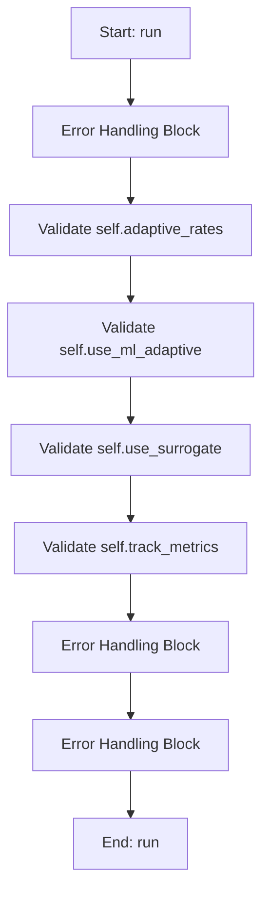

### Flowchart Pseudo-code
```python
FUNCTION run(self):
    DO "Error Handling Block"
    DO "Validate self.adaptive_rates"
    DO "Validate self.use_ml_adaptive"
    DO "Validate self.use_surrogate"
    DO "Validate self.track_metrics"
    DO "Error Handling Block"
    DO "Error Handling Block"
END FUNCTION
```

## Methods & Functions

### `safe_deap_operation`
- **Arguments**: `func`
- **Returns**: `None`
- **Logic**: Returns result

### `build_random_validation_payload`
- **Arguments**: `df, omega_vector, frf_curves`
- **Returns**: `None`
- **Logic**: Assigns payload; Assigns safe_curves; Conditional: isinstance(frf_curves, dict); Assigns payload['frf_curves']; Returns result

### `_attach_frf_peak_positions`
- **Arguments**: `self, results_dict`
- **Returns**: `None`
- **Logic**: Simple function logic.

### `__init__`
- **Arguments**: `self, main_params, target_values_dict, weights_dict, omega_start, omega_end, omega_points, ga_pop_size, ga_num_generations, ga_cxpb, ga_mutpb, ga_tol, ga_parameter_data, alpha, percentage_error_scale, cost_scale_factor, track_metrics, adaptive_rates, stagnation_limit, cxpb_min, cxpb_max, mutpb_min, mutpb_max, use_ml_adaptive, pop_min, pop_max, ml_ucb_c, ml_adapt_population, ml_diversity_weight, ml_diversity_target, ml_historical_weight, ml_current_weight, ml_stag_enabled, ml_stag_limit, use_rl_controller, rl_alpha, rl_gamma, rl_epsilon, rl_epsilon_decay, rl_stag_enabled, rl_stag_limit, rl_w1, rl_w2, rl_w3, rl_w4, rl_cv_target, use_surrogate, surrogate_pool_factor, surrogate_k, surrogate_explore_frac, seeding_method, seeding_seed, use_neural_seeding, neural_acq_type, neural_beta_min, neural_beta_max, neural_epsilon, neural_pool_mult, neural_epochs, neural_time_cap_ms, neural_ensemble_n, neural_hidden, neural_layers, neural_dropout, neural_weight_decay, neural_enable_grad_refine, neural_grad_steps, neural_device, neural_adapt_epsilon, neural_eps_min, neural_eps_max, best_pool_mult, best_diversity_frac, dva_activation_threshold, dva_activation_penalty, dva_costs, dva_costs_by_category, use_enhanced_cost, benefit_w_primary, benefit_w_accuracy, benefit_w_sparsity, cat_w_material, cat_w_manufacturing, cat_w_maintenance, cat_w_operational, benefit_weight_start, benefit_weight_end, generation_ratio, dva_category_map, metrics_timer_interval, metrics_verbose`
- **Returns**: `None`
- **Logic**: Assigns self.main_params; Assigns self.target_values_dict; Assigns self.weights_dict; Assigns self.omega_start; Assigns self.omega_end...

### `__del__`
- **Arguments**: `self`
- **Returns**: `None`
- **Logic**: Assigns self.abort; Assigns self.paused

### `handle_timeout`
- **Arguments**: `self`
- **Returns**: `None`
- **Logic**: Conditional: not self.abort

### `pause`
- **Arguments**: `self`
- **Returns**: `None`
- **Logic**: Assigns self.paused

### `resume`
- **Arguments**: `self`
- **Returns**: `None`
- **Logic**: Assigns self.paused

### `stop`
- **Arguments**: `self`
- **Returns**: `None`
- **Logic**: Assigns self.abort; Assigns self.paused

### `_check_pause_abort`
- **Arguments**: `self`
- **Returns**: `None`
- **Logic**: Assigns aborted; Returns result

### `cleanup`
- **Arguments**: `self`
- **Returns**: `None`
- **Logic**: Conditional: hasattr(creator, 'FitnessMin'); Conditional: hasattr(creator, 'Individual'); Conditional: self.watchdog_timer.isActive()

### `run`
- **Arguments**: `self`
- **Returns**: `None`
- **Logic**: Conditional: self.adaptive_rates; Conditional: self.use_ml_adaptive; Conditional: self.use_surrogate; Conditional: self.track_metrics

### `_get_system_info`
- **Arguments**: `self`
- **Returns**: `None`
- **Logic**: Simple function logic.

### `_update_resource_metrics`
- **Arguments**: `self`
- **Returns**: `None`
- **Logic**: Conditional: not self.track_metrics

### `_start_metrics_tracking`
- **Arguments**: `self`
- **Returns**: `None`
- **Logic**: Conditional: not self.track_metrics; Assigns self.metrics['start_time']

### `_stop_metrics_tracking`
- **Arguments**: `self`
- **Returns**: `None`
- **Logic**: Conditional: not self.track_metrics; Assigns self.metrics['end_time']; Assigns self.metrics['total_duration']; Conditional: len(self.metrics['best_fitness


================================================================================
## SOURCE: Documents/Optimization_Guild/Workers/MOGAWorker.md
================================================================================


# MOGAWorker

## Purpose
Core implementation of MOGAWorker logic.

## Internal Logic Flow: `run`
```mermaid
graph TD
    Start["Start: run"] --> Step0["Error Handling Block"]
    Step0["Error Handling Block"] --> End["End: run"]
```

### Flowchart Pseudo-code
```python
FUNCTION run(self):
    DO "Error Handling Block"
END FUNCTION
```

## Methods & Functions

### `safe_deap_operation`
- **Arguments**: `func`
- **Returns**: `None`
- **Logic**: Returns result

### `__init__`
- **Arguments**: `self, main_params, dva_params, target_values_weights, omega_start, omega_end, omega_points, pop_size, generations, cxpb, mutpb, eta_c, eta_m, indpb, sparsity_tau, sparsity_alpha, sparsity_beta, num_runs, random_seed, parent`
- **Returns**: `None`
- **Logic**: Assigns self.main_params; Assigns self.parameter_names; Assigns self.low_bounds; Assigns self.high_bounds; Assigns self.fixed_params...

### `stop`
- **Arguments**: `self`
- **Returns**: `None`
- **Logic**: Assigns self.abort

### `pause`
- **Arguments**: `self`
- **Returns**: `None`
- **Logic**: Assigns self.is_paused

### `resume`
- **Arguments**: `self`
- **Returns**: `None`
- **Logic**: Assigns self.is_paused

### `evaluate`
- **Arguments**: `self, individual`
- **Returns**: `None`
- **Logic**: Assigns n_active; Assigns f2; Assigns f3; Returns result

### `run`
- **Arguments**: `self`
- **Returns**: `None`
- **Logic**: Simple function logic.


================================================================================
## SOURCE: Documents/Optimization_Guild/Workers/MemorySeeder.md
================================================================================


# MemorySeeder

## Purpose
Lightweight AI-like memory seeder that learns and memorizes good seeds across runs.

- Keeps a bounded memory of the best parameter vectors (with lowest fitness)
- Proposes new seeds via a mixture of: replaying top seeds, Gaussian jitter around top-K,
  and uniform exploration within bounds
- Respects fixed parameters
- Persists memory to disk (JSON) to improve over time

## Internal Logic Flow: `__init__`
```mermaid
graph TD
    Start["Start: __init__"] --> Step0["Initialize self.lows"]
    Step0["Initialize self.lows"] --> Step1["Initialize self.highs"]
    Step1["Initialize self.highs"] --> Step2["Initialize self.fixed_mask"]
    Step2["Initialize self.fixed_mask"] --> Step3["Initialize self.fixed_values"]
    Step3["Initialize self.fixed_values"] --> Step4["Initialize self.var_indices"]
    Step4["Initialize self.var_indices"] --> Step5["Initialize self.max_size"]
    Step5["Initialize self.max_size"] --> Step6["Initialize self.top_k"]
    Step6["Initialize self.top_k"] --> Step7["Initialize self.sigma_scale"]
    Step7["Initialize self.sigma_scale"] --> End["End: __init__"]
```

### Flowchart Pseudo-code
```python
FUNCTION __init__(self, lows, highs, fixed_mask, fixed_values, max_size, top_k, sigma_scale, exploration_frac, replay_frac, file_path, seed):
    DO "Initialize self.lows"
    DO "Initialize self.highs"
    DO "Initialize self.fixed_mask"
    DO "Initialize self.fixed_values"
    DO "Initialize self.var_indices"
    DO "Initialize self.max_size"
    DO "Initialize self.top_k"
    DO "Initialize self.sigma_scale"
END FUNCTION
```

## Methods & Functions

### `__init__`
- **Arguments**: `self, lows, highs, fixed_mask, fixed_values, max_size, top_k, sigma_scale, exploration_frac, replay_frac, file_path, seed`
- **Returns**: `None`
- **Logic**: Assigns self.lows; Assigns self.highs; Assigns self.fixed_mask; Assigns self.fixed_values; Assigns self.var_indices...

### `size`
- **Arguments**: `self`
- **Returns**: `int`
- **Logic**: Returns result

### `_load`
- **Arguments**: `self`
- **Returns**: `None`
- **Logic**: Simple function logic.

### `_save`
- **Arguments**: `self`
- **Returns**: `None`
- **Logic**: Simple function logic.

### `add_data`
- **Arguments**: `self, X, y`
- **Returns**: `None`
- **Logic**: Conditional: not X or not y

### `_rand_var`
- **Arguments**: `self, n`
- **Returns**: `np.ndarray`
- **Logic**: Conditional: self.var_indices.size == 0; Assigns Z; Assigns lows; Assigns highs; Assigns span...

### `_jitter_around`
- **Arguments**: `self, bases, n`
- **Returns**: `np.ndarray`
- **Logic**: Conditional: n <= 0; Conditional: bases.size == 0 or self.var_in; Assigns lows; Assigns highs; Assigns span...

### `propose`
- **Arguments**: `self, count`
- **Returns**: `List[List[float]]`
- **Logic**: Conditional: count <= 0; Conditional: self.size == 0; Assigns n_replay; Assigns n_explore; Assigns n_model...


================================================================================
## SOURCE: Documents/Optimization_Guild/Workers/NSGA2Worker.md
================================================================================


# NSGA2Worker

## Purpose
Core implementation of NSGA2Worker logic.

## Internal Logic Flow: `run`
```mermaid
graph TD
    Start["Start: run"] --> Step0["Error Handling Block"]
    Step0["Error Handling Block"] --> End["End: run"]
```

### Flowchart Pseudo-code
```python
FUNCTION run(self):
    DO "Error Handling Block"
END FUNCTION
```

## Methods & Functions

### `safe_deap_operation`
- **Arguments**: `func`
- **Returns**: `None`
- **Logic**: Returns result

### `__init__`
- **Arguments**: `self, main_params, dva_params, target_values_weights, omega_start, omega_end, omega_points, pop_size, generations, cxpb, mutpb, eta_c, eta_m, indpb, sparsity_tau, sparsity_alpha, sparsity_beta, num_runs, random_seed, convergence_epsilon, convergence_window, convergence_min_gen, hv_ref_point, parent`
- **Returns**: `None`
- **Logic**: Assigns self.main_params; Assigns self.parameter_names; Assigns self.low_bounds; Assigns self.high_bounds; Assigns self.fixed_params...

### `stop`
- **Arguments**: `self`
- **Returns**: `None`
- **Logic**: Assigns self.abort

### `pause`
- **Arguments**: `self`
- **Returns**: `None`
- **Logic**: Assigns self.is_paused

### `resume`
- **Arguments**: `self`
- **Returns**: `None`
- **Logic**: Assigns self.is_paused

### `evaluate`
- **Arguments**: `self, individual`
- **Returns**: `None`
- **Logic**: Assigns n_active; Assigns f2; Assigns f3; Returns result

### `run`
- **Arguments**: `self`
- **Returns**: `None`
- **Logic**: Simple function logic.


================================================================================
## SOURCE: Documents/Optimization_Guild/Workers/NeuralSeeder.md
================================================================================


# NeuralSeeder

## Purpose
Online-learning seeding via an ensemble of small MLPs.

- Maintains dataset of evaluated (x, y). x provided in original scale; class normalizes to [0,1] over variable dims.
- Trains a small ensemble each generation under a wall-clock time cap.
- Proposes seeds via uncertainty-aware acquisition (UCB or EI) over a candidate pool.
- Supports epsilon exploration and diversity filtering; optional gradient refinement.
- Honors fixed parameters exactly and respects provided bounds when decoding.

## Internal Logic Flow: `_now_ms`
```mermaid
graph TD
    Start["Start: _now_ms"] --> End["End: _now_ms"]
```

### Flowchart Pseudo-code
```python
FUNCTION _now_ms():
END FUNCTION
```

## Methods & Functions

### `_now_ms`
- **Arguments**: ``
- **Returns**: `float`
- **Logic**: Returns result

### `__init__`
- **Arguments**: `self, lows, highs, fixed_mask, fixed_values, ensemble_n, hidden, layers, dropout, weight_decay, epochs, time_cap_ms, pool_mult, epsilon, acq_type, device, seed, diversity_min_dist, enable_grad_refine, grad_steps`
- **Returns**: `None`
- **Logic**: Assigns self.lows; Assigns self.highs; Assigns self.fixed_mask; Assigns self.fixed_values; Assigns self.var_indices...

### `_to_z`
- **Arguments**: `self, X`
- **Returns**: `np.ndarray`
- **Logic**: Assigns lows; Assigns highs; Assigns span; Returns result

### `_from_z`
- **Arguments**: `self, Z`
- **Returns**: `np.ndarray`
- **Logic**: Assigns X; Assigns X[:, :]; Assigns lows; Assigns highs; Assigns span...

### `size`
- **Arguments**: `self`
- **Returns**: `int`
- **Logic**: Returns result

### `add_data`
- **Arguments**: `self, X, y`
- **Returns**: `None`
- **Logic**: Conditional: X is None or y is None or len(; Assigns X_arr; Assigns y_arr; Assigns y_arr; Assigns y_arr...

### `_train_torch`
- **Arguments**: `self`
- **Returns**: `Tuple[float, int]`
- **Logic**: Conditional: not self._torch_ok or self.siz; Assigns start_ms; Assigns X; Assigns y; Assigns Z...

### `train`
- **Arguments**: `self`
- **Returns**: `Tuple[float, int]`
- **Logic**: Conditional: not self._torch_ok

### `_predict_mu_sigma`
- **Arguments**: `self, X`
- **Returns**: `Tuple[np.ndarray, np.ndarray]`
- **Logic**: Conditional: not self._torch_ok or not self; Assigns Z; Assigns Zt; Assigns preds; Assigns P...

### `_acq_scores`
- **Arguments**: `self, mu, sigma, best_y, beta`
- **Returns**: `np.ndarray`
- **Logic**: Conditional: self.acq_type == 'ei'; Returns result

### `_diversity_filter`
- **Arguments**: `self, Z, idx_sorted, k`
- **Returns**: `List[int]`
- **Logic**: Conditional: k <= 0 or idx_sorted.size == 0; Loops over idx_sorted; Assigns i; Returns result

### `propose`
- **Arguments**: `self, count, beta, best_y, exploration_fraction`
- **Returns**: `List[List[float]]`
- **Logic**: Conditional: count <= 0; Assigns pool_n; Conditional: SCIPY_QMC_AVAILABLE and self.i; Conditional: self.enable_grad_refine and se; Assigns X_pool...

### `predict_mean`
- **Arguments**: `self, X`
- **Returns**: `np.ndarray`
- **Logic**: Assigns X_arr; Assigns (mu, _); Returns result

### `predict_mu_sigma`
- **Arguments**: `self, X`
- **Returns**: `Tuple[np.ndarray, np.ndarray]`
- **Logic**: Assigns X_arr; Assigns (mu, sigma); Returns result


================================================================================
## SOURCE: Documents/Optimization_Guild/Workers/NeuralSurrogate.md
================================================================================


# NeuralSurrogate

## Purpose
A Neural Network Surrogate that replaces KNN for candidate screening.

Analogy: The "Seasoned Expert" who predicts performance without doing the math.

## Internal Logic Flow: `__init__`
```mermaid
graph TD
    Start["Start: __init__"] --> Step0["Initialize self.input_dim"]
    Step0["Initialize self.input_dim"] --> Step1["Initialize self.hidden"]
    Step1["Initialize self.hidden"] --> Step2["Initialize self.layers"]
    Step2["Initialize self.layers"] --> Step3["Initialize self.dropout"]
    Step3["Initialize self.dropout"] --> Step4["Initialize self.epochs"]
    Step4["Initialize self.epochs"] --> Step5["Initialize self.batch_size"]
    Step5["Initialize self.batch_size"] --> Step6["Initialize self.lr"]
    Step6["Initialize self.lr"] --> Step7["Initialize self._device"]
    Step7["Initialize self._device"] --> End["End: __init__"]
```

### Flowchart Pseudo-code
```python
FUNCTION __init__(self, input_dim, hidden, layers, dropout, epochs, batch_size, lr, device):
    DO "Initialize self.input_dim"
    DO "Initialize self.hidden"
    DO "Initialize self.layers"
    DO "Initialize self.dropout"
    DO "Initialize self.epochs"
    DO "Initialize self.batch_size"
    DO "Initialize self.lr"
    DO "Initialize self._device"
END FUNCTION
```

## Methods & Functions

### `__init__`
- **Arguments**: `self, input_dim, hidden, layers, dropout, epochs, batch_size, lr, device`
- **Returns**: `None`
- **Logic**: Assigns self.input_dim; Assigns self.hidden; Assigns self.layers; Assigns self.dropout; Assigns self.epochs...

### `train`
- **Arguments**: `self, X, y`
- **Returns**: `None`
- **Logic**: Conditional: not TORCH_AVAILABLE or self._m; Assigns X_t; Assigns y_t; Assigns dataset; Assigns loader...

### `predict`
- **Arguments**: `self, X`
- **Returns**: `np.ndarray`
- **Logic**: Conditional: not TORCH_AVAILABLE or self._m

### `get_fitness_gradient`
- **Arguments**: `self, X`
- **Returns**: `np.ndarray`
- **Logic**: Conditional: not TORCH_AVAILABLE or self._m; Assigns X_t; Assigns preds; Assigns total_pred; Returns result


================================================================================
## SOURCE: Documents/Optimization_Guild/Workers/PINNSolver.md
================================================================================


# PhysicsInformedFRF

## Purpose
A Neural Network that solves the Frequency Response Function (FRF).

Analogy: The "Mechanical Intuition" brain. It doesn't just memorize data; 
it understands the Newton's Laws that govern vibrations.

## Internal Logic Flow: `__init__`
```mermaid
graph TD
    Start["Start: __init__"] --> Step0["Initialize input_dim"]
    Step0["Initialize input_dim"] --> Step1["Initialize layers"]
    Step1["Initialize layers"] --> Step2["Initialize d"]
    Step2["Initialize d"] --> Step3["Iterate range(num_layers)"]
    Step3["Iterate range(num_layers)"] --> Step4["Initialize self.net"]
    Step4["Initialize self.net"] --> End["End: __init__"]
```

### Flowchart Pseudo-code
```python
FUNCTION __init__(self, param_dim, hidden_dim, num_layers):
    DO "Initialize input_dim"
    DO "Initialize layers"
    DO "Initialize d"
    DO "Iterate range(num_layers)"
    DO "Initialize self.net"
END FUNCTION
```

## Methods & Functions

### `__init__`
- **Arguments**: `self, param_dim, hidden_dim, num_layers`
- **Returns**: `None`
- **Logic**: Assigns input_dim; Assigns layers; Assigns d; Loops over range(num_layers); Assigns self.net

### `forward`
- **Arguments**: `self, params, omega`
- **Returns**: `torch.Tensor`
- **Logic**: Assigns x; Returns result

### `__init__`
- **Arguments**: `self, param_dim, device`
- **Returns**: `None`
- **Logic**: Assigns self.device; Assigns self.model; Assigns self.optimizer; Assigns self.criterion

### `physics_residual`
- **Arguments**: `self, params, omega, pred_amp`
- **Returns**: `None`
- **Logic**: Simple function logic.

### `train_step`
- **Arguments**: `self, params, omega, target_amp`
- **Returns**: `None`
- **Logic**: Assigns p_t; Conditional: omega.ndim == 1; Assigns y_t; Assigns pred; Assigns loss_data...

### `predict`
- **Arguments**: `self, params, omega_range`
- **Returns**: `np.ndarray`
- **Logic**: Simple function logic.

### `load_weights`
- **Arguments**: `self, file_path`
- **Returns**: `None`
- **Logic**: Conditional: not file_path or not os.path.e

### `save_weights`
- **Arguments**: `self, file_path`
- **Returns**: `None`
- **Logic**: Simple function logic.


================================================================================
## SOURCE: Documents/Optimization_Guild/Workers/PINNWorker.md
================================================================================


# GearboxPINN

## Purpose
Core implementation of GearboxPINN logic.

## Internal Logic Flow: `run`
```mermaid
graph TD
    Start["Start: run"] --> Step0["Error Handling Block"]
    Step0["Error Handling Block"] --> End["End: run"]
```

### Flowchart Pseudo-code
```python
FUNCTION run(self):
    DO "Error Handling Block"
END FUNCTION
```

## Methods & Functions

### `__init__`
- **Arguments**: `self, P, layers, neurons, activation, use_fourier, omega_max, n_freqs, topology_mask`
- **Returns**: `None`
- **Logic**: Assigns self.P; Assigns self.use_fourier; Assigns input_dim; Conditional: use_fourier; Assigns act...

### `get_matrices`
- **Arguments**: `self`
- **Returns**: `None`
- **Logic**: Assigns M; Assigns K_pos; Assigns C_pos; Assigns K_conn; Assigns K_conn_sym...

### `forward`
- **Arguments**: `self, t`
- **Returns**: `None`
- **Logic**: Conditional: self.use_fourier; Returns result

### `__init__`
- **Arguments**: `self, t_data, x_data, v_data, a_data, P, layers, neurons, adam_epochs, lbfgs_epochs, lr, lambda_f, lambda_data, lambda_ic, lambda_reg, use_fourier, omega_max, n_freqs, topology_mask, warmup_epochs`
- **Returns**: `None`
- **Logic**: Assigns self.t_data; Assigns self.x_data; Assigns self.v_data; Assigns self.a_data; Assigns self.P...

### `stop`
- **Arguments**: `self`
- **Returns**: `None`
- **Logic**: Assigns self.abort

### `physics_loss`
- **Arguments**: `self, model, t_col`
- **Returns**: `None`
- **Logic**: Assigns t_col; Assigns x_hat; Assigns (M, C, K); Assigns v_hat; Loops over range(self.P)...

### `run`
- **Arguments**: `self`
- **Returns**: `None`
- **Logic**: Simple function logic.


================================================================================
## SOURCE: Documents/Optimization_Guild/Workers/PSOWorker.md
================================================================================


# TopologyType

## Purpose
Topology types for PSO neighborhood structures.

Different topologies affect information flow through the swarm:
- GLOBAL: All particles connected, fastest convergence but may get trapped in local optima
- RING: Each particle connected to two neighbors, slower convergence but better exploration
- VON_NEUMANN: Grid-like neighborhood structure balancing exploration and exploitation
- RANDOM: Random connections that change periodically, enhancing diversity

## Internal Logic Flow: `create_neighborhoods`
```mermaid
graph TD
    Start["Start: create_neighborhoods"] --> Step0["Initialize neighborhoods"]
    Step0["Initialize neighborhoods"] --> Step1["Validate topology_type == Top"]
    Step1["Validate topology_type == Top"] --> End["End: create_neighborhoods"]
```

### Flowchart Pseudo-code
```python
FUNCTION create_neighborhoods(self, swarm_size, topology_type):
    DO "Initialize neighborhoods"
    DO "Validate topology_type == Top"
END FUNCTION
```

## Methods & Functions

### `__init__`
- **Arguments**: `self, main_params, target_values_dict, weights_dict, omega_start, omega_end, omega_points, pso_swarm_size, pso_num_iterations, pso_w, pso_w_damping, pso_c1, pso_c2, pso_tol, pso_parameter_data, alpha, adaptive_params, topology, mutation_rate, max_velocity_factor, stagnation_limit, boundary_handling, early_stopping, early_stopping_iters, early_stopping_tol, diversity_threshold, quasi_random_init, track_metrics, use_ml_adaptive, pop_min, pop_max, ml_ucb_c, ml_adapt_population, ml_diversity_weight, ml_diversity_target, use_rl_controller, rl_alpha, rl_gamma, rl_epsilon, rl_epsilon_decay`
- **Returns**: `None`
- **Logic**: Assigns self._terminate_flag; Assigns self.main_params; Assigns self.target_values_dict; Assigns self.weights_dict; Assigns self.omega_start...

### `adaptive_inertia_weight`
- **Arguments**: `self, iter_num, max_iter, best_fitness, avg_fitness, diversity`
- **Returns**: `None`
- **Logic**: Conditional: max_iter <= 1; Assigns w_linear; Assigns n; Assigns w_nonlinear; Conditional: avg_fitness == 0 or best_fitne...

### `adaptive_acceleration_coefficients`
- **Arguments**: `self, iter_num, max_iter, diversity`
- **Returns**: `None`
- **Logic**: Conditional: max_iter <= 1; Assigns (c1_min, c1_max); Assigns (c2_min, c2_max); Assigns progress; Assigns c1_time...

### `calculate_diversity`
- **Arguments**: `self, swarm, parameter_bounds`
- **Returns**: `None`
- **Logic**: Conditional: not swarm; Assigns num_particles; Conditional: num_particles <= 1; Assigns num_dimensions; Assigns centroid...

### `create_neighborhoods`
- **Arguments**: `self, swarm_size, topology_type`
- **Returns**: `None`
- **Logic**: Assigns neighborhoods; Conditional: topology_type == TopologyType.; Returns result

### `update_neighborhoods`
- **Arguments**: `self, iteration`
- **Returns**: `None`
- **Logic**: Conditional: self.topology == TopologyType.

### `handle_boundary_violation`
- **Arguments**: `self, position, velocity, dim, low, high`
- **Returns**: `None`
- **Logic**: Conditional: low <= position <= high; Conditional: self.boundary_handling == 'abs; Conditional: position < low

### `apply_mutation`
- **Arguments**: `self, position, parameter_bounds, fixed_parameters`
- **Returns**: `None`
- **Logic**: Assigns mutated_position; Loops over range(len(position)); Returns result

### `quasi_random_initialize`
- **Arguments**: `self, num_params, parameter_bounds, fixed_parameters, num_particles`
- **Returns**: `None`
- **Logic**: Assigns sampler; Assigns samples; Assigns positions; Loops over range(num_particles); Returns result

### `run`
- **Arguments**: `self`
- **Returns**: `None`
- **Logic**: Simple function logic.

### `_handle_timeout`
- **Arguments**: `self`
- **Returns**: `None`
- **Logic**: Simple function logic.

### `_get_system_info`
- **Arguments**: `self`
- **Returns**: `None`
- **Logic**: Simple function logic.

### `_update_resource_metrics`
- **Arguments**: `self`
- **Returns**: `None`
- **Logic**: Conditional: not self.track_metrics

### `_start_metrics_tracking`
- **Arguments**: `self`
- **Returns**: `None`
- **Logic**: Conditional: not self.track_metrics; Assigns self.metrics['start_time']; Conditional: not self.metrics.get('system_i

### `_stop_metrics_tracking`
- **Arguments**: `self`
- **Returns**: `None`
- **Logic**: Conditional: not self.track_metrics; Assigns self.metrics['end_time']; Conditional: self.metrics.get('start_time')

### `evaluate_particle`
- **Arguments**: `self, position, parameter_bounds`
- **Returns**: `None`
- **Logic**: Simple function logic.

### `terminate`
- **Arguments**: `self`
- **Returns**: `None`
- **Logic**: Assigns self._terminate_flag

### `is_terminated`
- **Arguments**: `self`
- **Returns**: `None`
- **Logic**: Returns result


================================================================================
## SOURCE: Documents/Optimization_Guild/Workers/SAWorker.md
================================================================================


# SAWorker

## Purpose
Core implementation of SAWorker logic.

## Internal Logic Flow: `run`
```mermaid
graph TD
    Start["Start: run"] --> Step0["Error Handling Block"]
    Step0["Error Handling Block"] --> End["End: run"]
```

### Flowchart Pseudo-code
```python
FUNCTION run(self):
    DO "Error Handling Block"
END FUNCTION
```

## Methods & Functions

### `__init__`
- **Arguments**: `self, main_params, target_values_dict, weights_dict, omega_start, omega_end, omega_points, sa_initial_temp, sa_cooling_rate, sa_num_iterations, sa_tol, sa_parameter_data, alpha, percentage_error_scale, track_metrics, use_ml_adaptive, ml_ucb_c, ml_accept_target, use_rl_controller, rl_alpha, rl_gamma, rl_epsilon, rl_epsilon_decay, step_scale`
- **Returns**: `None`
- **Logic**: Assigns self.main_params; Assigns self.target_values_dict; Assigns self.weights_dict; Assigns self.omega_start; Assigns self.omega_end...

### `run`
- **Arguments**: `self`
- **Returns**: `None`
- **Logic**: Simple function logic.

### `evaluate_candidate`
- **Arguments**: `self, candidate`
- **Returns**: `None`
- **Logic**: Simple function logic.

### `_get_system_info`
- **Arguments**: `self`
- **Returns**: `None`
- **Logic**: Simple function logic.

### `_update_resource_metrics`
- **Arguments**: `self`
- **Returns**: `None`
- **Logic**: Conditional: not self.track_metrics

### `_start_metrics_tracking`
- **Arguments**: `self`
- **Returns**: `None`
- **Logic**: Conditional: not self.track_metrics; Assigns self.metrics['start_time']; Conditional: not self.metrics.get('system_i

### `_stop_metrics_tracking`
- **Arguments**: `self`
- **Returns**: `None`
- **Logic**: Conditional: not self.track_metrics; Assigns self.metrics['end_time']; Conditional: self.metrics.get('start_time')

### `_handle_timeout`
- **Arguments**: `self`
- **Returns**: `None`
- **Logic**: Simple function logic.


================================================================================
## SOURCE: Documents/Optimization_Guild/Workers/SobolWorker.md
================================================================================


# SobolWorker

## Purpose
Core implementation of SobolWorker logic.

## Internal Logic Flow: `run`
```mermaid
graph TD
    Start["Start: run"] --> Step0["Error Handling Block"]
    Step0["Error Handling Block"] --> End["End: run"]
```

### Flowchart Pseudo-code
```python
FUNCTION run(self):
    DO "Error Handling Block"
END FUNCTION
```

## Methods & Functions

### `__init__`
- **Arguments**: `self, main_params, dva_bounds, dva_order, omega_start, omega_end, omega_points, num_samples_list, target_values_dict, weights_dict, n_jobs`
- **Returns**: `None`
- **Logic**: Assigns self.main_params; Assigns self.dva_bounds; Assigns self.dva_order; Assigns self.omega_start; Assigns self.omega_end...

### `run`
- **Arguments**: `self`
- **Returns**: `None`
- **Logic**: Simple function logic.


================================================================================
## SOURCE: Documents/GUI_Guild/ARCHITECTURE.md
================================================================================


# DeVana Software Architecture: The Mixin Revolution

## Overview
DeVana employs a sophisticated **Mixin-based Software Architecture** to manage the complexity of its multi-objective optimization suite. Instead of a monolithic class or deep inheritance hierarchy, the `MainWindow` is composed of specialized, decoupled functional units (Mixins).

This architecture allows for:
- **Separation of Concerns**: Each algorithm and UI section has its own dedicated Mixin.
- **Extensibility**: New optimization algorithms can be added by creating a new Mixin and adding it to the `MainWindow` inheritance list.
- **Maintainability**: Bugs in the GA implementation are isolated to the `GAOptimizationMixin`, not affecting PSO or the physics engine.

## The Mixin Composition Pattern

The `MainWindow` class in `codes/mainwindow.py` acts as the **Orchestrator**. It inherits from dozens of Mixins, effectively "assembling" its functionality at class definition time.

### Mixin Hierarchy Diagram

```mermaid
classDiagram
    class QMainWindow
    class MenuMixin
    class IntroductionMixin
    class ContinuousBeamMixin
    class MicrochipPageMixin
    class ThemeMixin
    class GAOptimizationMixin
    class FRFMixin
    class PSOMixin
    class InputTabsMixin
    class StochasticDesignMixin
    class SidebarMixin
    
    class MainWindow {
        +__init__()
        +main_layout: QHBoxLayout
        +content_stack: QStackedWidget
        +create_sidebar()
        +change_page(index)
    }
    
    QMainWindow <|-- MainWindow
    MenuMixin <|-- MainWindow
    IntroductionMixin <|-- MainWindow
    ContinuousBeamMixin <|-- MainWindow
    MicrochipPageMixin <|-- MainWindow
    ThemeMixin <|-- MainWindow
    GAOptimizationMixin <|-- MainWindow
    FRFMixin <|-- MainWindow
    PSOMixin <|-- MainWindow
    InputTabsMixin <|-- MainWindow
    StochasticDesignMixin <|-- MainWindow
    SidebarMixin <|-- MainWindow
```

## Core Architectural Components

### 1. The Orchestrator (`MainWindow`)
Located in `codes/mainwindow.py`, it initializes the core UI framework:
- **Central Widget**: A `QHBoxLayout` containing the Sidebar and the Content Area.
- **Content Area**: A `QScrollArea` containing a `QStackedWidget` (`content_stack`).
- **Initialization Sequence**: It calls `create_sidebar()`, then page creation methods (e.g., `create_introduction_page()`), and finally sets the default page.

### 2. Navigation & Layout (`SidebarMixin`)
Handles the primary navigation. It uses a custom `SidebarButton` widget and communicates with the `content_stack` to switch pages.

### 3. Functional Mixins
- **UI Mixins**: `IntroductionMixin`, `ContinuousBeamMixin`, `MicrochipPageMixin`. These define the visual structure of specific pages.
- **Algorithm Mixins**: `GAOptimizationMixin`, `PSOMixin`, `NSGA2Mixin`, etc. These handle the specific parameters, UI tabs, and worker coordination for each optimization algorithm.
- **Analysis Mixins**: `SobolAnalysisMixin`, `OmegaSensitivityMixin`. Focused on post-optimization or pre-optimization analysis.

### 4. The Worker Pattern (Threading)
To keep the UI responsive, all long-running tasks (optimization, FRF calculation) are offloaded to **Workers** located in `codes/workers/`.
- The Mixin creates a `Worker` instance (inheriting from `QThread`).
- Signals (e.g., `progress`, `finished`, `error`) are connected to Mixin methods.
- The Mixin handles UI updates (progress bars, result text) based on these signals.

## Data Flow & Signal Architecture

```mermaid
sequenceDiagram
    participant UI as Sidebar/Page
    participant Orchestrator as MainWindow
    participant Mixin as AlgorithmMixin
    participant Worker as AlgorithmWorker
    
    UI->>Orchestrator: User Interaction (Click 'Run')
    Orchestrator->>Mixin: Call run_algorithm()
    Mixin->>Mixin: Collect params from UI
    Mixin->>Worker: Instantiate and Start Thread
    loop Progress
        Worker-->>Mixin: signal: update_progress(data)
        Mixin-->>UI: Update UI Elements
    end
    Worker-->>Mixin: signal: finished(results)
    Mixin->>Mixin: Process Results
    Mixin-->>UI: Display Final Visualization
```

## Dynamic Integration Case: Differential Evolution (DE)
DeVana demonstrates an advanced dynamic integration technique for its DE algorithm. Instead of standard inheritance, it uses a manual method injection approach in `integrate_de_functionality()` to handle specific lifecycle requirements and placeholder management.

```python
# Simplified logic from mainwindow.py
def integrate_de_functionality(self):
    temp_de_mixin = DEOptimizationMixin()
    method_list = ['run_de', 'initialize_de_parameter_table', ...]
    for method_name in method_list:
        method = getattr(DEOptimizationMixin, method_name)
        setattr(self, method_name, types.MethodType(method, self))
```

This ensures that even if the Mixin is not fully inherited in the traditional sense, its functionality is surgically attached to the `MainWindow` instance.


================================================================================
## SOURCE: Documents/GUI_Guild/COMPONENTS.md
================================================================================


# DeVana GUI Components: A Modular Breakdown

## Overview
The DeVana user interface is designed for high-density engineering data entry and multi-faceted visualization. It follows a modular structure where major functional areas are isolated into their own UI pages and sub-tabs.

## 1. The Sidebar Navigation
The sidebar is the primary navigation hub, implemented in `SidebarMixin`.

| Button | Target Page | Description |
|--------|-------------|-------------|
| **Intro & Paradigm** | Introduction | High-level workflow and project mission. |
| **Stochastic Design** | Stochastic Design | The core optimization and analysis workspace. |
| **Microchip Controller** | Microchip | Specialized UI for microchip parameter control. |
| **Continuous Beam** | Continuous Beam | Interface for continuous system analysis. |
| **PINN Discretisizer** | PINN | Physics-Informed Neural Network configuration. |
| **REST API Access** | API Key | Headless server and API key management. |
| **CoPilot AI** | Drawer | Integrated AI assistant for engineering support. |

## 2. Stochastic Design Page (The Hub)
Implemented in `StochasticDesignMixin`, this page is a complex assembly of nested tabs and panels.

### UI Structure
```mermaid
graph TD
    SDP["Stochastic Design Page"] --> Banner["Banner: Title & Branding"]
    SDP --> Splitter["Horizontal Splitter"]
    Splitter --> Left["Left Panel: Input & Control"]
    Splitter --> Right["Right Panel: Results & Viz"]
    
    Left --> DesignTabs["Design Tabs"]
    DesignTabs --> InputTab["Input Tabs"]
    DesignTabs --> SensitivityTab["Sensitivity Tabs"]
    DesignTabs --> OptTab["Optimization Tabs"]
    DesignTabs --> MOOTab["Multi-Objective Tabs"]
    
    Right --> ResultsTabs["Results Visualization Tabs"]
    ResultsTabs --> TextResults["Text Summary"]
    ResultsTabs --> FRFViz["FRF Plot"]
    ResultsTabs --> CompViz["Comparative FRF"]
    ResultsTabs --> SobolViz["Sobol Plot"]
```

#### Pseudo-code
```text
BEGIN
  EXECUTE Stochastic Design Page
  EXECUTE Banner: Title & Branding
  EXECUTE Horizontal Splitter
  EXECUTE Left Panel: Input & Control
  EXECUTE Right Panel: Results & Viz
  EXECUTE Design Tabs
  EXECUTE Input Tabs
  EXECUTE Sensitivity Tabs
  EXECUTE Optimization Tabs
  EXECUTE Multi-Objective Tabs
  EXECUTE Results Visualization Tabs
  EXECUTE Text Summary
  EXECUTE FRF Plot
  EXECUTE Comparative FRF
  EXECUTE Sobol Plot
END
```

### Input Sub-Tabs (`InputTabsMixin`)
- **Main System**: Global parameters ($\mu$, $\lambda_i$, $\nu_i$) and boundary conditions.
- **DVA Parameters**: Extensive grid of $\beta$, $\lambda$, $\mu$, and $\nu$ parameters for the Dynamic Vibration Absorbers.
- **Targets & Weights**: Granular objective definition for each mass, including peak positions, bandwidths, and slopes.
- **Frequency & Plot**: Frequency range $(\omega_{start}, \omega_{end})$ and resolution configuration.

## 3. Visualization Engine
DeVana uses `Matplotlib` with the `Qt5Agg` backend for all engineering plots.

### Key Plot Types:
1. **Frequency Response Function (FRF)**: Displays Magnitude vs. Frequency.
2. **Comparative FRF**: Overlays multiple optimization results for benchmarking.
3. **Sobol Sensitivity Indices**: Bar charts showing parameter influence on system behavior.
4. **Convergence Plots**: Track optimization progress (Fitness vs. Generation).

## 4. Custom Widgets (`codes/gui/widgets.py`)
- **`ModernQTabWidget`**: A styled `QTabWidget` that supports document mode, movable tabs, and scroll buttons for high-density tab environments.
- **`SidebarButton`**: An animated, icon-supported button designed for the sidebar, featuring hover effects and active state styling.

## 5. Theme Management
The `ThemeMixin` (and `ThemeMixin` in `main_window/`) provides global switching between **Dark** and **Light** modes. This affects:
- Background and foreground colors.
- Matplotlib plot styles (using `whitegrid` or custom dark styles).
- GroupBox and Card styling.


================================================================================
## SOURCE: Documents/GUI_Guild/EVENT_FLOW.md
================================================================================


# DeVana Event Flow: Signal & Slot Architecture

## Overview
DeVana relies on the robust Signal/Slot mechanism of PyQt5 to handle user interactions and asynchronous data processing. The event flow is categorized into **Synchronous UI Transitions** and **Asynchronous Worker Execution**.

## 1. UI Navigation & Page Switching
Navigation events are triggered in the `SidebarMixin` and executed within the `MainWindow` orchestrator.

```mermaid
graph LR
    User["User Click"] -->|mousePressEvent| Sidebar["SidebarButton"]
    Sidebar -->|change_page("index")| Orchestrator["MainWindow"]
    Orchestrator -->|setCurrentIndex| Stack["QStackedWidget"]
    Stack -->|Trigger| Page["Target Page"]
    Page -->|Apply| Theme["Theme Refresh"]
```

#### Pseudo-code
```text
BEGIN
  EXECUTE User Click
  EXECUTE SidebarButton
  EXECUTE index
  EXECUTE MainWindow
  EXECUTE QStackedWidget
  EXECUTE Target Page
  EXECUTE Theme Refresh
END
```

## 2. Optimization Workflow (The Core Cycle)
The most critical event flow occurs when a user starts an optimization algorithm.

### Phase A: Setup & Launch
1. **User Action**: Click "Run GA" or "Run PSO".
2. **Parameter Collection**: The Mixin (e.g., `GAOptimizationMixin`) calls `get_main_system_params()` and `get_dva_params()` from `InputTabsMixin`.
3. **Worker Preparation**: The Mixin instantiates a `GAWorker` (or equivalent).
4. **Signal Connection**:
   - `worker.update_progress.connect(self.handle_progress)`
   - `worker.finished.connect(self.handle_finished)`
   - `worker.error.connect(self.handle_error)`

### Phase B: Asynchronous Execution
The worker runs in a separate thread.
1. **Physics Engine**: Calls `FRF.py` to calculate system response.
2. **Optimization Logic**: Executes the metaheuristic (DEAP, CMA, etc.).
3. **Progress Updates**: Periodically emits `update_progress` with the current best fitness and generation count.

### Phase C: UI Synchronization
The Mixin receives signals and updates the `results_text` and `frf_canvas`.

```mermaid
sequenceDiagram
    participant Mixin as OptimizationMixin
    participant Worker as AlgorithmWorker
    participant UI as Results Panel

    Mixin->>Worker: start()
    loop Every Generation
        Worker->>Mixin: update_progress(data)
        Mixin->>UI: Update Text/Progress Bar
    end
    Worker->>Mixin: finished(results)
    Mixin->>UI: Plot Final FRF
    Mixin->>UI: Display Statistics
```

## 3. Comparative Visualization Flow
The Comparative FRF feature involves a complex data-gathering flow:
1. **Cache Results**: Every optimization run stores its results in `self.frf_plots` (a dictionary).
2. **User Selection**: User selects multiple results from the `available_plots_list`.
3. **Plot Update**: `StochasticDesignMixin.update_frf_plot()` clears the canvas and overlays the selected curves.

## 4. Error Handling & Feedback
Errors occurring in background threads are captured and emitted as signals.
- **Worker Level**: Exceptions are caught in the `run()` method.
- **Mixin Level**: The `handle_error` slot displays a `QMessageBox` and resets the "Run" button state to ensure the UI remains interactive.

## 5. Theme Sync Flow
When the user toggles the theme:
1. `SidebarMixin.toggle_theme()` is called.
2. It updates `self.current_theme`.
3. It calls `apply_dark_theme()` or `apply_light_theme()`.
4. These methods recursively apply stylesheets to all children (Sidebar, Tabs, Inputs, Plots).


================================================================================
## SOURCE: Documents/GUI_Guild/MainWindow.md
================================================================================


# Core Architecture: MainWindow

## Purpose
`MainWindow` is the central orchestrator of the DeVana application. It serves as the primary container for the GUI, managing the lifecycle of the window, coordinating between various functional Mixins, and handling the global application state. It bridges the UI with backend calculation engines and workers.

## Inheritance Structure
DeVana follows a "Super-Mixin" pattern where `MainWindow` inherits from dozens of specialized classes to aggregate functionality.

```mermaid
classDiagram
    class QMainWindow
    class MenuMixin
    class IntroductionMixin
    class ContinuousBeamMixin
    class MicrochipPageMixin
    class ThemeMixin
    class FRFMixin
    class PSOMixin
    class GAOptimizationMixin
    class InputTabsMixin
    class ExtraOptimizationMixin
    class SidebarMixin
    class StochasticDesignMixin
    class SobolAnalysisMixin
    class OmegaSensitivityMixin
    class AdaVEAOptimizationMixin
    class MOGAOptimizationMixin
    class PINNIdentificationMixin
    class AIAssistantMixin
    class ApiKeyMixin
    
    QMainWindow <|-- MainWindow
    MenuMixin <|-- MainWindow
    IntroductionMixin <|-- MainWindow
    ContinuousBeamMixin <|-- MainWindow
    MicrochipPageMixin <|-- MainWindow
    ThemeMixin <|-- MainWindow
    FRFMixin <|-- MainWindow
    PSOMixin <|-- MainWindow
    GAOptimizationMixin <|-- MainWindow
    InputTabsMixin <|-- MainWindow
    ExtraOptimizationMixin <|-- MainWindow
    SidebarMixin <|-- MainWindow
    StochasticDesignMixin <|-- MainWindow
    SobolAnalysisMixin <|-- MainWindow
    OmegaSensitivityMixin <|-- MainWindow
    AdaVEAOptimizationMixin <|-- MainWindow
    MOGAOptimizationMixin <|-- MainWindow
    PINNIdentificationMixin <|-- MainWindow
    AIAssistantMixin <|-- MainWindow
    ApiKeyMixin <|-- MainWindow
```

### Pseudo-code: Inheritance Map
```python
# Definition of MainWindow using multi-inheritance
class MainWindow(QMainWindow, MenuMixin, IntroductionMixin, ...):
    def __init__(self):
        super().__init__()
        # Initialize UI components from various Mixins
        self.create_sidebar()
        self.create_menubar()
        self.create_introduction_page()
        # ... and more
```

## Initialization Sequence
The `__init__` method of `MainWindow` performs a precise sequence of operations to set up the environment.

```mermaid
sequenceDiagram
    participant MW as MainWindow
    participant UI as Qt UI Components
    participant Mixins as Functional Mixins

    MW->>MW: setWindowTitle & resize
    MW->>MW: Initialize global variables (theme, results holders)
    MW->>UI: Create central widget & main layout
    MW->>Mixins: create_sidebar()
    MW->>UI: Create QStackedWidget (content_stack)
    MW->>Mixins: create_introduction_page() (Index 0)
    MW->>Mixins: create_stochastic_design_page() (Index 1)
    MW->>Mixins: create_ai_assistant_drawer()
    MW->>Mixins: integrate_de_functionality()
    MW->>Mixins: create_microchip_controller_page() (Index 2)
    MW->>Mixins: create_continuous_beam_page() (Index 3)
    MW->>Mixins: create_pinn_discretisizer_page() (Index 4)
    MW->>Mixins: create_api_key_page() (Index 5)
    MW->>MW: apply_dark_theme()
    MW->>Mixins: create_menubar() & create_toolbar()
```

### Pseudo-code: Initialization Logic
```python
FUNCTION __init__():
    SET title = APP_NAME + version
    SET window_size = 1600x900
    
    # UI Layout setup
    CREATE central_widget
    SET main_layout = QHBoxLayout(central_widget)
    
    # Component Generation
    CALL create_sidebar()
    CREATE content_stack = QStackedWidget()
    
    # Page Creation (Ordering is critical for StackedWidget indices)
    CALL create_introduction_page()      # Index 0
    CALL create_stochastic_design_page() # Index 1
    CALL integrate_de_functionality()   # Dynamic binding for DE
    CALL create_microchip_controller_page() # Index 2
    
    # Global State
    CALL apply_dark_theme()
    CALL create_menubar()
    CALL create_toolbar()
END FUNCTION
```

## Significant Methods

### `integrate_de_functionality(self)`
- **Purpose**: Dynamically attaches methods from `DEOptimizationMixin` to the `MainWindow` instance and sets up the DE UI tab.
- **Logic**: 
    1. Creates a temporary instance of `DEOptimizationMixin`.
    2. Iterates through a predefined list of methods (`run_de`, `handle_de_progress`, etc.).
    3. Uses `types.MethodType` to bind these methods to the current `MainWindow` instance.
    4. Manually adds the DE tab to the `optimization_tabs` widget.
- **Outputs**: Bound methods on `self` and a new tab in the UI.

### `set_default_values(self)`
- **Purpose**: Resets all UI inputs across all mixins to their baseline engineering values.
- **Parameters**: None.
- **Logic**: Hardcodes default values for PSO, FRF, and DVA parameters. Clears previous results and plots.

### `get_calculation_config(self)`
- **Purpose**: Aggregates the engine settings (PINN vs Physics) for worker threads.
- **Outputs**: Dictionary containing `use_pinn`, `pinn_model_path`, and `pinn_online_learning`.

### `open_playground_clone(self)`
- **Purpose**: Implements the "Playground" feature, allowing users to spawn independent, cloned instances of the application for side-by-side comparison of different optimization runs.

## Signal/Slot Registry Integration
`MainWindow` acts as the primary receiver for signals from Workers (e.g., `ga_worker.progress`, `pso_worker.finished`). It routes these signals to the corresponding Mixin methods to update the UI.


================================================================================
## SOURCE: Documents/GUI_Guild/Mixins/adavea_mixin.md
================================================================================


# AdaVEAOptimizationMixin

## Purpose
Core implementation of AdaVEAOptimizationMixin logic.

## Internal Logic Flow: `create_adavea_tab`
```mermaid
graph TD
    Start["Start: create_adavea_tab"] --> Step0["Initialize self.adavea_tab"]
    Step0["Initialize self.adavea_tab"] --> Step1["Initialize main_layout"]
    Step1["Initialize main_layout"] --> Step2["Initialize self.adavea_sub_tabs"]
    Step2["Initialize self.adavea_sub_tabs"] --> Step3["Initialize settings_tab"]
    Step3["Initialize settings_tab"] --> Step4["Initialize settings_layout"]
    Step4["Initialize settings_layout"] --> Step5["Initialize settings_scroll_area"]
    Step5["Initialize settings_scroll_area"] --> Step6["Initialize settings_container"]
    Step6["Initialize settings_container"] --> Step7["Initialize settings_form_layout"]
    Step7["Initialize settings_form_layout"] --> End["End: create_adavea_tab"]
```

### Flowchart Pseudo-code
```python
FUNCTION create_adavea_tab(self):
    DO "Initialize self.adavea_tab"
    DO "Initialize main_layout"
    DO "Initialize self.adavea_sub_tabs"
    DO "Initialize settings_tab"
    DO "Initialize settings_layout"
    DO "Initialize settings_scroll_area"
    DO "Initialize settings_container"
    DO "Initialize settings_form_layout"
END FUNCTION
```

## Methods & Functions

### `create_adavea_tab`
- **Arguments**: `self`
- **Returns**: `None`
- **Logic**: Assigns self.adavea_tab; Assigns main_layout; Assigns self.adavea_sub_tabs; Assigns settings_tab; Assigns settings_layout...

### `run_adavea`
- **Arguments**: `self`
- **Returns**: `None`
- **Logic**: Conditional: self.adavea_worker_thread and ; Assigns self.adavea_all_runs_results; Assigns pop_size; Assigns generations; Assigns cxpb...

### `adavea_finished_wrapper`
- **Arguments**: `self, all_runs_data`
- **Returns**: `None`
- **Logic**: Simple function logic.

### `pause_adavea`
- **Arguments**: `self`
- **Returns**: `None`
- **Logic**: Conditional: self.adavea_worker

### `resume_adavea`
- **Arguments**: `self`
- **Returns**: `None`
- **Logic**: Conditional: self.adavea_worker

### `stop_adavea`
- **Arguments**: `self`
- **Returns**: `None`
- **Logic**: Conditional: self.adavea_worker

### `update_adavea_progress`
- **Arguments**: `self, run_idx, current_gen, total_gens, metrics`
- **Returns**: `None`
- **Logic**: Assigns total_progress

### `adavea_finished`
- **Arguments**: `self, all_runs_data`
- **Returns**: `None`
- **Logic**: Assigns self.adavea_all_runs_results

### `adavea_error`
- **Arguments**: `self, message`
- **Returns**: `None`
- **Logic**: Simple function logic.

### `reset_adavea_buttons`
- **Arguments**: `self`
- **Returns**: `None`
- **Logic**: Simple function logic.

### `display_adavea_results`
- **Arguments**: `self`
- **Returns**: `None`
- **Logic**: Conditional: not self.adavea_all_runs_resul; Assigns summary_text; Assigns final_hvs; Assigns final_igds; Assigns final_gds...

### `plot_adavea_convergence`
- **Arguments**: `self`
- **Returns**: `None`
- **Logic**: Assigns ax; Conditional: not self.adavea_all_runs_resul; Assigns hv_data_per_run; Loops over self.adavea_all_runs_results; Conditional: not hv_data_per_run or not hv_...

### `plot_adavea_pareto_3d`
- **Arguments**: `self`
- **Returns**: `None`
- **Logic**: Assigns ax; Conditional: not self.adavea_all_runs_resul; Assigns final_pareto_objectives; Conditional: self.adavea_all_runs_results; Conditional: not final_pareto_objectives...

### `plot_adavea_boxplot`
- **Arguments**: `self`
- **Returns**: `None`
- **Logic**: Conditional: not self.adavea_all_runs_resul; Assigns final_hvs; Assigns final_igds; Assigns final_pareto_sizes; Assigns final_times...

### `plot_adavea_pareto_2d`
- **Arguments**: `self`
- **Returns**: `None`
- **Logic**: Conditional: not self.adavea_all_runs_resul; Assigns final_pareto_objectives; Conditional: self.adavea_all_runs_results; Conditional: not final_pareto_objectives; Assigns objectives_array...

### `plot_adavea_robustness`
- **Arguments**: `self`
- **Returns**: `None`
- **Logic**: Assigns ax; Conditional: not self.adavea_all_runs_resul; Loops over enumerate(self.adavea_all_runs; Assigns hv_data_per_run; Loops over self.adavea_all_runs_results...

### `export_adavea_metrics`
- **Arguments**: `self`
- **Returns**: `None`
- **Logic**: Conditional: not self.adavea_all_runs_resul; Assigns (path, _); Conditional: path

### `export_adavea_pareto`
- **Arguments**: `self`
- **Returns**: `None`
- **Logic**: Conditional: not self.adavea_all_runs_resul; Assigns (path, _); Conditional: path


================================================================================
## SOURCE: Documents/GUI_Guild/Mixins/ai_assistant_mixin.md
================================================================================


# AIAssistantMixin

## Purpose
Mixin for the DeVana AI CoPilot (Assistant B).
Handles chat interface, state bridge, and model settings.

## Internal Logic Flow: `create_ai_assistant_drawer`
```mermaid
graph TD
    Start["Start: create_ai_assistant_drawer"] --> Step0["Initialize self.ai_panel"]
    Step0["Initialize self.ai_panel"] --> Step1["Initialize self.settings"]
    Step1["Initialize self.settings"] --> Step2["Initialize panel_layout"]
    Step2["Initialize panel_layout"] --> Step3["Initialize header"]
    Step3["Initialize header"] --> Step4["Initialize self.ai_tabs"]
    Step4["Initialize self.ai_tabs"] --> Step5["Initialize chat_tab"]
    Step5["Initialize chat_tab"] --> Step6["Initialize chat_layout"]
    Step6["Initialize chat_layout"] --> Step7["Initialize self.chat_display"]
    Step7["Initialize self.chat_display"] --> End["End: create_ai_assistant_drawer"]
```

### Flowchart Pseudo-code
```python
FUNCTION create_ai_assistant_drawer(self):
    DO "Initialize self.ai_panel"
    DO "Initialize self.settings"
    DO "Initialize panel_layout"
    DO "Initialize header"
    DO "Initialize self.ai_tabs"
    DO "Initialize chat_tab"
    DO "Initialize chat_layout"
    DO "Initialize self.chat_display"
END FUNCTION
```

## Methods & Functions

### `create_ai_assistant_drawer`
- **Arguments**: `self`
- **Returns**: `None`
- **Logic**: Assigns self.ai_panel; Assigns self.settings; Assigns panel_layout; Assigns header; Assigns self.ai_tabs...

### `fetch_gemini_models`
- **Arguments**: `self`
- **Returns**: `None`
- **Logic**: Assigns api_key; Conditional: not api_key; Conditional: not GENAI_AVAILABLE

### `update_model_list`
- **Arguments**: `self, models`
- **Returns**: `None`
- **Logic**: Conditional: not models; Assigns current; Conditional: current in models

### `save_ai_settings`
- **Arguments**: `self`
- **Returns**: `None`
- **Logic**: Simple function logic.

### `collect_system_state`
- **Arguments**: `self`
- **Returns**: `Dict[str, Any]`
- **Logic**: Assigns state; Returns result

### `send_ai_query`
- **Arguments**: `self`
- **Returns**: `None`
- **Logic**: Assigns query; Conditional: not query; Assigns api_key; Assigns model_name; Assigns doc_context...

### `handle_ai_response`
- **Arguments**: `self, text`
- **Returns**: `None`
- **Logic**: Simple function logic.


================================================================================
## SOURCE: Documents/GUI_Guild/Mixins/api_key_mixin.md
================================================================================


# ApiKeyMixin

## Purpose
Mixin to add API Key management to the MainWindow.

## Internal Logic Flow: `create_api_key_page`
```mermaid
graph TD
    Start["Start: create_api_key_page"] --> Step0["Initialize page"]
    Step0["Initialize page"] --> Step1["Initialize layout"]
    Step1["Initialize layout"] --> Step2["Initialize header"]
    Step2["Initialize header"] --> Step3["Initialize desc"]
    Step3["Initialize desc"] --> Step4["Initialize frame"]
    Step4["Initialize frame"] --> Step5["Initialize frame_layout"]
    Step5["Initialize frame_layout"] --> Step6["Initialize self.key_display"]
    Step6["Initialize self.key_display"] --> Step7["Initialize btn_layout"]
    Step7["Initialize btn_layout"] --> End["End: create_api_key_page"]
```

### Flowchart Pseudo-code
```python
FUNCTION create_api_key_page(self):
    DO "Initialize page"
    DO "Initialize layout"
    DO "Initialize header"
    DO "Initialize desc"
    DO "Initialize frame"
    DO "Initialize frame_layout"
    DO "Initialize self.key_display"
    DO "Initialize btn_layout"
END FUNCTION
```

## Methods & Functions

### `create_api_key_page`
- **Arguments**: `self`
- **Returns**: `None`
- **Logic**: Assigns page; Assigns layout; Assigns header; Assigns desc; Assigns frame...

### `handle_generate_key`
- **Arguments**: `self`
- **Returns**: `None`
- **Logic**: Assigns new_key

### `handle_copy_key`
- **Arguments**: `self`
- **Returns**: `None`
- **Logic**: Assigns key; Conditional: key


================================================================================
## SOURCE: Documents/GUI_Guild/Mixins/beam_mixin.md
================================================================================


# ContinuousBeamMixin

## Purpose
Core implementation of ContinuousBeamMixin logic.

## Internal Logic Flow: `create_continuous_beam_page`
```mermaid
graph TD
    Start["Start: create_continuous_beam_page"] --> Step0["Initialize beam_page"]
    Step0["Initialize beam_page"] --> Step1["Initialize layout"]
    Step1["Initialize layout"] --> Step2["Initialize top_widget"]
    Step2["Initialize top_widget"] --> Step3["Initialize top_layout"]
    Step3["Initialize top_layout"] --> Step4["Initialize error_label"]
    Step4["Initialize error_label"] --> Step5["Initialize status_label"]
    Step5["Initialize status_label"] --> Step6["Initialize description"]
    Step6["Initialize description"] --> End["End: create_continuous_beam_page"]
```

### Flowchart Pseudo-code
```python
FUNCTION create_continuous_beam_page(self):
    DO "Initialize beam_page"
    DO "Initialize layout"
    DO "Initialize top_widget"
    DO "Initialize top_layout"
    DO "Initialize error_label"
    DO "Initialize status_label"
    DO "Initialize description"
END FUNCTION
```

## Methods & Functions

### `create_continuous_beam_page`
- **Arguments**: `self`
- **Returns**: `None`
- **Logic**: Assigns beam_page; Assigns layout; Assigns top_widget; Assigns top_layout; Assigns error_label...


================================================================================
## SOURCE: Documents/GUI_Guild/Mixins/cmaes_mixin.md
================================================================================


# CMAESOptimizationMixin

## Purpose
Core implementation of CMAESOptimizationMixin logic.

## Internal Logic Flow: `create_cmaes_tab`
```mermaid
graph TD
    Start["Start: create_cmaes_tab"] --> Step0["Initialize self.cmaes_tab"]
    Step0["Initialize self.cmaes_tab"] --> Step1["Initialize layout"]
    Step1["Initialize layout"] --> Step2["Initialize self.cmaes_sub_tabs"]
    Step2["Initialize self.cmaes_sub_tabs"] --> Step3["Initialize cmaes_hyper_tab"]
    Step3["Initialize cmaes_hyper_tab"] --> Step4["Initialize cmaes_hyper_layout"]
    Step4["Initialize cmaes_hyper_layout"] --> Step5["Initialize self.cmaes_sigma_box"]
    Step5["Initialize self.cmaes_sigma_box"] --> Step6["Initialize self.cmaes_max_iter_"]
    Step6["Initialize self.cmaes_max_iter_"] --> Step7["Initialize self.cmaes_tol_box"]
    Step7["Initialize self.cmaes_tol_box"] --> End["End: create_cmaes_tab"]
```

### Flowchart Pseudo-code
```python
FUNCTION create_cmaes_tab(self):
    DO "Initialize self.cmaes_tab"
    DO "Initialize layout"
    DO "Initialize self.cmaes_sub_tabs"
    DO "Initialize cmaes_hyper_tab"
    DO "Initialize cmaes_hyper_layout"
    DO "Initialize self.cmaes_sigma_box"
    DO "Initialize self.cmaes_max_iter_"
    DO "Initialize self.cmaes_tol_box"
END FUNCTION
```

## Methods & Functions

### `create_cmaes_tab`
- **Arguments**: `self`
- **Returns**: `None`
- **Logic**: Assigns self.cmaes_tab; Assigns layout; Assigns self.cmaes_sub_tabs; Assigns cmaes_hyper_tab; Assigns cmaes_hyper_layout...

### `toggle_cmaes_fixed`
- **Arguments**: `self, state, row, table`
- **Returns**: `None`
- **Logic**: Conditional: table is None; Assigns fixed; Assigns fixed_value_spin; Assigns lower_bound_spin; Assigns upper_bound_spin

### `run_cmaes`
- **Arguments**: `self`
- **Returns**: `None`
- **Logic**: Simple function logic.

### `handle_cmaes_finished`
- **Arguments**: `self, results, best_candidate, parameter_names, best_fitness`
- **Returns**: `None`
- **Logic**: Loops over zip(parameter_names, best_cand; Assigns singular_response; Conditional: singular_response is not None; Loops over results.items()

### `handle_cmaes_error`
- **Arguments**: `self, err`
- **Returns**: `None`
- **Logic**: Simple function logic.

### `handle_cmaes_update`
- **Arguments**: `self, msg`
- **Returns**: `None`
- **Logic**: Simple function logic.


================================================================================
## SOURCE: Documents/GUI_Guild/Mixins/de_mixin.md
================================================================================


# DEOptimizationMixin

## Purpose
Core implementation of DEOptimizationMixin logic.

## Internal Logic Flow: `create_de_tab`
```mermaid
graph TD
    Start["Start: create_de_tab"] --> Step0["Initialize self.de_tab"]
    Step0["Initialize self.de_tab"] --> Step1["Initialize layout"]
    Step1["Initialize layout"] --> Step2["Initialize self.de_sub_tabs"]
    Step2["Initialize self.de_sub_tabs"] --> Step3["Initialize settings_tab"]
    Step3["Initialize settings_tab"] --> Step4["Initialize settings_layout"]
    Step4["Initialize settings_layout"] --> Step5["Initialize de_params_group"]
    Step5["Initialize de_params_group"] --> Step6["Initialize de_params_layout"]
    Step6["Initialize de_params_layout"] --> Step7["Initialize self.de_pop_size_spi"]
    Step7["Initialize self.de_pop_size_spi"] --> End["End: create_de_tab"]
```

### Flowchart Pseudo-code
```python
FUNCTION create_de_tab(self):
    DO "Initialize self.de_tab"
    DO "Initialize layout"
    DO "Initialize self.de_sub_tabs"
    DO "Initialize settings_tab"
    DO "Initialize settings_layout"
    DO "Initialize de_params_group"
    DO "Initialize de_params_layout"
    DO "Initialize self.de_pop_size_spi"
END FUNCTION
```

## Methods & Functions

### `create_de_tab`
- **Arguments**: `self`
- **Returns**: `None`
- **Logic**: Assigns self.de_tab; Assigns layout; Assigns self.de_sub_tabs; Assigns settings_tab; Assigns settings_layout...

### `initialize_de_parameter_table`
- **Arguments**: `self`
- **Returns**: `None`
- **Logic**: Simple function logic.

### `get_parameter_data`
- **Arguments**: `self`
- **Returns**: `None`
- **Logic**: Assigns parameter_data; Loops over range(1, 16); Loops over range(1, 16); Loops over range(1, 4); Loops over range(1, 16)...

### `toggle_de_fixed`
- **Arguments**: `self, state, row, table`
- **Returns**: `None`
- **Logic**: Conditional: table is None; Assigns fixed; Assigns lower_bound_item; Assigns upper_bound_item; Conditional: fixed

### `toggle_de_dva_fixed`
- **Arguments**: `self, state, row, table`
- **Returns**: `None`
- **Logic**: Conditional: table is None; Assigns fixed; Assigns fixed_value_spin; Assigns lower_bound_spin; Assigns upper_bound_spin...

### `run_de`
- **Arguments**: `self`
- **Returns**: `None`
- **Logic**: Simple function logic.

### `handle_de_progress`
- **Arguments**: `self, generation, best_fitness, diversity`
- **Returns**: `None`
- **Logic**: Simple function logic.

### `update_de_visualization`
- **Arguments**: `self`
- **Returns**: `None`
- **Logic**: Simple function logic.

### `handle_de_multi_run_progress`
- **Arguments**: `self, current_run, total_runs`
- **Returns**: `None`
- **Logic**: Simple function logic.

### `handle_de_finished`
- **Arguments**: `self, results, best_individual, parameter_names, best_fitness, statistics`
- **Returns**: `None`
- **Logic**: Simple function logic.

### `create_de_final_visualization`
- **Arguments**: `self, statistics, parameter_names`
- **Returns**: `None`
- **Logic**: Simple function logic.

### `save_de_visualization`
- **Arguments**: `self`
- **Returns**: `None`
- **Logic**: Simple function logic.

### `export_de_results_to_file`
- **Arguments**: `self`
- **Returns**: `None`
- **Logic**: Simple function logic.

### `visualize_de_benchmark_results`
- **Arguments**: `self, stats`
- **Returns**: `None`
- **Logic**: Simple function logic.

### `handle_de_error`
- **Arguments**: `self, error_msg`
- **Returns**: `None`
- **Logic**: Simple function logic.

### `handle_de_update`
- **Arguments**: `self, msg`
- **Returns**: `None`
- **Logic**: Simple function logic.

### `tune_de_hyperparameters`
- **Arguments**: `self`
- **Returns**: `None`
- **Logic**: Assigns reply; Conditional: reply == QMessageBox.No

### `_apply_tuning_results`
- **Arguments**: `self, best_params, dialog`
- **Returns**: `None`
- **Logic**: Conditional: not best_params; Conditional: 'strategy' in best_params


================================================================================
## SOURCE: Documents/GUI_Guild/Mixins/extra_opt_mixin.md
================================================================================


# ExtraOptimizationMixin

## Purpose
Aggregate mixin combining all extra optimization features.

## Methods & Functions


================================================================================
## SOURCE: Documents/GUI_Guild/Mixins/frf_mixin.md
================================================================================


# FRFMixin

## Purpose
Core implementation of FRFMixin logic.

## Internal Logic Flow: `create_comparative_visualization_options`
```mermaid
graph TD
    Start["Start: create_comparative_visualization_options"] --> Step0["Initialize self.rel_change_fig"]
    Step0["Initialize self.rel_change_fig"] --> Step1["Initialize self.rel_change_canv"]
    Step1["Initialize self.rel_change_canv"] --> Step2["Initialize self.rel_change_no_d"]
    Step2["Initialize self.rel_change_no_d"] --> Step3["Initialize self.comp_group"]
    Step3["Initialize self.comp_group"] --> Step4["Initialize comp_layout"]
    Step4["Initialize comp_layout"] --> Step5["Initialize self.comp_plot_conta"]
    Step5["Initialize self.comp_plot_conta"] --> Step6["Initialize self.comp_plot_layou"]
    Step6["Initialize self.comp_plot_layou"] --> Step7["Initialize self.comp_fig"]
    Step7["Initialize self.comp_fig"] --> End["End: create_comparative_visualization_options"]
```

### Flowchart Pseudo-code
```python
FUNCTION create_comparative_visualization_options(self, parent_layout):
    DO "Initialize self.rel_change_fig"
    DO "Initialize self.rel_change_canv"
    DO "Initialize self.rel_change_no_d"
    DO "Initialize self.comp_group"
    DO "Initialize comp_layout"
    DO "Initialize self.comp_plot_conta"
    DO "Initialize self.comp_plot_layou"
    DO "Initialize self.comp_fig"
END FUNCTION
```

## Methods & Functions

### `__init__`
- **Arguments**: `self`
- **Returns**: `None`
- **Logic**: Assigns self.plot_window; Assigns self.comp_canvas; Assigns self.comp_toolbar; Assigns self.comp_fig; Assigns self.zones

### `create_comparative_visualization_options`
- **Arguments**: `self, parent_layout`
- **Returns**: `None`
- **Logic**: Assigns self.rel_change_fig; Assigns self.rel_change_canvas; Assigns self.rel_change_no_data_label; Assigns self.comp_group; Assigns comp_layout...

### `_update_legend_table_from_selection`
- **Arguments**: `self`
- **Returns**: `None`
- **Logic**: Assigns selected_items; Conditional: not selected_items; Loops over enumerate(selected_items)

### `_choose_color`
- **Arguments**: `self, row`
- **Returns**: `None`
- **Logic**: Assigns color_button; Assigns color_dialog; Conditional: color_dialog.exec_()

### `clear_all_frf_plots`
- **Arguments**: `self`
- **Returns**: `None`
- **Logic**: Assigns self.legend_map; Conditional: hasattr(self, 'zones')

### `export_frf_data`
- **Arguments**: `self`
- **Returns**: `None`
- **Logic**: Conditional: self.available_plots_list.coun; Assigns (filename, _); Conditional: not filename; Assigns export_data; Loops over range(self.available_plots_lis

### `import_frf_data`
- **Arguments**: `self`
- **Returns**: `None`
- **Logic**: Assigns (filename, _); Conditional: not filename

### `add_zone`
- **Arguments**: `self`
- **Returns**: `None`
- **Logic**: Conditional: not hasattr(self, 'zones'); Assigns dialog; Assigns layout; Assigns name_layout; Assigns name_label...

### `remove_zone`
- **Arguments**: `self`
- **Returns**: `None`
- **Logic**: Conditional: not hasattr(self, 'zones'); Assigns current_row; Conditional: current_row >= 0 and current_r

### `clear_all_zones`
- **Arguments**: `self`
- **Returns**: `None`
- **Logic**: Conditional: not hasattr(self, 'zones')

### `_update_zone_table`
- **Arguments**: `self`
- **Returns**: `None`
- **Logic**: Conditional: not hasattr(self, 'zones'); Loops over enumerate(self.zones)

### `_add_zone_highlights`
- **Arguments**: `self, ax`
- **Returns**: `None`
- **Logic**: Conditional: not hasattr(self, 'zones'); Assigns (y_min, y_max); Loops over self.zones

### `_is_dark_color`
- **Arguments**: `self, color`
- **Returns**: `None`
- **Logic**: Conditional: color.startswith('#'); Assigns luminance; Returns result

### `create_sobol_analysis_tab`
- **Arguments**: `self`
- **Returns**: `None`
- **Logic**: Returns result

### `run_frf`
- **Arguments**: `self`
- **Returns**: `None`
- **Logic**: Conditional: self.omega_start_box.value() >; Assigns main_params; Assigns dva_params; Loops over range(15); Loops over range(15)...

### `handle_frf_finished`
- **Arguments**: `self, results_with_dva, results_without_dva`
- **Returns**: `None`
- **Logic**: Assigns self.frf_results; Assigns key_params; Assigns main_params; Conditional: len(main_params) >= 2; Assigns dva_params...

### `handle_frf_error`
- **Arguments**: `self, err`
- **Returns**: `None`
- **Logic**: Simple function logic.

### `run_sobol`
- **Arguments**: `self`
- **Returns**: `None`
- **Logic**: Simple function logic.

### `run_sa`
- **Arguments**: `self`
- **Returns**: `None`
- **Logic**: Simple function logic.

### `update_frf_plot`
- **Arguments**: `self`
- **Returns**: `None`
- **Logic**: Assigns key; Conditional: key in self.frf_plots

### `save_plot`
- **Arguments**: `self, figure, plot_type`
- **Returns**: `None`
- **Logic**: Conditional: figure is None; Assigns options; Assigns file_types; Assigns default_name; Assigns (file_path, selected_filter)...

### `save_sobol_results`
- **Arguments**: `self`
- **Returns**: `None`
- **Logic**: Simple function logic.

### `create_comparative_plot`
- **Arguments**: `self`
- **Returns**: `None`
- **Logic**: Assigns selected_items; Conditional: not selected_items; Assigns ax; Loops over range(self.legend_table.rowCou; Conditional: hasattr(self, 'zones') and sel...


================================================================================
## SOURCE: Documents/GUI_Guild/Mixins/ga_mixin.md
================================================================================


# GAOptimizationMixin

## Purpose
Core implementation of GAOptimizationMixin logic.

## Internal Logic Flow: `create_ga_tab`
```mermaid
graph TD
    Start["Start: create_ga_tab"] --> Step0["Initialize self.ga_tab"]
    Step0["Initialize self.ga_tab"] --> Step1["Initialize layout"]
    Step1["Initialize layout"] --> Step2["Initialize self.ga_sub_tabs"]
    Step2["Initialize self.ga_sub_tabs"] --> Step3["Initialize ga_hyper_tab"]
    Step3["Initialize ga_hyper_tab"] --> Step4["Initialize ga_hyper_layout"]
    Step4["Initialize ga_hyper_layout"] --> Step5["Initialize self.ga_pop_min_box"]
    Step5["Initialize self.ga_pop_min_box"] --> Step6["Initialize self.ga_pop_max_box"]
    Step6["Initialize self.ga_pop_max_box"] --> Step7["Initialize pop_range_widget"]
    Step7["Initialize pop_range_widget"] --> End["End: create_ga_tab"]
```

### Flowchart Pseudo-code
```python
FUNCTION create_ga_tab(self):
    DO "Initialize self.ga_tab"
    DO "Initialize layout"
    DO "Initialize self.ga_sub_tabs"
    DO "Initialize ga_hyper_tab"
    DO "Initialize ga_hyper_layout"
    DO "Initialize self.ga_pop_min_box"
    DO "Initialize self.ga_pop_max_box"
    DO "Initialize pop_range_widget"
END FUNCTION
```

## Methods & Functions

### `_ensure_frf_overlay_state`
- **Arguments**: `self`
- **Returns**: `None`
- **Logic**: Conditional: not hasattr(self, '_frf_group_; Conditional: not hasattr(self, '_frf_overla; Conditional: not hasattr(self, '_frf_select; Conditional: not hasattr(self, '_frf_baseli

### `_build_group_frf_overlay_tab`
- **Arguments**: `self, plot_tabs, df`
- **Returns**: `None`
- **Logic**: Assigns frf_tab; Assigns frf_layout; Assigns ctrl_group; Assigns ctrl_layout; Assigns self.frf_mass_combo...

### `_frf_auto_select_runs_from_df`
- **Arguments**: `self, df`
- **Returns**: `None`
- **Logic**: Assigns groups; Assigns counts; Assigns selected; Conditional: not selected; Conditional: 0 not in selected...

### `_refresh_frf_selected_runs_table`
- **Arguments**: `self, df`
- **Returns**: `None`
- **Logic**: Assigns by_run; Assigns tbl; Loops over enumerate(self._frf_selected_r

### `_frf_move_selected_row`
- **Arguments**: `self, delta, df`
- **Returns**: `None`
- **Logic**: Assigns row; Conditional: row < 0 or row >= len(self._fr; Assigns new_row; Conditional: new_row < 0 or new_row >= len(; Assigns (self._frf_selected_runs[row], self._frf_selected_runs[new_row])

### `_frf_remove_selected_run`
- **Arguments**: `self, df`
- **Returns**: `None`
- **Logic**: Assigns row; Conditional: row < 0 or row >= len(self._fr

### `_frf_add_run_via_dialog`
- **Arguments**: `self, df`
- **Returns**: `None`
- **Logic**: Assigns all_runs; Assigns avail; Conditional: not avail; Assigns dlg; Assigns lay...

### `_frf_region_row_to_dict`
- **Arguments**: `self, row`
- **Returns**: `None`
- **Logic**: Assigns name; Assigns start_x; Assigns end_x; Assigns color_item; Assigns color...

### `_refresh_frf_region_table`
- **Arguments**: `self`
- **Returns**: `None`
- **Logic**: Assigns tbl; Loops over enumerate(self._frf_overlay_re

### `_sync_regions_from_table_and_replot`
- **Arguments**: `self, df`
- **Returns**: `None`
- **Logic**: Assigns regs; Loops over range(self.frf_region_table.ro; Assigns self._frf_overlay_regions

### `_frf_add_region_and_replot`
- **Arguments**: `self, df`
- **Returns**: `None`
- **Logic**: Simple function logic.

### `_frf_remove_selected_region_and_replot`
- **Arguments**: `self, df`
- **Returns**: `None`
- **Logic**: Assigns row; Conditional: row >= 0 and row < len(self._f

### `_frf_clear_regions_and_replot`
- **Arguments**: `self, df`
- **Returns**: `None`
- **Logic**: Assigns self._frf_overlay_regions

### `_on_frf_region_cell_double_clicked`
- **Arguments**: `self, row, col`
- **Returns**: `None`
- **Logic**: Simple function logic.

### `_last_group_summary_df_placeholder`
- **Arguments**: `self`
- **Returns**: `None`
- **Logic**: Returns result

### `_get_main_params_targets_weights`
- **Arguments**: `self`
- **Returns**: `None`
- **Logic**: Simple function logic.

### `_get_frf_mag_for_run_and_mass`
- **Arguments**: `self, run_record, mass_key`
- **Returns**: `None`
- **Logic**: Assigns rn; Assigns cache; Conditional: mass_key in cache; Assigns (main_params, target_values, weights, omega_start, omega_end, omega_points); Conditional: main_params is None or target_...

### `_get_frf_mag_for_zero_dva`
- **Arguments**: `self, mass_key`
- **Returns**: `None`
- **Logic**: Conditional: mass_key in self._frf_baseline; Assigns (main_params, target_values, weights, omega_start, omega_end, omega_points); Conditional: main_params is None or target_; Assigns ZERO_DVA_LEN; Assigns dva_tuple

### `_update_group_frf_overlay_plot`
- **Arguments**: `self, df`
- **Returns**: `None`
- **Logic**: Assigns ax; Assigns mass_key; Assigns group_colors; Conditional: not self._frf_selected_runs; Assigns grouped...

### `_attach_open_in_new_window`
- **Arguments**: `self, toolbar, fig, title`
- **Returns**: `None`
- **Logic**: Simple function logic.

### `_get_ga_parameters_from_table`
- **Arguments**: `self`
- **Returns**: `None`
- **Logic**: Assigns params; Returns result

### `_apply_ranges_to_ga_table`
- **Arguments**: `self, ranges_by_name`
- **Returns**: `None`
- **Logic**: Simple function logic.

### `_build_current_ga_config_with_ranges`
- **Arguments**: `self, source_table`
- **Returns**: `None`
- **Logic**: Simple function logic.

### `import_ga_config`
- **Arguments**: `self`
- **Returns**: `None`
- **Logic**: Simple function logic.

### `export_ga_config`
- **Arguments**: `self`
- **Returns**: `None`
- **Logic**: Simple function logic.

### `_extract_cell_text`
- **Arguments**: `self, table, row, col`
- **Returns**: `None`
- **Logic**: Simple function logic.

### `_qtable_to_dataframe`
- **Arguments**: `self, table, selected_only`
- **Returns**: `None`
- **Logic**: Simple function logic.

### `_save_dataframe_to_path`
- **Arguments**: `self, df, file_path`
- **Returns**: `None`
- **Logic**: Simple function logic.

### `_export_table_via_dialog`
- **Arguments**: `self, table, default_basename, selected_only, forced_ext`
- **Returns**: `None`
- **Logic**: Simple function logic.

### `_show_table_context_menu`
- **Arguments**: `self, table, default_basename, pos`
- **Returns**: `None`
- **Logic**: Simple function logic.

### `_copy_table_selection_to_clipboard`
- **Arguments**: `self, table`
- **Returns**: `None`
- **Logic**: Simple function logic.

### `_attach_table_export`
- **Arguments**: `self, table, default_basename`
- **Returns**: `None`
- **Logic**: Simple function logic.

### `create_ga_tab`
- **Arguments**: `self`
- **Returns**: `None`
- **Logic**: Assigns self.ga_tab; Assigns layout; Assigns self.ga_sub_tabs; Assigns ga_hyper_tab; Assigns ga_hyper_layout...

### `toggle_fixed`
- **Arguments**: `self, state, row, table`
- **Returns**: `None`
- **Logic**: Conditional: table is None; Assigns fixed; Assigns fixed_value_spin; Assigns lower_bound_spin; Assigns upper_bound_spin

### `toggle_ga_fixed`
- **Arguments**: `self, state, row, table`
- **Returns**: `None`
- **Logic**: Conditional: table is None; Assigns fixed; Assigns fixed_value_spin; Assigns lower_bound_spin; Assigns upper_bound_spin...

### `toggle_adaptive_rates_options`
- **Arguments**: `self, state`
- **Returns**: `None`
- **Logic**: Conditional: state == Qt.Checked

### `_get_current_ga_param_config`
- **Arguments**: `self`
- **Returns**: `None`
- **Logic**: Assigns param_names; Assigns bounds; Assigns fixed_flags; Assigns fixed_values; Assigns name_to_row...

### `_render_figure_into_widget`
- **Arguments**: `self, target_widget, fig, include_toolbar`
- **Returns**: `None`
- **Logic**: Assigns layout; Conditional: layout is None; Assigns canvas; Conditional: include_toolbar

### `run_random_validation`
- **Arguments**: `self`
- **Returns**: `None`
- **Logic**: Conditional: hasattr(self, '_rv_worker') an; Conditional: self.omega_start_box.value() >; Assigns self.rv_frf_curves; Assigns self.rv_frf_omega; Assigns main_params...

### `cancel_random_validation`
- **Arguments**: `self`
- **Returns**: `None`
- **Logic**: Conditional: hasattr(self, '_rv_worker') an

### `_handle_random_validation_finished`
- **Arguments**: `self, payload`
- **Returns**: `None`
- **Logic**: Assigns self._rv_worker; Assigns df; Assigns frf_curves; Assigns omega_vector; Conditional: isinstance(payload, dict) and ...

### `_rv_frf_populate_run_list`
- **Arguments**: `self, df, preserve_selection`
- **Returns**: `None`
- **Logic**: Conditional: not hasattr(self, 'rv_frf_run_; Conditional: df is None or getattr(df, 'emp; Loops over sorted_df.iterrows(); Conditional: preserve_selection and current

### `_rv_frf_select_top`
- **Arguments**: `self, count`
- **Returns**: `None`
- **Logic**: Conditional: not hasattr(self, 'rv_frf_run_; Loops over range(self.rv_frf_run_list.cou; Loops over range(min(count, self.rv_frf_r

### `_rv_frf_clear_selection`
- **Arguments**: `self`
- **Returns**: `None`
- **Logic**: Conditional: not hasattr(self, 'rv_frf_run_; Loops over range(self.rv_frf_run_list.cou

### `update_random_validation_frf_plot`
- **Arguments**: `self`
- **Returns**: `None`
- **Logic**: Conditional: not hasattr(self, 'rv_frf_plot; Assigns omega; Conditional: omega is not None; Assigns mass_combo; Assigns mass_key...

### `_rv_frf_add_zone`
- **Arguments**: `self`
- **Returns**: `None`
- **Logic**: Simple function logic.

### `_rv_frf_remove_zone`
- **Arguments**: `self`
- **Returns**: `None`
- **Logic**: Simple function logic.

### `_rv_frf_clear_zones`
- **Arguments**: `self`
- **Returns**: `None`
- **Logic**: Simple function logic.

### `_update_zone_table`
- **Arguments**: `self`
- **Returns**: `None`
- **Logic**: Conditional: not hasattr(self, 'zones'); Assigns tbl; Conditional: tbl is None

### `update_random_validation_scatter`
- **Arguments**: `self`
- **Returns**: `None`
- **Logic**: Conditional: self.rv_results_df is None or ; Assigns param; Conditional: not param; Assigns df; Assigns fig...

### `export_random_validation_results`
- **Arguments**: `self`
- **Returns**: `None`
- **Logic**: Conditional: self.rv_results_df is None or ; Assigns (path, _); Conditional: path

### `refresh_random_validation_views`
- **Arguments**: `self`
- **Returns**: `None`
- **Logic**: Simple function logic.

### `update_random_validation_kde`
- **Arguments**: `self`
- **Returns**: `None`
- **Logic**: Simple function logic.

### `_rv_kde_update_zone_table`
- **Arguments**: `self`
- **Returns**: `None`
- **Logic**: Conditional: not hasattr(self, 'zones'); Assigns self._rv_kde_updating_table

### `_rv_kde_on_zone_cell_changed`
- **Arguments**: `self, item`
- **Returns**: `None`
- **Logic**: Conditional: self._rv_kde_updating_table

### `_rv_kde_add_zone`
- **Arguments**: `self`
- **Returns**: `None`
- **Logic**: Simple function logic.

### `_rv_kde_remove_zone`
- **Arguments**: `self`
- **Returns**: `None`
- **Logic**: Simple function logic.

### `_rv_kde_clear_zones`
- **Arguments**: `self`
- **Returns**: `None`
- **Logic**: Simple function logic.

### `toggle_ga_fixed`
- **Arguments**: `self, state, row, table`
- **Returns**: `None`
- **Logic**: Conditional: table is None; Assigns fixed; Assigns fixed_value_spin; Assigns lower_bound_spin; Assigns upper_bound_spin...

### `toggle_adaptive_rates_options`
- **Arguments**: `self, state`
- **Returns**: `None`
- **Logic**: Conditional: state == Qt.Checked

### `run_ga`
- **Arguments**: `self`
- **Returns**: `None`
- **Logic**: Conditional: hasattr(self, 'ga_worker') and; Conditional: self.omega_start_box.value() >; Assigns (target_values, weights); Assigns pop_size; Assigns num_gen...

### `pause_ga`
- **Arguments**: `self`
- **Returns**: `None`
- **Logic**: Conditional: hasattr(self, 'ga_worker') and

### `resume_ga`
- **Arguments**: `self`
- **Returns**: `None`
- **Logic**: Conditional: hasattr(self, 'ga_worker') and

### `stop_ga`
- **Arguments**: `self`
- **Returns**: `None`
- **Logic**: Conditional: hasattr(self, 'ga_worker') and

### `check_ga_worker_health`
- **Arguments**: `self`
- **Returns**: `None`
- **Logic**: Conditional: hasattr(self, 'ga_worker') and

### `update_ga_progress`
- **Arguments**: `self, value`
- **Returns**: `None`
- **Logic**: Conditional: hasattr(self, 'ga_progress_bar

### `handle_ga_finished`
- **Arguments**: `self, results, best_ind, parameter_names, best_fitness`
- **Returns**: `None`
- **Logic**: Conditional: hasattr(self, 'ga_watchdog_tim; Conditional: hasattr(self, 'benchmark_runs'; Conditional: hasattr(self, 'export_ga_resul; Conditional: not hasattr(self, 'benchmark_r; Conditional: isinstance(results, dict) and ...

### `handle_ga_error`
- **Arguments**: `self, error_msg`
- **Returns**: `None`
- **Logic**: Conditional: hasattr(self, 'ga_watchdog_tim; Conditional: hasattr(self, 'ga_progress_bar; Conditional: hasattr(self, 'ga_worker')

### `handle_ga_update`
- **Arguments**: `self, msg`
- **Returns**: `None`
- **Logic**: Simple function logic.

### `run_next_ga_benchmark`
- **Arguments**: `self`
- **Returns**: `None`
- **Logic**: Conditional: hasattr(self, 'ga_worker'); Assigns (target_values, weights); Assigns pop_size; Assigns num_gen; Assigns crossover_prob...

### `_open_plot_window`
- **Arguments**: `self, fig, title`
- **Returns**: `None`
- **Logic**: Assigns plot_window; Conditional: not hasattr(self, '_plot_windo

### `visualize_ga_benchmark_results`
- **Arguments**: `self`
- **Returns**: `None`
- **Logic**: Conditional: not hasattr(self, 'ga_benchmar; Conditional: not isinstance(self.ga_benchma; Assigns df; Assigns required_cols; Loops over required_cols...

### `generate_parameter_statistical_analysis`
- **Arguments**: `self, df`
- **Returns**: `None`
- **Logic**: Simple function logic.

### `add_multi_parameter_comparison_button`
- **Arguments**: `self`
- **Returns**: `None`
- **Logic**: Assigns compare_button; Returns result

### `open_multi_parameter_comparison_window`
- **Arguments**: `self`
- **Returns**: `None`
- **Logic**: Conditional: not hasattr(self, 'current_par; Assigns param_names; Assigns dialog_result; Conditional: not dialog_result; Assigns selected_params...

### `update_parameter_dropdowns`
- **Arguments**: `self, parameter_data`
- **Returns**: `None`
- **Logic**: Simple function logic.

### `on_parameter_selection_changed`
- **Arguments**: `self`
- **Returns**: `None`
- **Logic**: Assigns selected_param

### `on_plot_type_changed`
- **Arguments**: `self`
- **Returns**: `None`
- **Logic**: Assigns plot_type; Conditional: plot_type == 'Scatter Plot'

### `on_comparison_parameter_changed`
- **Arguments**: `self`
- **Returns**: `None`
- **Logic**: Simple function logic.

### `on_stats_view_changed`
- **Arguments**: `self`
- **Returns**: `None`
- **Logic**: Conditional: hasattr(self, 'current_paramet

### `update_parameter_plots`
- **Arguments**: `self`
- **Returns**: `None`
- **Logic**: Simple function logic.

### `extract_parameter_data_from_runs`
- **Arguments**: `self, df`
- **Returns**: `None`
- **Logic**: Simple function logic.

### `create_professional_violin_plot`
- **Arguments**: `self, selected_param`
- **Returns**: `None`
- **Logic**: Simple function logic.

### `create_box_plot`
- **Arguments**: `self, selected_param`
- **Returns**: `None`
- **Logic**: Simple function logic.

### `create_histogram_plot`
- **Arguments**: `self, selected_param`
- **Returns**: `None`
- **Logic**: Simple function logic.

### `create_correlation_heatmap`
- **Arguments**: `self`
- **Returns**: `None`
- **Logic**: Simple function logic.

### `_get_distribution_interpretation`
- **Arguments**: `self, skewness, kurtosis, p_normal, cv`
- **Returns**: `None`
- **Logic**: Assigns interpretation; Conditional: p_normal > 0.05; Conditional: abs(skewness) < 0.5; Conditional: cv < 10; Returns result

### `add_enhanced_plot_buttons`
- **Arguments**: `self, fig, plot_type, selected_param`
- **Returns**: `None`
- **Logic**: Simple function logic.

### `save_enhanced_plot`
- **Arguments**: `self, fig, filename`
- **Returns**: `None`
- **Logic**: Simple function logic.

### `_open_enhanced_plot_window`
- **Arguments**: `self, fig, title`
- **Returns**: `None`
- **Logic**: Simple function logic.

### `export_parameter_data`
- **Arguments**: `self, param_name`
- **Returns**: `None`
- **Logic**: Simple function logic.

### `create_distribution_plot`
- **Arguments**: `self, selected_param`
- **Returns**: `None`
- **Logic**: Simple function logic.

### `create_scatter_plot`
- **Arguments**: `self, selected_param, comparison_param`
- **Returns**: `None`
- **Logic**: Simple function logic.

### `create_parameter_vs_run_scatter`
- **Arguments**: `self, param_name`
- **Returns**: `None`
- **Logic**: Simple function logic.

### `create_multi_parameter_visualization`
- **Arguments**: `self, param_names`
- **Returns**: `None`
- **Logic**: Conditional: not param_names; Assigns dialog_result; Conditional: not dialog_result; Assigns selected_params; Assigns comparison_type...

### `create_scatter_matrix`
- **Arguments**: `self, param_names`
- **Returns**: `None`
- **Logic**: Simple function logic.

### `create_two_parameter_scatter`
- **Arguments**: `self, param_x, param_y`
- **Returns**: `None`
- **Logic**: Simple function logic.

### `create_qq_plot`
- **Arguments**: `self, selected_param`
- **Returns**: `None`
- **Logic**: Simple function logic.

### `create_parameter_statistics_tables`
- **Arguments**: `self, parameter_data`
- **Returns**: `None`
- **Logic**: Simple function logic.

### `create_detailed_statistics_tables`
- **Arguments**: `self, parameter_data`
- **Returns**: `None`
- **Logic**: Simple function logic.

### `create_equations_display`
- **Arguments**: `self`
- **Returns**: `None`
- **Logic**: Simple function logic.

### `export_ga_benchmark_data`
- **Arguments**: `self`
- **Returns**: `None`
- **Logic**: Simple function logic.

### `import_ga_benchmark_data`
- **Arguments**: `self`
- **Returns**: `None`
- **Logic**: Simple function logic.

### `export_ga_results_to_file`
- **Arguments**: `self`
- **Returns**: `None`
- **Logic**: Simple function logic.

### `show_run_details`
- **Arguments**: `self, item`
- **Returns**: `None`
- **Logic**: Conditional: not hasattr(self, 'ga_benchmar; Assigns row; Assigns run_number_item; Conditional: not run_number_item; Assigns run_number_text...

### `create_selected_run_visualizations`
- **Arguments**: `self, run_data`
- **Returns**: `None`
- **Logic**: Conditional: not hasattr(self, 'selected_ru; Conditional: self.selected_run_widget.layou; Assigns run_analysis_tabs

### `update_all_visualizations`
- **Arguments**: `self, run_data`
- **Returns**: `None`
- **Logic**: Simple function logic.

### `setup_widget_layout`
- **Arguments**: `self, widget`
- **Returns**: `None`
- **Logic**: Conditional: widget.layout()

### `create_fitness_evolution_plot`
- **Arguments**: `self, tab_widget, run_data`
- **Returns**: `None`
- **Logic**: Assigns fig; Assigns ax; Assigns metrics; Conditional: 'benchmark_metrics' in run_dat; Assigns fitness_history...

### `create_parameter_convergence_plot`
- **Arguments**: `self, tab_widget, run_data`
- **Returns**: `None`
- **Logic**: Assigns fig; Assigns ax; Assigns metrics; Conditional: 'benchmark_metrics' in run_dat; Assigns best_individual_per_gen...

### `create_adaptive_rates_plot`
- **Arguments**: `self, tab_widget, run_data`
- **Returns**: `None`
- **Logic**: Assigns fig; Assigns ax; Assigns metrics; Conditional: 'benchmark_metrics' in run_dat; Assigns adaptive_rates_history...

### `create_computational_efficiency_plot`
- **Arguments**: `self, tab_widget, run_data`
- **Returns**: `None`
- **Logic**: Assigns fig; Assigns ax; Assigns metrics; Conditional: 'benchmark_metrics' in run_dat; Assigns cpu_usage...

### `save_plot`
- **Arguments**: `self, fig, plot_name`
- **Returns**: `None`
- **Logic**: Simple function logic.

### `add_plot_buttons`
- **Arguments**: `self, fig, plot_type, selected_param, comparison_param`
- **Returns**: `None`
- **Logic**: Simple function logic.

### `create_run_fitness_evolution_plot`
- **Arguments**: `self, layout, run_data, metrics`
- **Returns**: `None`
- **Logic**: Assigns fig; Assigns ax; Conditional: 'fitness_history' in metrics a; Assigns canvas; Assigns toolbar

### `create_run_rl_controller_plots`
- **Arguments**: `self, layout, run_data, metrics`
- **Returns**: `None`
- **Logic**: Assigns fig; Assigns ax1; Assigns ax2; Assigns ax3; Assigns ax4...

### `create_run_performance_plot`
- **Arguments**: `self, layout, run_data, metrics`
- **Returns**: `None`
- **Logic**: Assigns fig; Assigns ax1; Assigns ax2; Assigns ax3; Assigns ax4...

### `create_run_timing_analysis_plot`
- **Arguments**: `self, layout, run_data, metrics`
- **Returns**: `None`
- **Logic**: Assigns fig; Assigns ax1; Assigns ax2; Assigns timing_operations; Assigns timing_keys...

### `create_run_ml_bandit_plots`
- **Arguments**: `self, layout, run_data, metrics`
- **Returns**: `None`
- **Logic**: Assigns fig; Assigns ax1; Assigns ax2; Assigns ax3; Assigns ml_hist...

### `create_run_surrogate_plots`
- **Arguments**: `self, layout, run_data, metrics`
- **Returns**: `None`
- **Logic**: Assigns fig; Assigns ax1; Assigns ax2; Assigns surr_info; Conditional: surr_info...

### `create_run_parameter_convergence_plot`
- **Arguments**: `self, layout, run_data, metrics`
- **Returns**: `None`
- **Logic**: Assigns control_panel; Assigns control_layout; Assigns param_label; Assigns param_dropdown; Assigns view_label...

### `create_run_adaptive_rates_plot`
- **Arguments**: `self, layout, run_data, metrics`
- **Returns**: `None`
- **Logic**: Assigns fig; Assigns ax; Conditional: 'adaptive_rates_history' in me; Assigns canvas; Assigns toolbar

### `create_run_generation_breakdown_plot`
- **Arguments**: `self, layout, run_data, metrics`
- **Returns**: `None`
- **Logic**: Assigns fig; Assigns ax1; Assigns ax2; Conditional: 'time_per_generation_breakdown; Conditional: 'convergence_rate' in metrics ...

### `create_run_fitness_components_plot`
- **Arguments**: `self, layout, run_data, metrics`
- **Returns**: `None`
- **Logic**: Assigns best_solution; Assigns param_names; Assigns active_names; Conditional: active_names; Assigns num_active_params...

### `create_run_seeding_visualizations`
- **Arguments**: `self, layout, run_data, metrics`
- **Returns**: `None`
- **Logic**: Assigns fig; Assigns method; Assigns method; Conditional: method == 'neural'; Assigns canvas...

### `show_parameter_selection_dialog`
- **Arguments**: `self, param_names`
- **Returns**: `None`
- **Logic**: Assigns dialog; Assigns layout; Assigns instruction_label; Assigns scroll_area; Assigns scroll_widget...

### `create_statistical_summary`
- **Arguments**: `self, selected_params`
- **Returns**: `None`
- **Logic**: Assigns html; Loops over selected_params; Loops over selected_params; Loops over selected_params; Conditional: len(selected_params) > 1...

### `create_correlation_matrix`
- **Arguments**: `self, param_names`
- **Returns**: `None`
- **Logic**: Assigns fig; Assigns n_params; Assigns corr_matrix; Assigns p_values; Loops over enumerate(param_names)...

### `_build_comprehensive_group_summary`
- **Arguments**: `self, df`
- **Returns**: `None`
- **Logic**: Simple function logic.


================================================================================
## SOURCE: Documents/GUI_Guild/Mixins/input_mixin.md
================================================================================


# InputTabsMixin

## Purpose
Core implementation of InputTabsMixin logic.

## Internal Logic Flow: `create_main_system_tab`
```mermaid
graph TD
    Start["Start: create_main_system_tab"] --> Step0["Initialize self.main_system_tab"]
    Step0["Initialize self.main_system_tab"] --> Step1["Initialize layout"]
    Step1["Initialize layout"] --> Step2["Initialize scroll_area"]
    Step2["Initialize scroll_area"] --> Step3["Initialize main_container"]
    Step3["Initialize main_container"] --> Step4["Initialize main_layout"]
    Step4["Initialize main_layout"] --> Step5["Initialize params_form"]
    Step5["Initialize params_form"] --> Step6["Initialize self.mu_box"]
    Step6["Initialize self.mu_box"] --> Step7["Initialize self.landa_boxes"]
    Step7["Initialize self.landa_boxes"] --> End["End: create_main_system_tab"]
```

### Flowchart Pseudo-code
```python
FUNCTION create_main_system_tab(self):
    DO "Initialize self.main_system_tab"
    DO "Initialize layout"
    DO "Initialize scroll_area"
    DO "Initialize main_container"
    DO "Initialize main_layout"
    DO "Initialize params_form"
    DO "Initialize self.mu_box"
    DO "Initialize self.landa_boxes"
END FUNCTION
```

## Methods & Functions

### `create_main_system_tab`
- **Arguments**: `self`
- **Returns**: `None`
- **Logic**: Assigns self.main_system_tab; Assigns layout; Assigns scroll_area; Assigns main_container; Assigns main_layout...

### `create_dva_parameters_tab`
- **Arguments**: `self`
- **Returns**: `None`
- **Logic**: Assigns self.dva_tab; Assigns layout; Assigns scroll_area; Assigns main_container; Assigns main_layout...

### `create_target_weights_tab`
- **Arguments**: `self`
- **Returns**: `None`
- **Logic**: Assigns self.tw_tab; Assigns layout; Assigns scroll_area; Assigns main_container; Assigns main_layout...

### `create_omega_sensitivity_tab`
- **Arguments**: `self`
- **Returns**: `None`
- **Logic**: Assigns self.omega_sensitivity_tab; Assigns layout; Assigns self.sensitivity_tabs; Assigns params_tab; Assigns params_layout...

### `get_main_system_params`
- **Arguments**: `self`
- **Returns**: `None`
- **Logic**: Returns result

### `get_dva_params`
- **Arguments**: `self`
- **Returns**: `None`
- **Logic**: Assigns dva_params; Returns result

### `get_target_values_weights`
- **Arguments**: `self`
- **Returns**: `None`
- **Logic**: Assigns target_values_dict; Assigns weights_dict; Loops over range(1, 6); Returns result

### `create_frequency_tab`
- **Arguments**: `self`
- **Returns**: `None`
- **Logic**: Assigns self.freq_tab; Assigns layout; Assigns scroll_area; Assigns main_container; Assigns main_layout...

### `refresh_sensitivity_plot`
- **Arguments**: `self`
- **Returns**: `None`
- **Logic**: Simple function logic.


================================================================================
## SOURCE: Documents/GUI_Guild/Mixins/introduction_mixin.md
================================================================================


# IntroductionMixin

## Purpose
Core implementation of IntroductionMixin logic.

## Internal Logic Flow: `create_introduction_page`
```mermaid
graph TD
    Start["Start: create_introduction_page"] --> Step0["Initialize self.intro_page"]
    Step0["Initialize self.intro_page"] --> Step1["Initialize container"]
    Step1["Initialize container"] --> Step2["Initialize main_vbox"]
    Step2["Initialize main_vbox"] --> Step3["Initialize self.intro_layout"]
    Step3["Initialize self.intro_layout"] --> Step4["Initialize header_widget"]
    Step4["Initialize header_widget"] --> Step5["Initialize header_layout"]
    Step5["Initialize header_layout"] --> Step6["Initialize title"]
    Step6["Initialize title"] --> Step7["Initialize subtitle"]
    Step7["Initialize subtitle"] --> End["End: create_introduction_page"]
```

### Flowchart Pseudo-code
```python
FUNCTION create_introduction_page(self):
    DO "Initialize self.intro_page"
    DO "Initialize container"
    DO "Initialize main_vbox"
    DO "Initialize self.intro_layout"
    DO "Initialize header_widget"
    DO "Initialize header_layout"
    DO "Initialize title"
    DO "Initialize subtitle"
END FUNCTION
```

## Methods & Functions

### `create_introduction_page`
- **Arguments**: `self`
- **Returns**: `None`
- **Logic**: Assigns self.intro_page; Assigns container; Assigns main_vbox; Assigns self.intro_layout; Assigns header_widget...

### `_create_modern_card`
- **Arguments**: `self, title, body, accent_color`
- **Returns**: `None`
- **Logic**: Assigns card; Assigns layout; Assigns t; Assigns b; Assigns card._title_label...

### `update_introduction_theme`
- **Arguments**: `self`
- **Returns**: `None`
- **Logic**: Assigns theme; Assigns is_dark; Assigns text_main; Assigns text_sec; Assigns card_bg...


================================================================================
## SOURCE: Documents/GUI_Guild/Mixins/menu_mixin.md
================================================================================


# MenuMixin

## Purpose
Mixin providing menubar and toolbar creation

## Internal Logic Flow: `create_menubar`
```mermaid
graph TD
    Start["Start: create_menubar"] --> Step0["Initialize menubar"]
    Step0["Initialize menubar"] --> Step1["Initialize file_menu"]
    Step1["Initialize file_menu"] --> Step2["Initialize new_action"]
    Step2["Initialize new_action"] --> Step3["Initialize open_action"]
    Step3["Initialize open_action"] --> Step4["Initialize save_action"]
    Step4["Initialize save_action"] --> Step5["Initialize save_as_action"]
    Step5["Initialize save_as_action"] --> Step6["Initialize import_action"]
    Step6["Initialize import_action"] --> Step7["Initialize export_action"]
    Step7["Initialize export_action"] --> End["End: create_menubar"]
```

### Flowchart Pseudo-code
```python
FUNCTION create_menubar(self):
    DO "Initialize menubar"
    DO "Initialize file_menu"
    DO "Initialize new_action"
    DO "Initialize open_action"
    DO "Initialize save_action"
    DO "Initialize save_as_action"
    DO "Initialize import_action"
    DO "Initialize export_action"
END FUNCTION
```

## Methods & Functions

### `create_menubar`
- **Arguments**: `self`
- **Returns**: `None`
- **Logic**: Assigns menubar; Assigns file_menu; Assigns new_action; Assigns open_action; Assigns save_action...

### `show_about`
- **Arguments**: `self`
- **Returns**: `None`
- **Logic**: Simple function logic.

### `create_toolbar`
- **Arguments**: `self`
- **Returns**: `None`
- **Logic**: Assigns toolbar; Assigns spacer; Assigns new_button; Assigns open_button; Assigns save_button...

### `switch_theme`
- **Arguments**: `self, theme`
- **Returns**: `None`
- **Logic**: Assigns self.current_theme; Conditional: theme == 'Dark'; Loops over self.findChildren(QAction)

### `import_parameters`
- **Arguments**: `self`
- **Returns**: `None`
- **Logic**: Simple function logic.

### `export_parameters`
- **Arguments**: `self`
- **Returns**: `None`
- **Logic**: Simple function logic.

### `_collect_parameters_to_dict`
- **Arguments**: `self`
- **Returns**: `None`
- **Logic**: Simple function logic.

### `_apply_parameters_from_dict`
- **Arguments**: `self, params`
- **Returns**: `None`
- **Logic**: Simple function logic.


================================================================================
## SOURCE: Documents/GUI_Guild/Mixins/microchip_mixin.md
================================================================================


# MicrochipPageMixin

## Purpose
Core implementation of MicrochipPageMixin logic.

## Internal Logic Flow: `create_microchip_controller_page`
```mermaid
graph TD
    Start["Start: create_microchip_controller_page"] --> Step0["Initialize microchip_page"]
    Step0["Initialize microchip_page"] --> Step1["Initialize layout"]
    Step1["Initialize layout"] --> Step2["Initialize top_widget"]
    Step2["Initialize top_widget"] --> Step3["Initialize top_layout"]
    Step3["Initialize top_layout"] --> Step4["Initialize title"]
    Step4["Initialize title"] --> Step5["Initialize status_label"]
    Step5["Initialize status_label"] --> Step6["Initialize description"]
    Step6["Initialize description"] --> End["End: create_microchip_controller_page"]
```

### Flowchart Pseudo-code
```python
FUNCTION create_microchip_controller_page(self):
    DO "Initialize microchip_page"
    DO "Initialize layout"
    DO "Initialize top_widget"
    DO "Initialize top_layout"
    DO "Initialize title"
    DO "Initialize status_label"
    DO "Initialize description"
END FUNCTION
```

## Methods & Functions

### `create_microchip_controller_page`
- **Arguments**: `self`
- **Returns**: `None`
- **Logic**: Assigns microchip_page; Assigns layout; Assigns top_widget; Assigns top_layout; Assigns title...


================================================================================
## SOURCE: Documents/GUI_Guild/Mixins/moga_mixin.md
================================================================================


# MOGAOptimizationMixin

## Purpose
Core implementation of MOGAOptimizationMixin logic.

## Internal Logic Flow: `create_moga_tab`
```mermaid
graph TD
    Start["Start: create_moga_tab"] --> Step0["Initialize self.moga_main_tab"]
    Step0["Initialize self.moga_main_tab"] --> Step1["Initialize main_layout"]
    Step1["Initialize main_layout"] --> Step2["Initialize self.moga_method_tab"]
    Step2["Initialize self.moga_method_tab"] --> Step3["Validate hasattr(self, 'creat"]
    Step3["Validate hasattr(self, 'creat"] --> End["End: create_moga_tab"]
```

### Flowchart Pseudo-code
```python
FUNCTION create_moga_tab(self):
    DO "Initialize self.moga_main_tab"
    DO "Initialize main_layout"
    DO "Initialize self.moga_method_tab"
    DO "Validate hasattr(self, 'creat"
END FUNCTION
```

## Methods & Functions

### `create_moga_tab`
- **Arguments**: `self`
- **Returns**: `None`
- **Logic**: Assigns self.moga_main_tab; Assigns main_layout; Assigns self.moga_method_tabs; Conditional: hasattr(self, 'create_adavea_t; Returns result

### `create_nsga2_sub_tab`
- **Arguments**: `self`
- **Returns**: `None`
- **Logic**: Assigns self.nsga2_tab; Assigns main_layout; Assigns self.nsga2_sub_tabs

### `create_nsga2_settings_tab`
- **Arguments**: `self`
- **Returns**: `None`
- **Logic**: Assigns self.nsga2_settings_tab; Assigns layout; Assigns nsga2_params_group; Assigns nsga2_params_layout; Assigns self.nsga2_pop_size_box...

### `toggle_nsga2_fixed`
- **Arguments**: `self, state, row`
- **Returns**: `None`
- **Logic**: Assigns fixed

### `get_nsga2_parameter_data`
- **Arguments**: `self`
- **Returns**: `None`
- **Logic**: Assigns parameters; Loops over range(self.nsga2_param_table.r; Returns result

### `create_nsga2_live_calc_tab`
- **Arguments**: `self`
- **Returns**: `None`
- **Logic**: Assigns self.nsga2_live_calc_tab; Assigns layout; Assigns self.nsga2_live_table

### `create_nsga2_statistics_tab`
- **Arguments**: `self`
- **Returns**: `None`
- **Logic**: Assigns self.nsga2_statistics_tab; Assigns layout; Assigns self.stats_summary_text; Assigns self.runs_summary_table; Assigns self.calculate_stats_button

### `calculate_and_display_statistics`
- **Arguments**: `self`
- **Returns**: `None`
- **Logic**: Assigns results_dir; Conditional: not os.path.exists(results_dir; Assigns all_results; Loops over os.listdir(results_dir); Conditional: not all_results...

### `display_selected_run_results`
- **Arguments**: `self`
- **Returns**: `None`
- **Logic**: Assigns selected_items; Conditional: not selected_items; Assigns selected_row; Assigns file_path; Conditional: os.path.exists(file_path)

### `create_nsga2_results_tab`
- **Arguments**: `self`
- **Returns**: `None`
- **Logic**: Assigns self.nsga2_results_tab; Assigns layout; Assigns self.nsga2_results_plot_tabs; Assigns self.nsga2_pareto_plot_widget; Assigns pareto_layout...

### `run_nsga2`
- **Arguments**: `self`
- **Returns**: `None`
- **Logic**: Simple function logic.

### `stop_nsga2`
- **Arguments**: `self`
- **Returns**: `None`
- **Logic**: Assigns self.nsga2_abort; Conditional: hasattr(self, 'nsga2_worker') 

### `update_nsga2_progress_multi`
- **Arguments**: `self, run_idx, current_gen, total_gens, metrics`
- **Returns**: `None`
- **Logic**: Assigns progress

### `update_nsga2_progress`
- **Arguments**: `self, progress, metrics`
- **Returns**: `None`
- **Logic**: Assigns row_position

### `nsga2_finished`
- **Arguments**: `self, run_id, file_path`
- **Returns**: `None`
- **Logic**: Conditional: not self.nsga2_multi_run_check

### `calculate_and_display_statistics`
- **Arguments**: `self`
- **Returns**: `None`
- **Logic**: Assigns results_dir; Conditional: not os.path.exists(results_dir; Assigns all_results; Loops over os.listdir(results_dir); Conditional: not all_results...

### `display_selected_run_results`
- **Arguments**: `self`
- **Returns**: `None`
- **Logic**: Assigns selected_items; Conditional: not selected_items; Assigns selected_row; Assigns file_path; Conditional: os.path.exists(file_path)

### `display_run_results`
- **Arguments**: `self, file_path`
- **Returns**: `None`
- **Logic**: Assigns pareto_front; Loops over pareto_front; Assigns ax; Assigns fitnesses; Conditional: fitnesses.size > 0

### `nsga2_error`
- **Arguments**: `self, error_message`
- **Returns**: `None`
- **Logic**: Simple function logic.


================================================================================
## SOURCE: Documents/GUI_Guild/Mixins/nsga2_mixin.md
================================================================================


# NSGA2OptimizationMixin

## Purpose
Core implementation of NSGA2OptimizationMixin logic.

## Internal Logic Flow: `create_nsga2_tab`
```mermaid
graph TD
    Start["Start: create_nsga2_tab"] --> Step0["Initialize self.nsga2_tab"]
    Step0["Initialize self.nsga2_tab"] --> Step1["Initialize main_layout"]
    Step1["Initialize main_layout"] --> Step2["Initialize self.nsga2_sub_tabs"]
    Step2["Initialize self.nsga2_sub_tabs"] --> Step3["Initialize settings_tab"]
    Step3["Initialize settings_tab"] --> Step4["Initialize settings_layout"]
    Step4["Initialize settings_layout"] --> Step5["Initialize settings_scroll_area"]
    Step5["Initialize settings_scroll_area"] --> Step6["Initialize settings_container"]
    Step6["Initialize settings_container"] --> Step7["Initialize settings_form_layout"]
    Step7["Initialize settings_form_layout"] --> End["End: create_nsga2_tab"]
```

### Flowchart Pseudo-code
```python
FUNCTION create_nsga2_tab(self):
    DO "Initialize self.nsga2_tab"
    DO "Initialize main_layout"
    DO "Initialize self.nsga2_sub_tabs"
    DO "Initialize settings_tab"
    DO "Initialize settings_layout"
    DO "Initialize settings_scroll_area"
    DO "Initialize settings_container"
    DO "Initialize settings_form_layout"
END FUNCTION
```

## Methods & Functions

### `create_nsga2_tab`
- **Arguments**: `self`
- **Returns**: `None`
- **Logic**: Assigns self.nsga2_tab; Assigns main_layout; Assigns self.nsga2_sub_tabs; Assigns settings_tab; Assigns settings_layout...

### `run_nsga2`
- **Arguments**: `self`
- **Returns**: `None`
- **Logic**: Conditional: self.nsga2_worker_thread and s; Assigns self.nsga2_all_runs_results; Assigns pop_size; Assigns generations; Assigns cxpb...

### `pause_nsga2`
- **Arguments**: `self`
- **Returns**: `None`
- **Logic**: Conditional: self.nsga2_worker

### `resume_nsga2`
- **Arguments**: `self`
- **Returns**: `None`
- **Logic**: Conditional: self.nsga2_worker

### `stop_nsga2`
- **Arguments**: `self`
- **Returns**: `None`
- **Logic**: Conditional: self.nsga2_worker

### `update_nsga2_progress`
- **Arguments**: `self, run_idx, current_gen, total_gens, metrics`
- **Returns**: `None`
- **Logic**: Assigns total_progress

### `nsga2_finished`
- **Arguments**: `self, all_runs_data`
- **Returns**: `None`
- **Logic**: Assigns self.nsga2_all_runs_results

### `nsga2_error`
- **Arguments**: `self, message`
- **Returns**: `None`
- **Logic**: Simple function logic.

### `reset_nsga2_buttons`
- **Arguments**: `self`
- **Returns**: `None`
- **Logic**: Simple function logic.

### `display_nsga2_results`
- **Arguments**: `self`
- **Returns**: `None`
- **Logic**: Conditional: not self.nsga2_all_runs_result; Assigns summary_text; Assigns final_hvs; Assigns final_igds; Assigns final_gds...

### `plot_nsga2_convergence`
- **Arguments**: `self`
- **Returns**: `None`
- **Logic**: Assigns ax; Conditional: not self.nsga2_all_runs_result; Assigns hv_data_per_run; Loops over self.nsga2_all_runs_results; Conditional: not hv_data_per_run or not hv_...

### `plot_nsga2_pareto_3d`
- **Arguments**: `self`
- **Returns**: `None`
- **Logic**: Assigns ax; Conditional: not self.nsga2_all_runs_result; Assigns final_pareto_objectives; Conditional: self.nsga2_all_runs_results; Conditional: not final_pareto_objectives...

### `plot_nsga2_boxplot`
- **Arguments**: `self`
- **Returns**: `None`
- **Logic**: Conditional: not self.nsga2_all_runs_result; Assigns final_hvs; Assigns final_igds; Assigns final_pareto_sizes; Assigns final_times...

### `plot_nsga2_pareto_2d`
- **Arguments**: `self`
- **Returns**: `None`
- **Logic**: Conditional: not self.nsga2_all_runs_result; Assigns final_pareto_objectives; Conditional: self.nsga2_all_runs_results; Conditional: not final_pareto_objectives; Assigns objectives_array...

### `plot_nsga2_robustness`
- **Arguments**: `self`
- **Returns**: `None`
- **Logic**: Assigns ax; Conditional: not self.nsga2_all_runs_result; Loops over enumerate(self.nsga2_all_runs_; Assigns hv_data_per_run; Loops over self.nsga2_all_runs_results...

### `export_nsga2_metrics`
- **Arguments**: `self`
- **Returns**: `None`
- **Logic**: Conditional: not self.nsga2_all_runs_result; Assigns (path, _); Conditional: path

### `export_nsga2_pareto`
- **Arguments**: `self`
- **Returns**: `None`
- **Logic**: Conditional: not self.nsga2_all_runs_result; Assigns (path, _); Conditional: path


================================================================================
## SOURCE: Documents/GUI_Guild/Mixins/omega_sensitivity_mixin.md
================================================================================


# OmegaSensitivityMixin

## Purpose
Core implementation of OmegaSensitivityMixin logic.

## Internal Logic Flow: `run_omega_sensitivity`
```mermaid
graph TD
    Start["Start: run_omega_sensitivity"] --> Step0["Initialize main_params"]
    Step0["Initialize main_params"] --> Step1["Initialize dva_params"]
    Step1["Initialize dva_params"] --> Step2["Iterate range(15)"]
    Step2["Iterate range(15)"] --> Step3["Iterate range(15)"]
    Step3["Iterate range(15)"] --> Step4["Iterate range(3)"]
    Step4["Iterate range(3)"] --> Step5["Iterate range(15)"]
    Step5["Iterate range(15)"] --> Step6["Initialize omega_start"]
    Step6["Initialize omega_start"] --> Step7["Initialize omega_end"]
    Step7["Initialize omega_end"] --> End["End: run_omega_sensitivity"]
```

### Flowchart Pseudo-code
```python
FUNCTION run_omega_sensitivity(self):
    DO "Initialize main_params"
    DO "Initialize dva_params"
    DO "Iterate range(15)"
    DO "Iterate range(15)"
    DO "Iterate range(3)"
    DO "Iterate range(15)"
    DO "Initialize omega_start"
    DO "Initialize omega_end"
END FUNCTION
```

## Methods & Functions

### `run_omega_sensitivity`
- **Arguments**: `self`
- **Returns**: `None`
- **Logic**: Assigns main_params; Assigns dva_params; Loops over range(15); Loops over range(15); Loops over range(3)...

### `handle_sensitivity_finished`
- **Arguments**: `self, results`
- **Returns**: `None`
- **Logic**: Assigns self.sensitivity_results; Assigns optimal_points; Assigns converged; Assigns convergence_point; Assigns all_analyzed...

### `handle_sensitivity_error`
- **Arguments**: `self, error_msg`
- **Returns**: `None`
- **Logic**: Simple function logic.

### `save_sensitivity_plot`
- **Arguments**: `self`
- **Returns**: `None`
- **Logic**: Assigns current_tab_idx; Conditional: current_tab_idx == 0


================================================================================
## SOURCE: Documents/GUI_Guild/Mixins/pinn_mixin.md
================================================================================


# PINNIdentificationMixin

## Purpose
Core implementation of PINNIdentificationMixin logic.

## Internal Logic Flow: `create_pinn_discretisizer_page`
```mermaid
graph TD
    Start["Start: create_pinn_discretisizer_page"] --> Step0["Initialize pinn_page"]
    Step0["Initialize pinn_page"] --> Step1["Initialize page_layout"]
    Step1["Initialize page_layout"] --> Step2["Initialize banner"]
    Step2["Initialize banner"] --> Step3["Initialize banner_layout"]
    Step3["Initialize banner_layout"] --> Step4["Initialize banner_palette"]
    Step4["Initialize banner_palette"] --> Step5["Initialize title_label"]
    Step5["Initialize title_label"] --> Step6["Initialize content_splitter"]
    Step6["Initialize content_splitter"] --> Step7["Initialize left_panel"]
    Step7["Initialize left_panel"] --> End["End: create_pinn_discretisizer_page"]
```

### Flowchart Pseudo-code
```python
FUNCTION create_pinn_discretisizer_page(self):
    DO "Initialize pinn_page"
    DO "Initialize page_layout"
    DO "Initialize banner"
    DO "Initialize banner_layout"
    DO "Initialize banner_palette"
    DO "Initialize title_label"
    DO "Initialize content_splitter"
    DO "Initialize left_panel"
END FUNCTION
```

## Methods & Functions

### `create_pinn_discretisizer_page`
- **Arguments**: `self`
- **Returns**: `None`
- **Logic**: Assigns pinn_page; Assigns page_layout; Assigns banner; Assigns banner_layout; Assigns banner_palette...

### `update_topology_table`
- **Arguments**: `self`
- **Returns**: `None`
- **Logic**: Assigns P; Assigns headers

### `set_topology_pattern`
- **Arguments**: `self, pattern`
- **Returns**: `None`
- **Logic**: Assigns P; Loops over range(P)

### `load_pinn_data`
- **Arguments**: `self`
- **Returns**: `None`
- **Logic**: Assigns (file_path, _); Conditional: file_path

### `get_topology_mask`
- **Arguments**: `self`
- **Returns**: `None`
- **Logic**: Assigns P; Assigns mask; Loops over range(P); Returns result

### `run_pinn_identification`
- **Arguments**: `self`
- **Returns**: `None`
- **Logic**: Conditional: not TORCH_AVAILABLE; Conditional: self.pinn_data is None

### `stop_pinn_identification`
- **Arguments**: `self`
- **Returns**: `None`
- **Logic**: Conditional: hasattr(self, 'pinn_worker')

### `update_pinn_progress`
- **Arguments**: `self, epoch, loss, params`
- **Returns**: `None`
- **Logic**: Assigns total_epochs; Assigns progress

### `pinn_finished`
- **Arguments**: `self, results`
- **Returns**: `None`
- **Logic**: Simple function logic.

### `pinn_error`
- **Arguments**: `self, message`
- **Returns**: `None`
- **Logic**: Simple function logic.

### `display_pinn_results`
- **Arguments**: `self, results`
- **Returns**: `None`
- **Logic**: Assigns M; Assigns C; Assigns K


================================================================================
## SOURCE: Documents/GUI_Guild/Mixins/pso_mixin.md
================================================================================


# PSOMixin

## Purpose
Core implementation of PSOMixin logic.

## Internal Logic Flow: `create_pso_tab`
```mermaid
graph TD
    Start["Start: create_pso_tab"] --> Step0["Initialize self.pso_tab"]
    Step0["Initialize self.pso_tab"] --> Step1["Initialize layout"]
    Step1["Initialize layout"] --> Step2["Initialize self.pso_sub_tabs"]
    Step2["Initialize self.pso_sub_tabs"] --> Step3["Initialize pso_basic_tab"]
    Step3["Initialize pso_basic_tab"] --> Step4["Initialize pso_basic_layout"]
    Step4["Initialize pso_basic_layout"] --> Step5["Initialize self.pso_swarm_size_"]
    Step5["Initialize self.pso_swarm_size_"] --> Step6["Initialize self.pso_num_iterati"]
    Step6["Initialize self.pso_num_iterati"] --> Step7["Initialize self.pso_inertia_box"]
    Step7["Initialize self.pso_inertia_box"] --> End["End: create_pso_tab"]
```

### Flowchart Pseudo-code
```python
FUNCTION create_pso_tab(self):
    DO "Initialize self.pso_tab"
    DO "Initialize layout"
    DO "Initialize self.pso_sub_tabs"
    DO "Initialize pso_basic_tab"
    DO "Initialize pso_basic_layout"
    DO "Initialize self.pso_swarm_size_"
    DO "Initialize self.pso_num_iterati"
    DO "Initialize self.pso_inertia_box"
END FUNCTION
```

## Methods & Functions

### `create_pso_tab`
- **Arguments**: `self`
- **Returns**: `None`
- **Logic**: Assigns self.pso_tab; Assigns layout; Assigns self.pso_sub_tabs; Assigns pso_basic_tab; Assigns pso_basic_layout...

### `toggle_pso_fixed`
- **Arguments**: `self, state, row, table`
- **Returns**: `None`
- **Logic**: Conditional: table is None; Assigns fixed; Assigns fixed_value_spin; Assigns lower_bound_spin; Assigns upper_bound_spin

### `run_pso`
- **Arguments**: `self`
- **Returns**: `None`
- **Logic**: Conditional: hasattr(self, 'pso_worker') an; Conditional: hasattr(self, 'pso_worker')

### `handle_pso_finished`
- **Arguments**: `self, results, best_particle, parameter_names, best_fitness`
- **Returns**: `None`
- **Logic**: Conditional: hasattr(self, 'pso_progress_ba; Conditional: hasattr(self, 'pso_benchmark_r; Conditional: hasattr(self, 'pso_worker') an; Conditional: not hasattr(self, 'pso_benchma

### `handle_pso_error`
- **Arguments**: `self, err`
- **Returns**: `None`
- **Logic**: Conditional: hasattr(self, 'pso_progress_ba; Conditional: hasattr(self, 'pso_worker') an

### `handle_pso_update`
- **Arguments**: `self, msg`
- **Returns**: `None`
- **Logic**: Simple function logic.

### `handle_pso_convergence`
- **Arguments**: `self, iterations, fitness_values`
- **Returns**: `None`
- **Logic**: Simple function logic.

### `update_pso_progress`
- **Arguments**: `self, value`
- **Returns**: `None`
- **Logic**: Simple function logic.

### `visualize_pso_benchmark_results`
- **Arguments**: `self`
- **Returns**: `None`
- **Logic**: Conditional: not hasattr(self, 'pso_benchma; Loops over enumerate(self.pso_benchmark_d; Assigns df; Assigns self.pso_current_parameter_data; Conditional: self.pso_current_parameter_dat...

### `export_pso_benchmark_data`
- **Arguments**: `self`
- **Returns**: `None`
- **Logic**: Simple function logic.

### `import_pso_benchmark_data`
- **Arguments**: `self`
- **Returns**: `None`
- **Logic**: Simple function logic.

### `pso_show_run_details`
- **Arguments**: `self, item`
- **Returns**: `None`
- **Logic**: Conditional: not hasattr(self, 'pso_benchma; Assigns row; Assigns run_number_item; Conditional: not run_number_item; Assigns run_number_text...

### `run_next_pso_benchmark`
- **Arguments**: `self`
- **Returns**: `None`
- **Logic**: Conditional: hasattr(self, 'pso_worker'); Assigns params; Assigns use_ml; Assigns use_adaptive; Assigns self.pso_worker

### `pso_on_parameter_selection_changed`
- **Arguments**: `self`
- **Returns**: `None`
- **Logic**: Simple function logic.

### `pso_on_plot_type_changed`
- **Arguments**: `self`
- **Returns**: `None`
- **Logic**: Assigns plot_type; Conditional: plot_type == 'Scatter Plot'

### `pso_on_comparison_parameter_changed`
- **Arguments**: `self`
- **Returns**: `None`
- **Logic**: Simple function logic.

### `pso_extract_parameter_data_from_runs`
- **Arguments**: `self, df`
- **Returns**: `None`
- **Logic**: Assigns parameter_data; Loops over df.iterrows(); Loops over parameter_data; Returns result

### `pso_update_parameter_dropdowns`
- **Arguments**: `self, parameter_data`
- **Returns**: `None`
- **Logic**: Assigns names

### `pso_update_parameter_plots`
- **Arguments**: `self`
- **Returns**: `None`
- **Logic**: Conditional: not hasattr(self, 'pso_current; Assigns param; Assigns plot_type; Assigns comp_param; Conditional: self.pso_param_plot_widget.lay...

### `pso_create_violin_plot`
- **Arguments**: `self, param`
- **Returns**: `None`
- **Logic**: Assigns values; Conditional: values is None or len(values) ; Assigns fig; Assigns ax; Assigns canvas

### `pso_create_distribution_plot`
- **Arguments**: `self, param`
- **Returns**: `None`
- **Logic**: Assigns values; Conditional: values is None or len(values) ; Assigns fig; Assigns ax; Assigns canvas

### `pso_create_scatter_plot`
- **Arguments**: `self, param, comp_param`
- **Returns**: `None`
- **Logic**: Conditional: comp_param == 'None' or comp_p; Assigns values_x; Assigns values_y; Conditional: len(values_x) == 0 or len(valu; Assigns fig...

### `pso_create_qq_plot`
- **Arguments**: `self, param`
- **Returns**: `None`
- **Logic**: Assigns values; Conditional: values is None or len(values) ; Assigns fig; Assigns ax; Assigns ((osm, osr), (slope, intercept, _))...

### `create_de_tab`
- **Arguments**: `self`
- **Returns**: `None`
- **Logic**: Simple function logic.

### `save_plot`
- **Arguments**: `self, fig, plot_name`
- **Returns**: `None`
- **Logic**: Simple function logic.

### `_open_plot_window`
- **Arguments**: `self, fig, title`
- **Returns**: `None`
- **Logic**: Assigns plot_window

### `update_pso_visualizations`
- **Arguments**: `self, run_data`
- **Returns**: `None`
- **Logic**: Simple function logic.

### `pso_create_selected_run_visualizations`
- **Arguments**: `self, run_data`
- **Returns**: `None`
- **Logic**: Simple function logic.

### `pso_select_run_for_analysis`
- **Arguments**: `self, run_number`
- **Returns**: `None`
- **Logic**: Simple function logic.

### `setup_widget_layout`
- **Arguments**: `self, widget`
- **Returns**: `None`
- **Logic**: Conditional: not widget.layout()

### `create_fitness_evolution_plot`
- **Arguments**: `self, tab_widget, run_data`
- **Returns**: `None`
- **Logic**: Simple function logic.

### `create_parameter_convergence_plot`
- **Arguments**: `self, tab_widget, run_data`
- **Returns**: `None`
- **Logic**: Simple function logic.

### `create_pso_parameter_convergence_plot`
- **Arguments**: `self, layout, run_data, metrics`
- **Returns**: `None`
- **Logic**: Assigns control_panel; Assigns control_layout; Assigns param_label; Assigns param_dropdown; Assigns view_label...

### `create_computational_efficiency_plot`
- **Arguments**: `self, tab_widget, run_data`
- **Returns**: `None`
- **Logic**: Simple function logic.

### `create_pso_performance_plot`
- **Arguments**: `self, layout, run_data, metrics`
- **Returns**: `None`
- **Logic**: Assigns fig; Assigns ax1; Assigns ax2; Assigns ax3; Assigns ax4...

### `create_pso_timing_analysis_plot`
- **Arguments**: `self, layout, run_data, metrics`
- **Returns**: `None`
- **Logic**: Assigns fig; Assigns ax1; Assigns ax2; Assigns ops; Assigns keys...

### `create_pso_rates_plot`
- **Arguments**: `self, tab_widget, run_data`
- **Returns**: `None`
- **Logic**: Simple function logic.

### `create_pso_ml_bandit_plots`
- **Arguments**: `self, layout, run_data, metrics`
- **Returns**: `None`
- **Logic**: Assigns fig; Assigns ax1; Assigns ax2; Assigns ax3; Assigns ml_hist...

### `create_pso_surrogate_plots`
- **Arguments**: `self, layout, run_data, metrics`
- **Returns**: `None`
- **Logic**: Assigns fig; Assigns ax1; Assigns ax2; Assigns surr_info; Conditional: surr_info...

### `create_pso_fitness_components_plot`
- **Arguments**: `self, layout, run_data, metrics`
- **Returns**: `None`
- **Logic**: Assigns fig; Assigns ax1; Assigns ax2; Assigns best_solution; Assigns best_fitness...

### `create_pso_generation_breakdown_plot`
- **Arguments**: `self, tab_widget, run_data`
- **Returns**: `None`
- **Logic**: Simple function logic.

### `pso_extract_parameter_data_from_runs`
- **Arguments**: `self, df`
- **Returns**: `None`
- **Logic**: Assigns parameter_data; Loops over df.iterrows(); Returns result

### `pso_update_parameter_dropdowns`
- **Arguments**: `self, parameter_data`
- **Returns**: `None`
- **Logic**: Assigns names

### `pso_create_violin_plot`
- **Arguments**: `self, selected_param`
- **Returns**: `None`
- **Logic**: Simple function logic.

### `pso_create_distribution_plot`
- **Arguments**: `self, selected_param`
- **Returns**: `None`
- **Logic**: Simple function logic.

### `pso_create_scatter_plot`
- **Arguments**: `self, selected_param, comparison_param`
- **Returns**: `None`
- **Logic**: Simple function logic.

### `pso_create_two_parameter_scatter`
- **Arguments**: `self, param_x, param_y`
- **Returns**: `None`
- **Logic**: Simple function logic.

### `pso_create_parameter_vs_run_scatter`
- **Arguments**: `self, param_name`
- **Returns**: `None`
- **Logic**: Simple function logic.

### `pso_create_qq_plot`
- **Arguments**: `self, selected_param`
- **Returns**: `None`
- **Logic**: Simple function logic.

### `pso_update_parameter_plots`
- **Arguments**: `self`
- **Returns**: `None`
- **Logic**: Conditional: not hasattr(self, 'pso_current; Assigns param; Assigns plot_type; Assigns comp_param; Conditional: self.pso_param_plot_widget.lay...

### `add_plot_buttons`
- **Arguments**: `self, fig, plot_type, selected_param, comparison_param`
- **Returns**: `None`
- **Logic**: Simple function logic.


================================================================================
## SOURCE: Documents/GUI_Guild/Mixins/rl_mixin.md
================================================================================


# RLOptimizationMixin

## Purpose
Core implementation of RLOptimizationMixin logic.

## Internal Logic Flow: `create_rl_tab`
```mermaid
graph TD
    Start["Start: create_rl_tab"] --> Step0["Initialize self.rl_tab"]
    Step0["Initialize self.rl_tab"] --> Step1["Initialize layout"]
    Step1["Initialize layout"] --> Step2["Initialize self.rl_sub_tabs"]
    Step2["Initialize self.rl_sub_tabs"] --> Step3["Initialize rl_hyper_tab"]
    Step3["Initialize rl_hyper_tab"] --> Step4["Initialize hyper_layout"]
    Step4["Initialize hyper_layout"] --> Step5["Initialize hyper_group"]
    Step5["Initialize hyper_group"] --> Step6["Initialize hyper_form"]
    Step6["Initialize hyper_form"] --> Step7["Initialize self.rl_num_episodes"]
    Step7["Initialize self.rl_num_episodes"] --> End["End: create_rl_tab"]
```

### Flowchart Pseudo-code
```python
FUNCTION create_rl_tab(self):
    DO "Initialize self.rl_tab"
    DO "Initialize layout"
    DO "Initialize self.rl_sub_tabs"
    DO "Initialize rl_hyper_tab"
    DO "Initialize hyper_layout"
    DO "Initialize hyper_group"
    DO "Initialize hyper_form"
    DO "Initialize self.rl_num_episodes"
END FUNCTION
```

## Methods & Functions

### `create_rl_tab`
- **Arguments**: `self`
- **Returns**: `None`
- **Logic**: Assigns self.rl_tab; Assigns layout; Assigns self.rl_sub_tabs; Assigns rl_hyper_tab; Assigns hyper_layout...

### `run_rl_optimization`
- **Arguments**: `self`
- **Returns**: `None`
- **Logic**: Simple function logic.

### `handle_rl_finished`
- **Arguments**: `self, results, best_params, param_names, best_fitness`
- **Returns**: `None`
- **Logic**: Assigns best_dict; Assigns self.current_rl_best_params; Assigns self.current_rl_best_fitness; Conditional: self._rl_bench_active

### `handle_rl_error`
- **Arguments**: `self, err`
- **Returns**: `None`
- **Logic**: Simple function logic.

### `handle_rl_update`
- **Arguments**: `self, msg`
- **Returns**: `None`
- **Logic**: Assigns cursor

### `handle_rl_metrics`
- **Arguments**: `self, metrics`
- **Returns**: `None`
- **Logic**: Assigns episode; Assigns reward; Conditional: not hasattr(self, 'rl_reward_h; Conditional: self._rl_bench_active; Assigns ax...

### `toggle_rl_fixed`
- **Arguments**: `self, state, row`
- **Returns**: `None`
- **Logic**: Assigns fixed; Assigns fixed_value_spin; Assigns lower_spin; Assigns upper_spin; Conditional: fixed

### `start_rl_benchmark`
- **Arguments**: `self`
- **Returns**: `None`
- **Logic**: Simple function logic.

### `run_next_rl_benchmark`
- **Arguments**: `self`
- **Returns**: `None`
- **Logic**: Assigns self._rl_current_episode_history; Assigns self._rl_run_start_time

### `_append_rl_benchmark_row`
- **Arguments**: `self, run_record`
- **Returns**: `None`
- **Logic**: Assigns row; Assigns eps_final; Assigns btn

### `show_rl_run_details`
- **Arguments**: `self, run_data`
- **Returns**: `None`
- **Logic**: Simple function logic.

### `export_rl_benchmark_data`
- **Arguments**: `self`
- **Returns**: `None`
- **Logic**: Conditional: not self.rl_benchmark_data; Assigns (path, _); Conditional: not path

### `import_rl_benchmark_data`
- **Arguments**: `self`
- **Returns**: `None`
- **Logic**: Assigns (path, _); Conditional: not path

### `compute_rl_parameter_recommendations`
- **Arguments**: `self`
- **Returns**: `None`
- **Logic**: Conditional: not self.rl_benchmark_data; Assigns param_to_values; Assigns param_names; Loops over self.rl_benchmark_data; Conditional: not param_to_values...

### `apply_rl_recommended_ranges_to_table`
- **Arguments**: `self`
- **Returns**: `None`
- **Logic**: Assigns rows; Conditional: rows == 0; Assigns rec_map; Loops over range(rows); Loops over range(self.rl_param_table.rowC


================================================================================
## SOURCE: Documents/GUI_Guild/Mixins/sa_mixin.md
================================================================================


# SAOptimizationMixin

## Purpose
Core implementation of SAOptimizationMixin logic.

## Internal Logic Flow: `create_sa_tab`
```mermaid
graph TD
    Start["Start: create_sa_tab"] --> Step0["Initialize self.sa_tab"]
    Step0["Initialize self.sa_tab"] --> Step1["Initialize layout"]
    Step1["Initialize layout"] --> Step2["Initialize self.sa_sub_tabs"]
    Step2["Initialize self.sa_sub_tabs"] --> Step3["Initialize sa_hyper_tab"]
    Step3["Initialize sa_hyper_tab"] --> Step4["Initialize sa_hyper_layout"]
    Step4["Initialize sa_hyper_layout"] --> Step5["Initialize self.sa_initial_temp"]
    Step5["Initialize self.sa_initial_temp"] --> Step6["Initialize self.sa_cooling_rate"]
    Step6["Initialize self.sa_cooling_rate"] --> Step7["Initialize self.sa_num_iteratio"]
    Step7["Initialize self.sa_num_iteratio"] --> End["End: create_sa_tab"]
```

### Flowchart Pseudo-code
```python
FUNCTION create_sa_tab(self):
    DO "Initialize self.sa_tab"
    DO "Initialize layout"
    DO "Initialize self.sa_sub_tabs"
    DO "Initialize sa_hyper_tab"
    DO "Initialize sa_hyper_layout"
    DO "Initialize self.sa_initial_temp"
    DO "Initialize self.sa_cooling_rate"
    DO "Initialize self.sa_num_iteratio"
END FUNCTION
```

## Methods & Functions

### `create_sa_tab`
- **Arguments**: `self`
- **Returns**: `None`
- **Logic**: Assigns self.sa_tab; Assigns layout; Assigns self.sa_sub_tabs; Assigns sa_hyper_tab; Assigns sa_hyper_layout...

### `toggle_sa_fixed`
- **Arguments**: `self, state, row, table`
- **Returns**: `None`
- **Logic**: Conditional: table is None; Assigns fixed; Assigns fixed_value_spin; Assigns lower_bound_spin; Assigns upper_bound_spin

### `run_sa`
- **Arguments**: `self`
- **Returns**: `None`
- **Logic**: Simple function logic.

### `run_cmaes`
- **Arguments**: `self`
- **Returns**: `None`
- **Logic**: Simple function logic.

### `_handle_sa_finished`
- **Arguments**: `self, results, best_candidate, parameter_names, best_fitness`
- **Returns**: `None`
- **Logic**: Simple function logic.


================================================================================
## SOURCE: Documents/GUI_Guild/Mixins/sidebar_mixin.md
================================================================================


# SidebarMixin

## Purpose
Core implementation of SidebarMixin logic.

## Internal Logic Flow: `create_sidebar`
```mermaid
graph TD
    Start["Start: create_sidebar"] --> Step0["Initialize sidebar_container"]
    Step0["Initialize sidebar_container"] --> Step1["Initialize sidebar_layout"]
    Step1["Initialize sidebar_layout"] --> Step2["Initialize logo_container"]
    Step2["Initialize logo_container"] --> Step3["Initialize logo_layout"]
    Step3["Initialize logo_layout"] --> Step4["Initialize title"]
    Step4["Initialize title"] --> Step5["Initialize version"]
    Step5["Initialize version"] --> Step6["Initialize line"]
    Step6["Initialize line"] --> Step7["Initialize nav_container"]
    Step7["Initialize nav_container"] --> End["End: create_sidebar"]
```

### Flowchart Pseudo-code
```python
FUNCTION create_sidebar(self, BEAM_IMPORTS_SUCCESSFUL):
    DO "Initialize sidebar_container"
    DO "Initialize sidebar_layout"
    DO "Initialize logo_container"
    DO "Initialize logo_layout"
    DO "Initialize title"
    DO "Initialize version"
    DO "Initialize line"
    DO "Initialize nav_container"
END FUNCTION
```

## Methods & Functions

### `create_sidebar`
- **Arguments**: `self, BEAM_IMPORTS_SUCCESSFUL`
- **Returns**: `None`
- **Logic**: Assigns sidebar_container; Assigns sidebar_layout; Assigns logo_container; Assigns logo_layout; Assigns title...

### `change_page`
- **Arguments**: `self, index`
- **Returns**: `None`
- **Logic**: Loops over [self.intro_btn, self.stochast; Conditional: index == 0

### `toggle_theme`
- **Arguments**: `self`
- **Returns**: `None`
- **Logic**: Conditional: self.current_theme == 'Dark'


================================================================================
## SOURCE: Documents/GUI_Guild/Mixins/sobol_mixin.md
================================================================================


# SobolAnalysisMixin

## Purpose
Core implementation of SobolAnalysisMixin logic.

## Internal Logic Flow: `create_sobol_analysis_tab`
```mermaid
graph TD
    Start["Start: create_sobol_analysis_tab"] --> Step0["Error Handling Block"]
    Step0["Error Handling Block"] --> End["End: create_sobol_analysis_tab"]
```

### Flowchart Pseudo-code
```python
FUNCTION create_sobol_analysis_tab(self):
    DO "Error Handling Block"
END FUNCTION
```

## Methods & Functions

### `_run_sobol_implementation`
- **Arguments**: `self`
- **Returns**: `None`
- **Logic**: Conditional: self.omega_start_box.value() >; Assigns (target_values, weights); Assigns num_samples_list; Assigns n_jobs; Assigns main_params...

### `run_sobol`
- **Arguments**: `self`
- **Returns**: `None`
- **Logic**: Simple function logic.

### `get_num_samples_list`
- **Arguments**: `self`
- **Returns**: `None`
- **Logic**: Simple function logic.

### `handle_sobol_error`
- **Arguments**: `self, err`
- **Returns**: `None`
- **Logic**: Simple function logic.

### `display_sobol_results`
- **Arguments**: `self, all_results, warnings`
- **Returns**: `None`
- **Logic**: Simple function logic.

### `generate_sobol_plots`
- **Arguments**: `self, all_results, param_names`
- **Returns**: `None`
- **Logic**: Assigns fig_last_run; Assigns self.sobol_plots['Last Run Results']; Assigns fig_grouped_ST; Assigns self.sobol_plots['Grouped Bar (Sorted by ST)']; Assigns conv_figs...

### `visualize_last_run`
- **Arguments**: `self, all_results, param_names`
- **Returns**: `None`
- **Logic**: Assigns last_run_idx; Assigns S1_last_run; Assigns ST_last_run; Assigns sorted_indices_S1; Assigns sorted_param_names_S1...

### `visualize_grouped_bar_plot_sorted_on_ST`
- **Arguments**: `self, all_results, param_names`
- **Returns**: `None`
- **Logic**: Assigns last_run_idx; Assigns S1_last_run; Assigns ST_last_run; Assigns sorted_indices_ST; Assigns sorted_param_names_ST...

### `visualize_convergence_plots`
- **Arguments**: `self, all_results, param_names`
- **Returns**: `None`
- **Logic**: Assigns sample_sizes; Assigns S1_matrix; Assigns ST_matrix; Assigns plots_per_fig; Assigns total_params...

### `visualize_combined_heatmap`
- **Arguments**: `self, all_results, param_names`
- **Returns**: `None`
- **Logic**: Assigns last_run_idx; Assigns S1_last; Assigns ST_last; Assigns df; Assigns df...

### `visualize_comprehensive_radar_plots`
- **Arguments**: `self, all_results, param_names`
- **Returns**: `None`
- **Logic**: Assigns last_run_idx; Assigns S1; Assigns ST; Assigns num_vars; Assigns angles...

### `visualize_separate_radar_plots`
- **Arguments**: `self, all_results, param_names`
- **Returns**: `None`
- **Logic**: Assigns last_run_idx; Assigns S1; Assigns ST; Assigns num_vars; Assigns angles...

### `visualize_box_plots`
- **Arguments**: `self, all_results`
- **Returns**: `None`
- **Logic**: Assigns data; Assigns df; Assigns fig; Assigns ax; Returns result

### `visualize_violin_plots`
- **Arguments**: `self, all_results`
- **Returns**: `None`
- **Logic**: Assigns data; Assigns df; Assigns fig; Assigns ax; Returns result

### `visualize_scatter_S1_ST`
- **Arguments**: `self, all_results, param_names`
- **Returns**: `None`
- **Logic**: Assigns last_run_idx; Assigns S1_last_run; Assigns ST_last_run; Assigns fig; Assigns ax...

### `visualize_parallel_coordinates`
- **Arguments**: `self, all_results, param_names`
- **Returns**: `None`
- **Logic**: Assigns data; Loops over enumerate(all_results['samples; Assigns df; Assigns fig; Assigns ax...

### `visualize_histograms`
- **Arguments**: `self, all_results`
- **Returns**: `None`
- **Logic**: Assigns last_run_idx; Assigns S1_last_run; Assigns ST_last_run; Assigns fig_s1; Assigns ax_s1...

### `get_main_system_params`
- **Arguments**: `self`
- **Returns**: `None`
- **Logic**: Returns result

### `save_sobol_results`
- **Arguments**: `self`
- **Returns**: `None`
- **Logic**: Assigns options; Assigns (file_path, _); Conditional: file_path

### `update_sobol_plot`
- **Arguments**: `self`
- **Returns**: `None`
- **Logic**: Simple function logic.

### `create_sobol_analysis_tab`
- **Arguments**: `self`
- **Returns**: `None`
- **Logic**: Simple function logic.

### `save_sobol_plot`
- **Arguments**: `self`
- **Returns**: `None`
- **Logic**: Simple function logic.

### `toggle_sobol_fixed`
- **Arguments**: `self, state, row`
- **Returns**: `None`
- **Logic**: Assigns fixed; Assigns fixed_value_spin; Assigns lower_bound_spin; Assigns upper_bound_spin; Conditional: fixed

### `get_target_values_weights`
- **Arguments**: `self`
- **Returns**: `None`
- **Logic**: Assigns target_values; Assigns weights; Loops over range(1, 6); Returns result


================================================================================
## SOURCE: Documents/GUI_Guild/Mixins/stochastic_mixin.md
================================================================================


# StochasticDesignMixin

## Purpose
Core implementation of StochasticDesignMixin logic.

## Internal Logic Flow: `create_stochastic_design_page`
```mermaid
graph TD
    Start["Start: create_stochastic_design_page"] --> Step0["Initialize stochastic_page"]
    Step0["Initialize stochastic_page"] --> Step1["Initialize page_layout"]
    Step1["Initialize page_layout"] --> Step2["Initialize self.stochastic_desi"]
    Step2["Initialize self.stochastic_desi"] --> Step3["Initialize banner_layout"]
    Step3["Initialize banner_layout"] --> Step4["Initialize banner_palette"]
    Step4["Initialize banner_palette"] --> Step5["Initialize self.stochastic_desi"]
    Step5["Initialize self.stochastic_desi"] --> Step6["Initialize content_splitter"]
    Step6["Initialize content_splitter"] --> Step7["Initialize left_panel"]
    Step7["Initialize left_panel"] --> End["End: create_stochastic_design_page"]
```

### Flowchart Pseudo-code
```python
FUNCTION create_stochastic_design_page(self):
    DO "Initialize stochastic_page"
    DO "Initialize page_layout"
    DO "Initialize self.stochastic_desi"
    DO "Initialize banner_layout"
    DO "Initialize banner_palette"
    DO "Initialize self.stochastic_desi"
    DO "Initialize content_splitter"
    DO "Initialize left_panel"
END FUNCTION
```

## Methods & Functions

### `create_stochastic_design_page`
- **Arguments**: `self`
- **Returns**: `None`
- **Logic**: Assigns stochastic_page; Assigns page_layout; Assigns self.stochastic_design_banner; Assigns banner_layout; Assigns banner_palette...

### `apply_optimized_dva_parameters`
- **Arguments**: `self`
- **Returns**: `None`
- **Logic**: Assigns selected_optimizer; Assigns best_params; Conditional: 'Genetic Algorithm' in selecte; Conditional: best_params is None

### `create_de_tab`
- **Arguments**: `self`
- **Returns**: `None`
- **Logic**: Conditional: hasattr(self, 'de_tab') and se; Assigns self.de_tab; Assigns layout; Assigns info_label; Assigns description...

### `run_de`
- **Arguments**: `self`
- **Returns**: `None`
- **Logic**: Conditional: hasattr(self, '__class__') and

### `run_moo_ga`
- **Arguments**: `self`
- **Returns**: `None`
- **Logic**: Simple function logic.


================================================================================
## SOURCE: Documents/GUI_Guild/Mixins/theme_mixin.md
================================================================================


# ThemeMixin

## Purpose
Mixin handling light/dark theme support with enhanced elegant styling

## Internal Logic Flow: `toggle_theme`
```mermaid
graph TD
    Start["Start: toggle_theme"] --> Step0["Validate self.current_theme ="]
    Step0["Validate self.current_theme ="] --> Step1["Validate hasattr(self, 'updat"]
    Step1["Validate hasattr(self, 'updat"] --> Step2["Validate hasattr(self, 'updat"]
    Step2["Validate hasattr(self, 'updat"] --> End["End: toggle_theme"]
```

### Flowchart Pseudo-code
```python
FUNCTION toggle_theme(self):
    DO "Validate self.current_theme ="
    DO "Validate hasattr(self, 'updat"
    DO "Validate hasattr(self, 'updat"
END FUNCTION
```

## Methods & Functions

### `toggle_theme`
- **Arguments**: `self`
- **Returns**: `None`
- **Logic**: Conditional: self.current_theme == 'Dark'; Conditional: hasattr(self, 'update_beam_int; Conditional: hasattr(self, 'update_introduc

### `apply_current_theme`
- **Arguments**: `self`
- **Returns**: `None`
- **Logic**: Conditional: self.current_theme == 'Dark'; Conditional: hasattr(self, 'update_beam_int; Conditional: hasattr(self, 'update_introduc

### `apply_dark_theme`
- **Arguments**: `self`
- **Returns**: `None`
- **Logic**: Assigns dark_palette; Assigns dark_color; Assigns darker_color; Assigns medium_color; Assigns light_color...

### `apply_light_theme`
- **Arguments**: `self`
- **Returns**: `None`
- **Logic**: Assigns light_palette; Assigns light_color; Assigns lighter_color; Assigns medium_color; Assigns dark_color...


================================================================================
## SOURCE: Documents/GUI_Guild/Mixins/widgets.md
================================================================================


# ModernQTabWidget

## Purpose
Custom TabWidget with modern styling

## Internal Logic Flow: `__init__`
```mermaid
graph TD
    Start["Start: __init__"] --> End["End: __init__"]
```

### Flowchart Pseudo-code
```python
FUNCTION __init__(self, parent):
END FUNCTION
```

## Methods & Functions

### `__init__`
- **Arguments**: `self, parent`
- **Returns**: `None`
- **Logic**: Simple function logic.

### `__init__`
- **Arguments**: `self, icon_path, text, parent`
- **Returns**: `None`
- **Logic**: Assigns layout; Conditional: icon_path; Assigns label

### `enterEvent`
- **Arguments**: `self, event`
- **Returns**: `None`
- **Logic**: Simple function logic.

### `leaveEvent`
- **Arguments**: `self, event`
- **Returns**: `None`
- **Logic**: Simple function logic.


================================================================================
## SOURCE: Documents/API_Library_Guild/API_Architecture.md
================================================================================


# API Architecture

The DeVana REST API is built using **FastAPI** to provide a high-performance, asynchronous interface for physics calculations and background optimization tasks.

## Core Setup and Security

The API runs via Uvicorn and is configured in `codes/api/main.py`.

### Security: APIKeyManager (`codes/api/security.py`)
All endpoints are protected by an API Key mechanism.
- **Header:** `X-API-Key`
- **Logic:** `APIKeyManager` handles generation, saving (`api_keys.json`), loading, and validation of API keys. If a request lacks a valid key, a `403 Forbidden` error is raised.

## Data Models (`codes/api/models.py`)

Requests are validated using Pydantic models:

1. **DVAConfiguration:**
   - `mu_1`, `mu_2`, `mu_3` (float): Mass ratios.
   - `lambda_1_15` (List[float]): 15 stiffness parameters.
   - `nu_1_15` (List[float]): 15 damping parameters.
   - `beta_1_15` (List[float]): 15 inerter parameters.
2. **FRFRequest:**
   - `dva_params` (DVAConfiguration).
   - `main_system_params` (List[float]): 17 values for the primary system.
   - `omega_range` (List[float]): [start, end, points].
   - `target_masses` (List[int]): Masses to monitor.
   - `use_interpolation` (bool), `interpolation_method` (str).
3. **OptimizationRequest:**
   - `algorithm` (str): E.g., GA, PSO.
   - `pop_size`, `generations` (int).
   - `dva_bounds` (Dict[str, List[float]]).
   - `fixed_parameters` (List[int]), `target_masses` (List[int]).
   - `use_pinn_acceleration` (bool).
   - `omega_range` (List[float]).
4. **PINNRequest:**
   - `csv_data_path` (str).
   - `num_epochs` (int), `learning_rate` (float).
   - `topology` (str).

## Endpoints

### 1. Physics Router (`codes/api/routers/physics.py`)

#### `POST /api/physics/calculate-frf`
**Purpose:** Compute the Frequency Response Function for a given DVA configuration.
- **Parameters:** `FRFRequest` body.
- **Logic:**
  1. Unpacks `dva_params` into a flat 48-parameter list `(mu1..3, lambda1..15, nu1..15, beta1..15)`.
  2. Calls the core `frf()` physics engine.
  3. Filters the results to only include `target_masses` and the `total_singular_response`.
- **Outputs/Response:**
  - `status` (str): "success".
  - `results` (dict): Mass-specific peak positions, peak values, and `total_singular_response`.
- **Error Codes:**
  - `403`: Invalid API Key.
  - `422`: Validation Error (bad JSON).
  - `500`: Internal Server Error (FRF calculation failed).

### 2. Optimization Router (`codes/api/routers/optimization.py`)

#### `POST /api/optimization/start`
**Purpose:** Start a long-running optimization algorithm as a background task.
- **Parameters:** `OptimizationRequest` body, FastAPI `BackgroundTasks`.
- **Logic:**
  1. Generates a unique `task_id` (UUID).
  2. Stores task status in an in-memory dictionary.
  3. Dispatches `run_optimization_task` to the background.
- **Outputs/Response:**
  - `task_id` (str).
  - `message` (str): Confirmation of background start.

#### `GET /api/optimization/status/{task_id}`
**Purpose:** Check the status of a background optimization task.
- **Parameters:** `task_id` (Path param).
- **Logic:** Looks up `task_id` in the in-memory tasks dictionary.
- **Outputs/Response:** Task dictionary (`status`, `algorithm`, `result`, `error`).
- **Error Codes:**
  - `404`: Task not found.

## Execution Flow

```mermaid
sequenceDiagram
    participant Client
    participant FastAPI_Main
    participant Security
    participant PhysicsRouter
    participant FRF_Engine

    Client->>FastAPI_Main: POST /physics/calculate-frf (Headers: X-API-Key)
    FastAPI_Main->>Security: validate_key()
    alt Invalid Key
        Security-->>FastAPI_Main: False
        FastAPI_Main-->>Client: 403 Forbidden
    else Valid Key
        Security-->>FastAPI_Main: True
        FastAPI_Main->>PhysicsRouter: calculate_frf(FRFRequest)
        PhysicsRouter->>FRF_Engine: frf(main_params, dva_params, omega_range, ...)
        FRF_Engine-->>PhysicsRouter: results_dict
        PhysicsRouter-->>Client: 200 OK (JSON Results)
    end
```

### PSEUDO-CODE for API Execution Flow
```python
def handle_request(request, headers):
    # 1. Security Check
    api_key = headers.get("X-API-Key")
    if not APIKeyManager.validate_key(api_key):
        return HTTPError(403, "Forbidden")
    
    # 2. Routing
    if request.path == "/physics/calculate-frf":
        # 3. Parameter extraction
        main_params = request.body.main_system_params
        dva_params = flatten(request.body.dva_params)
        
        # 4. Engine Execution
        try:
            results = frf_engine.frf(main_params, dva_params, request.body.omega_range, ...)
        except Exception as e:
            return HTTPError(500, str(e))
            
        # 5. Result formatting
        serializable_results = filter_targets(results, request.body.target_masses)
        return HTTPResponse(200, {"status": "success", "results": serializable_results})
```


================================================================================
## SOURCE: Documents/API_Library_Guild/Devana_Library.md
================================================================================


# Devana Library Reference

The `devana` Python package is a standalone, headless framework that encapsulates the core physics, machine learning, sensitivity analysis, and system modeling logic of DeVana.

## 1. Machine Learning (`devana.ml`)

### `pinn.py` (Physics-Informed Neural Networks)
**Purpose:** Accelerates FRF predictions and solves system identification problems using ML governed by physics residuals.

#### `PhysicsInformedFRF` (nn.Module)
- **Parameters:** `param_dim` (int), `hidden_dim` (int=128), `num_layers` (int=4).
- **Logic:** An MLP using SiLU activations (for smooth derivatives). Takes `params` and `omega` as input, outputs predicted amplitude.
- **Outputs:** Tensor of predicted amplitudes.

#### `PINNSolver`
- **Purpose:** Manages the training and inference of the `PhysicsInformedFRF`.
- **Methods:**
  - `train_step(params, omega, target_amp)`: Calculates MSE loss between predictions and target data, adds physics residual (conceptual), and backpropagates using Adam optimizer. Returns loss item.
  - `predict(params, omega_range)`: Runs rapid inference over an array of frequencies. Returns numpy array of amplitudes.

### `surrogate.py` (Neural Surrogate)
**Purpose:** Replaces slow physics evaluations during optimization (like KNN) with a fast MLP.

#### `NeuralSurrogate`
- **Parameters:** `input_dim`, `hidden`, `layers`, `dropout`, `epochs`, `batch_size`, `lr`.
- **Methods:**
  - `train(X, y)`: Trains the internal `_SurrogateMLP` on evaluated candidates (`X`) and their fitness (`y`).
  - `predict(X)`: Instantly predicts fitness for new candidates.
  - `get_fitness_gradient(X)`: Computes $\frac{\partial \text{fitness}}{\partial X}$ using PyTorch `requires_grad=True` and `.backward()`. Used for Physics-Guided "Smart Mutation".

### `seeding.py` (Intelligent Memory)
**Purpose:** Provides memory banks to inject previously successful configurations into new optimization populations.

#### `MemorySeeder`
- **Logic:** Maintains a bounded list of top-performing historical seeds.
- **Methods:**
  - `add_data(X, y)`: Stores evaluated candidates, keeping only the best `max_size`.
  - `propose(count)`: Returns `count` seeds via a mix of exact replay, jittered neighborhood exploration, and random uniform exploration.

#### `NeuralSeeder`
- **Logic:** Uses an ensemble of MLPs to model the fitness landscape and acquire points via Upper Confidence Bound (UCB) or Expected Improvement (EI).
- **Methods:**
  - `train()`: Trains the ensemble on stored historical data.
  - `propose(count, beta, best_y, exploration_fraction)`: Samples a massive pool (via SciPy QMC Sobol), predicts mean/variance, calculates acquisition scores, applies diversity filters, and returns top candidates.

## 2. Physics Engines (`devana.physics`)

### `frf.py` (Core Frequency Response)
**Purpose:** Evaluates the vibrational amplitude of a complex discrete MDOF system across a frequency range.

#### `frf(...)`
- **Parameters:** `main_system_parameters` (17 elements), `dva_parameters` (48 elements), `omega_start`, `omega_end`, `omega_points`, target dicts/weights per mass.
- **Logic:**
  1. Constructs Mass ($M$), Damping ($C$), and Stiffness ($K$) matrices dynamically.
  2. Applies boundary conditions and removes inactive DOFs via `remove_zero_mass_dofs()`.
  3. Solves the complex linear system $(K - \omega^2 M + i\omega C)X = F$ using `np.linalg.solve` (with fallback to pseudoinverse for singular matrices).
  4. Processes responses via `process_mass()` (finding peaks, slopes, bandwidth, AUC).
  5. Computes a `singular_response` based on weighted targets.
- **Outputs:** Dictionary containing detailed metrics per mass and the aggregated `singular_response`.

#### `perform_omega_points_sensitivity_analysis(...)`
- **Logic:** Iteratively increases `omega_points` (frequency resolution) and evaluates `frf` until the relative change in calculated metrics (like peak positions/values) drops below a `convergence_threshold`.

### `beam.py` & `beam_optimize.py` (Continuous Beam Modeling)
**Purpose:** Finite Element Method (FEM) Euler-Bernoulli beam modeling.

#### `BeamModel`
- **Logic:** 2-node Hermite FEM with dynamic assembly of $M$ and $K$ matrices. Supports composite layers to calculate equivalent bending stiffness ($EI$). Computes FRF via direct inversion at each frequency step.

#### `optimize_values_at_locations(...)` & `optimize_placement_and_values(...)`
- **Logic:** Employs Differential Evolution (DE) or Particle Swarm Optimization (PSO) to find optimal Ground Spring/Damper magnitudes ($k, c$) and their physical locations ($x$) on the continuous beam to satisfy displacement/velocity target specifications.

## 3. Systems (`devana.systems`)

### `dva_system.py`
**Purpose:** High-level Pythonic wrapper for interacting with the raw `frf` function.

#### `DVASystem`
- **Logic:** Maintains the 17-element primary array and 48-element DVA array internally. Exposes intuitive methods:
  - `set_primary_mass_ratio(mu)`
  - `set_stiffness_ratios(landas)`
  - `set_dva_parameters(stiffness, mass_ratios, damping, inerter)`
  - `calculate_response(...)`: Wraps and calls `devana.physics.frf.frf()`.

## 4. Sensitivity Analysis (`devana.sensitivity`)

### `sobol.py`
**Purpose:** Global sensitivity analysis using SALib to determine parameter importance.

#### `perform_sobol_analysis(...)`
- **Logic:**
  1. Generates a massive parameter sample space using `saltelli.sample()`.
  2. Evaluates the FRF `singular_response` for each sample in parallel using `joblib`.
  3. Calculates First-order ($S_1$) and Total-order ($S_T$) Sobol indices using `sobol.analyze()`.

---

## 5. Flowcharts & Blueprints

### Core FRF Physics Pipeline
```mermaid
flowchart TD
    A["Inputs: Main Params, DVA Params, Omega Range"] --> B["Construct M, C, K Matrices"]
    B --> C["remove_zero_mass_dofs"]
    C --> D["Loop Omega \n Solve (K - w^2M + iwC)x = F"]
    D --> E["Extract Amplitude for Active DOFs"]
    E --> F["process_mass: Find Peaks, Area, Slopes"]
    F --> G["calculate_singular_response"]
    G --> H["Return Results Dict"]
```

#### PSEUDO-CODE
```python
def frf(main_params, dva_params, omega):
    # Construct raw matrices
    M = build_mass_matrix(main_params, dva_params)
    C = build_damping_matrix(main_params, dva_params)
    K = build_stiffness_matrix(main_params, dva_params)
    F = build_force_vector(main_params, dva_params, omega)
    
    # Prune system
    M, C, K, F, active_dofs = remove_zero_mass_dofs(M, C, K, F)
    
    A = empty_array()
    for w in omega:
        H = -w**2 * M + 2 * ZETA * w * C + K
        A[w] = robust_solve(H, F[w])
        
    results = process_mass_responses(A, omega)
    fitness = calculate_singular_response(results, targets)
    return fitness
```

### Implementation Blueprint: Custom Automation Script
How a developer builds a script using `devana`:

```python
# blueprint_automation.py
from devana.systems.dva_system import DVASystem
from devana.sensitivity.sobol import perform_sobol_analysis

# 1. Setup the high-level system representation
system = DVASystem(omega_dc=5000.0)
system.set_primary_mass_ratio(1.5)

# 2. Define wrapper for evaluation
def evaluate_for_sobol(params_dict):
    # params_dict contains dynamically sampled parameters
    system.set_dva_parameters(
        mass_ratios=[params_dict['mu_1'], 0.1, 0.1],
        stiffness=[params_dict['k_1']] + [1.0]*14
    )
    res = system.calculate_response(target_masses={1: {"peak_value": 0.5}})
    return res['singular_response']

# 3. Execute Analysis
bounds = {'mu_1': (0.01, 0.5), 'k_1': (0.5, 2.0)}
sobol_results = perform_sobol_analysis(
    main_system_parameters=system.main_params,
    dva_parameters_bounds=bounds,
    # ... other args
)

print("First Order Sensitivities:", sobol_results['S1'])
```


================================================================================
## SOURCE: Documents/Physics_Guild/Continuous_Beam.md
================================================================================


# Continuous Beam: Finite Element Analysis Domain

## Overview
The Continuous Beam module provides a high-fidelity Finite Element Analysis (FEA) environment for simulating Euler-Bernoulli beams with multi-layer composite sections, discrete ground springs, and dampers.

## Mathematical Formulation

### 1. Euler-Bernoulli Beam Theory
The displacement field $w(x,t)$ is governed by the fourth-order partial differential equation:

$$ \frac{\partial^2}{\partial x^2} \left( EI(x) \frac{\partial^2 w}{\partial x^2} \right) + m(x) \frac{\partial^2 w}{\partial t^2} = f(x,t) $$

Where:
- $EI(x)$ is the flexural rigidity.
- $m(x)$ is the mass per unit length.

### 2. Transformed Section Method
For composite multi-layer beams, DeVana uses the Transformed Section Method to calculate equivalent properties. All layers are assumed to have a constant width $b$.

#### Neutral Axis Calculation
The E-weighted neutral axis height $\bar{y}$ is:
$$ \bar{y} = \frac{\sum E_i A_i y_{c,i}}{\sum E_i A_i} $$

#### Equivalent Flexural Rigidity ($EI$)
$$ EI = \sum E_i \left( I_{c,i} + A_i (y_{c,i} - \bar{y})^2 \right) $$

#### Equivalent Mass per Length ($m_{line}$)
$$ m_{line} = \sum \rho_i A_i $$

### 3. Finite Element Discretization (Hermite Elements)
The beam is discretized into $N$ elements. Each node has 2 DOFs: vertical displacement ($w$) and rotation ($\theta$).

#### Element Stiffness Matrix $\mathbf{K}_e$
$$ \mathbf{K}_e = \frac{EI}{L_e^3} \begin{bmatrix}
12 & 6L_e & -12 & 6L_e \\
6L_e & 4L_e^2 & -6L_e & 2L_e^2 \\
-12 & -6L_e & 12 & -6L_e \\
6L_e & 2L_e^2 & -6L_e & 4L_e^2
\end{bmatrix} $$

#### Element Mass Matrix $\mathbf{M}_e$ (Consistent Mass)
$$ \mathbf{M}_e = \frac{m_{line} L_e}{420} \begin{bmatrix}
156 & 22L_e & 54 & -13L_e \\
22L_e & 4L_e^2 & 13L_e & -3L_e^2 \\
54 & 13L_e & 156 & -22L_e \\
-13L_e & -3L_e^2 & -22L_e & 4L_e^2
\end{bmatrix} $$

## Implementation Logic

### Global Assembly and Boundary Conditions
The global matrices are assembled by mapping element DOFs to global indices. Boundary conditions (e.g., Clamped at $x=0$) are enforced using the penalty method.

```mermaid
graph TD
    A["Start: Layer Specs"] --> B["Compute Neutral Axis & EI"];
    B --> C["Loop over N Elements"];
    C --> D["Compute Ke and Me for Element"];
    D --> E["Map to Global Matrices K, M"];
    E --> F{"Apply Boundary Conditions"};
    F -- Clamped-Free --> G["Add Penalty 1e18 to node 0"];
    G --> H["Final Matrices K, M"];
    H --> I["End"];
```

#### Pseudo-code: Beam Assembly
```python
FUNCTION assemble_beam_fem(N, L, EI, m_line):
    ndof = 2 * (N + 1)
    Le = L / N
    K, M = ZEROS(ndof, ndof)
    
    FOR e IN range(N):
        dofs = [2*e, 2*e+1, 2*(e+1), 2*(e+1)+1]
        Ke = compute_element_K(EI, Le)
        Me = compute_element_M(m_line, Le)
        K[dofs, dofs] += Ke
        M[dofs, dofs] += Me
        
    # Penalty for Clamped end
    K[0, 0] += 1e18
    K[1, 1] += 1e18
    RETURN M, K
```

### Frequency Response Function (`frequency_response`)
Calculates the nodal displacement response to harmonic forcing.

```mermaid
graph TD
    A["Input: omega, k_points, c_points"] --> B["Augment K with ground springs"];
    B --> C["Build Damping Matrix C: Rayleigh + point dampers"];
    C --> D["Assemble Force Vector F"];
    D --> E["Loop omega_i"];
    E --> F["Solve A*X = F_i where A = -w^2*M + i*w*C + K"];
    F --> G["Extract displacement DOFs"];
    G --> H["End"];
```

#### Pseudo-code: FRF Calculation
```python
FUNCTION frequency_response(omega, k_pts, c_pts):
    K_aug = K + sum(kval at nearest_node(xloc))
    C = alpha*M + beta*K + sum(cval at nearest_node(xloc))
    
    F = assemble_unit_force_at_tip(ndof)
    
    FOR w IN omega:
        A = -w^2*M + 1j*w*C + K_aug
        displacement_vector = solve(A, F)
        store(displacement_vector[even_indices])
```

## Detailed Method Documentation

### `_compute_section_properties()`
**Purpose:** Calculates composite beam properties using the transformed section method.
**Logic:**
1. Iterates through layers to find the E-weighted centroid (neutral axis).
2. Applies the Parallel Axis Theorem to compute total $EI$.
3. Sums layer densities for $m_{line}$.
**Outputs:** Area ($A$), Flexural Rigidity ($EI$), Mass per line ($m_{line}$).

### `objective_from_targets(...)`
**Purpose:** Evaluates the fitness of a beam configuration for optimization.
**Parameters:**
- `targets`: List of `TargetSpecification` (location, quantity, target value).
- `penalty_weight`: Scalar for inequality violation penalties.
**Logic:**
1. Computes full FRF.
2. Derives requested quantity (displacement, velocity, or acceleration).
3. Extracts magnitudes at target locations.
4. Computes Weighted Mean Squared Error (WMSE).
5. Adds Hinge Penalties for bound violations: $P = \max(0, \text{bound} - \text{mag})$.
**Outputs:** Scalar loss value.

### `derive_quantity(...)`
**Purpose:** Transforms displacement FRF into higher-order derivatives.
**Logic:**
- Displacement: $\mathbf{W}$
- Velocity: $i\omega \mathbf{W}$
- Acceleration: $-\omega^2 \mathbf{W}$
**Outputs:** Complex response matrix of the requested type.

## Rayleigh Damping Model
The global damping matrix $\mathbf{C}$ is constructed as:
$$ \mathbf{C} = \alpha \mathbf{M} + \beta \mathbf{K} + \mathbf{C}_{point} $$
Where:
- $\alpha$: Mass-proportional damping coefficient.
- $\beta$: Stiffness-proportional damping coefficient.
- $\mathbf{C}_{point}$: Contribution from discrete viscous dampers.


================================================================================
## SOURCE: Documents/Physics_Guild/FRF_Engine.md
================================================================================


# FRF Engine: Multi-Degree-of-Freedom Vibration Analysis

## Overview
The FRF Engine is the primary computational module for calculating the frequency-dependent response of vibrational systems. It supports complex system architectures with up to 5 degrees of freedom (DOF) by default, including main systems and multiple Dynamic Vibration Absorbers (DVAs).

## Mathematical Formulation

### 1. Governing Equation of Motion
The system is modeled as a linear Multi-Degree-of-Freedom (MDOF) system governed by the matrix differential equation:

$$ \mathbf{M} \ddot{\mathbf{x}}(t) + \mathbf{C} \dot{\mathbf{x}}(t) + \mathbf{K} \mathbf{x}(t) = \mathbf{f}(t) $$

Where:
- $\mathbf{M} \in \mathbb{R}^{n \times n}$ is the Mass Matrix.
- $\mathbf{C} \in \mathbb{R}^{n \times n}$ is the Damping Matrix.
- $\mathbf{K} \in \mathbb{R}^{n \times n}$ is the Stiffness Matrix.
- $\mathbf{x}(t) \in \mathbb{R}^n$ is the displacement vector.
- $\mathbf{f}(t) \in \mathbb{C}^n$ is the complex excitation vector.

### 2. Frequency Response Function (FRF)
Assuming a harmonic excitation $\mathbf{f}(t) = \mathbf{F}(\omega) e^{i\omega t}$ and a steady-state response $\mathbf{x}(t) = \mathbf{X}(\omega) e^{i\omega t}$, the equation transforms to the frequency domain:

$$ \left[ -\omega^2 \mathbf{M} + i\omega \mathbf{C} + \mathbf{K} \right] \mathbf{X}(\omega) = \mathbf{F}(\omega) $$

The complex amplitude vector $\mathbf{X}(\omega)$ is solved as:

$$ \mathbf{X}(\omega) = \mathbf{H}(\omega) \mathbf{F}(\omega) $$

Where the Receptance Matrix $\mathbf{H}(\omega)$ is:

$$ \mathbf{H}(\omega) = \left[ -\omega^2 \mathbf{M} + i\omega \mathbf{C} + \mathbf{K} \right]^{-1} $$

## Implementation Logic

### Selective DOF Elimination (`remove_zero_mass_dofs`)
To ensure numerical stability and prevent Singular Matrix errors, DeVana employs a strict selective DOF elimination strategy. A DOF is removed only if it is completely inactive across all physical matrices.

```mermaid
graph TD
    A["Start: System Matrices"] --> B{"Check Mass Matrix"};
    B -- Row & Col ≈ 0 --> C{"Check C, K, F Matrices"};
    B -- Row | Col > 0 --> D["Retain DOF"];
    C -- All ≈ 0 --> E["Remove DOF"];
    C -- Any > 0 --> D;
    E --> F["Reduced Matrices"];
    D --> F;
    F --> G["End"];
```

#### Pseudo-code: Selective DOF Elimination
```python
FUNCTION remove_zero_mass_dofs(M, C, K, F, tol):
    z_mass = ALL(M ≈ 0 along rows AND columns)
    z_damp = ALL(C ≈ 0 along rows AND columns)
    z_stif = ALL(K ≈ 0 along rows AND columns)
    z_force = ALL(F ≈ 0)
    
    # Strict elimination criterion
    dofs_to_remove = z_mass OR (z_damp AND z_stif AND z_force)
    active_dofs = NOT dofs_to_remove
    
    RETURN M[active_dofs, active_dofs], C[active_dofs, active_dofs], 
           K[active_dofs, active_dofs], F[active_dofs], active_dofs
```

### Robust Solver Logic
The FRF calculation uses a multi-stage robust solver to handle ill-conditioned matrices, especially near resonant frequencies.

```mermaid
graph TD
    A["Matrix A, RHS b"] --> B["Try: np.linalg.solve"];
    B -- Success --> C["Return X"];
    B -- Failure --> D["Try: Progressive Regularization"];
    D -- Loop mult in 1, 10, 100... --> E{"Check A + eps*mult*I"};
    E -- Success --> C;
    E -- All Fails --> F["Try: Pseudo-inverse np.linalg.pinv"];
    F -- Success --> C;
    F -- Failure --> G["Final: Least Squares np.linalg.lstsq"];
    G --> C;
```

#### Pseudo-code: Robust Solver
```python
FUNCTION robust_solve(hmat, rhs):
    TRY:
        RETURN solve(hmat, rhs)
    EXCEPT LinAlgError:
        scale = INF_NORM(hmat)
        base_eps = 1e-12 * scale
        FOR mult IN [1, 10, 100, 1000, 10000]:
            TRY:
                RETURN solve(hmat + base_eps * mult * I, rhs)
            EXCEPT LinAlgError: CONTINUE
        TRY:
            RETURN pinv(hmat) @ rhs
        EXCEPT:
            RETURN lstsq(hmat, rhs)
```

## Detailed Method Documentation

### `frf(...)`
**Purpose:** Primary entry point for frequency response analysis.
**Parameters:**
- `main_system_parameters`: Physics constants of the base structure.
- `dva_parameters`: Parameters for the 5-mass DVA topology.
- `omega_start/end/points`: Frequency sweep range.
- `target_values/weights`: Criteria for optimization.
**Logic:**
1. Unpacks parameters into topology indices.
2. Assembles global $\mathbf{M}, \mathbf{C}, \mathbf{K}$ matrices.
3. Performs selective DOF removal.
4. Executes frequency sweep using `robust_solve`.
5. Post-processes data through `process_mass`.
**Outputs:** Dictionary of magnitude vectors, peaks, slopes, and bandwidths for each active mass.

### `process_mass(...)`
**Purpose:** Extracts engineering features from a complex response vector.
**Parameters:**
- `a_mass`: Complex displacement vector across $\omega$.
- `omega`: Frequency vector.
**Logic:**
1. Calculates magnitude: $|A(\omega)|$.
2. Detects significant peaks using prominence filtering.
3. Refines peak resolution using local cubic interpolation.
4. Calculates area under curve via Simpson's rule.
5. Calculates slopes between all identified peaks.
**Outputs:** Structured dictionary of peak positions, values, bandwidths, and slopes.

### `perform_omega_points_sensitivity_analysis(...)`
**Purpose:** Determines the optimal number of frequency points to ensure slope stability.
**Parameters:**
- `convergence_threshold`: Max relative change allowed between iterations.
**Logic:**
1. Iteratively increases `omega_points`.
2. Computes FRF and flattens all metrics.
3. Calculates relative change: $\delta = |M_i - M_{i-1}| / M_{i-1}$.
4. Stops when $\max(\delta) <$ threshold.
**Outputs:** Convergence data and optimal point count.

## Matrix Assembly (5-DOF System)

### Mass Matrix $\mathbf{M}$
The mass matrix is assembled considering the main system inertia and the coupling effects of the DVAs:
$$ M_{ij} = \begin{bmatrix} 
1 + \sum \beta_{1..3} & 0 & -\beta_1 & -\beta_2 & -\beta_3 \\
0 & \mu + \sum \beta_{4..6} & -\beta_4 & -\beta_5 & -\beta_6 \\
... & ... & ... & ... & ...
\end{bmatrix} $$

### Damping Matrix $\mathbf{C}$
Includes both viscous damping and structural damping coefficients:
$$ C_{ij} = 2 \zeta_{dc} \omega_{dc} \times \text{Topology}(\nu_{1..15}) $$

### Stiffness Matrix $\mathbf{K}$
Assembled based on the spring constants $\lambda_{1..15}$:
$$ K_{ij} = \omega_{dc}^2 \times \text{Topology}(\lambda_{1..15}) $$


================================================================================
## SOURCE: Documents/Physics_Guild/Sobol_Sensitivity.md
================================================================================


# Sobol Sensitivity Analysis: Global Parameter Influence

## Overview
Sobol Sensitivity Analysis is a variance-based global sensitivity analysis (GSA) method used to quantify the contribution of each input parameter (and their interactions) to the variance of the system's output (singular response).

## Mathematical Formulation

### 1. Variance Decomposition
The total variance $V(Y)$ of the model output $Y = f(\mathbf{X})$ is decomposed into contributions from individual parameters and their interactions:

$$ V(Y) = \sum_i V_i + \sum_{i<j} V_{ij} + \sum_{i<j<k} V_{ijk} + \dots + V_{12..k} $$

Where:
- $V_i = V[E(Y|X_i)]$ is the variance contribution of parameter $X_i$.
- $V_{ij} = V[E(Y|X_i, X_j)] - V_i - V_j$ is the variance contribution of the interaction between $X_i$ and $X_j$.

### 2. Sensitivity Indices

#### First-order Sensitivity Index ($S_1$)
Measures the main effect of parameter $X_i$ on the output variance:
$$ S_i = \frac{V_i}{V(Y)} $$

#### Total-order Sensitivity Index ($S_T$)
Measures the total contribution of $X_i$, including its main effect and all higher-order interactions with other parameters:
$$ S_{Ti} = \frac{E_{X_{\sim i}}[V_{X_i}(Y|X_{\sim i})]}{V(Y)} = 1 - \frac{V_{X_{\sim i}}[E_{X_i}(Y|X_{\sim i})]}{V(Y)} $$

## Implementation Logic

### Sampling and Evaluation Pipeline
DeVana utilizes the `SALib` library for sampling and analysis, coupled with `joblib` for parallel model evaluations.

```mermaid
graph TD
    A["Start: Parameter Bounds"] --> B["Define Problem Dictionary"];
    B --> C["Saltelli Sampling: N samples"];
    C --> D["Parallel Evaluation: joblib"];
    D --> E["Evaluate FRF for each sample"];
    E --> F["Collect Singular Response Vector Y"];
    F --> G["Check for non-finite values"];
    G --> H["Sobol Analysis: S1, ST"];
    H --> I["Convergence Check across N_list"];
    I --> J["Save & Visualize Results"];
    J --> K["End"];
```

#### Pseudo-code: Sobol Analysis
```python
FUNCTION perform_sobol_analysis(params_bounds, N_list):
    problem = {'num_vars': len(params), 'names': names, 'bounds': bounds}
    
    FOR N IN N_list:
        # Saltelli generates N*(2k+2) samples
        param_values = saltelli_sample(problem, N)
        
        # Parallel execution across CPU cores
        Y = PARALLEL_EXECUTE(evaluate_frf, param_values)
        
        # Sensitivity indices calculation
        Si = sobol_analyze(problem, Y)
        
        store_results(Si['S1'], Si['ST'], N)
```

## Detailed Method Documentation

### `perform_sobol_analysis(...)`
**Purpose:** Orchestrates the entire GSA workflow across multiple sample sizes.
**Parameters:**
- `dva_parameters_bounds`: Dictionary or list of (low, high) ranges for design variables.
- `num_samples_list`: List of base sample sizes (e.g., [10, 100, 1000]) to check convergence.
- `n_jobs`: Number of parallel workers.
**Logic:**
1. Separates fixed parameters from variable parameters.
2. Constructs the SALib problem definition.
3. Iterates through sample sizes to generate Saltelli matrices.
4. Uses `Parallel` and `delayed` to evaluate the FRF model for each sample.
5. Replaces `NaN` or `inf` results with $0.0$ to maintain statistical integrity.
6. Computes $S_1$ and $S_T$ indices.
**Outputs:** Dictionary of sensitivity indices and sample size history.

### `evaluate_frf(...)`
**Purpose:** Worker function for a single parameter set.
**Logic:**
1. Merges sampled variable values with fixed parameters.
2. Orders parameters according to the DVA topology.
3. Executes the full `frf(...)` solver.
4. Extracts the `singular_response` metric.
**Outputs:** Scalar response value.

### `save_sorted_sensitivity(...)`
**Purpose:** Ranks parameters by their influence.
**Logic:**
1. Extracts indices from the last (largest) run.
2. Sorts parameters in descending order of $S_1$ and $S_T$.
3. Saves to CSV for direct engineering decision support (e.g., identifying which DVAs to prioritize for tuning).

## Statistical Reliability
To ensure the sensitivity results are not artifacts of insufficient sampling, DeVana provides:
1. **Convergence Plots:** Tracking $S_1$ and $S_T$ as a function of sample size.
2. **Error Estimation:** Calculation of variance, standard deviation, and Confidence Intervals (CI) for the indices.

$$ \text{CI}_{95\%} = \text{mean}(S) \pm 1.96 \frac{\sigma}{\sqrt{N}} $$


================================================================================
## SOURCE: Documents/Algorithms/CMAES.md
================================================================================


# Covariance Matrix Adaptation Evolution Strategy (CMA-ES)

## Overview
CMA-ES (`CMAESWorker.py`) is a derivative-free optimization algorithm for non-linear, non-convex optimization problems in continuous domains. It is widely considered the state-of-the-art for black-box optimization by adapting a multivariate normal search distribution.

## Advanced Features
- **Covariance Matrix Adaptation**: Learns the dependencies between parameters and the scaling of the search space, effectively performing a local search that adapts to the topology of the fitness landscape.
- **Step-size Control (Sigma)**: Dynamically scales the search region to maintain optimal exploration/exploitation balance.
- **ML/RL Controllers**: Integrates with DeVana's adaptive framework to modulate the step-size ($\sigma$) based on performance feedback.
- **Boundary Handling**: Integrated with `cma` library's robust boundary management to ensure physical feasibility of DVA parameters.
- **Benchmarking**: Full integration with the benchmarking suite to track CPU/Memory usage and generation timings.

## Algorithm Flowchart

```mermaid
flowchart TD
    Start("[Start CMA-ES]") --> Init["Initialize Mean x0, <br/> Step-size Sigma, and Covariance C=I"]
    Init --> IterLoop{"Max Generations <br/> Reached?"}
    
    IterLoop -- No --> CheckTermination["Check Termination Flags"]
    CheckTermination --> AdaptSigma["Adapt Sigma <br/> (ML/RL Controllers or Path Evolution)"]
    
    AdaptSigma --> Sample["Sample Population from <br/> Normal Distribution"]
    Sample --> Bounds["Apply Parameter Bounds"]
    Bounds --> Eval["Evaluate Population via FRF"]
    
    Eval --> Sort["Sort by Fitness"]
    Sort --> UpdateMean["Update Mean m <br/> Weighted sum of best individuals"]
    
    UpdateMean --> UpdateC["Update Covariance Matrix C <br/> Rank-1 and Rank-mu updates"]
    UpdateC --> UpdatePaths["Update Evolution Paths"]
    
    UpdatePaths --> Metrics["Record Metrics & Best Solution"]
    Metrics --> Converge{"Tolerance Met?"}
    
    Converge -- No --> IterLoop
    Converge -- Yes --> OutputBest
    
    IterLoop -- Yes --> OutputBest
    
    OutputBest["Output Best Solution & Metrics"] --> End("[End CMA-ES]")
```

#### Pseudo-code
```text
BEGIN
  EXECUTE [Start CMA-ES]
  EXECUTE Initialize Mean x0,   Step-size Sigma, and Covariance C=I
  EXECUTE Max Generations   Reached?
  EXECUTE Check Termination Flags
  EXECUTE Adapt Sigma   (ML/RL Controllers or Path Evolution)
  EXECUTE Sample Population from   Normal Distribution
  EXECUTE Apply Parameter Bounds
  EXECUTE Evaluate Population via FRF
  EXECUTE Sort by Fitness
  EXECUTE Update Mean m   Weighted sum of best individuals
  EXECUTE Update Covariance Matrix C   Rank-1 and Rank-mu updates
  EXECUTE Update Evolution Paths
  EXECUTE Record Metrics & Best Solution
  EXECUTE Tolerance Met?
  EXECUTE Output Best Solution & Metrics
  EXECUTE [End CMA-ES]
END
```


================================================================================
## SOURCE: Documents/Algorithms/DE.md
================================================================================


# Differential Evolution (DE)

## Overview
The Differential Evolution module (`DEWorker.py`) optimizes DVA parameters by maintaining a population of candidate solutions and creating trial vectors through mutation and crossover operations. DE is particularly well-suited for multidimensional real-valued continuous optimization spaces.

## Advanced Features
- **Multiple Strategies**: Supports `rand/1`, `rand/2`, `best/1`, `best/2`, `current-to-best/1`, and `current-to-rand/1` mutation strategies.
- **Adaptive Parameter Control**:
  - *Jitter/Dither*: Random perturbations to the mutation factor (F).
  - *JADE*: Adaptive DE with an optional archive to guide parameter adjustments.
  - *SaDE / Success-History*: Adjusts crossover rate (CR) and F based on historical success.
- **Diversity Preservation**: Reinitializes parts of the population if diversity falls below a threshold.
- **Constraint Handling**: Strategies including "penalty", "reflection", and "projection".
- **ML/RL Controllers**: Similar to GA/PSO, adjusts F, CR, and population size dynamically based on a multi-armed bandit or reinforcement learning agent.
- **Multi-Run Statistics**: Capable of executing multiple independent runs and computing statistical distributions.

## Algorithm Flowchart

```mermaid
flowchart TD
    Start("[Start DE]") --> InitPop["Initialize Population <br/> (Latin Hypercube or Random)"]
    InitPop --> EvalInitial["Evaluate Initial Population"]
    EvalInitial --> GenLoop{"Max Generations <br/> Reached?"}
    
    GenLoop -- No --> AdaptParams["Adapt Control Parameters <br/> F and CR"]
    AdaptParams --> MLRL["Update ML/RL Controllers if enabled"]
    MLRL --> PopLoop["For each target vector x_i"]
    
    PopLoop --> Mutation["Apply DE Strategy <br/> Create Donor Vector v"]
    Mutation --> Crossover["Apply Binomial Crossover <br/> Create Trial Vector u"]
    Crossover --> Constraints["Apply Constraint Handling <br/> (Reflection, Projection)"]
    Constraints --> EvalTrial["Evaluate Trial Vector u"]
    
    EvalTrial --> Selection{"Is f("\\"u\\"") < f("\\"x_i\\"")?"}
    Selection -- Yes --> Replace["Replace x_i with u"]
    Selection -- No --> Keep["Keep x_i"]
    
    Replace --> CheckNext{"More targets?"}
    Keep --> CheckNext
    
    CheckNext -- Yes --> PopLoop
    CheckNext -- No --> Diversity["Calculate Diversity & <br/> Apply Preservation"]
    
    Diversity --> Metrics["Calculate Generation Metrics & Update Best"]
    Metrics --> EarlyStop{"Convergence Met?"}
    
    EarlyStop -- No --> GenLoop
    EarlyStop -- Yes --> OutputBest
    GenLoop -- Yes --> OutputBest
    
    OutputBest["Output Best Solution & Multi-run Stats"] --> End("[End DE]")
```

#### Pseudo-code
```text
BEGIN
  EXECUTE [Start DE]
  EXECUTE Initialize Population   (Latin Hypercube or Random)
  EXECUTE Evaluate Initial Population
  EXECUTE Max Generations   Reached?
  EXECUTE Adapt Control Parameters   F and CR
  EXECUTE Update ML/RL Controllers if enabled
  EXECUTE For each target vector x_i
  EXECUTE Apply DE Strategy   Create Donor Vector v
  EXECUTE Apply Binomial Crossover   Create Trial Vector u
  EXECUTE Apply Constraint Handling   (Reflection, Projection)
  EXECUTE Evaluate Trial Vector u
  EXECUTE Is f(\
  EXECUTE ) < f(\
  EXECUTE )?
  EXECUTE Replace x_i with u
  EXECUTE Keep x_i
  EXECUTE More targets?
  EXECUTE Calculate Diversity &   Apply Preservation
  EXECUTE Calculate Generation Metrics & Update Best
  EXECUTE Convergence Met?
  EXECUTE Output Best Solution & Multi-run Stats
  EXECUTE [End DE]
END
```


================================================================================
## SOURCE: Documents/Algorithms/GA.md
================================================================================


# Genetic Algorithm (GA)

## Overview
The Genetic Algorithm (`GAWorker.py`) optimizes DVA parameters by simulating natural selection. It evaluates fitness based on a comprehensive [Objective Function](ObjectiveFunction.md) that considers FRF analysis, sparsity, and cost-benefit ratios.

## GA Workflow with Advanced Controllers
The core evolutionary loop is augmented by multiple intelligent controllers that dynamically tune hyperparameters to ensure robust convergence and prevent stagnation.

```mermaid
flowchart TD
    Start("[Start GA Optimization]") --> Init["Initialize Population <br/> (Random, Sobol, LHS, Memory, or Neural)"]
    Init --> Eval["Evaluate Initial Fitness <br/> (FRF Analysis)"]
    
    Eval --> GenLoop{"Max Generations <br/> Reached?"}
    
    GenLoop -- No --> SelectController["Select Parameter Controller <br/> (Fixed, Adaptive, ML Bandit, or RL)"]
    
    SelectController --> AdaptLogic["Update Rates (cxpb, mutpb) <br/> & Population Size"]
    
    AdaptLogic --> Selection["Selection <br/> (Tournament Selection)"]
    Selection --> Crossover["Crossover <br/> (Blend or SBX)"]
    Crossover --> Mutation["Mutation <br/> (Gaussian or Polynomial)"]
    
    Mutation --> Resize{"Population <br/> Resize Needed?"}
    Resize -- Yes --> ResizeLogic["Adjust Population <br/> (Neural Seeding for growth)"]
    Resize -- No --> EvalOffspring["Evaluate Offspring Fitness"]
    ResizeLogic --> EvalOffspring
    
    EvalOffspring --> Replace["Form New Population <br/> (Elitism & Replacement)"]
    Replace --> Metrics["Track Resource Metrics <br/> (CPU, RAM, Diversity)"]
    
    Metrics --> GenLoop
    
    GenLoop -- Yes --> Output["Output Best Solutions & <br/> Statistical Reports"]
    Output --> End("[End GA]")
```

#### Pseudo-code
```text
BEGIN
  EXECUTE [Start GA Optimization]
  EXECUTE Initialize Population   (Random, Sobol, LHS, Memory, or Neural)
  EXECUTE Evaluate Initial Fitness   (FRF Analysis)
  EXECUTE Max Generations   Reached?
  EXECUTE Select Parameter Controller   (Fixed, Adaptive, ML Bandit, or RL)
  EXECUTE Update Rates (cxpb, mutpb)   & Population Size
  EXECUTE Selection   (Tournament Selection)
  EXECUTE Crossover   (Blend or SBX)
  EXECUTE Mutation   (Gaussian or Polynomial)
  EXECUTE Population   Resize Needed?
  EXECUTE Adjust Population   (Neural Seeding for growth)
  EXECUTE Evaluate Offspring Fitness
  EXECUTE Form New Population   (Elitism & Replacement)
  EXECUTE Track Resource Metrics   (CPU, RAM, Diversity)
  EXECUTE Output Best Solutions &   Statistical Reports
  EXECUTE [End GA]
END
```

## Intelligent Parameter Controllers

### 1. ML Bandit Controller (MAB)
If enabled, DeVana uses a Multi-Armed Bandit strategy to select the optimal combination of crossover probability, mutation probability, and population size.
- **Algorithm:** Upper Confidence Bound (UCB).
- **Action Space:** A Cartesian product of deltas for rates ($\pm 15\%, \pm 30\%$) and population multipliers ($0.75x, 1.25x$).
- **Reward Function:** Blends fitness improvement, computational efficiency (gen time), and genetic diversity.

```mermaid
flowchart TD
    StartMAB["Start Generation"] --> CalcReward["Calculate Reward from Previous Action <br/> (Improvement + Speed - Diversity Penalty)"]
    CalcReward --> UpdateUCB["Update Action Counts & <br/> Cumulative Rewards"]
    UpdateUCB --> SelectBest["Select Action with Highest UCB Score: <br/> Score = AvgReward + C * sqrt("log(t")/count)"]
    SelectBest --> ApplyAction["Apply Deltas to cxpb, mutpb, pop_size"]
    ApplyAction --> EndMAB["Next Generation"]
```

#### Pseudo-code
```text
BEGIN
  EXECUTE Start Generation
  EXECUTE Calculate Reward from Previous Action   (Improvement + Speed - Diversity Penalty)
  EXECUTE Update Action Counts &   Cumulative Rewards
  EXECUTE Select Action with Highest UCB Score:   Score = AvgReward + C * sqrt(
  EXECUTE )/count)
  EXECUTE Apply Deltas to cxpb, mutpb, pop_size
  EXECUTE Next Generation
END
```

### 2. RL Controller (Q-Learning)
An alternative adaptive method that uses a reinforcement learning agent to learn the best parameter adjustments.
- **Algorithm:** Discrete Q-Learning.
- **State Space:** Binary state (extended for stagnation/diversity).
- **Policy:** $\epsilon$-greedy (Exploration vs. Exploitation).

### 3. Adaptive Rate Controller
A heuristic-based controller that monitors:
- **Success Rate:** Ratio of offspring outperforming parents.
- **Genetic Diversity:** Standard deviation of parameters.
It increases mutation to explore when diversity is low and decreases it to exploit when success is high.

## Advanced Seeding & Population Management
DeVana supports a high-tier hierarchy of initialization methods:
- **Sobol & LHS:** Quasi-random sequences for optimal search space coverage.
- **Memory Seeding:** Reuses high-quality solutions from previous optimization sessions.
- **Neural Seeding:** Uses an online surrogate model (MLP ensemble) to generate promising candidates when the population grows.


================================================================================
## SOURCE: Documents/Algorithms/MOGA.md
================================================================================


# Multi-Objective Genetic Algorithm (MOGA)

## Overview
The MOGA module (`MOGAWorker.py`) is designed to handle optimization problems with multiple conflicting objectives. While the implementation in this codebase is a placeholder, the architecture is designed to support the search for a Pareto-optimal front where no single objective can be improved without degrading another.

## Intended Features
- **Non-dominated Sorting**: Ranking individuals based on Pareto dominance.
- **Diversity Maintenance**: Using mechanisms like crowding distance or niching to ensure a well-spread Pareto front.
- **Conflicting Objectives**:
  - **Minimizing Vibrations**: Achieving a singular response close to 1.
  - **Minimizing Cost**: Reducing material and manufacturing expenses.
  - **Maximizing Sparsity**: Reducing the number of active absorbers.

## Theoretical Flowchart

```mermaid
flowchart TD
    Start("[\"Start MOGA\"]") --> InitPop["Initialize Population"]
    InitPop --> Eval["Evaluate Multiple Objectives <br/> (FRF, Cost, Sparsity)"]
    
    Eval --> ParetoRank["Perform Non-dominated Sorting <br/> Assign Pareto Ranks"]
    ParetoRank --> Density["Calculate Crowding Distance / <br/> Niching Factor"]
    
    Density --> GenLoop{"Max Generations <br/> Reached?"}
    
    GenLoop -- No --> Select["Selection based on <br/> Rank and Density"]
    Select --> Crossover["Crossover"]
    Crossover --> Mutate["Mutation"]
    
    Mutate --> EvalNew["Evaluate New Population"]
    EvalNew --> Combine["Combine Parents & Offspring"]
    Combine --> ParetoRank
    
    GenLoop -- Yes --> OutputFront
    
    OutputFront["Output Pareto Front Set"] --> End("[\"End MOGA\"]")
```

#### Pseudo-code
```text
BEGIN
  EXECUTE [\
  EXECUTE ]
  EXECUTE Initialize Population
  EXECUTE Evaluate Multiple Objectives   (FRF, Cost, Sparsity)
  EXECUTE Perform Non-dominated Sorting   Assign Pareto Ranks
  EXECUTE Calculate Crowding Distance /   Niching Factor
  EXECUTE Max Generations   Reached?
  EXECUTE Selection based on   Rank and Density
  EXECUTE Crossover
  EXECUTE Mutation
  EXECUTE Evaluate New Population
  EXECUTE Combine Parents & Offspring
  EXECUTE Output Pareto Front Set
END
```


================================================================================
## SOURCE: Documents/Algorithms/NSGA2.md
================================================================================


# Non-dominated Sorting Genetic Algorithm II (NSGA-II)

## Overview
The NSGA-II module (`NSGA2Worker.py`) implements one of the most popular and efficient multi-objective optimization algorithms. It uses the `DEAP` library to maintain a diverse set of solutions on the Pareto-optimal front, balancing vibration suppression, design sparsity, and cost.

## Objectives
1. **Objective 1 (Vibration)**: Minimize the difference between the FRF singular response and the target.
2. **Objective 2 (Sparsity)**: Minimize the number of active components and the total magnitude of parameters (L1 regularization).
3. **Objective 3 (Cost)**: Minimize the total cost calculated as a weighted sum of parameter values using `cost_coeffs`.

## Advanced Features
- **Elitist Preservation**: Ensures that the best individuals from the current generation are carried over to the next.
- **Fast Non-dominated Sorting**: Efficiently ranks the population into different fronts based on Pareto dominance.
- **Crowding Distance Assignment**: Maintains diversity along the Pareto front by favoring individuals in less dense regions.
- **Simulated Binary Crossover (SBX)**: A robust crossover operator for continuous search spaces.
- **Polynomial Mutation**: Effective mutation for real-valued parameters.

## Algorithm Flowchart

```mermaid
flowchart TD
    Start("[Start NSGA-II]") --> InitPop["Initialize Population <br/> Attribute Generator"]
    InitPop --> EvalInitial["Evaluate Objectives <br/> (f1: FRF, f2: Sparsity, f3: Cost)"]
    
    EvalInitial --> GenLoop{"Max Generations <br/> Reached?"}
    
    GenLoop -- No --> Select["Tournament Selection <br/> based on Rank & Crowding"]
    
    Select --> Mate["Simulated Binary Crossover"]
    Mate --> Mutate["Polynomial Mutation"]
    
    Mutate --> EvalOffspring["Evaluate Offspring Objectives"]
    EvalOffspring --> Combine["Merge Parents N + Offspring N"]
    
    Combine --> NDSort["Non-dominated Sorting <br/> Assign Fronts F1, F2, ..."]
    NDSort --> Crowding["Calculate Crowding Distance <br/> for each front"]
    
    Crowding --> Replace["Select Best N individuals <br/> for next generation"]
    Replace --> GenLoop
    
    GenLoop -- Yes --> FinalPareto["Extract First Pareto Front F1"]
    FinalPareto --> Save["Save Pareto Front to JSON"]
    
    Save --> End("[End NSGA-II]")
```

#### Pseudo-code
```text
BEGIN
  EXECUTE [Start NSGA-II]
  EXECUTE Initialize Population   Attribute Generator
  EXECUTE Evaluate Objectives   (f1: FRF, f2: Sparsity, f3: Cost)
  EXECUTE Max Generations   Reached?
  EXECUTE Tournament Selection   based on Rank & Crowding
  EXECUTE Simulated Binary Crossover
  EXECUTE Polynomial Mutation
  EXECUTE Evaluate Offspring Objectives
  EXECUTE Merge Parents N + Offspring N
  EXECUTE Non-dominated Sorting   Assign Fronts F1, F2, ...
  EXECUTE Calculate Crowding Distance   for each front
  EXECUTE Select Best N individuals   for next generation
  EXECUTE Extract First Pareto Front F1
  EXECUTE Save Pareto Front to JSON
  EXECUTE [End NSGA-II]
END
```


================================================================================
## SOURCE: Documents/Algorithms/ObjectiveFunction.md
================================================================================


# Objective Function Formulation

## Overview
In DeVana, the optimization goal is to find the optimal DVA parameters $\mathbf{x} = [x_1, x_2, \ldots, x_n]^\top$ bounded by $[\mathbf{x}_L, \mathbf{x}_U]$. The objective function $f(\mathbf{x})$ evaluates the quality of a solution by balancing dynamic performance, system simplicity, and cost.

## Multi-Criteria Objective Structure
The global objective function is a weighted sum of three primary components:

$$ f(\mathbf{x}) = w_{\mathrm{FRF}} f_{\mathrm{FRF}}(\mathbf{x}) + w_{\mathrm{sparsity}} f_{\mathrm{sparsity}}(\mathbf{x}) + w_{\mathrm{cost}} f_{\mathrm{cost}}(\mathbf{x}) $$

### 1. Dynamic Performance ($f_{\mathrm{FRF}}$)
Measures how closely the system's Frequency Response Function (FRF) matches the target.
- **Primary Term**: $f_{\mathrm{primary}}(\mathbf{x}) = \left| \left(\sum_{i=1}^{N_m} \mathrm{CM}_i(\mathbf{x})\right) - 1.0 \right|$
- **Error Term**: Penalizes individual deviations across structural masses.

### 2. Sparsity and Simplicity ($f_{\mathrm{sparsity}}$)
Encourages simpler designs by penalizing non-zero and active parameters using L1 regularization and activation thresholds.
$$ f_{\mathrm{sparsity}}(\mathbf{x}) = \alpha \sum_{k=1}^{N_p} |x_k| + \beta \sum_{k=1}^{N_p} \mathbb{I}(|x_k| > \delta) $$
Where $\delta$ is the activation threshold.

### 3. Cost-Benefit ($f_{\mathrm{cost}}$)
Evaluates the economic viability considering material, manufacturing, maintenance, and operational costs.
$$ f_{\mathrm{cost}}(\mathbf{x}) = \sum_{k=1}^{N_p} C_k \cdot \mathbb{I}(|x_k| > \delta) $$

## Evaluation Workflow

```mermaid
flowchart TD
    Start["Start Evaluation"] --> Input["Input Design Parameters (x)"]
    Input --> Obj["Compute Objective f("x")"]
    Obj --> Penalty["Apply Penalties (Constraints)"]
    Penalty --> Fitness["Compute Final Fitness"]
    Fitness --> Output["Return Fitness to Optimizer"]
```

#### Pseudo-code
```text
BEGIN
  EXECUTE Start Evaluation
  EXECUTE Input Design Parameters (x)
  EXECUTE Compute Objective f(
  EXECUTE )
  EXECUTE Apply Penalties (Constraints)
  EXECUTE Compute Final Fitness
  EXECUTE Return Fitness to Optimizer
END
```

## Fitness Function Hierarchy

```mermaid
graph TD
    Root["Fitness Function f("x")"] --> FRF["FRF Performance"]
    Root --> Sparsity["Sparsity & Activation"]
    Root --> Cost["Cost/Benefit Ratio"]
    
    FRF --> Primary["Primary Objective Term"]
    FRF --> Error["Percentage Error Term"]
    
    Sparsity --> L1["L1 Regularization (Sum of |x|)"]
    Sparsity --> ActPen["Activation Penalty (x > threshold)"]
    
    Cost --> Econ["Economic Cost Term"]
    Cost --> BCR["Benefit-Cost Ratio"]
```

#### Pseudo-code
```text
BEGIN
  EXECUTE Fitness Function f(
  EXECUTE )
  EXECUTE FRF Performance
  EXECUTE Sparsity & Activation
  EXECUTE Cost/Benefit Ratio
  EXECUTE Primary Objective Term
  EXECUTE Percentage Error Term
  EXECUTE L1 Regularization (Sum of |x|)
  EXECUTE Activation Penalty (x > threshold)
  EXECUTE Economic Cost Term
  EXECUTE Benefit-Cost Ratio
END
```


================================================================================
## SOURCE: Documents/Algorithms/PSO.md
================================================================================


# Particle Swarm Optimization (PSO)

## Overview
The Particle Swarm Optimization (PSO) module (`PSOWorker.py`) mimics the social behavior of bird flocking to find the optimal DVA parameters. Particles navigate the continuous parameter space influenced by their personal best experience and the global (or neighborhood) best experience.

## Advanced Features
- **Adaptive Parameters**: Inertia weight (`w`) and acceleration coefficients (`c1`, `c2`) dynamically adjust over time based on linear/nonlinear decay, swarm fitness, and diversity.
- **Topologies**: Supports multiple neighborhood topologies (Global, Ring, Von Neumann, Random) to balance exploration and exploitation.
- **Velocity Clamping**: Prevents parameter explosion by restricting maximum velocities.
- **Boundary Handling**: Multiple strategies ("absorbing", "reflecting", "invisible") when particles hit the search space bounds.
- **Quasi-Random Initialization**: Utilizes Sobol sequences for robust search space coverage during initialization.
- **Stagnation Recovery**: Detects stagnant particles and reinitializes them to prevent premature convergence.
- **Controllers**: Integrated ML Bandit and Reinforcement Learning (RL) controllers to adapt swarm behavior dynamically.

## Algorithm Flowchart

```mermaid
flowchart TD
    Start("[\"Start PSO\"]") --> InitSwarm["Initialize Swarm <br/> (Quasi-random/Sobol or Random)"]
    InitSwarm --> InitVels["Initialize Velocities & Personal Bests"]
    InitVels --> Topology["Establish Neighborhood Topology"]
    Topology --> IterLoop{"Max Iterations <br/> Reached?"}
    
    IterLoop -- No --> CheckTermination["Check Termination Flags"]
    CheckTermination --> Adapt["Adapt w, c1, c2 <br/> (Adaptive, ML, or RL)"]
    
    Adapt --> ParticleLoop["For Each Particle"]
    
    ParticleLoop --> CalcVel["Calculate Velocity <br/> (Cognitive + Social components)"]
    CalcVel --> ClampVel["Apply Velocity Clamping & Constriction"]
    ClampVel --> UpdatePos["Update Position"]
    UpdatePos --> Bounds["Apply Boundary Handling <br/> (Absorbing, Reflecting, etc.)"]
    Bounds --> Mutate["Apply Mutation if Diversity is Low"]
    
    Mutate --> EvalParticle["Evaluate Fitness via FRF"]
    EvalParticle --> UpdatePersonalBest["Update Personal Best"]
    UpdatePersonalBest --> NextParticle{"More Particles?"}
    
    NextParticle -- Yes --> ParticleLoop
    NextParticle -- No --> UpdateGlobalBest["Update Global/Neighborhood Bests"]
    
    UpdateGlobalBest --> CheckStagnation["Check Particle Stagnation <br/> Reinitialize if needed"]
    CheckStagnation --> CalcDiversity["Calculate Swarm Diversity"]
    CalcDiversity --> UpdateControllers["Update ML/RL Controllers"]
    UpdateControllers --> EarlyStop{"Convergence or <br/> Early Stop?"}
    
    EarlyStop -- No --> IterLoop
    EarlyStop -- Yes --> OutputBest
    IterLoop -- Yes --> OutputBest
    
    OutputBest["Output Best Position & Metrics"] --> End("[\"End PSO\"]")
```

#### Pseudo-code
```text
BEGIN
  EXECUTE [\
  EXECUTE ]
  EXECUTE Initialize Swarm   (Quasi-random/Sobol or Random)
  EXECUTE Initialize Velocities & Personal Bests
  EXECUTE Establish Neighborhood Topology
  EXECUTE Max Iterations   Reached?
  EXECUTE Check Termination Flags
  EXECUTE Adapt w, c1, c2   (Adaptive, ML, or RL)
  EXECUTE For Each Particle
  EXECUTE Calculate Velocity   (Cognitive + Social components)
  EXECUTE Apply Velocity Clamping & Constriction
  EXECUTE Update Position
  EXECUTE Apply Boundary Handling   (Absorbing, Reflecting, etc.)
  EXECUTE Apply Mutation if Diversity is Low
  EXECUTE Evaluate Fitness via FRF
  EXECUTE Update Personal Best
  EXECUTE More Particles?
  EXECUTE Update Global/Neighborhood Bests
  EXECUTE Check Particle Stagnation   Reinitialize if needed
  EXECUTE Calculate Swarm Diversity
  EXECUTE Update ML/RL Controllers
  EXECUTE Convergence or   Early Stop?
  EXECUTE Output Best Position & Metrics
END
```


================================================================================
## SOURCE: Documents/Algorithms/RL.md
================================================================================


# Reinforcement Learning (RL) Optimization

## Overview
The RL Worker (`RLWorker.py`) applies a policy-gradient-inspired approach to optimize DVA parameters. It is designed for continuous search spaces, making it more effective than traditional discrete Q-learning for mechanical parameter optimization.

## Core Concepts
- **Policy Network**: Learns a mapping from the "state" (effectively the current parameter configuration) to the optimal "actions" (parameter adjustments).
- **Continuous Action Space**: Instead of discrete steps, the agent learns to output continuous values for masses, stiffnesses, and damping.
- **Experience Replay**: Stores past trials (parameters, fitness, results) and samples from them to break temporal correlations and stabilize learning.
- **Exploration vs. Exploitation**: Managed via various $\epsilon$-decay strategies (Exponential, Linear, Inverse, Step, Cosine).
- **Sobol-guided Ranking**: Uses Sobol sensitivity analysis at the start to rank parameters by importance, focusing the RL agent's learning on the most influential variables.

## Algorithm Flowchart

```mermaid
flowchart TD
    Start("[Start RL Optimization]") --> Sobol["Perform Sobol Analysis <br/> Rank Parameters by Sensitivity"]
    Sobol --> Reorder["Reorder Parameters <br/> Sensitivity-based Hierarchy"]
    
    Reorder --> InitPolicy["Initialize Policy Weights & <br/> Experience Buffer"]
    InitPolicy --> EpisodeLoop{"Max Episodes <br/> Reached?"}
    
    EpisodeLoop -- No --> ResetWatchdog["Reset Safety Watchdog"]
    ResetWatchdog --> StepLoop{"Max Steps <br/> Reached?"}
    
    StepLoop -- No --> GenParams["Generate Parameters <br/> Policy + Exploration Noise"]
    GenParams --> Eval["Evaluate Parameters via FRF <br/> Calculate Fitness (Reward)"]
    
    Eval --> Store["Store Experience <br/> (Params, Fitness, Results)"]
    Store --> UpdateBest["Update Global Best Solution"]
    UpdateBest --> StepLoop
    
    StepLoop -- Yes --> UpdatePolicy["Update Policy Weights <br/> via Policy Gradient & Batch Sampling"]
    UpdatePolicy --> DecayEpsilon["Decay Exploration Rate epsilon"]
    DecayEpsilon --> EpisodeLoop
    
    EpisodeLoop -- Yes --> FinalEval["Final Evaluation of Best Solution"]
    FinalEval --> SaveExp["Save Experience Data"]
    
    SaveExp --> OutputBest["Output Best Solution & Metrics"] --> End("[End RL]")
```

#### Pseudo-code
```text
BEGIN
  EXECUTE [Start RL Optimization]
  EXECUTE Perform Sobol Analysis   Rank Parameters by Sensitivity
  EXECUTE Reorder Parameters   Sensitivity-based Hierarchy
  EXECUTE Initialize Policy Weights &   Experience Buffer
  EXECUTE Max Episodes   Reached?
  EXECUTE Reset Safety Watchdog
  EXECUTE Max Steps   Reached?
  EXECUTE Generate Parameters   Policy + Exploration Noise
  EXECUTE Evaluate Parameters via FRF   Calculate Fitness (Reward)
  EXECUTE Store Experience   (Params, Fitness, Results)
  EXECUTE Update Global Best Solution
  EXECUTE Update Policy Weights   via Policy Gradient & Batch Sampling
  EXECUTE Decay Exploration Rate epsilon
  EXECUTE Final Evaluation of Best Solution
  EXECUTE Save Experience Data
  EXECUTE Output Best Solution & Metrics
  EXECUTE [End RL]
END
```


================================================================================
## SOURCE: Documents/Algorithms/SA.md
================================================================================


# Simulated Annealing (SA)

## Overview
The Simulated Annealing module (`SAWorker.py`) is a probabilistic technique for approximating the global optimum of a given function. It mimics the process of annealing in metallurgy, where a material is heated and then cooled slowly to reach a low-energy state.

## Advanced Features
- **Adaptive Cooling**: Dynamically adjusts the cooling rate to focus search effort.
- **Dynamic Step Scaling**: Adjusts the scale of perturbations based on the current temperature and acceptance rate.
- **ML Bandit & RL Controllers**: Similar to other workers, adapts temperature, cooling rate, and step scale to optimize performance.
- **Probabilistic Acceptance**: Accepts worse solutions based on the Boltzmann distribution $P = \exp(-\Delta f / T)$, allowing the algorithm to escape local optima.
- **Boundary Constraint Management**: Ensures candidate solutions remain within the specified physical bounds of the DVA parameters.

## Algorithm Flowchart

```mermaid
flowchart TD
    Start("[Start SA]") --> InitState["Initialize Current Candidate <br/> (Random or Seeded)"]
    InitState --> EvalInitial["Evaluate Initial Fitness via FRF"]
    EvalInitial --> InitParams["Set Initial Temperature T, <br/> Cooling Rate, and Step Scale"]
    
    InitParams --> IterLoop{"Max Iterations <br/> Reached?"}
    
    IterLoop -- No --> CheckTermination["Check Termination Flags"]
    CheckTermination --> Adapt["Adapt T, Cooling, Step <br/> (ML or RL Controllers)"]
    
    Adapt --> Perturb["Generate New Candidate <br/> via Gaussian Perturbation"]
    Perturb --> Bounds["Apply Parameter Bounds"]
    Bounds --> EvalNew["Evaluate New Fitness via FRF"]
    
    EvalNew --> CalcDelta["Calculate Delta f"]
    
    CalcDelta --> Improvement{"Is Delta f < 0?"}
    Improvement -- Yes --> Accept["Accept New Candidate"]
    Improvement -- No --> ProbCheck{"Accept with <br/> Boltzmann Probability?"}
    
    ProbCheck -- Yes --> Accept
    ProbCheck -- No --> Reject["Keep Current Candidate"]
    
    Accept --> UpdateBest["Update Best Candidate Found"]
    Reject --> UpdateBest
    
    UpdateBest --> Cool["Update Temperature: <br/> T = T * CoolingRate"]
    Cool --> Metrics["Calculate Progress & <br/> Update Metrics"]
    
    Metrics --> Tolerance{"Best Fitness <br/> < Tolerance?"}
    Tolerance -- No --> IterLoop
    Tolerance -- Yes --> OutputBest
    
    IterLoop -- Yes --> OutputBest
    
    OutputBest["Output Best Candidate & Metrics"] --> End("[End SA]")
```

#### Pseudo-code
```text
BEGIN
  EXECUTE [Start SA]
  EXECUTE Initialize Current Candidate   (Random or Seeded)
  EXECUTE Evaluate Initial Fitness via FRF
  EXECUTE Set Initial Temperature T,   Cooling Rate, and Step Scale
  EXECUTE Max Iterations   Reached?
  EXECUTE Check Termination Flags
  EXECUTE Adapt T, Cooling, Step   (ML or RL Controllers)
  EXECUTE Generate New Candidate   via Gaussian Perturbation
  EXECUTE Apply Parameter Bounds
  EXECUTE Evaluate New Fitness via FRF
  EXECUTE Calculate Delta f
  EXECUTE Is Delta f < 0?
  EXECUTE Accept New Candidate
  EXECUTE Accept with   Boltzmann Probability?
  EXECUTE Keep Current Candidate
  EXECUTE Update Best Candidate Found
  EXECUTE Update Temperature:   T = T * CoolingRate
  EXECUTE Calculate Progress &   Update Metrics
  EXECUTE Best Fitness   < Tolerance?
  EXECUTE Output Best Candidate & Metrics
  EXECUTE [End SA]
END
```


================================================================================
## SOURCE: Documents/Analysis/FRF.md
================================================================================


# Frequency Response Function (FRF) Analysis

## Overview
The FRF module (`FRF.py`) is the computational core of DeVana. It calculates the dynamic response of multi-degree-of-freedom systems across a specified frequency range ($\omega$). To handle ill-conditioned systems, zero-mass parameters, and complex modal interactions, the module utilizes a series of highly specialized sub-algorithms.

---

## 1. Main FRF Execution Flow
The master loop orchestrates the matrix assembly, solving, and post-processing.

```mermaid
flowchart TD
    Start["Calculate FRF"] --> Unpack["Unpack System & DVA Parameters"]
    Unpack --> Matrices["Construct Mass, Damping, Stiffness Matrices"]
    Matrices --> Clean["Eliminate Zero/Inactive DOFs"]
    Clean --> FreqLoop{"Iterate over Frequencies"}
    
    FreqLoop -- Next w --> BuildH["Build Dynamic Matrix: H = -w^2*M + iw*C + K"]
    BuildH --> Solve["Solve H * X = F via Robust Solver"]
    Solve --> FreqLoop
    
    FreqLoop -- Done --> Process["Process Responses for each Mass"]
    Process --> Interpolate["Apply Smoothing & Interpolation"]
    Interpolate --> Peaks["Detect Significant Peaks"]
    Peaks --> Metrics["Calculate Bandwidth, Slopes, Area"]
    Metrics --> Aggregate["Calculate Singular Composite Response"]
```

#### Pseudo-code
```text
BEGIN
  EXECUTE Calculate FRF
  EXECUTE Unpack System & DVA Parameters
  EXECUTE Construct Mass, Damping, Stiffness Matrices
  EXECUTE Eliminate Zero/Inactive DOFs
  EXECUTE Iterate over Frequencies
  EXECUTE Build Dynamic Matrix: H = -w^2*M + iw*C + K
  EXECUTE Solve H * X = F via Robust Solver
  EXECUTE Process Responses for each Mass
  EXECUTE Apply Smoothing & Interpolation
  EXECUTE Detect Significant Peaks
  EXECUTE Calculate Bandwidth, Slopes, Area
  EXECUTE Calculate Singular Composite Response
END
```

---

## 2. Zero DOF Elimination
Systems with non-active parameters (e.g., zero mass or zero stiffness) produce singular matrices. This algorithm safely reduces the system dimensions before solving.

```mermaid
flowchart TD
    Start["Analyze System Matrices"] --> CheckM["Identify rows/cols with zero Mass"]
    CheckM --> CheckK["Identify rows/cols with zero Stiffness"]
    CheckK --> Intersection["Find DOFs where Mass AND Stiffness are zero"]
    Intersection --> Reduce["Remove inactive rows/cols from M, C, K, F"]
    Reduce --> Output["Return Well-conditioned Reduced Matrices"]
```

#### Pseudo-code
```text
BEGIN
  EXECUTE Analyze System Matrices
  EXECUTE Identify rows/cols with zero Mass
  EXECUTE Identify rows/cols with zero Stiffness
  EXECUTE Find DOFs where Mass AND Stiffness are zero
  EXECUTE Remove inactive rows/cols from M, C, K, F
  EXECUTE Return Well-conditioned Reduced Matrices
END
```

---

## 3. Robust Linear Solver
When matrices are near-singular (ill-conditioned), standard solvers fail. This multi-stage solver guarantees a numeric response.

```mermaid
flowchart TD
    Start["Solve H * X = F"] --> TryLU["Attempt standard LU/Cholesky solve"]
    TryLU -- Success --> Output["Return Displacement Vector X"]
    TryLU -- Failure --> Reg["Add tiny regularization term to diagonal of H"]
    Reg --> TryLU2["Attempt solve with regularized H"]
    TryLU2 -- Success --> Output
    TryLU2 -- Failure --> Pinv["Compute Pseudo-Inverse of H"]
    Pinv --> LeastSq["X = Pseudo-Inverse * F (Least Squares)"]
    LeastSq --> Output
```

#### Pseudo-code
```text
BEGIN
  EXECUTE Solve H * X = F
  EXECUTE Attempt standard LU/Cholesky solve
  EXECUTE Return Displacement Vector X
  EXECUTE Add tiny regularization term to diagonal of H
  EXECUTE Attempt solve with regularized H
  EXECUTE Compute Pseudo-Inverse of H
  EXECUTE X = Pseudo-Inverse * F (Least Squares)
END
```

---

## 4. Peak Detection via Prominence
Identifying true resonant peaks among numerical noise is achieved using topological prominence filtering rather than static thresholds.

```mermaid
flowchart TD
    Start["Detect Peaks"] --> Maxima["Identify all local maxima in magnitude array"]
    Maxima --> Prom["Calculate topological prominence for each maximum"]
    Prom --> Filter["Discard peaks with prominence below adaptive threshold"]
    Filter --> Sort["Sort remaining peaks by magnitude"]
    Sort --> Limit["Keep top N most significant peaks"]
    Limit --> Output["Return Valid Resonant Peaks"]
```

#### Pseudo-code
```text
BEGIN
  EXECUTE Detect Peaks
  EXECUTE Identify all local maxima in magnitude array
  EXECUTE Calculate topological prominence for each maximum
  EXECUTE Discard peaks with prominence below adaptive threshold
  EXECUTE Sort remaining peaks by magnitude
  EXECUTE Keep top N most significant peaks
  EXECUTE Return Valid Resonant Peaks
END
```

---

## 5. Interpolation and Smoothing
Raw frequency step data is interpolated to find the exact frequency of resonant peaks without requiring computationally expensive micro-stepping.

```mermaid
flowchart TD
    Start["Interpolate Data"] --> CheckN{"Are there enough data points?"}
    CheckN -- No --> Linear["Apply Basic Linear Interpolation"]
    CheckN -- Yes --> Noise{"Is data highly noisy?"}
    Noise -- Yes --> SavGol["Apply Savitzky-Golay Smoothing Filter"]
    Noise -- No --> Spline["Apply Cubic/Akima Spline Interpolation"]
    SavGol --> Spline
    Spline --> Resample["Resample at high resolution to find exact peak tip"]
    Linear --> Resample
    Resample --> Output["Return Smooth Response Curve"]
```

#### Pseudo-code
```text
BEGIN
  EXECUTE Interpolate Data
  EXECUTE Are there enough data points?
  EXECUTE Apply Basic Linear Interpolation
  EXECUTE Is data highly noisy?
  EXECUTE Apply Savitzky-Golay Smoothing Filter
  EXECUTE Apply Cubic/Akima Spline Interpolation
  EXECUTE Resample at high resolution to find exact peak tip
  EXECUTE Return Smooth Response Curve
END
```

---

## 6. Mass Data Processing
Translates raw complex vectors into engineering metrics (bandwidth, slopes, energy transfer).

```mermaid
flowchart TD
    Start["Process Mass Response"] --> Mag["Calculate Absolute Magnitude"]
    Mag --> FindPeaks["Run Peak Detection Algorithm"]
    FindPeaks --> Bandwidth["Calculate distance between primary modes (Bandwidth)"]
    Bandwidth --> Slope["Calculate magnitude slope between peaks"]
    Slope --> Simpson["Calculate Area under curve via Simpson's Rule"]
    Simpson --> Output["Return Dictionary of Performance Metrics"]
```

#### Pseudo-code
```text
BEGIN
  EXECUTE Process Mass Response
  EXECUTE Calculate Absolute Magnitude
  EXECUTE Run Peak Detection Algorithm
  EXECUTE Calculate distance between primary modes (Bandwidth)
  EXECUTE Calculate magnitude slope between peaks
  EXECUTE Calculate Area under curve via Simpson's Rule
  EXECUTE Return Dictionary of Performance Metrics
END
```


================================================================================
## SOURCE: Documents/Analysis/MathematicalModel.md
================================================================================


# Mathematical Model (2DOF-3DOF)

## Overview
DeVana's primary benchmark model is a fully-coupled **2DOF-3DOF** system. It consists of a 2-Degree-of-Freedom main structure attached to three 1-Degree-of-Freedom Dynamic Vibration Absorbers (DVAs). This model captures complex modal interactions and energy transfer phenomena.

## System Components
- **Main Structure**: Two main masses ($M_1, M_2$) connected by springs and dampers.
- **DVAs**: Three absorber masses ($m_1, m_2, m_3$).
- **Coupling Elements**: The system features complete coupling, meaning every mass can be connected to any other mass and to the ground via:
  - **Springs** ($k_i$) for elastic coupling.
  - **Dampers** ($c_i$) for viscous energy dissipation.
  - **Inerters** ($b_i$) for inertial coupling.

## Equations of Motion
The system's behavior is governed by the matrix differential equation:

$$ \mathbf{M} \ddot{\mathbf{q}} + \mathbf{C} \dot{\mathbf{q}} + \mathbf{K} \mathbf{q} = \mathbf{F}(t) $$

Where $\mathbf{q} = [U_1, U_2, u_1, u_2, u_3]^\top$ is the vector of generalized coordinates.

### Dimensionless Formulation
To generalize the analysis, the system is transformed into a dimensionless form:

$$ \mathbf{\bar{M}} \ddot{\mathbf{q}} + 2 \zeta_{dc} \omega_{dc} \mathbf{\bar{C}} \dot{\mathbf{q}} + \omega_{dc}^2 \mathbf{\bar{K}} \mathbf{q} = \mathbf{\bar{F}}(t) $$

**Dimensionless Parameters:**
- Mass Ratios: $\Gamma = M_2/M_1$, $\mu_i = m_i/M_1$
- Inerter Ratios: $\beta_i = b_i/M_1$
- Damping Ratios: $\mathcal{N}_i = C_i/C_1$, $\nu_i = c_i/C_1$
- Stiffness Ratios: $\Lambda_i = K_i/K_1$, $\lambda_i = k_i/K_1$

### Harmonic Response
Assuming harmonic excitation $\mathbf{F}(t) = \mathbf{F} e^{j\omega t}$, the steady-state response $\mathbf{q}(t) = \mathbf{X} e^{j\omega t}$ is solved in the frequency domain:

$$ \mathbf{X} = \omega_{dc}^2 \left( -\Omega^2 \mathbf{\bar{M}} + j 2 \zeta_{dc} \Omega \mathbf{\bar{C}} + \mathbf{\bar{K}} \right)^{-1} \mathbf{\bar{F}} $$

## Benchmark System Parameters
For standard evaluation and optimization testing, DeVana utilizes a reference parameter set where all DVA design variables are bounded within $[0, 1]$.

**Example Baseline Setup:**
- Mass ratio ($\mu$): 1.0
- Stiffness bounds ($\lambda_{\text{LOW}}, \lambda_{\text{UPP}}$): [0.05, 0.95]
- Base Natural Frequency ($\Omega_{\text{DC}}$): 100.0 rad/s
- Base Damping Ratio ($\zeta_{\text{DC}}$): 0.01

**Cost Structure for Optimization:**
- **Springs ($\lambda$)**: Material $3, Manufacturing $12, Operation $1.
- **Dampers ($\nu$)**: Material $7, Manufacturing $25, Maintenance $100, Operation $2.
- **Inerters ($\beta$)**: Material $10, Manufacturing $100, Maintenance $100, Operation $2.
- **Masses ($\mu$)**: Material $10, Manufacturing $20, Operation $5.


================================================================================
## SOURCE: Documents/Analysis/Metrics.md
================================================================================


# Computational Metrics

## Overview
DeVana includes a comprehensive benchmarking and metrics system (`computational_metrics_new.py`) to monitor the resource efficiency and numerical stability of the optimization algorithms.

## Monitored Metrics
- **System Resource Usage**:
  - **CPU Utilization**: Total and per-core usage.
  - **Memory Footprint**: Process RSS, VMS, and total system available memory.
  - **Thread Count**: Monitoring parallel execution overhead.
- **Optimization Performance**:
  - **Generation Timings**: Time taken per generation/iteration.
  - **Evaluation Latency**: Time spent specifically in FRF calculations.
  - **Convergence Rate**: Tracking fitness improvement over time.
- **Algorithm-Specific Metrics**:
  - **GA**: Diversity and mutation/crossover rate adaptations.
  - **PSO**: Swarm diversity and inertia weight decay.
  - **SA**: Temperature history and acceptance rates.
  - **RL**: Epsilon decay and reward history.

## Visualization Suite
The metrics system provides real-time feedback and post-optimization reports, including:
- **Resource Time-series**: Overlaying CPU/Memory usage with generation markers.
- **Hardware Profile**: Capturing system architecture (CPU freq, Cores, Total RAM).
- **Metric Breakdown**: Visualizing where time is spent (e.g., Evaluation vs. Algorithm Overhead).


================================================================================
## SOURCE: Documents/Analysis/PINNIdentification.md
================================================================================


# Physics-Informed Neural Network (PINN) Discretisizer: Exhaustive Technical Documentation

## 1. Overview and Problem Statement
The PINN Discretisizer solves the **Inverse Vibration Problem**. In mechanical engineering, the "Forward Problem" involves predicting vibration given known Mass (**M**), Damping (**C**), and Stiffness (**K**) matrices. The **Inverse Problem** is significantly more challenging: identifying the underlying structural parameters (**M, C, K**) from raw time-domain sensor data ($x, v, a$).

The engine models a system of $P$ sensors as an **equivalent lumped $P$-DOF system**. This discretisization effectively "compresses" a continuous elastic structure (like a gearbox housing) into a manageable mathematical model suitable for control design and health monitoring.

---

## 2. Mathematical Formulation of the Physical Engine

### 2.1 The Governing Equation
The identified system is assumed to follow the generalized linear matrix equation of motion:
$$ \mathbf{M}\ddot{\mathbf{x}}(t) + \mathbf{C}\dot{\mathbf{x}}(t) + \mathbf{K}\mathbf{x}(t) = \mathbf{0} $$
where:
- $\mathbf{x}(t) \in \mathbb{R}^P$ is the displacement vector.
- $\mathbf{M}, \mathbf{C}, \mathbf{K} \in \mathbb{R}^{P \times P}$ are the mass, damping, and stiffness matrices.

### 2.2 Enforcing Physical Positivity and Symmetry
To ensure the identified model is physically realizable, the parameters are optimized in **log-space** or through specific structural formulations.

#### Mass Matrix (Diagonal)
The mass matrix is assumed diagonal (lumped mass assumption). To prevent non-physical negative mass:
$$ M_{ii} = \exp(\theta_{m,i}) \implies \mathbf{M} = \text{diag}(M_{11}, M_{22}, \dots, M_{PP}) $$

#### Stiffness and Damping (Topology Masked)
The stiffness matrix $\mathbf{K}$ is constructed from two components:
1.  **Ground Springs** ($k_i$): Connected from node $i$ to the inertial frame.
2.  **Connection Springs** ($k_{ij}$): Connected between node $i$ and node $j$.

The implementation uses a **Topology Mask** $\mathbf{A} \in \{0, 1\}^{P \times P}$ defined by the user:
-   **Step 1: Raw Constants.** $k_{ij}^{raw} = \exp(\theta_{K,ij}) \cdot A_{ij}$.
-   **Step 2: Off-Diagonals.** $K_{ij} = -k_{ij}^{raw}$ for $i \neq j$.
-   **Step 3: Diagonals.** $K_{ii} = k_{i}^{ground} + \sum_{j \neq i} k_{ij}^{raw}$.

This formulation guarantees that $\mathbf{K}$ is **Symmetric** ($K_{ij} = K_{ji}$) and **Positive Semi-Definite** (by Gershgorin circle theorem properties of Laplacian-like matrices). The same logic applies to the Damping matrix $\mathbf{C}$.

---

## 3. Neural Network Architecture Details

### 3.1 Smooth Activation Functions
Unlike standard deep learning where `ReLU` is dominant, PINNs **require** activations that are at least $C^2$ continuous (twice differentiable). 
- **`tanh` (Default):** Provides smooth gradients for $v$ and $a$.
- **`SiLU` (Swish):** An alternative that avoids the vanishing gradient problem in deeper layers while remaining smooth.

### 3.2 Fourier Feature Mapping (Input Projection)
To capture high-frequency components (common in gears), the input time $t$ is projected into a higher-dimensional periodic space before entering the MLP:
$$ \gamma(t) = \left[ \sin(2\pi \mathbf{f} t), \cos(2\pi \mathbf{f} t) \right]^\top $$
where $\mathbf{f}$ is a vector of $n$ frequencies linearly spaced up to $f_{max}$. This bypasses the "Spectral Bias" where neural networks naturally learn low frequencies first.

---

## 4. The Multi-Objective Loss Function

The training minimizes a composite residual:
$$ \mathcal{L}_{total} = \lambda_{data} \mathcal{L}_{data} + \lambda_{phys} \mathcal{L}_{physics} $$

### 4.1 Triple-Signal Data Loss
The engine minimizes the mismatch for all three physical signals simultaneously:
$$ \mathcal{L}_{data} = \frac{1}{N} \sum_{i=1}^N \left( \|\hat{x}_i - x_i\|^2 + \|\hat{v}_i - v_i\|^2 + \|\hat{a}_i - a_i\|^2 \right) $$
Including $v$ and $a$ in the data loss significantly stabilizes the identification of $\mathbf{C}$ and $\mathbf{M}$ respectively.

### 4.2 Physics Residual (Automatic Differentiation)
We compute the exact physics violation at every collocation point:
$$ \text{res}_i = \mathbf{M} \frac{\partial^2 N_\theta(t_i)}{\partial t^2} + \mathbf{C} \frac{\partial N_\theta(t_i)}{\partial t} + \mathbf{K} N_\theta(t_i) $$
$$ \mathcal{L}_{physics} = \frac{1}{N} \sum_{i=1}^N \| \text{res}_i \|^2 $$
The derivatives $\frac{\partial}{\partial t}$ are computed via PyTorch's `autograd.grad` with `create_graph=True`.

---

## 5. Optimization Strategy

### 5.1 Phase 1: Adam (Stochastic Exploration)
Used for the first $N$ epochs (Warm-up). It is robust to noise and helps the network find the general shape of the vibration signal.

### 5.2 Phase 2: L-BFGS (Deterministic Refinement)
Once the "basin of attraction" is found, the engine switches to the **Limited-memory Broyden–Fletcher–Goldfarb–Shanno** optimizer. 
- **Second-order:** Uses Hessian approximations to achieve quadratic convergence.
- **Line Search:** Employs `strong_wolfe` conditions to ensure every step leads to a sufficient decrease in the physics residual.

---

## 6. Normalization and Scaling Laws

### 6.1 Training Space
To prevent numerical instability, all data is normalized before entering the network:
- $t_{norm} = \frac{t}{T}$ where $T = t_{max} - t_{min}$.
- $x_{norm} = \frac{x - \mu_x}{\sigma_x}$.

### 6.2 Denormalization (Physical Recovery)
The parameters identified by the network ($\mathbf{M}_{id}, \mathbf{C}_{id}, \mathbf{K}_{id}$) are valid only in the $[0, 1]$ time domain. To recover the real physical units:

1.  **Stiffness:** The frequency-independent stiffness remains invariant:
    $$ \mathbf{K}_{phys} = \mathbf{K}_{id} $$
2.  **Damping:** Since velocity $\dot{x}$ scales with $1/T$:
    $$ \mathbf{C}_{phys} = \mathbf{C}_{id} \cdot T $$
3.  **Mass:** Since acceleration $\ddot{x}$ scales with $1/T^2$:
    $$ \mathbf{M}_{phys} = \mathbf{M}_{id} \cdot T^2 $$

---

## 7. Pipeline Flowchart

```mermaid
graph TD
    subgraph Data Input
    A["Raw CSV"] --> B["x, v, a extraction"]
    B --> C["Normalization t->"0..1\""]
    end

    subgraph PINN Brain
    C --> D["Fourier Projection Layer"]
    D --> E["Deep MLP: tanh/SiLU"]
    E --> F["Predicted x_hat"]
    F -- Autograd --> G["v_hat, a_hat"]
    end

    subgraph Physics constraints
    H["log_m, K_raw, C_raw"] -- Topology Mask --> I["M, C, K Matrices"]
    I --> J["ODE Residual Calculation"]
    end

    subgraph Optimization
    F & G & B --> K["Data Loss"]
    J --> L["Physics Loss"]
    K & L --> M["Total Loss"]
    M -- Adam/L-BFGS --> E & H
    end

    subgraph Post-Processing
    H -- Scaling Laws --> N["Physical M, C, K"]
    N --> O["Eigen-analysis: Natural Frequencies"]
    end
```

#### Pseudo-code
```text
BEGIN
  EXECUTE Raw CSV
  EXECUTE x, v, a extraction
  EXECUTE Normalization t->
  EXECUTE Fourier Projection Layer
  EXECUTE Deep MLP: tanh/SiLU
  EXECUTE Predicted x_hat
  EXECUTE v_hat, a_hat
  EXECUTE log_m, K_raw, C_raw
  EXECUTE M, C, K Matrices
  EXECUTE ODE Residual Calculation
  EXECUTE Data Loss
  EXECUTE Physics Loss
  EXECUTE Total Loss
  EXECUTE Physical M, C, K
  EXECUTE Eigen-analysis: Natural Frequencies
END
```


================================================================================
## SOURCE: Documents/Analysis/Sobol.md
================================================================================


# Sobol Sensitivity Analysis

## Overview
The Sobol module (`sobol_sensitivity.py`) provides global sensitivity analysis (GSA) to identify which DVA parameters (masses, stiffnesses, damping) most significantly impact the system's performance. This is critical for dimensionality reduction and understanding the design space.

## Mathematical Basis
It decomposes the variance of the output ($Y$, usually the singular response) into fractions attributed to individual inputs or sets of inputs:
- **First-order Index ($S_1$)**: Measures the contribution of a single parameter to the output variance.
- **Total-order Index ($S_T$)**: Measures the total contribution of a parameter, including its interactions with all other parameters.

## Advanced Features
- **Saltelli Sampling**: Efficient sampling strategy based on the Sobol sequence.
- **Parallel Execution**: Utilizes multi-core processing (`joblib`) to evaluate hundreds or thousands of samples simultaneously.
- **Convergence Tracking**: Analyzes sensitivity indices across increasing sample sizes to ensure statistical stability.
- **Comprehensive Visualization**:
  - **Grouped Bar Plots**: Sorted by $S_1$ or $S_T$.
  - **Radar Plots**: To see parameter importance in a circular layout.
  - **Parallel Coordinates**: Tracking indices across different sample sizes.
  - **Heatmaps & Scatter Plots**: Visualizing parameter interactions.

## Analysis Flowchart

```mermaid
flowchart TD
    Start("[Start Sobol Analysis]") --> DefineProb["Define Problem <br/> Variable Bounds & Names"]
    DefineProb --> SampleLoop{"For each Sample Size N"}
    
    SampleLoop --> Saltelli["Generate Samples via <br/> Saltelli Sampling Scheme"]
    Saltelli --> ParallelEval["Parallel Evaluation of Samples <br/> via FRF Module"]
    ParallelEval --> SiAnalyze["Perform Sobol Analysis <br/> (SALib.analyze)"]
    
    SiAnalyze --> Store["Store S1 and ST indices"]
    Store --> SampleLoop
    
    SampleLoop -- All N Done --> Ranking["Rank Parameters by ST <br/> Most to Least Important"]
    Ranking --> Stats["Calculate Statistical Errors <br/> (Variance, Std, CI)"]
    
    Stats --> Visuals["Generate Comprehensive <br/> Visualization Suite"]
    Visuals --> End("[End Sobol Analysis]")
```

#### Pseudo-code
```text
BEGIN
  EXECUTE [Start Sobol Analysis]
  EXECUTE Define Problem   Variable Bounds & Names
  EXECUTE For each Sample Size N
  EXECUTE Generate Samples via   Saltelli Sampling Scheme
  EXECUTE Parallel Evaluation of Samples   via FRF Module
  EXECUTE Perform Sobol Analysis   (SALib.analyze)
  EXECUTE Store S1 and ST indices
  EXECUTE Rank Parameters by ST   Most to Least Important
  EXECUTE Calculate Statistical Errors   (Variance, Std, CI)
  EXECUTE Generate Comprehensive   Visualization Suite
  EXECUTE [End Sobol Analysis]
END
```


================================================================================
## SOURCE: Documents/Analysis/StatisticalEvaluation.md
================================================================================


# Statistical Evaluation & Optimal Ranges

## Redefining Optimization: Ranges over Points
In complex mechanical design, relying on a single "optimal" point is risky due to manufacturing tolerances and modeling uncertainties. DeVana's core philosophy shifts the goal from finding a *single optimal point* to defining **Optimal Parameter Ranges**.

A range is considered optimal if any configuration within that bound guarantees system performance above a predefined Acceptable Performance Threshold ($\epsilon$).

### Proposed DVA Optimization Workflow

```mermaid
flowchart TD
    Start["DeVana Environment"] --> MultiOpt["1. Run Multiple Independent Optimizations<br/>(Find set of local minima)"]
    MultiOpt --> Extract["2. Extract Parameter Ranges<br/>(Determine Min/Max for each parameter)"]
    Extract --> Assess["3. Assess Solution Quality<br/>(Filter out poor solutions)"]
    Assess --> Stats["4. Statistical Analysis<br/>(Calculate mean, variance, percentiles)"]
    Stats --> Validate["5. Range Validation<br/>(Simulate random points within the proposed ranges)"]
    Validate --> Output["Final Output: Reliable Parameter Ranges"]
```

#### Pseudo-code
```text
BEGIN
  EXECUTE DeVana Environment
  EXECUTE 1. Run Multiple Independent Optimizations (Find set of local minima)
  EXECUTE 2. Extract Parameter Ranges (Determine Min/Max for each parameter)
  EXECUTE 3. Assess Solution Quality (Filter out poor solutions)
  EXECUTE 4. Statistical Analysis (Calculate mean, variance, percentiles)
  EXECUTE 5. Range Validation (Simulate random points within the proposed ranges)
  EXECUTE Final Output: Reliable Parameter Ranges
END
```

---

## Strict Statistical Extraction (Top 10% & Median 5%)
To ensure that the extracted ranges are both high-performing and statistically stable, DeVana applies a strict filtering mechanism rather than using all raw optimization data.

We analyze two specific subsets of the independent runs:
1. **The Top 10%**: The absolute best performing runs.
2. **The Median 5% (47.5% to 52.5%)**: The most "typical" stable runs.

```mermaid
flowchart TD
    Start["Start Extraction"] --> Sort["Sort all optimization runs by Objective Fitness"]
    Sort --> Top10["Select Top 10% of runs"]
    Sort --> Med5["Select Median 5% of runs"]
    
    Top10 --> Bounds10["Calculate bounds (Min, Max) for Top 10%"]
    Med5 --> Bounds5["Calculate bounds (Min, Max) for Median 5%"]
    
    Bounds10 --> Synth["Synthesize bounds to balance peak performance and stability"]
    Bounds5 --> Synth
    Synth --> Out["Output Final Optimal Ranges"]
```

#### Pseudo-code
```text
BEGIN
  EXECUTE Start Extraction
  EXECUTE Sort all optimization runs by Objective Fitness
  EXECUTE Select Top 10% of runs
  EXECUTE Select Median 5% of runs
  EXECUTE Calculate bounds (Min, Max) for Top 10%
  EXECUTE Calculate bounds (Min, Max) for Median 5%
  EXECUTE Synthesize bounds to balance peak performance and stability
  EXECUTE Output Final Optimal Ranges
END
```

---

## Algorithm Performance Metrics
When evaluating different seeding methods or algorithmic variations (e.g., Fixed vs. Adaptive Rates), DeVana uses three primary metrics:

### 1. Best Fitness
Measures the absolute quality of the final solution. Tracked across generations to analyze convergence speed.

### 2. CPU Time (Computational Efficiency)
Measures the pure processing time spent executing the algorithm, independent of system load or I/O delays. Reflects the algorithmic complexity (Big-O).

```mermaid
flowchart TD
    Start["Start Execution"] --> T1["Record initial CPU Time"]
    T1 --> Run["Execute Algorithm Generation"]
    Run --> T2["Record final CPU Time"]
    T2 --> Calc["Efficiency = Total Generations / (T2 - T1)"]
```

#### Pseudo-code
```text
BEGIN
  EXECUTE Start Execution
  EXECUTE Record initial CPU Time
  EXECUTE Execute Algorithm Generation
  EXECUTE Record final CPU Time
  EXECUTE Efficiency = Total Generations / (T2 - T1)
END
```

### 3. Wall Time (Operational Efficiency)
Measures the real-world elapsed time (from the user's perspective), including I/O wait times and GUI updates.

```mermaid
flowchart TD
    Start["Start Execution"] --> W1["Record System Clock (Start)"]
    W1 --> Run["Execute Full Algorithm Lifecycle"]
    Run --> W2["Record System Clock (End)"]
    W2 --> Calc["Operational Time = W2 - W1"]
```

#### Pseudo-code
```text
BEGIN
  EXECUTE Start Execution
  EXECUTE Record System Clock (Start)
  EXECUTE Execute Full Algorithm Lifecycle
  EXECUTE Record System Clock (End)
  EXECUTE Operational Time = W2 - W1
END
```

By cross-referencing Best Fitness against CPU and Wall Time, DeVana identifies algorithms that are not only accurate but practically efficient for large-scale engineering problems.


================================================================================
## SOURCE: Documents/CoreComponents/Architecture.md
================================================================================


# Software Architecture & Data Flow

## Overview
DeVana is built on a modular, object-oriented architecture designed to ensure high performance, maintainability, and seamless user interaction. The framework separates the graphical user interface from heavy computational tasks to guarantee a responsive experience even during complex optimizations.

## Library Stack
The framework relies on a robust stack of scientific and UI libraries:

```mermaid
graph TD
    Root["DeVana Libraries"] --> Frontend["Front End (GUI)"]
    Root --> Backend["Back End (Computation)"]
    
    Frontend --> PyQt["PyQt5 (Interface & Event Loop)"]
    Frontend --> Plt["Matplotlib (Visualization)"]
    
    Backend --> Np["NumPy (Matrix Operations)"]
    Backend --> Sp["SciPy (Signal Processing & Solvers)"]
    Backend --> Deap["DEAP (Evolutionary Algorithms)"]
    Backend --> Torch["PyTorch (Neural Networks)"]
    Backend --> Psutil["psutil (Resource Monitoring)"]
    Backend --> OS["os, copy, warnings (System Utils)"]
```

#### Pseudo-code
```text
BEGIN
  EXECUTE DeVana Libraries
  EXECUTE Front End (GUI)
  EXECUTE Back End (Computation)
  EXECUTE PyQt5 (Interface & Event Loop)
  EXECUTE Matplotlib (Visualization)
  EXECUTE NumPy (Matrix Operations)
  EXECUTE SciPy (Signal Processing & Solvers)
  EXECUTE DEAP (Evolutionary Algorithms)
  EXECUTE PyTorch (Neural Networks)
  EXECUTE psutil (Resource Monitoring)
  EXECUTE os, copy, warnings (System Utils)
END
```

## Data Flow (Observer Pattern)
To prevent UI freezing during intensive optimization cycles, DeVana implements a multi-layered architecture based on the **Observer Pattern**. The GUI acts as the observer, receiving real-time updates from independent worker threads.

```mermaid
flowchart LR
    GUI["GUI (Observer)<br/>Receives updates,<br/>handles user input & display"]
    Input["User Input<br/>Params & Settings"]
    Process["Processing Layer<br/>Parallel execution"]
    
    W1["Algorithm Worker<br/>(e.g., GA, PSO)"]
    W2["FRF/Sensitivity<br/>Worker"]
    W3["Other Workers"]
    
    Save["Persistence Layer<br/>(JSON Storage)"]
    Display["Presentation Layer<br/>(Charts & Tables)"]
    Export["Export Layer<br/>(CSV, PDF, Excel)"]

    GUI <--> Input
    Input --> Process
    Process --> W1 & W2 & W3
    Process <--> GUI
    
    W1 & W2 & W3 --> Save
    Save --> Display & Export
    Save <--> GUI
```

#### Pseudo-code
```text
BEGIN
  EXECUTE GUI (Observer) Receives updates, handles user input & display
  EXECUTE User Input Params & Settings
  EXECUTE Processing Layer Parallel execution
  EXECUTE Algorithm Worker (e.g., GA, PSO)
  EXECUTE FRF/Sensitivity Worker
  EXECUTE Other Workers
  EXECUTE Persistence Layer (JSON Storage)
  EXECUTE Presentation Layer (Charts & Tables)
  EXECUTE Export Layer (CSV, PDF, Excel)
END
```

### Architectural Layers
1. **Input Layer**: Captures physical constraints, algorithm settings, and target responses from the user.
2. **Processing Layer**: Dispatches tasks to multi-threaded workers (e.g., `GAWorker.py`, `FRFWorker.py`).
3. **Persistence Layer**: Serializes results into JSON format ensuring data integrity and version control.
4. **Presentation Layer**: Renders mathematical results into interactive charts and tables.
5. **Export Layer**: Generates high-quality reports for external analysis.


================================================================================
## SOURCE: Documents/CoreComponents/ContinuousBeam.md
================================================================================


# Continuous Beam Analysis (Under Construction)

## Status: Under Construction
The Continuous Beam Analysis module is currently undergoing significant architectural refactoring to integrate more advanced Finite Element Method (FEM) capabilities and improve numerical stability.

## Planned Features
- **Enhanced FEM Formulation**: High-fidelity discretization using improved Hermite beam elements.
- **Advanced Damping Models**: Frequency-dependent damping and localized viscous damper optimization.
- **Composite Material Support**: Comprehensive modeling of multi-layered beams with temperature-dependent properties.
- **Dynamic Placement**: Automated optimization of DVA locations along the beam length.

## Expected Availability
This module will be re-enabled in a future update once the core FEM engine has been fully validated against experimental benchmarks.


================================================================================
## SOURCE: Documents/CoreComponents/MainWindow.md
================================================================================


# Main Application Architecture

## Overview
DeVana's graphical user interface (`mainwindow.py`) is built using PyQt5 and follows a modular "Mixin" architecture. This design pattern allows for a clean separation of concerns, where each functional block (e.g., GA, PSO, FRF plotting) is encapsulated in its own mixin class.

## Mixin Architecture
The `MainWindow` class inherits from multiple mixins, each providing specialized functionality:
- **`SidebarMixin`**: Manages navigation and switching between different analysis modules.
- **`InputMixin`**: Handles user input for main system parameters and DVA bounds.
- **`GA/PSO/DE/SA/CMAES Mixins`**: Logic for setting up and launching optimization workers.
- **`FRFMixin`**: Coordinates real-time FRF plotting and peak detection visualization.
- **`SobolMixin`**: Interface for global sensitivity analysis.
- **`ThemeMixin`**: Manages the application's visual style and dark/light modes.

## Component Flowchart

```mermaid
graph TD
    App("[\"DeVana Application\"]") --> MW["Main Window"]
    MW --> Mixins["Mixin Classes"]
    
    subgraph CoreMixins ["Core Functionality"]
        Mixins --> Input["InputMixin: Parameter Management"]
        Mixins --> FRF["FRFMixin: Visualization & Peak Analysis"]
        Mixins --> Sidebar["SidebarMixin: Navigation"]
    end
    
    subgraph WorkerMixins ["Optimization Workers"]
        Mixins --> Opt["Optimization Mixins: GA, PSO, SA, etc."]
        Opt --> Workers["Worker Threads: QThread-based"]
        Workers --> Results["Results Processing & Logging"]
    end
    
    subgraph UIComponents ["UI Components"]
        MW --> ModernTabs["ModernQTabWidget"]
        MW --> Dashboard["ResultsDashboard"]
        MW --> Plots["Matplotlib Figure Canvas"]
    end
```

#### Pseudo-code
```text
BEGIN
  EXECUTE [\
  EXECUTE ]
  EXECUTE Main Window
  EXECUTE Mixin Classes
  EXECUTE Core Functionality
  EXECUTE InputMixin: Parameter Management
  EXECUTE FRFMixin: Visualization & Peak Analysis
  EXECUTE SidebarMixin: Navigation
  EXECUTE Optimization Workers
  EXECUTE Optimization Mixins: GA, PSO, SA, etc.
  EXECUTE Worker Threads: QThread-based
  EXECUTE Results Processing & Logging
  EXECUTE UI Components
  EXECUTE ModernQTabWidget
  EXECUTE ResultsDashboard
  EXECUTE Matplotlib Figure Canvas
END
```

## Key UI Features
- **Modern Styling**: Custom CSS and modern widgets (SidebarButtons, ModernTabs) for a professional look.
- **Real-time Feedback**: Live progress bars and status updates from worker threads.
- **Interactive Plots**: Draggable annotations and zoomable Matplotlib figures for detailed analysis.
- **Benchmarking Integration**: Real-time display of CPU and memory usage during heavy computations.


================================================================================
## SOURCE: Documents/CoreComponents/Microchip.md
================================================================================


# Microchip Controller (Under Construction)

## Status: Under Construction
The Microchip Controller module is a future extension of the DeVana framework, focusing on precision vibration control at the micro-scale.

## Planned Scope
- **MEMS Optimization**: Specialized algorithms for Micro-Electro-Mechanical Systems.
- **High-Frequency Response**: Tuning for the gigahertz range typical of precision electronics.
- **Integrated Packaging Constraints**: Optimization considering the spatial and thermal limits of microchip packaging.

## Development Roadmap
This module is currently in the conceptual design phase. Implementation will follow the stabilization of the main structural analysis modules.


================================================================================
## SOURCE: Documents/CoreComponents/Seeding.md
================================================================================


# Intelligent Seeding Strategies

## Overview
Population initialization (seeding) drastically impacts the convergence speed and final quality of evolutionary algorithms. DeVana offers a hierarchy of advanced seeding options to bypass pure random search and focus on high-potential regions immediately.

## Seeding Options Hierarchy

```mermaid
graph TD
    Main["DeVana Seeding Options"] --> Random["Uniform Random"]
    Main --> Sobol["Sobol Sequence (Quasi-Random)"]
    Main --> LHS["Latin Hypercube Sampling (LHS)"]
    Main --> Neural["Neural Seeder (Machine Learning)"]
    Main --> Mem["Memory Seeder (Historical)"]
    Main --> Best["Best-Candidate (Targeted)"]
    
    Neural --> UCB["Upper Confidence Bound (UCB)"]
    Neural --> EI["Expected Improvement (EI)"]
```

#### Pseudo-code
```text
BEGIN
  EXECUTE DeVana Seeding Options
  EXECUTE Uniform Random
  EXECUTE Sobol Sequence (Quasi-Random)
  EXECUTE Latin Hypercube Sampling (LHS)
  EXECUTE Neural Seeder (Machine Learning)
  EXECUTE Memory Seeder (Historical)
  EXECUTE Best-Candidate (Targeted)
  EXECUTE Upper Confidence Bound (UCB)
  EXECUTE Expected Improvement (EI)
END
```

---

## 1. Uniform Random Seeding
The simplest approach. Values are drawn from a uniform distribution across the allowable bounds. Fast, but risks poor coverage in high-dimensional spaces.

## 2. Sobol Sequence Seeding (Quasi-Monte Carlo)
Utilizes the `scipy.stats.qmc.Sobol` engine to generate low-discrepancy sequences. This ensures that the initial population is distributed much more uniformly than pseudo-random numbers, preventing "clusters" and "gaps" in the search space. 
- **Implementation:** Handles up to power-of-2 sample sizes for optimal discrepancy properties.
- **Advantage:** Particularly effective for global sensitivity analysis and finding global basins of attraction in DVA landscapes.

```mermaid
flowchart TD
    Start["Start Sobol"] --> Init["Initialize Sobol Generator for N dimensions"]
    Init --> Sample["Generate base-2 samples"]
    Sample --> Scale["\"Scale [0,1"] samples to actual bounds"]
    Scale --> Enforce["Enforce fixed parameter constraints"]
    Enforce --> Output["Return Quasi-Random Population"]
```

#### Pseudo-code
```text
BEGIN
  EXECUTE Start Sobol
  EXECUTE Initialize Sobol Generator for N dimensions
  EXECUTE Generate base-2 samples
  EXECUTE \
  EXECUTE ] samples to actual bounds
  EXECUTE Enforce fixed parameter constraints
  EXECUTE Return Quasi-Random Population
END
```

## 3. Latin Hypercube Sampling (LHS)
Uses `scipy.stats.qmc.LatinHypercube` to ensure that each parameter's marginal distribution is perfectly uniform. The range of each parameter is divided into $N$ equal intervals, and exactly one sample is drawn from each interval.

```mermaid
flowchart TD
    Start["Start LHS"] --> Divide["Divide each parameter range into N intervals"]
    Divide --> Sample["Draw one random point per interval"]
    Sample --> Shuffle["Randomly shuffle and pair points across dimensions"]
    Shuffle --> Output["Return LHS Population"]
```

#### Pseudo-code
```text
BEGIN
  EXECUTE Start LHS
  EXECUTE Divide each parameter range into N intervals
  EXECUTE Draw one random point per interval
  EXECUTE Randomly shuffle and pair points across dimensions
  EXECUTE Return LHS Population
END
```

## 4. Neural Seeding (Online Surrogate ML)
An advanced surrogate-assisted approach. An ensemble of Multi-Layer Perceptrons (MLPs) learns the fitness landscape from past evaluations. 
- **Acquisition Functions:** Uses UCB or Expected Improvement (EI) to balance sampling known good regions vs. exploring uncertain areas.
- **Integration:** Used both for initial seeding and for generating new individuals when the population size is increased by the ML/RL controllers.

## 5. Memory-Based Seeding
Learns across different optimization runs by saving the best performing solutions to a JSON file. Reuses top candidates with a slight Gaussian jitter to explore near proven local optima.


================================================================================
## SOURCE: Documents/PINNs for Vibration System Identification Discrete Multi-DOF to Continuous Gearbox.md
================================================================================


# Physics-Informed Neural Networks for Vibration System Identification
### From Discrete Multi-DOF Equations of Motion to Continuous Gearbox M-C-K Identification

***

## Executive Summary

Physics-Informed Neural Networks (PINNs) are a powerful hybrid framework that merge neural networks with the governing differential equations of physical systems. For vibration systems, they solve the **inverse problem**: given sensor measurements of displacement, velocity, and acceleration, find the mass matrix **M**, damping matrix **C**, and stiffness matrix **K** that govern the system. This is achieved by embedding Newton's second law directly into the neural network's loss function and treating the physical parameters as additional trainable variables. Inverse PINNs have demonstrated parameter estimation errors below 2% even on noisy data, with strong robustness to sparse sensor placement.[^1][^2][^3][^4][^5][^6][^7]

***

## Part 0 — Neural Networks for Absolute Beginners: A Visual Guide

If you have never worked with Neural Networks (NNs), think of them as **"Self-Correcting Math Machines."** 

### 1. What is a "Neuron"?
In math, a neuron is just a simple formula: \(y = f(w \cdot t + b)\).
- **\(t\)**: Your input (Time).
- **\(w\)**: The **Weight**. It tells the network how important this time point is.
- **\(b\)**: The **Bias**. It shifts the signal up or down.
- **\(f\)**: The **Activation Function**. This is the most important part—it adds "curves" to the math so it can represent vibrations.

```mermaid
graph LR
    A["Time t"] -- "x Weight (w)" --> B("Summing Node Σ")
    C["Bias b"] -- "+" --> B
    B --> D{"Activation f"}
    D --> E["Predicted Displacement x̂"]
    
    style B fill:#f9f,stroke:#333,stroke-width:2px
    style D fill:#bbf,stroke:#333,stroke-width:2px
```

#### Pseudo-code
```text
BEGIN
  EXECUTE Time t
  EXECUTE x Weight (w)
  EXECUTE Summing Node Σ
  EXECUTE Bias b
  EXECUTE +
  EXECUTE Activation f
  EXECUTE Predicted Displacement x̂
END
```

### 2. Deep Networks: The "Brain" Structure
When we say "Deep Learning," we mean we stack hundreds of these neurons in layers. This allows the network to "learn" the complex ripples and patterns of a gearbox vibrating at high speeds.

```mermaid
graph TD
    In("(\"Time t\"")) --> H1_1("(\"Neuron\""))
    In --> H1_2("(\"Neuron\""))
    In --> H1_3("(\"Neuron\""))
    
    subgraph "Hidden Layer 1 (Captures raw shapes)"
    H1_1
    H1_2
    H1_3
    end
    
    H1_1 --> H2_1("(\"Neuron\""))
    H1_1 --> H2_2("(\"Neuron\""))
    H1_2 --> H2_1
    H1_3 --> H2_2
    
    subgraph "Hidden Layer 2 (Captures complex patterns)"
    H2_1
    H2_2
    end
    
    H2_1 --> Out("(\"x̂_sensor1\""))
    H2_2 --> Out2("(\"x̂_sensor2\""))
```

#### Pseudo-code
```text
BEGIN
  EXECUTE (\
  EXECUTE Hidden Layer 1 (Captures raw shapes)
  EXECUTE Hidden Layer 2 (Captures complex patterns)
END
```

### 3. How it Learns (The Training Loop)
1.  **Guess:** The network makes a random guess about the vibration.
2.  **Check:** It compares its guess to the real sensor data.
3.  **Correct:** It uses an "Optimizer" to tweak the weights slightly to be more accurate next time.
4.  **Repeat:** It does this 10,000 times until the guess matches the reality.

***

## Part I — What Is a PINN?

### The Core Concept

A standard neural network learns a mapping from inputs to outputs purely from data. A PINN augments this by adding a **physics residual term** to the loss function. Instead of just minimizing the mismatch between predictions and measurements, the PINN simultaneously minimizes the extent to which the network's output **violates the governing differential equations**.[^2][^3]

The key enabling technology is **automatic differentiation (AD)**: PyTorch and TensorFlow can compute exact derivatives of the neural network output with respect to its inputs via backpropagation through the computational graph. This allows the PINN to evaluate \(\hat{\ddot{\mathbf{x}}} = \partial^2 \hat{\mathbf{x}} / \partial t^2\) at any time point without finite differences or mesh discretization.[^8][^1]

### Comparison: Standard NN vs. PINN Logic

```mermaid
graph TD
    subgraph "Standard NN (Data Only)"
    D1["Time t"] --> D2["NN"] --> D3["x̂ Prediction"]
    D3 -- "Compare" --> D4["Sensor Data"]
    D4 --> D5["Error/Loss"] --> D6["Update NN"]
    end

    subgraph "PINN (Data + Physics)"
    P1["Time t"] --> P2["NN"] --> P3["x̂ Prediction"]
    P3 -- "Compare" --> P4["Sensor Data"]
    P3 -- "Differentiate" --> P5["v̂, â"]
    P5 -- "Plug into F=ma" --> P6["Physics Equation"]
    P4 & P6 --> P7["Total Error/Loss"]
    P7 --> P8["Update NN + M,C,K Params"]
    end
```

#### Pseudo-code
```text
BEGIN
  EXECUTE Standard NN (Data Only)
  EXECUTE Time t
  EXECUTE NN
  EXECUTE x̂ Prediction
  EXECUTE Compare
  EXECUTE Sensor Data
  EXECUTE Error/Loss
  EXECUTE Update NN
  EXECUTE PINN (Data + Physics)
  EXECUTE Differentiate
  EXECUTE v̂, â
  EXECUTE Plug into F=ma
  EXECUTE Physics Equation
  EXECUTE Total Error/Loss
  EXECUTE Update NN + M,C,K Params
END
```

### Forward vs. Inverse PINNs (Choosing the Mode)

| Mode | Known | Unknown | Why Choose This? |
|------|-------|---------|------------------|
| **Forward PINN** | M, C, K matrices | Displacement x(t) | **Simulation:** Choose this if you have a blueprint and want to predict how it will shake without building it. |
| **Inverse PINN** | Sensor data x(t), v(t), a(t) | M, C, K values | **Identification:** **Chosen for this project.** We have a real gearbox with sensors; we want to "reverse-engineer" its physical health (stiffness/mass). |

For a gearbox with random sensors, the **Inverse PINN** is used. The unknown physical parameters are declared as `nn.Parameter` in PyTorch and optimized jointly with the network weights via gradient descent.[^9][^6][^10][^7]

***

## Part II — Discrete Vibrational Systems: Any N Degrees of Freedom

### Equations of Motion — Matrix Form

The universal governing equation for any N-DOF discrete vibrational system is:[^11][^12]

\[
\mathbf{M}\ddot{\mathbf{x}}(t) + \mathbf{C}\dot{\mathbf{x}}(t) + \mathbf{K}\mathbf{x}(t) = \mathbf{f}(t)
\]

where \(\mathbf{x}(t) \in \mathbb{R}^N\) is the displacement vector and \(\mathbf{M}, \mathbf{C}, \mathbf{K} \in \mathbb{R}^{N \times N}\) are the mass, damping, and stiffness matrices.

For a **2-DOF chain system** (two masses connected by springs):

\[
\mathbf{M} = \begin{bmatrix} m_1 & 0 \\ 0 & m_2 \end{bmatrix}, \quad
\mathbf{C} = \begin{bmatrix} c_1+c_2 & -c_2 \\ -c_2 & c_2+c_3 \end{bmatrix}, \quad
\mathbf{K} = \begin{bmatrix} k_1+k_2 & -k_2 \\ -k_2 & k_2+k_3 \end{bmatrix}
\]

A two-DOF PINN framework was demonstrated to identify a nonlinear spring coefficient \(k_n\) with only 0.67% error from limited simulation data. For a damped harmonic oscillator (1-DOF), inverse PINNs estimated damping and stiffness with under 2% relative error and remained robust under moderate observational noise.[^4][^1]

### General N-DOF Tridiagonal Stiffness (Chain Topology)

\[
\mathbf{K} = \begin{bmatrix}
k_1+k_2 & -k_2 & 0 & \cdots & 0 \\
-k_2 & k_2+k_3 & -k_3 & \cdots & 0 \\
0 & -k_3 & k_3+k_4 & \cdots & 0 \\
\vdots & & & \ddots & \vdots \\
0 & 0 & 0 & \cdots & k_{N-1}+k_N
\end{bmatrix}
\]

For **arbitrary topologies**, the rule is:
- \(K_{ii} = \sum_{\text{springs at node } i} k_s\) (diagonal = sum of attached springs)
- \(K_{ij} = -k_s\) if spring \(s\) connects nodes \(i\) and \(j\)

The same pattern applies for **C** using damper coefficients \(c_s\).

### State-Space First-Order Form

PINNs work most naturally with first-order systems. Defining the state vector \(\mathbf{q} = [\mathbf{x}^T, \dot{\mathbf{x}}^T]^T \in \mathbb{R}^{2N}\):

\[
\dot{\mathbf{q}} = \begin{bmatrix} \mathbf{0} & \mathbf{I} \\ -\mathbf{M}^{-1}\mathbf{K} & -\mathbf{M}^{-1}\mathbf{C} \end{bmatrix} \mathbf{q} + \begin{bmatrix} \mathbf{0} \\ \mathbf{M}^{-1}\mathbf{f} \end{bmatrix}
\]

This reduces second-order ODEs to first-order, which stabilizes training and allows auxiliary outputs to be defined for velocity terms.[^1]

***

## Part III — The PINN Architecture

### Network Design Requirements

The neural network maps scalar time \(t\) to the N displacement outputs:[^4][^1]

```
Input:  t (1 neuron)
Hidden: 5 layers × 64 neurons, tanh activation  ← CRITICAL
Output: [x̂₁(t), x̂₂(t), ..., x̂ₙ(t)]
```

### Explaining Activation Modes: Why Tanh?

An activation function is the "personality" of the neuron. Here are the common modes:

| Mode | Math | Visual | Suitability for Physics | Why Chosen? |
|------|------|--------|-------------------------|-------------|
| **ReLU** | \(max(0, x)\) | Straight line with a corner | **Fails.** The 2nd derivative is zero everywhere. You cannot calculate acceleration. | Never use for vibrations. |
| **Sigmoid** | \(1/(1+e^{-x})\) | Smooth S-curve (0 to 1) | **Poor.** Can lead to "dead" neurons where the network stops learning. | Old-fashioned. |
| **Tanh** | \(tanh(x)\) | Smooth S-curve (-1 to 1) | **Excellent.** It is "smooth" (\(C^\infty\)) meaning you can differentiate it forever. | **CHOSEN.** It handles the back-and-forth oscillations of vibrations perfectly. |
| **Sin (SIREN)** | \(sin(x)\) | Periodic wave | **Advanced.** Naturally represents frequencies. | Great for high-frequency gears, but harder to train. |

**Why `tanh`?** PINNs require smooth, twice-differentiable activations because accelerations are computed as second derivatives of the network output. ReLU gives zero second derivatives everywhere and is completely unusable for this application.[^13]

### Two Classes of Trainable Parameters

The PINN simultaneously optimizes two types of parameters:

| Type | Symbol | Implementation | Role |
|------|--------|----------------|------|
| Network weights | \(\boldsymbol{\theta}\) | Standard `nn.Linear` | The "Artist": Learns the shape of the wave. |
| Physical parameters | \(\hat{m}_i, \hat{c}_i, \hat{k}_i\) | `nn.Parameter` | The "Engineer": Finds the mass/stiffness of the gear. |

Physical parameters should be **log-parameterized** to enforce positivity without constrained optimization:[^7]

```python
m_i = torch.exp(log_m_i)   # guaranteed positive (Mass can't be negative!)
k_ij = torch.exp(log_k_ij) # guaranteed positive (Springs must resist!)
```

***

## Part IV — The Loss Function

### Three-Component Total Loss

\[
\mathcal{L}_{\text{total}} = \lambda_f \mathcal{L}_{\text{physics}} + \lambda_d \mathcal{L}_{\text{data}} + \lambda_0 \mathcal{L}_{\text{IC}}
\]

This is the canonical loss formulation established by Raissi et al. (2019) and extended for structural parameter identification.[^6][^2][^1]

### Component 1: Physics Loss (ODE Residual)

```mermaid
graph TD
    T["Collocation Points t_c"] --> NN["Neural Network"]
    NN --> X["Predicted x̂"]
    X -- "1st Deriv (d/dt)" --> V["Predicted Velocity v̂"]
    V -- "2nd Deriv (d/dt)" --> A["Predicted Acceleration â"]
    
    M["Current Guess for Mass M"] --> Res["Physics Residual"]
    C["Current Guess for Damping C"] --> Res
    K["Current Guess for Stiffness K"] --> Res
    X & V & A --> Res
    
    Res -- "Calculate Error" --> L_phys["Physics Loss: |Mâ + Cv̂ + Kx̂|²"]
```

#### Pseudo-code
```text
BEGIN
  EXECUTE Collocation Points t_c
  EXECUTE Neural Network
  EXECUTE Predicted x̂
  EXECUTE 1st Deriv (d/dt)
  EXECUTE Predicted Velocity v̂
  EXECUTE 2nd Deriv (d/dt)
  EXECUTE Predicted Acceleration â
  EXECUTE Current Guess for Mass M
  EXECUTE Physics Residual
  EXECUTE Current Guess for Damping C
  EXECUTE Current Guess for Stiffness K
  EXECUTE Calculate Error
  EXECUTE Physics Loss: |Mâ + Cv̂ + Kx̂|²
END
```

At \(N_c\) collocation points \(\{t_j^c\}\) sampled uniformly across the time domain:[^5][^1]

\[
\mathcal{L}_{\text{physics}} = \frac{1}{N_c} \sum_{j=1}^{N_c} \left\| \mathbf{M}\hat{\ddot{\mathbf{x}}}(t_j^c) + \mathbf{C}\hat{\dot{\mathbf{x}}}(t_j^c) + \mathbf{K}\hat{\mathbf{x}}(t_j^c) - \mathbf{f}(t_j^c) \right\|^2
\]

Derivatives \(\hat{\dot{\mathbf{x}}}\) and \(\hat{\ddot{\mathbf{x}}}\) are computed via `torch.autograd.grad` with `create_graph=True` to enable double differentiation.[^14][^8]

### Component 2: Data Loss

At sensor measurement times \(\{t_i^d\}\):[^15][^6]

\[
\mathcal{L}_{\text{data}} = \frac{1}{N_d \cdot P} \sum_{i=1}^{N_d} \sum_{s=1}^{P} \left( \hat{x}_s(t_i^d) - x_s^{\text{meas}} \right)^2
\]

Since the gearbox problem provides \(x(t)\), \(v(t)\), and \(a(t)\), the data loss is extended to all three:[^10]

\[
\mathcal{L}_{\text{data}} = \mathcal{L}_{x} + \mathcal{L}_{v} + \mathcal{L}_{a}
\]

Having all three signals is a major advantage: acceleration directly constrains **M**, velocity constrains **C**, and displacement constrains **K** in the residual equation.

### Component 3: Initial Condition Loss

\[
\mathcal{L}_{\text{IC}} = \left\| \hat{\mathbf{x}}(t_0) - \mathbf{x}_0 \right\|^2 + \left\| \hat{\dot{\mathbf{x}}(t_0) - \mathbf{v}_0 \right\|^2
\]

### Explaining Optimizer Modes: How the Machine Learns

The **Optimizer** is the brain's "Logic Mode."

| Mode | Algorithm | Strategy | Why Choose? |
|------|-----------|----------|-------------|
| **SGD** | Stochastic Gradient Descent | Take a step based on one data point. | **Too noisy.** Often gets lost in PINNs. |
| **Adam** | Adaptive Moment Estimation | Keeps a "momentum" of past steps. | **Phase 1 Choice.** Excellent for finding the "general area" of the solution quickly. |
| **L-BFGS** | Limited-memory Broyden–Fletcher–Goldfarb–Shanno | Uses curvature (2nd derivatives) to teleport to the bottom. | **Phase 2 Choice.** **CHOSEN for final accuracy.** It is "surgical" and finds the exact M,C,K values. |

**The Winning Strategy:** Start with **Adam** for 5,000 steps to get the general shape, then switch to **L-BFGS** to lock in the physical parameters.

***

## Part V — Gearbox: Continuous System to Lumped Equivalent

### The Physical Problem

A real gearbox is a **continuous elastic structure**. You have placed \(P\) sensors at random locations and recorded \(x_s(t)\), \(v_s(t)\), \(a_s(t)\) at each sensor \(s\) during operation. The goal is to identify the equivalent lumped **P-DOF** mass-spring-damper model.[^16][^10]

The continuous structure is treated as equivalent to a lumped model because of **modal truncation**: real structures have infinite modes, but only the lowest few dominate the vibration energy at operating frequencies. This is the same principle used in Craig-Bampton component mode synthesis.[^17]

### Equivalent Lumped Model

Each sensor location becomes a **lumped node**. The model is:

\[
\mathbf{M}_{eq}\ddot{\mathbf{x}} + \mathbf{C}_{eq}\dot{\mathbf{x}} + \mathbf{K}_{eq}\mathbf{x} = \mathbf{0} \quad \text{(free vibration during operation)}
\]

### Flowchart: From Gearbox to Model

```mermaid
graph TD
    A["Real Gearbox Housing"] -- "Place Sensors" --> B["P Sensor Locations"]
    B -- "Assume each sensor is a Mass Node" --> C["Lumped Mass Model"]
    C -- "PINN finds links" --> D["Equivalent M, C, K"]
    
    subgraph "The Hidden Physics"
    C --> C1["Mass m1"]
    C --> C2["Mass m2"]
    C1 -- "k12, c12" --> C2
    end
```

#### Pseudo-code
```text
BEGIN
  EXECUTE Real Gearbox Housing
  EXECUTE Place Sensors
  EXECUTE P Sensor Locations
  EXECUTE Assume each sensor is a Mass Node
  EXECUTE Lumped Mass Model
  EXECUTE PINN finds links
  EXECUTE Equivalent M, C, K
  EXECUTE The Hidden Physics
  EXECUTE Mass m1
  EXECUTE Mass m2
  EXECUTE k12, c12
END
```

The mass matrix is diagonal (lumped mass assumption):

\[
\mathbf{M}_{eq} = \text{diag}(m_1, m_2, \ldots, m_P)
\]

The stiffness and damping matrices are symmetric (\(K_{ij} = K_{ji}\)), with coupling entries \(K_{ij} \neq 0\) for sensor nodes that are structurally connected.[^18]

**Number of unknowns** for \(P\) sensors:
- \(P\) diagonal masses
- \(P(P+1)/2\) unique stiffness entries
- \(P(P+1)/2\) unique damping entries

Total: \(P + P(P+1)\) scalar unknowns

### The Full Gearbox Loss Function

\[
\mathcal{L}_{\text{total}} = \lambda_f \mathcal{L}_{\text{physics}} + \lambda_x \mathcal{L}_{x} + \lambda_v \mathcal{L}_{v} + \lambda_a \mathcal{L}_{a} + \lambda_0 \mathcal{L}_{\text{IC}} + \lambda_r \mathcal{L}_{\text{reg}}
\]

The **symmetry regularization loss** is added to enforce the fundamental physical requirement that \(\mathbf{K} = \mathbf{K}^T\) and \(\mathbf{C} = \mathbf{C}^T\):[^1]

\[
\mathcal{L}_{\text{reg}} = \left\| \mathbf{K}_{eq} - \mathbf{K}_{eq}^T \right\|_F^2 + \left\| \mathbf{C}_{eq} - \mathbf{C}_{eq}^T \right\|_F^2
\]

This symmetry regularization was validated for structural parameter identification in the PINN framework of Zhang et al. and applied to gear transmission systems by TCPINN.[^10][^1]

***

## Part VI — End-to-End Flowchart: Gearbox Pipeline

```mermaid
sequenceDiagram
    participant G as Real Gearbox
    participant D as Data Pre-processing
    participant P as PINN (Brain)
    participant Ph as Physics (Newton's Laws)
    participant R as Results

    G->>D: Collect x, v, a (Sensors)
    D->>D: Normalize to [-1, 1]
    D->>P: Send Time (t) and Signals
    
    loop 10,000 Iterations
        P->>P: Predict x̂
        P->>Ph: Send x̂
        Ph->>Ph: Compute Derivatives (ẋ, ẍ)
        Ph->>Ph: Calculate Physics Error (Mẍ + Cẋ + Kx)
        Ph->>P: Backpropagate Total Error
        P->>P: Update Weights & M,C,K Guesses
    end
    
    P->>R: Final identified M, C, K
```

```
PHASE 0: DATA COLLECTION
─────────────────────────────────────────────────────
  Real Gearbox → P sensors → x_s(t), v_s(t), a_s(t)
                              for each sensor s = 1...P

PHASE 1: PRE-PROCESSING
─────────────────────────────────────────────────────
```mermaid
graph TD
    Data["Raw Sensor Data: x, v, a"] --> Check["Consistency Check: a ≈ d²x/dt²"]
    Check --> Filter["Low-pass Filter: Remove high-freq noise"]
    Filter --> NormT["\"Normalize Time: t ∈ [0, 1"]"]
    NormT --> NormX["Normalize Signals: Zero mean, Unit variance"]
    NormX --> IC["Extract Initial Conditions: x0, v0"]
    IC --> Final["Clean Data Ready for Training"]
```

#### Pseudo-code
```text
BEGIN
  EXECUTE Raw Sensor Data: x, v, a
  EXECUTE Consistency Check: a ≈ d²x/dt²
  EXECUTE Low-pass Filter: Remove high-freq noise
  EXECUTE \
  EXECUTE ]
  EXECUTE Normalize Signals: Zero mean, Unit variance
  EXECUTE Extract Initial Conditions: x0, v0
  EXECUTE Clean Data Ready for Training
END
```
  ① Consistency check: verify a ≈ d²x/dt²
  ② Low-pass filter to remove high-frequency noise
  ③ Normalize: τ = (t - t_min)/(t_max - t_min) ∈ [0,1]
  ④ Normalize signals: x̄ = x / std(x) per sensor
  ⑤ Extract initial conditions: x₀, v₀ = signals at t=0

PHASE 2: BUILD PINN
─────────────────────────────────────────────────────
  NN: t(1) → [Dense+tanh] × 5 → [x̂₁,...,x̂ₚ](P outputs)
  Physical params: log_m[P], K_raw[P×P], C_raw[P×P]
  All declared as nn.Parameter (trainable)

PHASE 3: TWO-STAGE TRAINING
─────────────────────────────────────────────────────
  Stage A (warm-up, ~1000 epochs, Adam):
    L = L_data only
    → NN learns shape of sensor signals first

  Stage B (physics-informed, ~10000 epochs):
    L = λ_f·L_phys + λ_x·L_x + λ_v·L_v + λ_a·L_a
        + λ_0·L_ic + λ_r·L_reg
    Optimizer: Adam → switch to L-BFGS for fine-tuning

PHASE 4: POST-PROCESSING & VALIDATION
─────────────────────────────────────────────────────
```mermaid
graph TD
    Model["Trained PINN"] --> Extract["Extract M, C, K Matrices"]
    Extract --> Physics["Check Symmetry & Positivity"]
    Extract --> Modal["Calculate Natural Frequencies & Damping"]
    Modal -- "Compare" --> FFT["Measured FFT Peaks"]
    Extract --> Sim["Simulate Response with Identified M,C,K"]
    Sim -- "Compare" --> Holdout["Held-out Sensor Data"]
    Holdout --> Verdict{"Accuracy > 98%?"}
    Verdict -- "Yes" --> Done["System Identified Successfully"]
    Verdict -- "No" --> Retrain["Adjust Weights/Layers & Retrain"]
```

#### Pseudo-code
```text
BEGIN
  EXECUTE Trained PINN
  EXECUTE Extract M, C, K Matrices
  EXECUTE Check Symmetry & Positivity
  EXECUTE Calculate Natural Frequencies & Damping
  EXECUTE Compare
  EXECUTE Measured FFT Peaks
  EXECUTE Simulate Response with Identified M,C,K
  EXECUTE Held-out Sensor Data
  EXECUTE Accuracy > 98%?
  EXECUTE Yes
  EXECUTE System Identified Successfully
  EXECUTE No
  EXECUTE Adjust Weights/Layers & Retrain
END
```
  Extract M_eq, C_eq, K_eq from trained model
  Natural frequencies: solve eig(M⁻¹K)
  Damping ratios: ζᵢ = cᵢ/(2·mᵢ·ωₙᵢ)
  Validate: compare NN prediction vs held-out sensor data
  Compare FFT peaks vs identified ωₙ

***

## Part VII — Training Best Practices

### Critical Implementation Rules

**1. Always normalize**: Physical quantities like mass (kg), stiffness (N/m), and time (s) span very different scales. Normalize time to \([0, 1]\) and all displacement signals to unit variance. This is the single most impactful preprocessing step.[^14]

**2. Two-phase training**: Train on data loss first so the NN learns the signal shapes, then introduce the physics loss. If physics loss is introduced too early and dominates, the NN can converge to a trivial physically-consistent but data-ignorant solution.[^4][^1]

**3. Use `create_graph=True`** when computing the first derivative in PyTorch, because computing the second derivative (acceleration) requires differentiating through the first derivative computation graph.[^13][^8]

**4. Fourier feature embeddings for high-frequency vibration**: Standard `tanh` networks have **spectral bias** and learn low frequencies first. For gearboxes operating at high RPM (say, 3000+ RPM = 50+ Hz mesh frequencies), prepend a Fourier feature layer:[^17]

```python
# Transform t → [sin(ω₁t), cos(ω₁t), sin(ω₂t), cos(ω₂t), ...]
omega = torch.linspace(1, omega_max, n_freqs)
fourier_features = torch.cat([torch.sin(omega * t), 
                               torch.cos(omega * t)], dim=1)
```

This was validated in the modal PINN framework for structural vibrations.[^17]

### Common Pitfalls

| Pitfall | Symptom | Fix |
|---------|---------|-----|
| Using `ReLU` activation | Zero second derivatives | Use `tanh` or `sin` |
| Missing `create_graph=True` | RuntimeError on 2nd derivative | Add flag to `autograd.grad` |
| Large scale mismatch in M, K | Loss plateaus early | Normalize all inputs/outputs |
| Physics loss dominates early | NN ignores sensor data | Use two-phase training |
| No symmetry constraint | Non-physical K, C matrices | Add \(\mathcal{L}_{\text{reg}}\) |
| P >> sensors | Under-determined system | Reduce DOF count to P |

***

## Part VIII — PyTorch Implementation Skeleton

The following code structure is based on the validated inverse PINN methodology from De Silva (2025) and Zhang et al. (2023):[^1][^4]

```python
import torch, torch.nn as nn

class GearboxPINN(nn.Module):
    def __init__(self, P=3, layers=5, neurons=64):
        super().__init__()
        # Neural network: t → [x̂₁, ..., x̂ₚ]
        net = [nn.Linear(1, neurons), nn.Tanh()]
        for _ in range(layers - 1):
            net += [nn.Linear(neurons, neurons), nn.Tanh()]
        net.append(nn.Linear(neurons, P))
        self.net = nn.Sequential(*net)
        # Physical parameters (log-parameterized for positivity)
        self.log_m = nn.Parameter(torch.zeros(P))
        self.K_raw = nn.Parameter(torch.zeros(P, P))
        self.C_raw = nn.Parameter(torch.zeros(P, P))

    def get_matrices(self):
        M = torch.diag(torch.exp(self.log_m))
        K_u = torch.triu(self.K_raw)
        K = K_u + K_u.T - torch.diag(torch.diag(K_u))  # symmetrize
        C_u = torch.triu(self.C_raw)
        C = C_u + C_u.T - torch.diag(torch.diag(C_u))
        return M, C, K

    def forward(self, t):
        return self.net(t)

def physics_loss(model, t_col):
    """Compute ODE residual at collocation points."""
    t_col = t_col.requires_grad_(True)
    x = model(t_col)           # [Nc, P]
    M, C, K = model.get_matrices()
    # Velocities via autograd
    v = torch.autograd.grad(x.sum(), t_col, 
                             create_graph=True)
    # Accelerations via autograd
    a = torch.autograd.grad(v.sum(), t_col,
                             create_graph=True)
    # Residual: M·a + C·v + K·x = 0
    residual = a @ M.T + v @ C.T + x @ K.T
    return torch.mean(residual**2)
```

***

## Part IX — Validation Protocol

### Post-Training Checklist

After training converges, validate with these checks:[^6][^1]

1. **Symmetry**: \(\|\mathbf{K} - \mathbf{K}^T\|_F < \varepsilon\) and \(\|\mathbf{C} - \mathbf{C}^T\|_F < \varepsilon\)
2. **Positive definiteness**: all eigenvalues of **M** and **K** must be positive
3. **Frequency validation**: natural frequencies \(\omega_n = \sqrt{\text{eig}(\mathbf{M}^{-1}\mathbf{K})}\) should match peaks in measured FFT spectrum
4. **Damping ratios**: \(\zeta_i = c_i / (2 m_i \omega_{ni})\) should lie in \((0, 1)\) for typical gearboxes
5. **Holdout test**: simulate model response with identified M, C, K and compare against **held-out sensor data** not used in training

### Why This Works for Gearboxes

Gearbox PINN identification is well-supported by the literature: a TCPINN model integrating Fourier-like networks with gear vibration ODE equations was used to estimate time-varying meshing stiffness parameters from vibration acceleration data. A separate study using PINNs for condition monitoring of a Jeffcott rotor model demonstrated parameter estimation of five health-state parameters from limited sensor data.[^19][^16][^10]

The key advantage over traditional methods (modal analysis, system identification via FRF) is that PINNs do not require frequency-domain transformations, known input forcing, or complete sensor coverage — they work directly with time-domain operational data from wherever the sensors happen to be placed.[^15][^6]

***

## Practical Recommendations

- **Start with N = P**: Set the number of lumped DOFs equal to the number of sensors. This avoids under-determined identification.
- **Use L-BFGS for final convergence**: Adam is great for exploration; L-BFGS converges more precisely for parameter identification.[^4][^1]
- **Monitor M, C, K during training**: Log the parameter values every 500 epochs. If they diverge to very large or very small values, reduce learning rate or add L2 regularization on physical parameters.
- **Provide physical bounds as soft constraints**: If you have rough prior estimates (e.g., "mass is approximately 5–50 kg"), add a penalty \(\lambda_b \cdot \text{max}(0, m - m_{max})^2\) to keep parameters in range.
- **The gearbox baseline**: Research on PINNs for gearbox systems shows that combining physics-residual loss with vibration ODEs enables identification of time-varying dynamic parameters that traditional FFT-based methods cannot extract.[^10]

---

## References

1. [[PDF] Structural Parameter Identification with a Physics-Informed Neural ...](https://dpi-proceedings.com/index.php/shm2023/article/download/36891/35467) - A two degree of freedom mass-spring system is used as the numerical example to demonstrate the effec...

2. [What Are Physics-Informed Neural Networks (PINNs)? - MathWorks](https://www.mathworks.com/discovery/physics-informed-neural-networks.html) - PINNs are neural networks that incorporate physical laws described by differential equations into th...

3. [Tutorial 33: Physics Informed Neural Networks using ... - DeepChem](https://deepchem.io/tutorials/physics-informed-neural-networks/) - PINNs was introduced by Maziar Raissi et. al in their paper Physics Informed Deep Learning (Part I):...

4. [[PDF] Physics-Informed Neural Networks (PINNs) for Param - Trepo](https://trepo.tuni.fi/bitstream/10024/227649/4/KaluduraChamathPiyumSurajDeSilva.pdf) - The PINN algorithm reduces the physical loss which maintains model accuracy with the oscillatory equ...

5. [Inverse PINNs for Coupled ODEs: Estimate Multi Solution ... - YouTube](https://www.youtube.com/watch?v=T6nHF3Pi9TM) - Video-ID-V20250322-AA In this tutorial, we solve an inverse problem for a system of coupled ODEs usi...

6. [A physics-informed neural networks framework for model parameter ...](https://www.sciencedirect.com/science/article/pii/S0888327024010884) - This study introduces an innovative approach that employs Physics-Informed Neural Networks (PINNs) t...

7. [Inverse Physics-Informed Neural Net - Towards Data Science](https://towardsdatascience.com/inverse-physics-informed-neural-net-3b636efeb37e/) - An inverse physics-informed neural network (iPINN) acts on a response and determines the parameters ...

8. [Physics-informed neural networks (PINN) with PyTorch - YouTube](https://www.youtube.com/watch?v=whXM-w7ig-I) - (PINN) with PyTorch We present an overview of solving a forward problem (a 1D advection-diffusion eq...

9. [Solve Inverse Problem for PDE Using Physics-Informed Neural ...](https://www.mathworks.com/help/deeplearning/ug/solve-inverse-problem-for-pde-using-physics-informed-neural-network.html) - This example shows how to solve an inverse problem using a physics-informed neural network (PINN).

10. [A data-physic driven method for gear fault diagnosis using PINN and ...](https://www.sciencedirect.com/science/article/abs/pii/S0263224124010091) - A data-physic driven method for estimating the time-varying dynamic parameters in gear transmission ...

11. [[PDF] 6. Multi-Degree of Freedom System](https://uwe-repository.worktribe.com/OutputFile/10132439) - Generally, for N of degree of freedom system, the above matrix equation can be generalized as follow...

12. [Mass-spring-damper model - Wikipedia](https://en.wikipedia.org/wiki/Mass-spring-damper_model) - The mass-spring-damper model consists of discrete mass nodes distributed throughout an object and in...

13. [2nd order differential for PINN model - autograd - PyTorch Forums](https://discuss.pytorch.org/t/2nd-order-differential-for-pinn-model/117834) - X is [n,2] matric which compose x and t. I am using Pytorch to compute differential of u(x,t) wrt to...

14. [Inverse modeling with PINN in PyTorch - YouTube](https://www.youtube.com/watch?v=UaJmVW8Zbew) - Py4SciComp--Python for Scientific Computing (FEniCS, PyTorch, VTK, and more) PyTorch tutorial series...

15. [Damage Identification in Concrete Structures Using Physics ...](https://www.youtube.com/watch?v=s1P0KT-e3Jk) - Presented By: Rui Zhang, Pennsylvania State University Description: In this research, a physics-info...

16. [[PDF] Physics-Informed Neural Networks for the Condition Monitoring of ...](https://re.public.polimi.it/retrieve/638bdd0a-f553-4edd-b97a-93dc082766d3/Physics-Informed%20Neural%20Networks%20for%20the%20Condition%20Monitoring%20of%20Rotating%20Shafts.pdf) - PINNs are used for the estimation of five parameters that characterize the health state of the syste...

17. [Modal Physics-Informed Neural Networks for Forward and Inverse Structural Vibration Problems](https://www.worldscientific.com/doi/10.1142/S021945542750355X) - Physics-informed neural networks face significant computational challenges when applied to structura...

18. [Identification of mass, damping and stiffness matrices of multi degree of freedom system subjected to kinematic excitations](https://reference-global.com/article/10.2478/sgem-2025-0008) - Abstract This paper presents theoretical considerations relating to the possibility of fully identif...

19. [Physics-Informed Neural Networks for the Condition Monitoring of ...](https://pmc.ncbi.nlm.nih.gov/articles/PMC10781337/) - This paper leverages physics-informed neural networks (PINNs). Specifically, a simple but realistic ...
