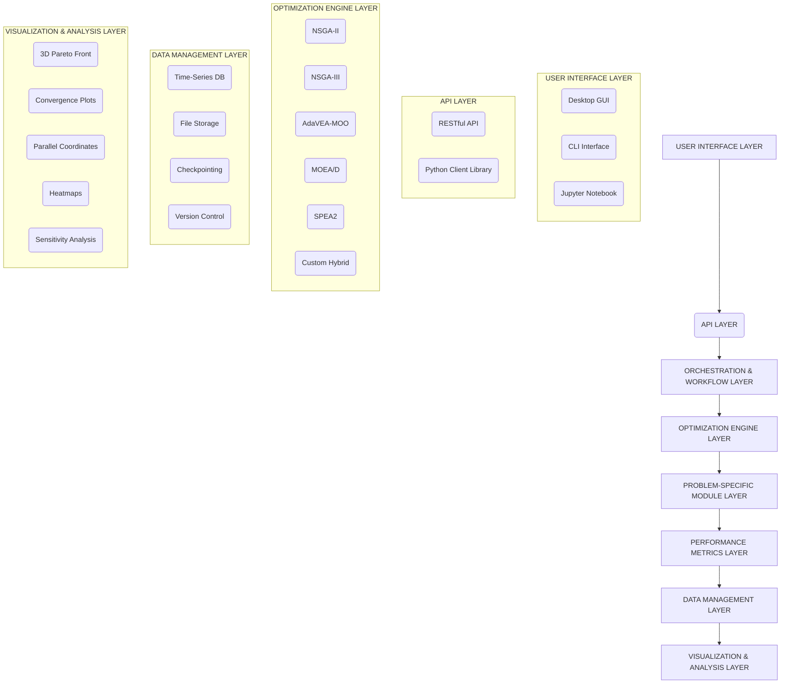

# Software Architecture and Implementation Requirements
## Complete Technical Specification for DVA Multi-Objective Optimization System

---

## 1. SOFTWARE SYSTEM ARCHITECTURE

### 1.1 High-Level System Design

**Modular Architecture (Layered Design):**



### 1.2 Technology Stack Recommendations

**Programming Language:** Python 3.9+
- **Rationale:** Rich ecosystem for scientific computing, optimization, and ML

**Core Libraries:**

| Purpose | Library | Version | Justification |
|---------|---------|---------|---------------|
| Numerical Computing | NumPy | ≥1.23 | Vectorized operations, BLAS/LAPACK integration |
| Scientific Computing | SciPy | ≥1.10 | Optimization routines, statistical functions |
| Data Structures | Pandas | ≥1.5 | Tabular data handling, time series |
| Visualization | Matplotlib | ≥3.6 | Publication-quality static plots |
| Interactive Viz | Plotly | ≥5.13 | 3D interactive Pareto fronts |
| Statistical Analysis | Statsmodels | ≥0.13 | Hypothesis testing, regression |
| Parallel Computing | Joblib / Dask | Latest | Parallel fitness evaluations |
| Hypervolume | PyGMO | ≥2.18 | Fast HV computation (WFG algorithm) |
| MOO Framework | Pymoo | ≥0.6 | Baseline algorithms, metrics |
| GUI Framework | PyQt5 / Tkinter | Latest | Cross-platform desktop application development |
| API Framework | FastAPI / Flask | Latest | Building robust and scalable RESTful APIs |

**Optional Advanced Libraries:**

| Purpose | Library | Use Case |
|---------|---------|----------|
| Deep Learning | PyTorch | Surrogate modeling (metamodels) |
| Bayesian Optimization | BoTorch | Expensive function optimization |
| Sensitivity Analysis | SALib | Global sensitivity analysis |
| FEA Integration | FEniCS / PyAnsys | Mechanical simulations |

---

### 1.3 Detailed Folder Structure

A well-defined folder structure is crucial for maintaining a scalable, modular, and easily navigable codebase. This structure promotes clear separation of concerns, simplifies dependency management, and facilitates collaborative development.

```
dva_moo_system/
├── src/                                # Source code for the core application
│   ├── __init__.py                     # Makes src a Python package
│   ├── core/                           # Core optimization logic and data structures
│   │   ├── __init__.py
│   │   ├── problem_definition.py       # DVAProblem class, objective functions
│   │   ├── algorithms/                 # Implementations of MOEA algorithms
│   │   │   ├── __init__.py
│   │   │   ├── base_algorithm.py       # Base class for MOEAs
│   │   │   ├── nsga2.py
│   │   │   ├── nsga3.py
│   │   │   ├── moead.py
│   │   │   ├── spea2.py
│   │   │   └── adavea_moo.py           # Custom AdaVEA-MOO implementation
│   │   ├── metrics/                    # Performance metrics calculators (HV, IGD+, etc.)
│   │   │   ├── __init__.py
│   │   │   ├── hypervolume.py
│   │   │   └── igd_plus.py
│   │   └── utils/                      # General utilities (e.g., data loaders, helpers)
│   │       ├── __init__.py
│   │       └── data_utils.py
│   ├── orchestration/                  # Manages experiment workflows and runs
│   │   ├── __init__.py
│   │   ├── experiment_manager.py       # Handles experiment setup, execution, and logging
│   │   ├── config_manager.py           # Manages configuration loading and validation
│   │   └── run_coordinator.py          # Coordinates multi-run experiments
│   ├── data_management/                # Handles data storage, retrieval, and checkpointing
│   │   ├── __init__.py
│   │   ├── data_store.py               # Interface for HDF5, database storage
│   │   └── checkpointing.py            # Checkpoint and recovery logic
│   ├── visualization/                  # Core visualization logic (Plotly, Matplotlib wrappers)
│   │   ├── __init__.py
│   │   ├── plot_utils.py               # Helper functions for plotting
│   │   ├── pareto_plots.py             # 3D Pareto front, convergence plots
│   │   └── analysis_plots.py           # Parallel coordinates, heatmaps
│   └── api/                            # RESTful API implementation
│       ├── __init__.py
│       ├── main.py                     # FastAPI/Flask app entry point
│       ├── schemas.py                  # Pydantic models for request/response
│       └── endpoints.py                # API route definitions
├── cli/                                # Command-Line Interface
│   ├── __init__.py
│   └── main.py                         # CLI entry point using Click/Typer
├── gui/                                # Graphical User Interface
│   ├── __init__.py
│   ├── main_window.py                  # Main application window
│   ├── widgets/                        # Custom GUI components
│   │   ├── __init__.py
│   │   └── plot_widget.py              # Widget for embedding plots
│   ├── controllers/                    # Handles GUI logic and interaction with core
│   │   ├── __init__.py
│   │   └── experiment_controller.py
│   └── assets/                         # Icons, images, UI resources
├── experiments/                        # Default directory for experiment outputs
│   └── (generated_experiment_folders)/
├── docs/                               # Project documentation
│   ├── architecture.md
│   ├── usage.md
│   └── api_reference.md
├── tests/                              # Unit and integration tests
│   ├── core/
│   ├── orchestration/
│   └── api/
├── notebooks/                          # Jupyter notebooks for analysis and examples
│   ├── tutorial.ipynb
│   └── advanced_analysis.ipynb
├── config/                             # Configuration files (e.g., default parameters)
│   ├── __init__.py
│   └── default_config.json
├── .env                                # Environment variables
├── .gitignore
├── README.md
├── requirements.txt                    # Python dependencies
├── setup.py                            # Package installation
└── main.py                             # Main entry point for the application (e.g., to run GUI or CLI)
```

### 1.4 API Design Principles

The API layer is designed to provide a clean, consistent, and programmatic interface to the core optimization system, enabling integration with other systems, scripting, and advanced automation.

**Key Principles:**

*   **RESTful Design:** Adhere to REST principles for resource-oriented URLs, standard HTTP methods (GET, POST, PUT, DELETE), and stateless operations.
*   **Clear Resource Naming:** Use intuitive and consistent naming for API endpoints (e.g., `/experiments`, `/algorithms`, `/results`).
*   **Data Serialization:** Utilize JSON for request and response bodies, ensuring compatibility and ease of parsing across different programming languages.
*   **Authentication & Authorization:** Implement robust security mechanisms (e.g., API keys, OAuth2) to control access to sensitive operations and data.
*   **Versioning:** Support API versioning (e.g., `/v1/experiments`) to allow for backward-compatible evolution of the API without breaking existing clients.
*   **Error Handling:** Provide clear, informative error messages with appropriate HTTP status codes to facilitate debugging and client-side error handling.
*   **Documentation:** Generate interactive API documentation (e.g., OpenAPI/Swagger UI) to make the API easily discoverable and usable.
*   **Asynchronous Operations:** For long-running optimization tasks, support asynchronous processing with status tracking endpoints to prevent timeouts and improve user experience.

**Core API Endpoints (Examples):**

*   `POST /experiments`: Create a new optimization experiment.
*   `GET /experiments/{experiment_id}`: Retrieve details of a specific experiment.
*   `POST /experiments/{experiment_id}/run`: Start an optimization run for an experiment.
*   `GET /experiments/{experiment_id}/status`: Get the current status of an experiment run.
*   `GET /experiments/{experiment_id}/results`: Retrieve final results (Pareto front, metrics).
*   `GET /algorithms`: List available optimization algorithms and their parameters.
*   `GET /problems`: List available problem definitions.

## 2. SOFTWARE CAPABILITIES AND FEATURES

### 2.1 Core Optimization Capabilities

#### 2.1.1 Algorithm Suite

**Baseline Algorithms (for comparison):**

1.  **NSGA-II** (Fast Elitist Non-Dominated Sorting GA)
    - Fast non-dominated sort: $ O(MN^2) $
    - Crowding distance diversity preservation
    - Binary tournament selection

2.  **NSGA-III** (Reference Point-Based MOEA)
    - Structured reference points (Das-Dennis)
    - Niche preservation mechanism
    - Better for 4+ objectives

3.  **MOEA/D** (Multi-Objective EA based on Decomposition)
    - Scalarization via Tchebycheff approach
    - Neighborhood-based mating
    - Lower computational complexity

4.  **SPEA2** (Strength Pareto EA 2)
    - Fine-grained fitness assignment
    - Archive truncation via k-th nearest neighbor
    - Effective on complex fronts

**Custom Algorithm:**

5.  **AdaVEA-MOO** (Your contribution)
    - All adaptive mechanisms from Section 3
    - Hybrid learning strategies
    - Ensemble mutation operators
    - Problem-specific initialization

#### 2.1.2 Configurable Parameters

**Global Settings:**

```python
config = {
    'population_size': int,          # Default: 100
    'max_generations': int,           # Default: 2000
    'max_evaluations': int,           # Alternative stopping criterion
    'n_runs': int,                    # Default: 30 (for statistics)
    'random_seed': int or None,       # Reproducibility
    'parallel_workers': int,          # CPU cores for parallel eval
}
```

**Algorithm-Specific Parameters:**

```python
nsga2_params = {
    'crossover_prob': float,          # Default: 0.9
    'crossover_eta': float,           # SBX distribution index, default: 20
    'mutation_prob': float,           # Default: 1/n
    'mutation_eta': float,            # Polynomial mutation index, default: 20
}

adavea_params = {
    'init_heuristic_ratio': float,    # Default: 0.4
    'mutation_strategies': list,      # ['gaussian', 'cauchy', 'cost_aware', 'sparsity']
    'p_m_min': float,                 # Default: 0.01
    'p_m_max': float,                 # Default: 0.1
    'p_c_min': float,                 # Default: 0.5
    'p_c_max': float,                 # Default: 1.0
    'local_search_freq': int,         # Apply every N generations, default: 10
    'local_search_top_k': float,      # Fraction of pop for LS, default: 0.1
}
```

### 2.2 Problem Definition Interface

**Objective Function Template:**

```python
class DVAProblem(Problem):
    def __init__(self, 
                 n_var: int = 48,
                 n_obj: int = 3,
                 xl: np.ndarray = 0.0,
                 xu: np.ndarray = 1.0):
        super().__init__(n_var=n_var, n_obj=n_obj, 
                         xl=xl, xu=xu)
        
        # Problem-specific initialization
        self.cost_coefficients = self.load_cost_data()
        self.frf_model = FRFModel()  # Mechanical model
    
    def _evaluate(self, X, out, *args, **kwargs):
        """
        X: (N, 48) array of decision variables
        out: dict to store objectives
        """
        n_samples = X.shape[0]
        
        # Objective 1: FRF (Frequency Response Function)
        f1 = np.zeros(n_samples)
        for i in range(n_samples):
            f1[i] = self.compute_frf_objective(X[i])
        
        # Objective 2: Sparsity
        f2 = self.compute_sparsity(X)
        
        # Objective 3: Cost
        f3 = self.compute_cost(X)
        
        out["F"] = np.column_stack([f1, f2, f3])
    
    def compute_frf_objective(self, x: np.ndarray) -> float:
        """
        Compute weighted sum of FRF criteria across 5 masses
        """
        total_error = 0.0
        
        for mass_idx in range(5):
            # Extract FRF for this mass
            freq_range = np.linspace(0, 100, 1000)  # Hz
            frf = self.frf_model.compute_frf(x, mass_idx, freq_range)
            
            # Extract criteria
            peaks = find_peaks(frf)
            peak_positions = freq_range[peaks]
            peak_values = frf[peaks]
            
            # Compare with targets
            for criterion, weight, target in self.get_targets(mass_idx):
                actual = self.extract_criterion(frf, criterion)
                total_error += weight * abs(actual - target) / target
        
        return total_error
    
    def compute_sparsity(self, X: np.ndarray) -> np.ndarray:
        """
        Sparsity = α * N_active + β * Σ|x_i|
        """
        threshold = 0.1
        n_active = np.sum(X > threshold, axis=1)
        magnitude_sum = np.sum(np.abs(X), axis=1)
        
        alpha, beta = 1.0, 0.5
        return alpha * n_active + beta * magnitude_sum
    
    def compute_cost(self, X: np.ndarray) -> np.ndarray:
        """
        Cost = Σ c_i * x_i
        """
        return X @ self.cost_coefficients
```

### 2.3 Data Output and Storage

#### 2.3.1 Output File Structure

**Directory Organization:**

```
experiments/
├── experiment_001/
│   ├── config.json              # Full configuration
│   ├── metadata.json            # Timestamp, git hash, system info
│   ├── algorithms/
│   │   ├── nsga2/
│   │   │   ├── run_001/
│   │   │   │   ├── population_final.npy
│   │   │   │   ├── objectives_final.npy
│   │   │   │   ├── archive.npy
│   │   │   │   ├── metrics_per_gen.csv
│   │   │   │   └── convergence.png
│   │   │   ├── run_002/
│   │   │   │   └── ...
│   │   │   └── summary_statistics.csv
│   │   ├── adavea/
│   │   │   └── ...
│   ├── comparisons/
│   │   ├── hypervolume_comparison.csv
│   │   ├── statistical_tests.json
│   │   ├── pareto_fronts_combined.png
│   │   └── convergence_all_algorithms.png
│   └── sensitivity_analysis/
│       ├── parameter_importance.csv
│       └── correlation_matrix.png
```

#### 2.3.2 Data Formats

**Per-Generation Metrics (CSV):**

```csv
generation,time_elapsed,hypervolume,igd_plus,gd,spread,spacing,n_pareto,diversity,p_m,p_c,best_f1,best_f2,best_f3
0,0.52,0.654,0.235,0.189,0.523,0.087,12,0.342,0.021,1.0,0.654,28.3,15.2
1,1.08,0.671,0.221,0.176,0.498,0.079,15,0.329,0.022,0.997,0.632,27.1,14.8
...
```

**Final Population (NumPy .npy):**

```python
# Shape: (N, n_var) = (100, 48)
population = np.load('population_final.npy')

# Shape: (N, n_obj) = (100, 3)
objectives = np.load('objectives_final.npy')

# Archive (non-dominated solutions across all generations)
# Shape: (M, n_var) where M varies
archive_vars = np.load('archive_vars.npy')
archive_objs = np.load('archive_objs.npy')
```

**Configuration (JSON):**

```json
{
  "experiment_id": "exp_001",
  "timestamp": "2025-01-15T10:30:00Z",
  "problem": {
    "name": "DVA_48param_3obj",
    "n_var": 48,
    "n_obj": 3,
    "bounds": [[0, 1], [0, 1], ...]
  },
  "algorithm": {
    "name": "AdaVEA-MOO",
    "population_size": 100,
    "max_generations": 2000,
    "parameters": {
      "p_m_min": 0.01,
      "p_m_max": 0.1,
      ...
    }
  },
  "hardware": {
    "cpu": "Intel i9-12900K",
    "cores_used": 16,
    "ram_gb": 64
  }
}
```

### 2.4 Real-Time Monitoring and Logging

**Live Dashboard Features:**

1.  **Convergence Plot (Real-Time Update)**
    - X-axis: Generation
    - Y-axis: Hypervolume
    - Multiple algorithm traces overlaid
    - Update frequency: Every 10 generations

2.  **3D Pareto Front (Interactive)**
    - Scatter plot in objective space
    - Color-coded by algorithm
    - Hover tooltips showing decision variables
    - Rotation, zoom, pan controls

3.  **Population Diversity Tracker**
    - Line plot showing diversity metric over time
    - Threshold line indicating critical diversity

4.  **Adaptive Parameter Trajectories**
    - $ p_m(t) $ and $ p_c(t) $ over generations
    - Visual correlation with convergence events

**Console Logging (Structured):**

```
[2025-01-15 10:30:15] INFO: Initializing AdaVEA-MOO
[2025-01-15 10:30:16] INFO: Population initialized (40% heuristic, 60% random)
[2025-01-15 10:30:16] INFO: Initial diversity: σ = 0.342
[2025-01-15 10:30:25] GEN 10: HV=0.671 | IGD+=0.221 | p_m=0.023 | p_c=0.975 | Time=9.2s
[2025-01-15 10:30:34] GEN 20: HV=0.694 | IGD+=0.198 | p_m=0.025 | p_c=0.951 | Time=18.8s
...
[2025-01-15 11:15:42] WARNING: Diversity dropped below threshold (σ=0.028)
[2025-01-15 11:15:42] INFO: Triggering diversity recovery mechanism
[2025-01-15 11:45:30] INFO: Convergence detected at generation 187
[2025-01-15 11:45:30] INFO: Final HV: 0.884 ± 0.019 (30 runs)
[2025-01-15 11:45:30] SUCCESS: Optimization completed in 1h 15m 15s

```
[2025-01-15 11:45:30] SUCCESS: Optimization completed in 1h 15m 15s
```

```

---

## 3. PERFORMANCE METRICS AND ANALYSIS TOOLS

### 3.1 Built-In Metric Calculators

**Hypervolume Module:**

```python
class HypervolumeCalculator:
    def __init__(self, ref_point: np.ndarray):
        self.ref_point = ref_point
        self.hv_indicator = pygmo.hypervolume()
    
    def compute(self, pareto_front: np.ndarray) -> float:
        """
        Compute hypervolume using WFG algorithm
        
        Args:
            pareto_front: (N, m) array of objective values
        
        Returns:
            Hypervolume value (scalar)
        """
        return self.hv_indicator.compute(pareto_front, self.ref_point)
    
    def compute_contributions(self, pareto_front: np.ndarray) -> np.ndarray:
        """
        Compute individual HV contributions
        
        Returns:
            (N,) array of contributions
        """
        contributions = np.zeros(len(pareto_front))
        for i in range(len(pareto_front)):
            reduced_front = np.delete(pareto_front, i, axis=0)
            hv_without = self.compute(reduced_front)
            hv_with = self.compute(pareto_front)
            contributions[i] = hv_with - hv_without
        
        return contributions
```

**IGD+ Module:**

```python
def inverted_generational_distance_plus(
    approx_front: np.ndarray, 
    true_front: np.ndarray
) -> float:
    """
    IGD+ metric (Pareto compliant variant) 
    
    Args:
        approx_front: (N, m) approximation set
        true_front: (M, m) true Pareto front
    
    Returns:
        IGD+ value (lower is better)
    """
    igd_plus = 0.0
    
    for z in true_front:
        # Find closest point in approximation
        min_dist_plus = float('inf')
        
        for a in approx_front:
            # Modified distance (IGD+)
            dist_plus = np.sqrt(np.sum(np.maximum(a - z, 0)**2))
            min_dist_plus = min(min_dist_plus, dist_plus)
        
        igd_plus += min_dist_plus**2
    
    return np.sqrt(igd_plus / len(true_front))
```

### 3.2 Statistical Analysis Suite

**Wilcoxon Rank-Sum Test:**

```python
from scipy.stats import ranksums

def compare_algorithms_wilcoxon(results_A: np.ndarray, 
                                  results_B: np.ndarray,
                                  metric_name: str = 'Hypervolume') -> dict:
    """
    Perform Wilcoxon rank-sum test
    
    Args:
        results_A: (30,) HV values for algorithm A
        results_B: (30,) HV values for algorithm B
    
    Returns:
        Dictionary with test results
    """
    statistic, p_value = ranksums(results_A, results_B)
    
    # Effect size (Cohen's d)
    pooled_std = np.sqrt((np.var(results_A) + np.var(results_B)) / 2)
    cohens_d = (np.mean(results_A) - np.mean(results_B)) / pooled_std
    
    return {
        'metric': metric_name,
        'statistic': statistic,
        'p_value': p_value,
        'significant': p_value < 0.05,
        'cohens_d': cohens_d,
        'effect_size_interpretation': interpret_cohens_d(cohens_d),
        'mean_A': np.mean(results_A),
        'mean_B': np.mean(results_B),
        'std_A': np.std(results_A),
        'std_B': np.std(results_B),
    }

def interpret_cohens_d(d: float) -> str:
    abs_d = abs(d)
    if abs_d < 0.2:
        return 'negligible'
    elif abs_d < 0.5:
        return 'small'
    elif abs_d < 0.8:
        return 'medium'
    elif abs_d < 1.2:
        return 'large'
    else:
        return 'very large'
```

### 3.3 Sensitivity Analysis

**Sobol Sensitivity Analysis:**

```python
from SALib.analyze import sobol
from SALib.sample import saltelli

def sensitivity_analysis_dvd_parameters(problem_definition, n_samples=1024):
    """
    Perform global sensitivity analysis on DVA parameters
    
    Returns:
        DataFrame with first-order and total-order indices
    """
    # Define parameter space
    param_bounds = [[0, 1]] * 48
    problem = {
        'num_vars': 48,
        'names': [f'x_{i}' for i in range(48)],
        'bounds': param_bounds
    }
    
    # Generate samples (Saltelli sampling)
    param_values = saltelli.sample(problem, n_samples)
    
    # Evaluate objectives
    Y_frf = np.zeros(len(param_values))
    Y_sparsity = np.zeros(len(param_values))
    Y_cost = np.zeros(len(param_values))
    
    for i, params in enumerate(param_values):
        objectives = problem_definition._evaluate(params.reshape(1, -1))
        Y_frf[i] = objectives[0, 0]
        Y_sparsity[i] = objectives[0, 1]
        Y_cost[i] = objectives[0, 2]
    
    # Analyze
    Si_frf = sobol.analyze(problem, Y_frf)
    Si_sparsity = sobol.analyze(problem, Y_sparsity)
    Si_cost = sobol.analyze(problem, Y_cost)
    
    # Compile results
    results = pd.DataFrame({
        'parameter': problem['names'],
        'FRF_S1': Si_frf['S1'],
        'FRF_ST': Si_frf['ST'],
        'Sparsity_S1': Si_sparsity['S1'],
        'Sparsity_ST': Si_sparsity['ST'],
        'Cost_S1': Si_cost['S1'],
        'Cost_ST': Si_cost['ST'],
    })
    
    return results.sort_values('FRF_ST', ascending=False)
```

---

## 4. VISUALIZATION CAPABILITIES

### 4.1 3D Pareto Front Visualization

**Interactive Plotly Implementation:**

```python
import plotly.graph_objects as go

def plot_pareto_front_3d(results_dict: dict, save_path: str = None):
    """
    Generate interactive 3D scatter plot of Pareto fronts
    
    Args:
        results_dict: {algorithm_name: objectives_array}
    """
    fig = go.Figure()
    
    colors = ['blue', 'red', 'green', 'orange', 'purple']
    
    for idx, (alg_name, objectives) in enumerate(results_dict.items()):
        fig.add_trace(go.Scatter3d(
            x=objectives[:, 0],
            y=objectives[:, 1],
            z=objectives[:, 2],
            mode='markers',
            name=alg_name,
            marker=dict(
                size=5,
                color=colors[idx % len(colors)],
                opacity=0.7,
                line=dict(width=0.5, color='white')
            ),
            text=[f'{alg_name}<br>F1={obj[0]:.3f}<br>F2={obj[1]:.1f}<br>F3={obj[2]:.2f}' 
                  for obj in objectives],
            hoverinfo='text'
        ))
    
    fig.update_layout(
        title='3D Pareto Front Comparison',
        scene=dict(
            xaxis_title='FRF Objective',
            yaxis_title='Sparsity',
            zaxis_title='Cost',
            camera=dict(eye=dict(x=1.5, y=1.5, z=1.3))
        ),
        width=1000,
        height=800,
        legend=dict(x=0.7, y=0.9)
    )
    
    if save_path:
        fig.write_html(save_path)
    
    fig.show()
```

### 4.2 Convergence Plots

**Matplotlib Implementation with Confidence Bands:**

```python
def plot_convergence_comparison(metrics_dict: dict, save_path: str = None):
    """
    Plot convergence curves with confidence bands
    
    Args:
        metrics_dict: {algorithm: DataFrame with columns [generation, HV, run_id]}
    """
    fig, ax = plt.subplots(1, 1, figsize=(12, 6))
    
    for alg_name, df in metrics_dict.items():
        # Group by generation, compute statistics
        grouped = df.groupby('generation')['HV']
        mean_hv = grouped.mean()
        std_hv = grouped.std()
        
        generations = mean_hv.index
        
        # Plot mean
        ax.plot(generations, mean_hv, label=alg_name, linewidth=2)
        
        # Plot confidence band (±1 std)
        ax.fill_between(generations, 
                         mean_hv - std_hv, 
                         mean_hv + std_hv, 
                         alpha=0.2)
    
    ax.set_xlabel('Generation', fontsize=14)
    ax.set_ylabel('Hypervolume', fontsize=14)
    ax.set_title('Convergence Comparison (30 runs, mean ± std)', fontsize=16)
    ax.legend(fontsize=12)
    ax.grid(True, alpha=0.3)
    
    if save_path:
        plt.savefig(save_path, dpi=300, bbox_inches='tight')
    
    plt.show()
```

### 4.3 Parallel Coordinates Plot

**For High-Dimensional Solution Visualization:**

```python
from pandas.plotting import parallel_coordinates

def plot_parallel_coordinates(pareto_solutions: np.ndarray, 
                               objectives: np.ndarray,
                               parameter_names: list):
    """
    Parallel coordinates to visualize parameter-objective relationships
    
    Args:
        pareto_solutions: (N, 48) decision variables
        objectives: (N, 3) objective values
        parameter_names: list of 48 parameter names
    """
    # Combine parameters and objectives
    df = pd.DataFrame(pareto_solutions, columns=parameter_names)
    df['FRF'] = objectives[:, 0]
    df['Sparsity'] = objectives[:, 1]
    df['Cost'] = objectives[:, 2]
    
    # Discretize one objective for coloring
    df['Cost_Category'] = pd.cut(df['Cost'], bins=5, labels=['Very Low', 'Low', 'Medium', 'High', 'Very High'])
    
    # Select top 10 most important parameters + objectives
    important_params = ['x_5', 'x_12', 'x_18', 'x_27', 'x_35', 'x_41', 
                        'FRF', 'Sparsity', 'Cost']
    
    fig, ax = plt.subplots(1, 1, figsize=(16, 8))
    parallel_coordinates(df[important_params + ['Cost_Category']], 
                         'Cost_Category', 
                         ax=ax, 
                         alpha=0.5)
    
    ax.set_title('Parallel Coordinates: Important Parameters & Objectives')
    ax.legend(title='Cost Category', loc='upper left')
    plt.xticks(rotation=45)
    plt.tight_layout()
    plt.show()
```

### 4.4 Heatmap for Parameter Correlations

```python
import seaborn as sns

def plot_correlation_heatmap(pareto_solutions: np.ndarray, 
                              objectives: np.ndarray,
                              save_path: str = None):
    """
    Correlation heatmap between parameters and objectives
    """
    # Combine data
    combined = np.hstack([pareto_solutions, objectives])
    param_cols = [f'x_{i}' for i in range(48)]
    obj_cols = ['FRF', 'Sparsity', 'Cost']
    
    df = pd.DataFrame(combined, columns=param_cols + obj_cols)
    
    # Compute correlation with objectives only
    corr_matrix = df[param_cols].corrwith(df[obj_cols])
    
    # Reshape for heatmap
    corr_df = pd.DataFrame(corr_matrix.values.reshape(48, 3), 
                           index=param_cols, 
                           columns=obj_cols)
    
    # Plot
    fig, ax = plt.subplots(1, 1, figsize=(8, 14))
    sns.heatmap(corr_df, annot=False, cmap='coolwarm', 
                center=0, vmin=-1, vmax=1, 
                cbar_kws={'label': 'Correlation'}, ax=ax)
    
    ax.set_title('Parameter-Objective Correlation Matrix')
    ax.set_ylabel('Parameters')
    ax.set_xlabel('Objectives')
    
    if save_path:
        plt.savefig(save_path, dpi=300, bbox_inches='tight')
    
    plt.tight_layout()
    plt.show()
```

---

## 5. DATA INTERPRETATION GUIDELINES

### 5.1 Hypervolume Interpretation

**What It Means:**

- **Absolute Value:** Volume of objective space dominated by your solutions
  - Higher = Better coverage and convergence
  - Depends on reference point choice

**Reference Point Selection:**

$ \mathbf{r} = (r_1, r_2, r_3) = (\max f_1 + \delta, \max f_2 + \delta, \max f_3 + \delta) $

Where $ \delta = 0.1 \times \text{range}(f_i) $

**Interpretation Guide:**

| HV Range | Interpretation |
|----------|----------------|
| 0.0 - 0.3 | Poor coverage, likely stuck in local optima |
| 0.3 - 0.6 | Moderate coverage, significant room for improvement |
| 0.6 - 0.8 | Good coverage, approaching true Pareto front |
| 0.8 - 1.0 | Excellent coverage, near-optimal approximation |

### 5.2 IGD+ Interpretation

**What It Means:**

- Average distance from true Pareto front to approximation set
- **Lower = Better** (0 = perfect match)

**Typical Values:**

| IGD+ Value | Quality Assessment |
|------------|-------------------|
| < 0.05 | Excellent approximation |
| 0.05 - 0.10 | Good approximation |
| 0.10 - 0.20 | Moderate approximation |
| > 0.20 | Poor approximation |

### 5.3 Convergence Detection

**Practical Criterion:**

Algorithm converged when:

$ \frac{|HV(t) - HV(t-50)|}{HV(t-50)} < 0.1\% $

**Visual Indicators:**

1.  **Plateau in HV curve** → Convergence
2.  **Decreasing diversity without HV improvement** → Stagnation
3.  **Oscillating HV** → Instability, increase population or adjust parameters

### 5.4 Solution Quality Assessment

**For Individual Solutions:**

1.  **Dominance Check:** Is solution in Rank 1 (non-dominated)?
2.  **Crowding Distance:** Is solution in dense or sparse region?
   - High distance → Extreme/boundary solution
   - Low distance → Interior solution
3.  **Hypervolume Contribution:** Does removing solution significantly reduce HV?

**For Solution Sets:**

1.  **Coverage:** Does set span entire Pareto front?
   - Check range in each objective
   - Visual inspection of 3D plot
2.  **Uniformity:** Are solutions evenly distributed?
   - Spacing metric
   - Visual gaps in plots

---

## 6. RECOMMENDED WORKFLOW FOR THESIS

**Step 1: Problem Setup (Week 1)**
- Implement DVA mechanical model (FRF computation)
- Define objective functions with domain expert validation
- Create cost coefficient database

**Step 2: Baseline Implementation (Week 2)**
- Implement NSGA-II from scratch or use Pymoo
- Run 30 independent runs
- Compute baseline statistics

**Step 3: Custom Algorithm Development (Weeks 3-5)**
- Implement AdaVEA-MOO components incrementally:
  - Week 3: Adaptive parameters + ensemble mutation
  - Week 4: Hybrid learning + initialization
  - Week 5: Integration and debugging

**Step 4: Experimental Comparison (Week 6-7)**
- Run all algorithms (NSGA-II, NSGA-III, MOEA/D, AdaVEA-MOO)
- 30 runs each
- Collect all metrics

**Step 5: Analysis and Visualization (Week 8-9)**
- Statistical tests
- Generate all plots
- Sensitivity analysis
- Interpretation of results

**Step 6: Thesis Writing (Weeks 10-12)**
- Compile results into thesis chapters
- Create summary tables
- Write discussion and conclusions

---

This comprehensive software specification provides everything needed to implement a research-grade multi-objective optimization system for your Master's thesis.
