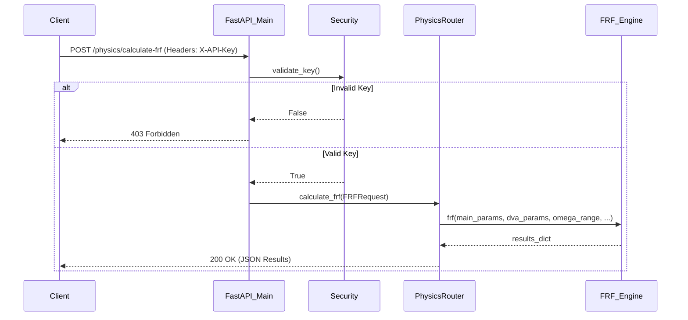

# API Architecture

The DeVana REST API is built using **FastAPI** to provide a high-performance, asynchronous interface for physics calculations and background optimization tasks.

## Core Setup and Security

The API runs via Uvicorn and is configured in `codes/api/main.py`.

### Security: APIKeyManager (`codes/api/security.py`)
All endpoints are protected by an API Key mechanism.
- **Header:** `X-API-Key`
- **Logic:** `APIKeyManager` handles generation, saving (`api_keys.json`), loading, and validation of API keys. If a request lacks a valid key, a `403 Forbidden` error is raised.

## Data Models (`codes/api/models.py`)

Requests are validated using Pydantic models:

1. **DVAConfiguration:**
   - `mu_1`, `mu_2`, `mu_3` (float): Mass ratios.
   - `lambda_1_15` (List[float]): 15 stiffness parameters.
   - `nu_1_15` (List[float]): 15 damping parameters.
   - `beta_1_15` (List[float]): 15 inerter parameters.
2. **FRFRequest:**
   - `dva_params` (DVAConfiguration).
   - `main_system_params` (List[float]): 17 values for the primary system.
   - `omega_range` (List[float]): [start, end, points].
   - `target_masses` (List[int]): Masses to monitor.
   - `use_interpolation` (bool), `interpolation_method` (str).
3. **OptimizationRequest:**
   - `algorithm` (str): E.g., GA, PSO.
   - `pop_size`, `generations` (int).
   - `dva_bounds` (Dict[str, List[float]]).
   - `fixed_parameters` (List[int]), `target_masses` (List[int]).
   - `use_pinn_acceleration` (bool).
   - `omega_range` (List[float]).
4. **PINNRequest:**
   - `csv_data_path` (str).
   - `num_epochs` (int), `learning_rate` (float).
   - `topology` (str).

## Endpoints

### 1. Physics Router (`codes/api/routers/physics.py`)

#### `POST /api/physics/calculate-frf`
**Purpose:** Compute the Frequency Response Function for a given DVA configuration.
- **Parameters:** `FRFRequest` body.
- **Logic:**
  1. Unpacks `dva_params` into a flat 48-parameter list `(mu1..3, lambda1..15, nu1..15, beta1..15)`.
  2. Calls the core `frf()` physics engine.
  3. Filters the results to only include `target_masses` and the `total_singular_response`.
- **Outputs/Response:**
  - `status` (str): "success".
  - `results` (dict): Mass-specific peak positions, peak values, and `total_singular_response`.
- **Error Codes:**
  - `403`: Invalid API Key.
  - `422`: Validation Error (bad JSON).
  - `500`: Internal Server Error (FRF calculation failed).

### 2. Optimization Router (`codes/api/routers/optimization.py`)

#### `POST /api/optimization/start`
**Purpose:** Start a long-running optimization algorithm as a background task.
- **Parameters:** `OptimizationRequest` body, FastAPI `BackgroundTasks`.
- **Logic:**
  1. Generates a unique `task_id` (UUID).
  2. Stores task status in an in-memory dictionary.
  3. Dispatches `run_optimization_task` to the background.
- **Outputs/Response:**
  - `task_id` (str).
  - `message` (str): Confirmation of background start.

#### `GET /api/optimization/status/{task_id}`
**Purpose:** Check the status of a background optimization task.
- **Parameters:** `task_id` (Path param).
- **Logic:** Looks up `task_id` in the in-memory tasks dictionary.
- **Outputs/Response:** Task dictionary (`status`, `algorithm`, `result`, `error`).
- **Error Codes:**
  - `404`: Task not found.

## Execution Flow



### PSEUDO-CODE for API Execution Flow
```python
def handle_request(request, headers):
    # 1. Security Check
    api_key = headers.get("X-API-Key")
    if not APIKeyManager.validate_key(api_key):
        return HTTPError(403, "Forbidden")
    
    # 2. Routing
    if request.path == "/physics/calculate-frf":
        # 3. Parameter extraction
        main_params = request.body.main_system_params
        dva_params = flatten(request.body.dva_params)
        
        # 4. Engine Execution
        try:
            results = frf_engine.frf(main_params, dva_params, request.body.omega_range, ...)
        except Exception as e:
            return HTTPError(500, str(e))
            
        # 5. Result formatting
        serializable_results = filter_targets(results, request.body.target_masses)
        return HTTPResponse(200, {"status": "success", "results": serializable_results})
```
