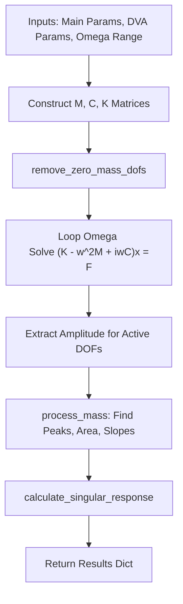

# Devana Library Reference

The `devana` Python package is a standalone, headless framework that encapsulates the core physics, machine learning, sensitivity analysis, and system modeling logic of DeVana.

## 1. Machine Learning (`devana.ml`)

### `pinn.py` (Physics-Informed Neural Networks)
**Purpose:** Accelerates FRF predictions and solves system identification problems using ML governed by physics residuals.

#### `PhysicsInformedFRF` (nn.Module)
- **Parameters:** `param_dim` (int), `hidden_dim` (int=128), `num_layers` (int=4).
- **Logic:** An MLP using SiLU activations (for smooth derivatives). Takes `params` and `omega` as input, outputs predicted amplitude.
- **Outputs:** Tensor of predicted amplitudes.

#### `PINNSolver`
- **Purpose:** Manages the training and inference of the `PhysicsInformedFRF`.
- **Methods:**
  - `train_step(params, omega, target_amp)`: Calculates MSE loss between predictions and target data, adds physics residual (conceptual), and backpropagates using Adam optimizer. Returns loss item.
  - `predict(params, omega_range)`: Runs rapid inference over an array of frequencies. Returns numpy array of amplitudes.

### `surrogate.py` (Neural Surrogate)
**Purpose:** Replaces slow physics evaluations during optimization (like KNN) with a fast MLP.

#### `NeuralSurrogate`
- **Parameters:** `input_dim`, `hidden`, `layers`, `dropout`, `epochs`, `batch_size`, `lr`.
- **Methods:**
  - `train(X, y)`: Trains the internal `_SurrogateMLP` on evaluated candidates (`X`) and their fitness (`y`).
  - `predict(X)`: Instantly predicts fitness for new candidates.
  - `get_fitness_gradient(X)`: Computes $\frac{\partial \text{fitness}}{\partial X}$ using PyTorch `requires_grad=True` and `.backward()`. Used for Physics-Guided "Smart Mutation".

### `seeding.py` (Intelligent Memory)
**Purpose:** Provides memory banks to inject previously successful configurations into new optimization populations.

#### `MemorySeeder`
- **Logic:** Maintains a bounded list of top-performing historical seeds.
- **Methods:**
  - `add_data(X, y)`: Stores evaluated candidates, keeping only the best `max_size`.
  - `propose(count)`: Returns `count` seeds via a mix of exact replay, jittered neighborhood exploration, and random uniform exploration.

#### `NeuralSeeder`
- **Logic:** Uses an ensemble of MLPs to model the fitness landscape and acquire points via Upper Confidence Bound (UCB) or Expected Improvement (EI).
- **Methods:**
  - `train()`: Trains the ensemble on stored historical data.
  - `propose(count, beta, best_y, exploration_fraction)`: Samples a massive pool (via SciPy QMC Sobol), predicts mean/variance, calculates acquisition scores, applies diversity filters, and returns top candidates.

## 2. Physics Engines (`devana.physics`)

### `frf.py` (Core Frequency Response)
**Purpose:** Evaluates the vibrational amplitude of a complex discrete MDOF system across a frequency range.

#### `frf(...)`
- **Parameters:** `main_system_parameters` (17 elements), `dva_parameters` (48 elements), `omega_start`, `omega_end`, `omega_points`, target dicts/weights per mass.
- **Logic:**
  1. Constructs Mass ($M$), Damping ($C$), and Stiffness ($K$) matrices dynamically.
  2. Applies boundary conditions and removes inactive DOFs via `remove_zero_mass_dofs()`.
  3. Solves the complex linear system $(K - \omega^2 M + i\omega C)X = F$ using `np.linalg.solve` (with fallback to pseudoinverse for singular matrices).
  4. Processes responses via `process_mass()` (finding peaks, slopes, bandwidth, AUC).
  5. Computes a `singular_response` based on weighted targets.
- **Outputs:** Dictionary containing detailed metrics per mass and the aggregated `singular_response`.

#### `perform_omega_points_sensitivity_analysis(...)`
- **Logic:** Iteratively increases `omega_points` (frequency resolution) and evaluates `frf` until the relative change in calculated metrics (like peak positions/values) drops below a `convergence_threshold`.

### `beam.py` & `beam_optimize.py` (Continuous Beam Modeling)
**Purpose:** Finite Element Method (FEM) Euler-Bernoulli beam modeling.

#### `BeamModel`
- **Logic:** 2-node Hermite FEM with dynamic assembly of $M$ and $K$ matrices. Supports composite layers to calculate equivalent bending stiffness ($EI$). Computes FRF via direct inversion at each frequency step.

#### `optimize_values_at_locations(...)` & `optimize_placement_and_values(...)`
- **Logic:** Employs Differential Evolution (DE) or Particle Swarm Optimization (PSO) to find optimal Ground Spring/Damper magnitudes ($k, c$) and their physical locations ($x$) on the continuous beam to satisfy displacement/velocity target specifications.

## 3. Systems (`devana.systems`)

### `dva_system.py`
**Purpose:** High-level Pythonic wrapper for interacting with the raw `frf` function.

#### `DVASystem`
- **Logic:** Maintains the 17-element primary array and 48-element DVA array internally. Exposes intuitive methods:
  - `set_primary_mass_ratio(mu)`
  - `set_stiffness_ratios(landas)`
  - `set_dva_parameters(stiffness, mass_ratios, damping, inerter)`
  - `calculate_response(...)`: Wraps and calls `devana.physics.frf.frf()`.

## 4. Sensitivity Analysis (`devana.sensitivity`)

### `sobol.py`
**Purpose:** Global sensitivity analysis using SALib to determine parameter importance.

#### `perform_sobol_analysis(...)`
- **Logic:**
  1. Generates a massive parameter sample space using `saltelli.sample()`.
  2. Evaluates the FRF `singular_response` for each sample in parallel using `joblib`.
  3. Calculates First-order ($S_1$) and Total-order ($S_T$) Sobol indices using `sobol.analyze()`.

---

## 5. Flowcharts & Blueprints

### Core FRF Physics Pipeline


#### PSEUDO-CODE
```python
def frf(main_params, dva_params, omega):
    # Construct raw matrices
    M = build_mass_matrix(main_params, dva_params)
    C = build_damping_matrix(main_params, dva_params)
    K = build_stiffness_matrix(main_params, dva_params)
    F = build_force_vector(main_params, dva_params, omega)
    
    # Prune system
    M, C, K, F, active_dofs = remove_zero_mass_dofs(M, C, K, F)
    
    A = empty_array()
    for w in omega:
        H = -w**2 * M + 2 * ZETA * w * C + K
        A[w] = robust_solve(H, F[w])
        
    results = process_mass_responses(A, omega)
    fitness = calculate_singular_response(results, targets)
    return fitness
```

### Implementation Blueprint: Custom Automation Script
How a developer builds a script using `devana`:

```python
# blueprint_automation.py
from devana.systems.dva_system import DVASystem
from devana.sensitivity.sobol import perform_sobol_analysis

# 1. Setup the high-level system representation
system = DVASystem(omega_dc=5000.0)
system.set_primary_mass_ratio(1.5)

# 2. Define wrapper for evaluation
def evaluate_for_sobol(params_dict):
    # params_dict contains dynamically sampled parameters
    system.set_dva_parameters(
        mass_ratios=[params_dict['mu_1'], 0.1, 0.1],
        stiffness=[params_dict['k_1']] + [1.0]*14
    )
    res = system.calculate_response(target_masses={1: {"peak_value": 0.5}})
    return res['singular_response']

# 3. Execute Analysis
bounds = {'mu_1': (0.01, 0.5), 'k_1': (0.5, 2.0)}
sobol_results = perform_sobol_analysis(
    main_system_parameters=system.main_params,
    dva_parameters_bounds=bounds,
    # ... other args
)

print("First Order Sensitivities:", sobol_results['S1'])
```
