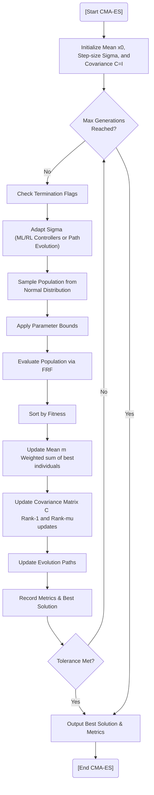

# Covariance Matrix Adaptation Evolution Strategy (CMA-ES)

## Overview
CMA-ES (`CMAESWorker.py`) is a derivative-free optimization algorithm for non-linear, non-convex optimization problems in continuous domains. It is widely considered the state-of-the-art for black-box optimization by adapting a multivariate normal search distribution.

## Advanced Features
- **Covariance Matrix Adaptation**: Learns the dependencies between parameters and the scaling of the search space, effectively performing a local search that adapts to the topology of the fitness landscape.
- **Step-size Control (Sigma)**: Dynamically scales the search region to maintain optimal exploration/exploitation balance.
- **ML/RL Controllers**: Integrates with DeVana's adaptive framework to modulate the step-size ($\sigma$) based on performance feedback.
- **Boundary Handling**: Integrated with `cma` library's robust boundary management to ensure physical feasibility of DVA parameters.
- **Benchmarking**: Full integration with the benchmarking suite to track CPU/Memory usage and generation timings.

## Algorithm Flowchart



#### Pseudo-code
```text
BEGIN
  EXECUTE [Start CMA-ES]
  EXECUTE Initialize Mean x0,   Step-size Sigma, and Covariance C=I
  EXECUTE Max Generations   Reached?
  EXECUTE Check Termination Flags
  EXECUTE Adapt Sigma   (ML/RL Controllers or Path Evolution)
  EXECUTE Sample Population from   Normal Distribution
  EXECUTE Apply Parameter Bounds
  EXECUTE Evaluate Population via FRF
  EXECUTE Sort by Fitness
  EXECUTE Update Mean m   Weighted sum of best individuals
  EXECUTE Update Covariance Matrix C   Rank-1 and Rank-mu updates
  EXECUTE Update Evolution Paths
  EXECUTE Record Metrics & Best Solution
  EXECUTE Tolerance Met?
  EXECUTE Output Best Solution & Metrics
  EXECUTE [End CMA-ES]
END
```
