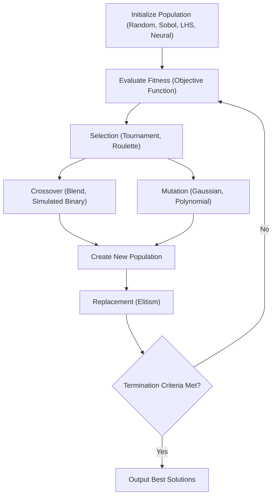
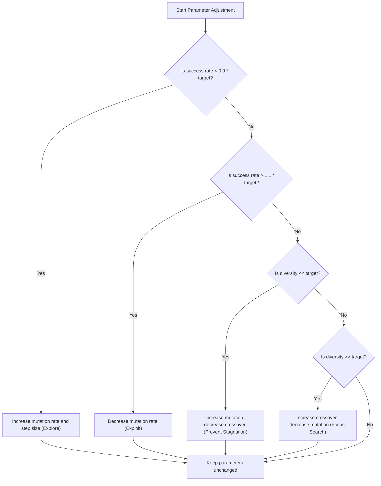

# Genetic Algorithm (GA)

## Overview
The Genetic Algorithm (`GAWorker.py`) optimizes DVA parameters by simulating natural selection. It evaluates fitness based on a comprehensive [Objective Function](ObjectiveFunction.md) that considers FRF analysis, sparsity, and cost-benefit ratios.

## Standard GA Workflow
The algorithm follows a biologically inspired cycle of selection, crossover, and mutation to evolve a population of candidate solutions toward the global optimum.

## Enhanced Adaptive Rates
While fixed rates (e.g., static $p_{mut}=0.2$) are easy to implement, they often struggle to balance exploration (searching new areas) and exploitation (refining good solutions) across different phases of the optimization. 

DeVana implements an **Adaptive Rate Controller** that dynamically adjusts mutation rate ($p_{mut}$), crossover rate ($p_{cx}$), and mutation step size ($\eta$) based on:
1. **Smoothed Success Rate ($\hat{s}$)**: The ratio of offspring outperforming their parents.
2. **Genetic Diversity ($\hat{D}$)**: The dispersion of genes within the current population.

### Adaptive Logic Flowchart

## Integrated Controllers
- **ML Bandit Controller**: Formulates operator selection as a Multi-Armed Bandit problem, using Upper Confidence Bound (UCB) to choose the best genetic operators dynamically.
- **RL Controller**: Utilizes Reinforcement Learning to adjust hyperparameters based on the historical reward (fitness improvement) signal.
