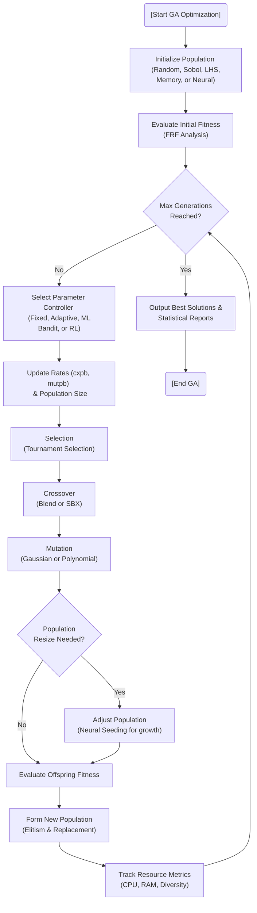

# Genetic Algorithm (GA)

## Overview
The Genetic Algorithm (`GAWorker.py`) optimizes DVA parameters by simulating natural selection. It evaluates fitness based on a comprehensive [Objective Function](ObjectiveFunction.md) that considers FRF analysis, sparsity, and cost-benefit ratios.

## GA Workflow with Advanced Controllers
The core evolutionary loop is augmented by multiple intelligent controllers that dynamically tune hyperparameters to ensure robust convergence and prevent stagnation.



#### Pseudo-code
```text
BEGIN
  EXECUTE [Start GA Optimization]
  EXECUTE Initialize Population   (Random, Sobol, LHS, Memory, or Neural)
  EXECUTE Evaluate Initial Fitness   (FRF Analysis)
  EXECUTE Max Generations   Reached?
  EXECUTE Select Parameter Controller   (Fixed, Adaptive, ML Bandit, or RL)
  EXECUTE Update Rates (cxpb, mutpb)   & Population Size
  EXECUTE Selection   (Tournament Selection)
  EXECUTE Crossover   (Blend or SBX)
  EXECUTE Mutation   (Gaussian or Polynomial)
  EXECUTE Population   Resize Needed?
  EXECUTE Adjust Population   (Neural Seeding for growth)
  EXECUTE Evaluate Offspring Fitness
  EXECUTE Form New Population   (Elitism & Replacement)
  EXECUTE Track Resource Metrics   (CPU, RAM, Diversity)
  EXECUTE Output Best Solutions &   Statistical Reports
  EXECUTE [End GA]
END
```

## Intelligent Parameter Controllers

### 1. ML Bandit Controller (MAB)
If enabled, DeVana uses a Multi-Armed Bandit strategy to select the optimal combination of crossover probability, mutation probability, and population size.
- **Algorithm:** Upper Confidence Bound (UCB).
- **Action Space:** A Cartesian product of deltas for rates ($\pm 15\%, \pm 30\%$) and population multipliers ($0.75x, 1.25x$).
- **Reward Function:** Blends fitness improvement, computational efficiency (gen time), and genetic diversity.

```mermaid
flowchart TD
    StartMAB["Start Generation"] --> CalcReward["Calculate Reward from Previous Action <br/> (Improvement + Speed - Diversity Penalty)"]
    CalcReward --> UpdateUCB["Update Action Counts & <br/> Cumulative Rewards"]
    UpdateUCB --> SelectBest["Select Action with Highest UCB Score: <br/> Score = AvgReward + C * sqrt("log(t")/count)"]
    SelectBest --> ApplyAction["Apply Deltas to cxpb, mutpb, pop_size"]
    ApplyAction --> EndMAB["Next Generation"]
```

#### Pseudo-code
```text
BEGIN
  EXECUTE Start Generation
  EXECUTE Calculate Reward from Previous Action   (Improvement + Speed - Diversity Penalty)
  EXECUTE Update Action Counts &   Cumulative Rewards
  EXECUTE Select Action with Highest UCB Score:   Score = AvgReward + C * sqrt(
  EXECUTE )/count)
  EXECUTE Apply Deltas to cxpb, mutpb, pop_size
  EXECUTE Next Generation
END
```

### 2. RL Controller (Q-Learning)
An alternative adaptive method that uses a reinforcement learning agent to learn the best parameter adjustments.
- **Algorithm:** Discrete Q-Learning.
- **State Space:** Binary state (extended for stagnation/diversity).
- **Policy:** $\epsilon$-greedy (Exploration vs. Exploitation).

### 3. Adaptive Rate Controller
A heuristic-based controller that monitors:
- **Success Rate:** Ratio of offspring outperforming parents.
- **Genetic Diversity:** Standard deviation of parameters.
It increases mutation to explore when diversity is low and decreases it to exploit when success is high.

## Advanced Seeding & Population Management
DeVana supports a high-tier hierarchy of initialization methods:
- **Sobol & LHS:** Quasi-random sequences for optimal search space coverage.
- **Memory Seeding:** Reuses high-quality solutions from previous optimization sessions.
- **Neural Seeding:** Uses an online surrogate model (MLP ensemble) to generate promising candidates when the population grows.
