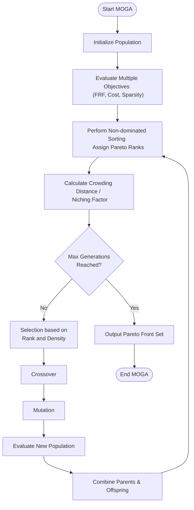

# Multi-Objective Genetic Algorithm (MOGA)

## Overview
The MOGA module (`MOGAWorker.py`) is designed to handle optimization problems with multiple conflicting objectives. While the implementation in this codebase is a placeholder, the architecture is designed to support the search for a Pareto-optimal front where no single objective can be improved without degrading another.

## Intended Features
- **Non-dominated Sorting**: Ranking individuals based on Pareto dominance.
- **Diversity Maintenance**: Using mechanisms like crowding distance or niching to ensure a well-spread Pareto front.
- **Conflicting Objectives**:
  - **Minimizing Vibrations**: Achieving a singular response close to 1.
  - **Minimizing Cost**: Reducing material and manufacturing expenses.
  - **Maximizing Sparsity**: Reducing the number of active absorbers.

## Theoretical Flowchart

