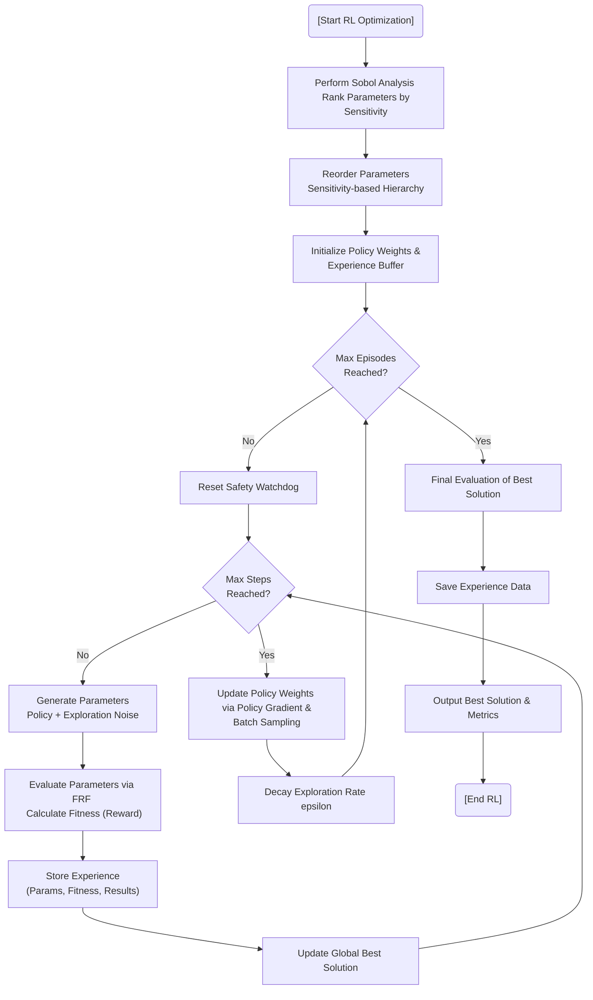

# Reinforcement Learning (RL) Optimization

## Overview
The RL Worker (`RLWorker.py`) applies a policy-gradient-inspired approach to optimize DVA parameters. It is designed for continuous search spaces, making it more effective than traditional discrete Q-learning for mechanical parameter optimization.

## Core Concepts
- **Policy Network**: Learns a mapping from the "state" (effectively the current parameter configuration) to the optimal "actions" (parameter adjustments).
- **Continuous Action Space**: Instead of discrete steps, the agent learns to output continuous values for masses, stiffnesses, and damping.
- **Experience Replay**: Stores past trials (parameters, fitness, results) and samples from them to break temporal correlations and stabilize learning.
- **Exploration vs. Exploitation**: Managed via various $\epsilon$-decay strategies (Exponential, Linear, Inverse, Step, Cosine).
- **Sobol-guided Ranking**: Uses Sobol sensitivity analysis at the start to rank parameters by importance, focusing the RL agent's learning on the most influential variables.

## Algorithm Flowchart



#### Pseudo-code
```text
BEGIN
  EXECUTE [Start RL Optimization]
  EXECUTE Perform Sobol Analysis   Rank Parameters by Sensitivity
  EXECUTE Reorder Parameters   Sensitivity-based Hierarchy
  EXECUTE Initialize Policy Weights &   Experience Buffer
  EXECUTE Max Episodes   Reached?
  EXECUTE Reset Safety Watchdog
  EXECUTE Max Steps   Reached?
  EXECUTE Generate Parameters   Policy + Exploration Noise
  EXECUTE Evaluate Parameters via FRF   Calculate Fitness (Reward)
  EXECUTE Store Experience   (Params, Fitness, Results)
  EXECUTE Update Global Best Solution
  EXECUTE Update Policy Weights   via Policy Gradient & Batch Sampling
  EXECUTE Decay Exploration Rate epsilon
  EXECUTE Final Evaluation of Best Solution
  EXECUTE Save Experience Data
  EXECUTE Output Best Solution & Metrics
  EXECUTE [End RL]
END
```
