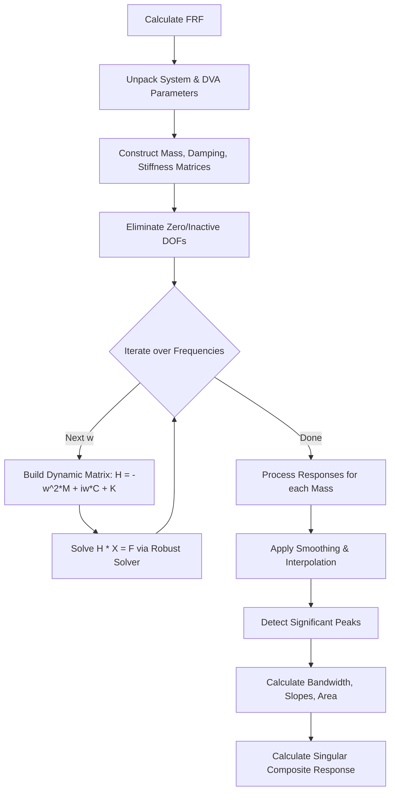
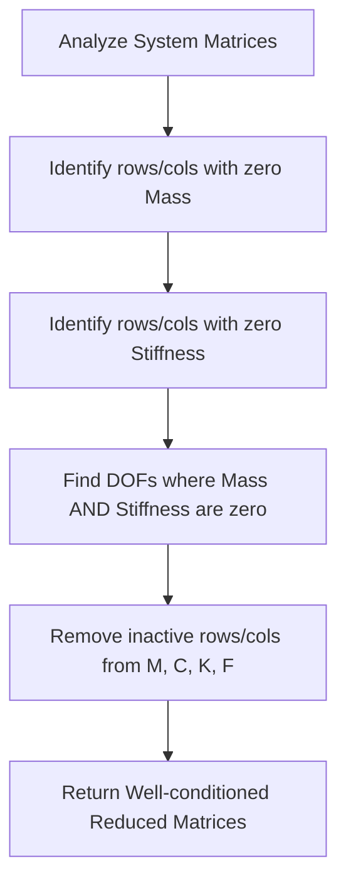
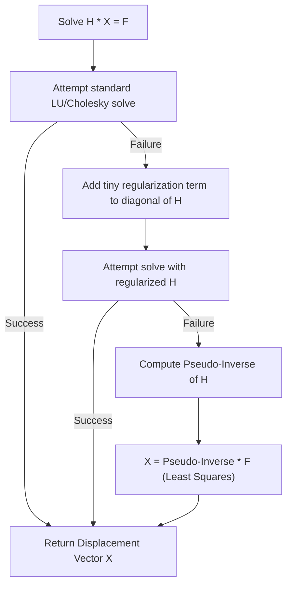
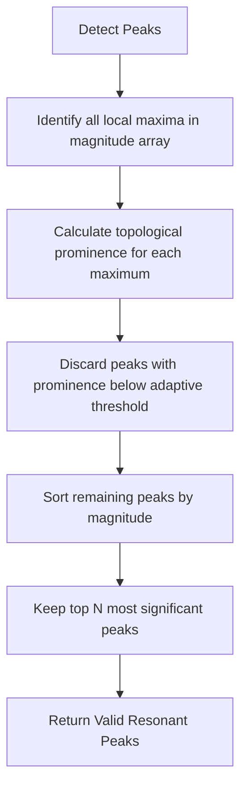
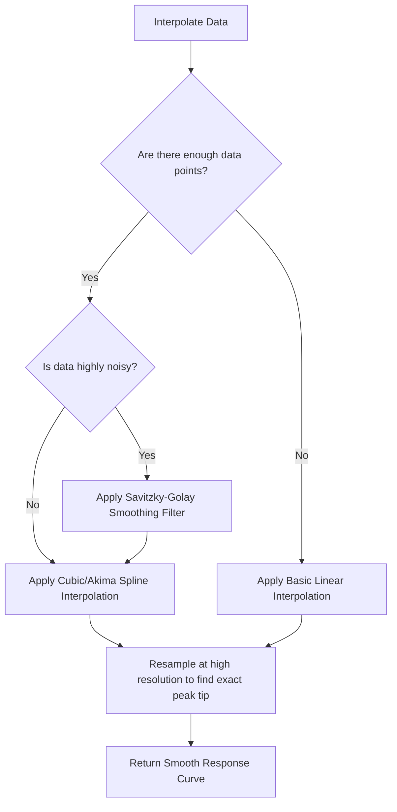
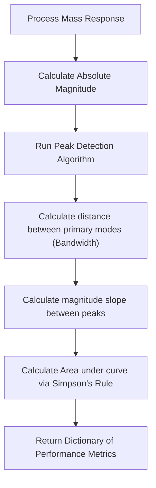

# Frequency Response Function (FRF) Analysis

## Overview
The FRF module (`FRF.py`) is the computational core of DeVana. It calculates the dynamic response of multi-degree-of-freedom systems across a specified frequency range ($\omega$). To handle ill-conditioned systems, zero-mass parameters, and complex modal interactions, the module utilizes a series of highly specialized sub-algorithms.

---

## 1. Main FRF Execution Flow
The master loop orchestrates the matrix assembly, solving, and post-processing.

---

## 2. Zero DOF Elimination
Systems with non-active parameters (e.g., zero mass or zero stiffness) produce singular matrices. This algorithm safely reduces the system dimensions before solving.

---

## 3. Robust Linear Solver
When matrices are near-singular (ill-conditioned), standard solvers fail. This multi-stage solver guarantees a numeric response.

---

## 4. Peak Detection via Prominence
Identifying true resonant peaks among numerical noise is achieved using topological prominence filtering rather than static thresholds.

---

## 5. Interpolation and Smoothing
Raw frequency step data is interpolated to find the exact frequency of resonant peaks without requiring computationally expensive micro-stepping.

---

## 6. Mass Data Processing
Translates raw complex vectors into engineering metrics (bandwidth, slopes, energy transfer).

