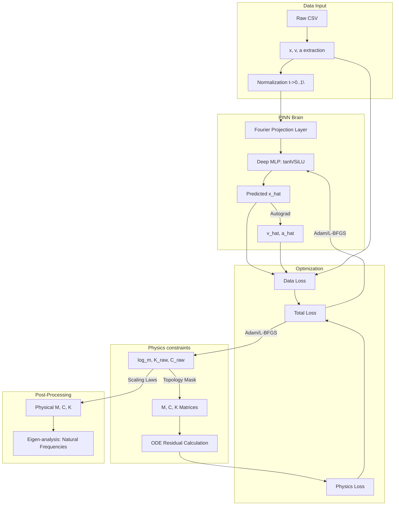

# Physics-Informed Neural Network (PINN) Discretisizer: Exhaustive Technical Documentation

## 1. Overview and Problem Statement
The PINN Discretisizer solves the **Inverse Vibration Problem**. In mechanical engineering, the "Forward Problem" involves predicting vibration given known Mass (**M**), Damping (**C**), and Stiffness (**K**) matrices. The **Inverse Problem** is significantly more challenging: identifying the underlying structural parameters (**M, C, K**) from raw time-domain sensor data ($x, v, a$).

The engine models a system of $P$ sensors as an **equivalent lumped $P$-DOF system**. This discretisization effectively "compresses" a continuous elastic structure (like a gearbox housing) into a manageable mathematical model suitable for control design and health monitoring.

---

## 2. Mathematical Formulation of the Physical Engine

### 2.1 The Governing Equation
The identified system is assumed to follow the generalized linear matrix equation of motion:
$$ \mathbf{M}\ddot{\mathbf{x}}(t) + \mathbf{C}\dot{\mathbf{x}}(t) + \mathbf{K}\mathbf{x}(t) = \mathbf{0} $$
where:
- $\mathbf{x}(t) \in \mathbb{R}^P$ is the displacement vector.
- $\mathbf{M}, \mathbf{C}, \mathbf{K} \in \mathbb{R}^{P \times P}$ are the mass, damping, and stiffness matrices.

### 2.2 Enforcing Physical Positivity and Symmetry
To ensure the identified model is physically realizable, the parameters are optimized in **log-space** or through specific structural formulations.

#### Mass Matrix (Diagonal)
The mass matrix is assumed diagonal (lumped mass assumption). To prevent non-physical negative mass:
$$ M_{ii} = \exp(\theta_{m,i}) \implies \mathbf{M} = \text{diag}(M_{11}, M_{22}, \dots, M_{PP}) $$

#### Stiffness and Damping (Topology Masked)
The stiffness matrix $\mathbf{K}$ is constructed from two components:
1.  **Ground Springs** ($k_i$): Connected from node $i$ to the inertial frame.
2.  **Connection Springs** ($k_{ij}$): Connected between node $i$ and node $j$.

The implementation uses a **Topology Mask** $\mathbf{A} \in \{0, 1\}^{P \times P}$ defined by the user:
-   **Step 1: Raw Constants.** $k_{ij}^{raw} = \exp(\theta_{K,ij}) \cdot A_{ij}$.
-   **Step 2: Off-Diagonals.** $K_{ij} = -k_{ij}^{raw}$ for $i \neq j$.
-   **Step 3: Diagonals.** $K_{ii} = k_{i}^{ground} + \sum_{j \neq i} k_{ij}^{raw}$.

This formulation guarantees that $\mathbf{K}$ is **Symmetric** ($K_{ij} = K_{ji}$) and **Positive Semi-Definite** (by Gershgorin circle theorem properties of Laplacian-like matrices). The same logic applies to the Damping matrix $\mathbf{C}$.

---

## 3. Neural Network Architecture Details

### 3.1 Smooth Activation Functions
Unlike standard deep learning where `ReLU` is dominant, PINNs **require** activations that are at least $C^2$ continuous (twice differentiable). 
- **`tanh` (Default):** Provides smooth gradients for $v$ and $a$.
- **`SiLU` (Swish):** An alternative that avoids the vanishing gradient problem in deeper layers while remaining smooth.

### 3.2 Fourier Feature Mapping (Input Projection)
To capture high-frequency components (common in gears), the input time $t$ is projected into a higher-dimensional periodic space before entering the MLP:
$$ \gamma(t) = \left[ \sin(2\pi \mathbf{f} t), \cos(2\pi \mathbf{f} t) \right]^\top $$
where $\mathbf{f}$ is a vector of $n$ frequencies linearly spaced up to $f_{max}$. This bypasses the "Spectral Bias" where neural networks naturally learn low frequencies first.

---

## 4. The Multi-Objective Loss Function

The training minimizes a composite residual:
$$ \mathcal{L}_{total} = \lambda_{data} \mathcal{L}_{data} + \lambda_{phys} \mathcal{L}_{physics} $$

### 4.1 Triple-Signal Data Loss
The engine minimizes the mismatch for all three physical signals simultaneously:
$$ \mathcal{L}_{data} = \frac{1}{N} \sum_{i=1}^N \left( \|\hat{x}_i - x_i\|^2 + \|\hat{v}_i - v_i\|^2 + \|\hat{a}_i - a_i\|^2 \right) $$
Including $v$ and $a$ in the data loss significantly stabilizes the identification of $\mathbf{C}$ and $\mathbf{M}$ respectively.

### 4.2 Physics Residual (Automatic Differentiation)
We compute the exact physics violation at every collocation point:
$$ \text{res}_i = \mathbf{M} \frac{\partial^2 N_\theta(t_i)}{\partial t^2} + \mathbf{C} \frac{\partial N_\theta(t_i)}{\partial t} + \mathbf{K} N_\theta(t_i) $$
$$ \mathcal{L}_{physics} = \frac{1}{N} \sum_{i=1}^N \| \text{res}_i \|^2 $$
The derivatives $\frac{\partial}{\partial t}$ are computed via PyTorch's `autograd.grad` with `create_graph=True`.

---

## 5. Optimization Strategy

### 5.1 Phase 1: Adam (Stochastic Exploration)
Used for the first $N$ epochs (Warm-up). It is robust to noise and helps the network find the general shape of the vibration signal.

### 5.2 Phase 2: L-BFGS (Deterministic Refinement)
Once the "basin of attraction" is found, the engine switches to the **Limited-memory Broyden–Fletcher–Goldfarb–Shanno** optimizer. 
- **Second-order:** Uses Hessian approximations to achieve quadratic convergence.
- **Line Search:** Employs `strong_wolfe` conditions to ensure every step leads to a sufficient decrease in the physics residual.

---

## 6. Normalization and Scaling Laws

### 6.1 Training Space
To prevent numerical instability, all data is normalized before entering the network:
- $t_{norm} = \frac{t}{T}$ where $T = t_{max} - t_{min}$.
- $x_{norm} = \frac{x - \mu_x}{\sigma_x}$.

### 6.2 Denormalization (Physical Recovery)
The parameters identified by the network ($\mathbf{M}_{id}, \mathbf{C}_{id}, \mathbf{K}_{id}$) are valid only in the $[0, 1]$ time domain. To recover the real physical units:

1.  **Stiffness:** The frequency-independent stiffness remains invariant:
    $$ \mathbf{K}_{phys} = \mathbf{K}_{id} $$
2.  **Damping:** Since velocity $\dot{x}$ scales with $1/T$:
    $$ \mathbf{C}_{phys} = \mathbf{C}_{id} \cdot T $$
3.  **Mass:** Since acceleration $\ddot{x}$ scales with $1/T^2$:
    $$ \mathbf{M}_{phys} = \mathbf{M}_{id} \cdot T^2 $$

---

## 7. Pipeline Flowchart



#### Pseudo-code
```text
BEGIN
  EXECUTE Raw CSV
  EXECUTE x, v, a extraction
  EXECUTE Normalization t->
  EXECUTE Fourier Projection Layer
  EXECUTE Deep MLP: tanh/SiLU
  EXECUTE Predicted x_hat
  EXECUTE v_hat, a_hat
  EXECUTE log_m, K_raw, C_raw
  EXECUTE M, C, K Matrices
  EXECUTE ODE Residual Calculation
  EXECUTE Data Loss
  EXECUTE Physics Loss
  EXECUTE Total Loss
  EXECUTE Physical M, C, K
  EXECUTE Eigen-analysis: Natural Frequencies
END
```
