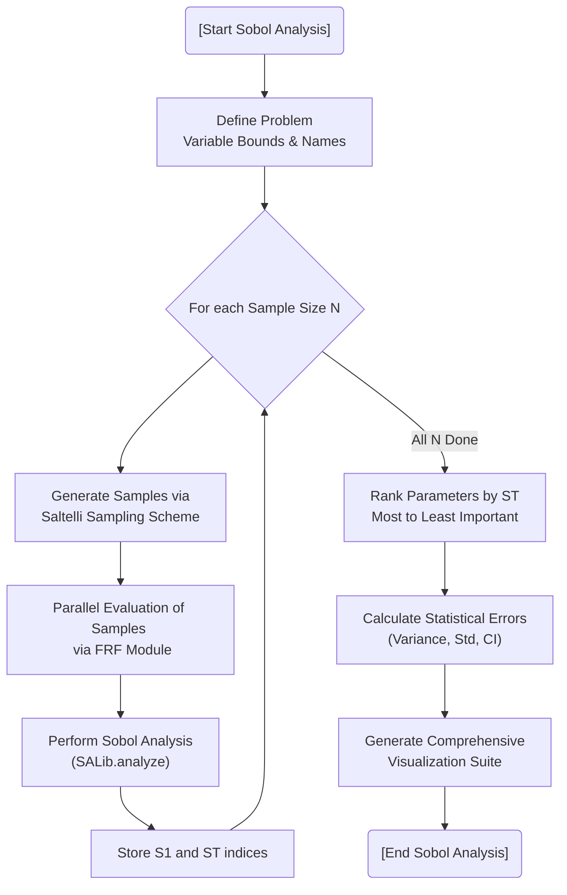

# Sobol Sensitivity Analysis

## Overview
The Sobol module (`sobol_sensitivity.py`) provides global sensitivity analysis (GSA) to identify which DVA parameters (masses, stiffnesses, damping) most significantly impact the system's performance. This is critical for dimensionality reduction and understanding the design space.

## Mathematical Basis
It decomposes the variance of the output ($Y$, usually the singular response) into fractions attributed to individual inputs or sets of inputs:
- **First-order Index ($S_1$)**: Measures the contribution of a single parameter to the output variance.
- **Total-order Index ($S_T$)**: Measures the total contribution of a parameter, including its interactions with all other parameters.

## Advanced Features
- **Saltelli Sampling**: Efficient sampling strategy based on the Sobol sequence.
- **Parallel Execution**: Utilizes multi-core processing (`joblib`) to evaluate hundreds or thousands of samples simultaneously.
- **Convergence Tracking**: Analyzes sensitivity indices across increasing sample sizes to ensure statistical stability.
- **Comprehensive Visualization**:
  - **Grouped Bar Plots**: Sorted by $S_1$ or $S_T$.
  - **Radar Plots**: To see parameter importance in a circular layout.
  - **Parallel Coordinates**: Tracking indices across different sample sizes.
  - **Heatmaps & Scatter Plots**: Visualizing parameter interactions.

## Analysis Flowchart



#### Pseudo-code
```text
BEGIN
  EXECUTE [Start Sobol Analysis]
  EXECUTE Define Problem   Variable Bounds & Names
  EXECUTE For each Sample Size N
  EXECUTE Generate Samples via   Saltelli Sampling Scheme
  EXECUTE Parallel Evaluation of Samples   via FRF Module
  EXECUTE Perform Sobol Analysis   (SALib.analyze)
  EXECUTE Store S1 and ST indices
  EXECUTE Rank Parameters by ST   Most to Least Important
  EXECUTE Calculate Statistical Errors   (Variance, Std, CI)
  EXECUTE Generate Comprehensive   Visualization Suite
  EXECUTE [End Sobol Analysis]
END
```
