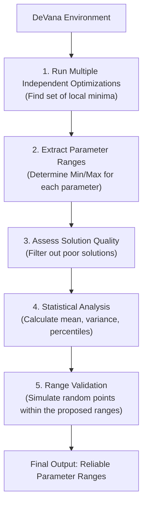
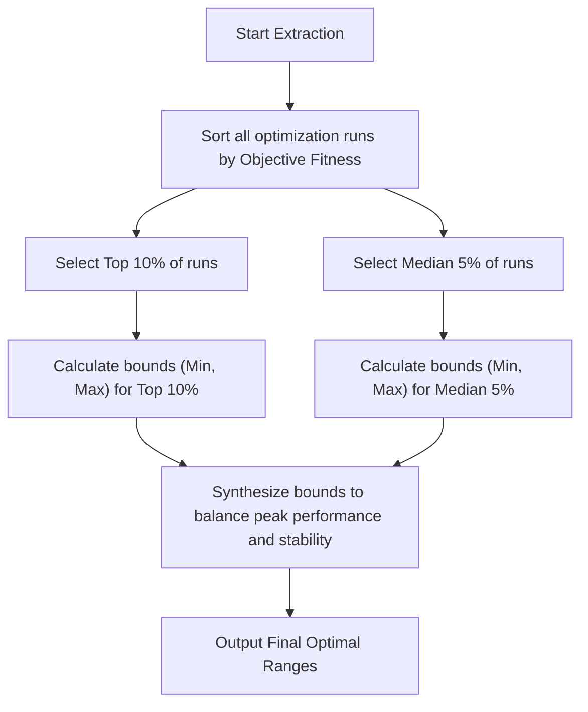
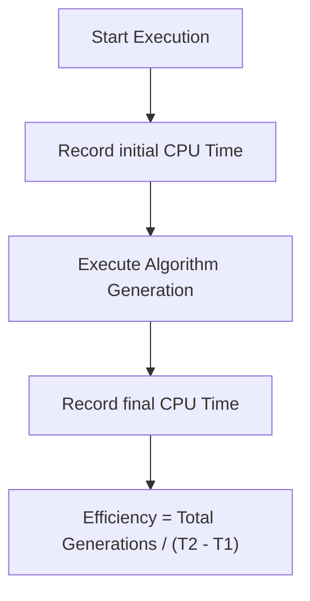
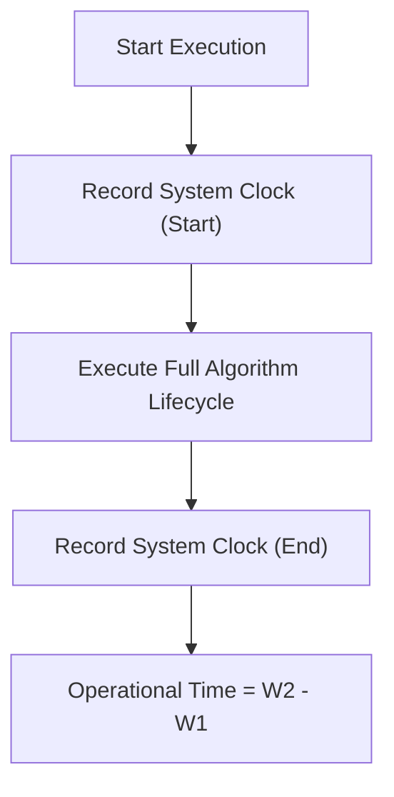

# Statistical Evaluation & Optimal Ranges

## Redefining Optimization: Ranges over Points
In complex mechanical design, relying on a single "optimal" point is risky due to manufacturing tolerances and modeling uncertainties. DeVana's core philosophy shifts the goal from finding a *single optimal point* to defining **Optimal Parameter Ranges**.

A range is considered optimal if any configuration within that bound guarantees system performance above a predefined Acceptable Performance Threshold ($\epsilon$).

### Proposed DVA Optimization Workflow



#### Pseudo-code
```text
BEGIN
  EXECUTE DeVana Environment
  EXECUTE 1. Run Multiple Independent Optimizations (Find set of local minima)
  EXECUTE 2. Extract Parameter Ranges (Determine Min/Max for each parameter)
  EXECUTE 3. Assess Solution Quality (Filter out poor solutions)
  EXECUTE 4. Statistical Analysis (Calculate mean, variance, percentiles)
  EXECUTE 5. Range Validation (Simulate random points within the proposed ranges)
  EXECUTE Final Output: Reliable Parameter Ranges
END
```

---

## Strict Statistical Extraction (Top 10% & Median 5%)
To ensure that the extracted ranges are both high-performing and statistically stable, DeVana applies a strict filtering mechanism rather than using all raw optimization data.

We analyze two specific subsets of the independent runs:
1. **The Top 10%**: The absolute best performing runs.
2. **The Median 5% (47.5% to 52.5%)**: The most "typical" stable runs.



#### Pseudo-code
```text
BEGIN
  EXECUTE Start Extraction
  EXECUTE Sort all optimization runs by Objective Fitness
  EXECUTE Select Top 10% of runs
  EXECUTE Select Median 5% of runs
  EXECUTE Calculate bounds (Min, Max) for Top 10%
  EXECUTE Calculate bounds (Min, Max) for Median 5%
  EXECUTE Synthesize bounds to balance peak performance and stability
  EXECUTE Output Final Optimal Ranges
END
```

---

## Algorithm Performance Metrics
When evaluating different seeding methods or algorithmic variations (e.g., Fixed vs. Adaptive Rates), DeVana uses three primary metrics:

### 1. Best Fitness
Measures the absolute quality of the final solution. Tracked across generations to analyze convergence speed.

### 2. CPU Time (Computational Efficiency)
Measures the pure processing time spent executing the algorithm, independent of system load or I/O delays. Reflects the algorithmic complexity (Big-O).



#### Pseudo-code
```text
BEGIN
  EXECUTE Start Execution
  EXECUTE Record initial CPU Time
  EXECUTE Execute Algorithm Generation
  EXECUTE Record final CPU Time
  EXECUTE Efficiency = Total Generations / (T2 - T1)
END
```

### 3. Wall Time (Operational Efficiency)
Measures the real-world elapsed time (from the user's perspective), including I/O wait times and GUI updates.



#### Pseudo-code
```text
BEGIN
  EXECUTE Start Execution
  EXECUTE Record System Clock (Start)
  EXECUTE Execute Full Algorithm Lifecycle
  EXECUTE Record System Clock (End)
  EXECUTE Operational Time = W2 - W1
END
```

By cross-referencing Best Fitness against CPU and Wall Time, DeVana identifies algorithms that are not only accurate but practically efficient for large-scale engineering problems.
