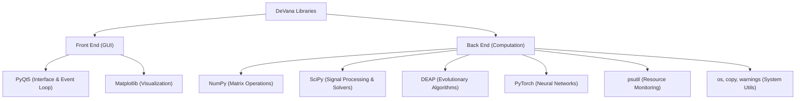
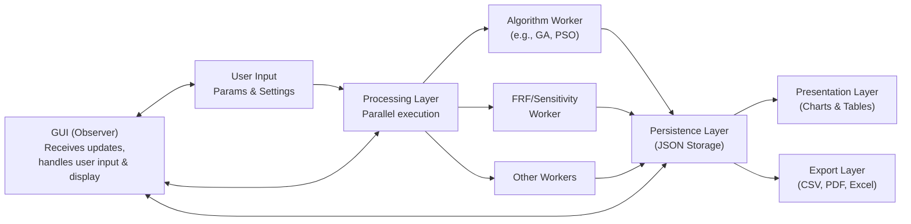

# Software Architecture & Data Flow

## Overview
DeVana is built on a modular, object-oriented architecture designed to ensure high performance, maintainability, and seamless user interaction. The framework separates the graphical user interface from heavy computational tasks to guarantee a responsive experience even during complex optimizations.

## Library Stack
The framework relies on a robust stack of scientific and UI libraries:



#### Pseudo-code
```text
BEGIN
  EXECUTE DeVana Libraries
  EXECUTE Front End (GUI)
  EXECUTE Back End (Computation)
  EXECUTE PyQt5 (Interface & Event Loop)
  EXECUTE Matplotlib (Visualization)
  EXECUTE NumPy (Matrix Operations)
  EXECUTE SciPy (Signal Processing & Solvers)
  EXECUTE DEAP (Evolutionary Algorithms)
  EXECUTE PyTorch (Neural Networks)
  EXECUTE psutil (Resource Monitoring)
  EXECUTE os, copy, warnings (System Utils)
END
```

## Data Flow (Observer Pattern)
To prevent UI freezing during intensive optimization cycles, DeVana implements a multi-layered architecture based on the **Observer Pattern**. The GUI acts as the observer, receiving real-time updates from independent worker threads.



#### Pseudo-code
```text
BEGIN
  EXECUTE GUI (Observer) Receives updates, handles user input & display
  EXECUTE User Input Params & Settings
  EXECUTE Processing Layer Parallel execution
  EXECUTE Algorithm Worker (e.g., GA, PSO)
  EXECUTE FRF/Sensitivity Worker
  EXECUTE Other Workers
  EXECUTE Persistence Layer (JSON Storage)
  EXECUTE Presentation Layer (Charts & Tables)
  EXECUTE Export Layer (CSV, PDF, Excel)
END
```

### Architectural Layers
1. **Input Layer**: Captures physical constraints, algorithm settings, and target responses from the user.
2. **Processing Layer**: Dispatches tasks to multi-threaded workers (e.g., `GAWorker.py`, `FRFWorker.py`).
3. **Persistence Layer**: Serializes results into JSON format ensuring data integrity and version control.
4. **Presentation Layer**: Renders mathematical results into interactive charts and tables.
5. **Export Layer**: Generates high-quality reports for external analysis.
