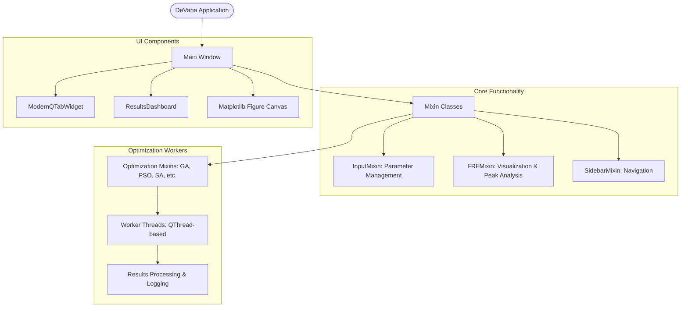

# Main Application Architecture

## Overview
DeVana's graphical user interface (`mainwindow.py`) is built using PyQt5 and follows a modular "Mixin" architecture. This design pattern allows for a clean separation of concerns, where each functional block (e.g., GA, PSO, FRF plotting) is encapsulated in its own mixin class.

## Mixin Architecture
The `MainWindow` class inherits from multiple mixins, each providing specialized functionality:
- **`SidebarMixin`**: Manages navigation and switching between different analysis modules.
- **`InputMixin`**: Handles user input for main system parameters and DVA bounds.
- **`GA/PSO/DE/SA/CMAES Mixins`**: Logic for setting up and launching optimization workers.
- **`FRFMixin`**: Coordinates real-time FRF plotting and peak detection visualization.
- **`SobolMixin`**: Interface for global sensitivity analysis.
- **`ThemeMixin`**: Manages the application's visual style and dark/light modes.

## Component Flowchart

## Key UI Features
- **Modern Styling**: Custom CSS and modern widgets (SidebarButtons, ModernTabs) for a professional look.
- **Real-time Feedback**: Live progress bars and status updates from worker threads.
- **Interactive Plots**: Draggable annotations and zoomable Matplotlib figures for detailed analysis.
- **Benchmarking Integration**: Real-time display of CPU and memory usage during heavy computations.
