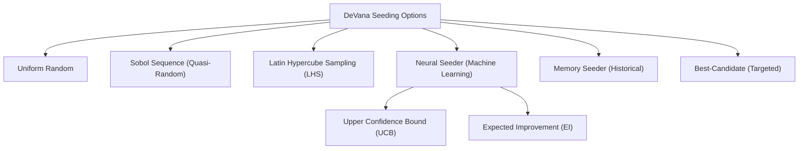
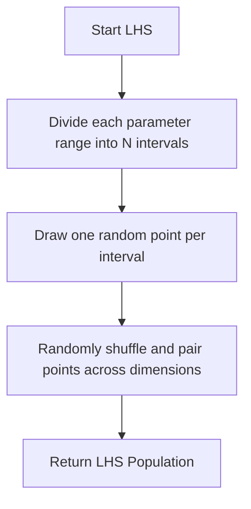

# Intelligent Seeding Strategies

## Overview
Population initialization (seeding) drastically impacts the convergence speed and final quality of evolutionary algorithms. DeVana offers a hierarchy of advanced seeding options to bypass pure random search and focus on high-potential regions immediately.

## Seeding Options Hierarchy



#### Pseudo-code
```text
BEGIN
  EXECUTE DeVana Seeding Options
  EXECUTE Uniform Random
  EXECUTE Sobol Sequence (Quasi-Random)
  EXECUTE Latin Hypercube Sampling (LHS)
  EXECUTE Neural Seeder (Machine Learning)
  EXECUTE Memory Seeder (Historical)
  EXECUTE Best-Candidate (Targeted)
  EXECUTE Upper Confidence Bound (UCB)
  EXECUTE Expected Improvement (EI)
END
```

---

## 1. Uniform Random Seeding
The simplest approach. Values are drawn from a uniform distribution across the allowable bounds. Fast, but risks poor coverage in high-dimensional spaces.

## 2. Sobol Sequence Seeding (Quasi-Monte Carlo)
Utilizes the `scipy.stats.qmc.Sobol` engine to generate low-discrepancy sequences. This ensures that the initial population is distributed much more uniformly than pseudo-random numbers, preventing "clusters" and "gaps" in the search space. 
- **Implementation:** Handles up to power-of-2 sample sizes for optimal discrepancy properties.
- **Advantage:** Particularly effective for global sensitivity analysis and finding global basins of attraction in DVA landscapes.

```mermaid
flowchart TD
    Start["Start Sobol"] --> Init["Initialize Sobol Generator for N dimensions"]
    Init --> Sample["Generate base-2 samples"]
    Sample --> Scale["\"Scale [0,1"] samples to actual bounds"]
    Scale --> Enforce["Enforce fixed parameter constraints"]
    Enforce --> Output["Return Quasi-Random Population"]
```

#### Pseudo-code
```text
BEGIN
  EXECUTE Start Sobol
  EXECUTE Initialize Sobol Generator for N dimensions
  EXECUTE Generate base-2 samples
  EXECUTE \
  EXECUTE ] samples to actual bounds
  EXECUTE Enforce fixed parameter constraints
  EXECUTE Return Quasi-Random Population
END
```

## 3. Latin Hypercube Sampling (LHS)
Uses `scipy.stats.qmc.LatinHypercube` to ensure that each parameter's marginal distribution is perfectly uniform. The range of each parameter is divided into $N$ equal intervals, and exactly one sample is drawn from each interval.



#### Pseudo-code
```text
BEGIN
  EXECUTE Start LHS
  EXECUTE Divide each parameter range into N intervals
  EXECUTE Draw one random point per interval
  EXECUTE Randomly shuffle and pair points across dimensions
  EXECUTE Return LHS Population
END
```

## 4. Neural Seeding (Online Surrogate ML)
An advanced surrogate-assisted approach. An ensemble of Multi-Layer Perceptrons (MLPs) learns the fitness landscape from past evaluations. 
- **Acquisition Functions:** Uses UCB or Expected Improvement (EI) to balance sampling known good regions vs. exploring uncertain areas.
- **Integration:** Used both for initial seeding and for generating new individuals when the population size is increased by the ML/RL controllers.

## 5. Memory-Based Seeding
Learns across different optimization runs by saving the best performing solutions to a JSON file. Reuses top candidates with a slight Gaussian jitter to explore near proven local optima.
