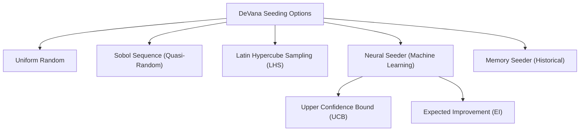
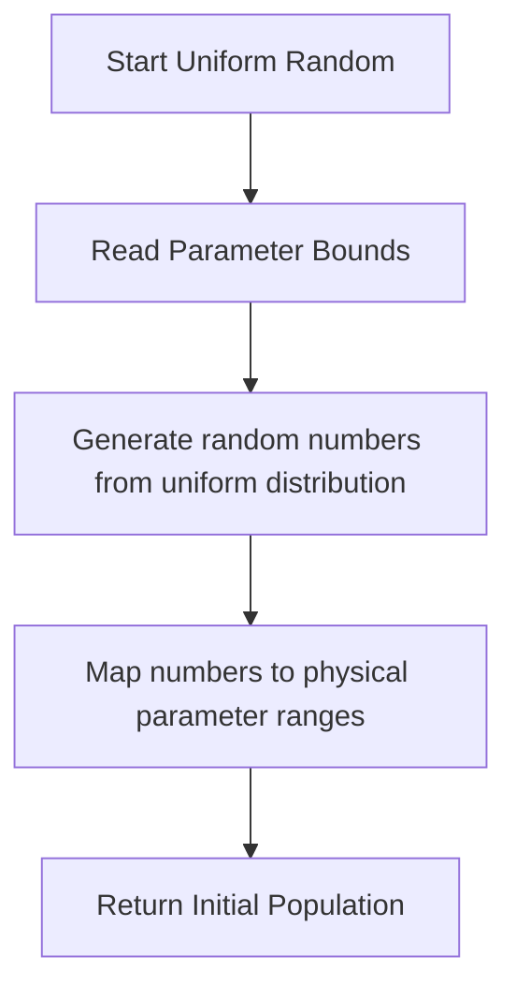
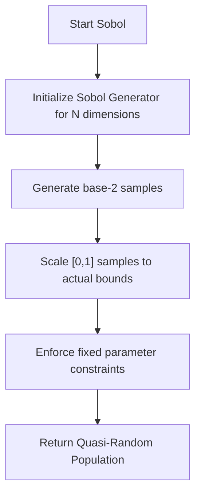
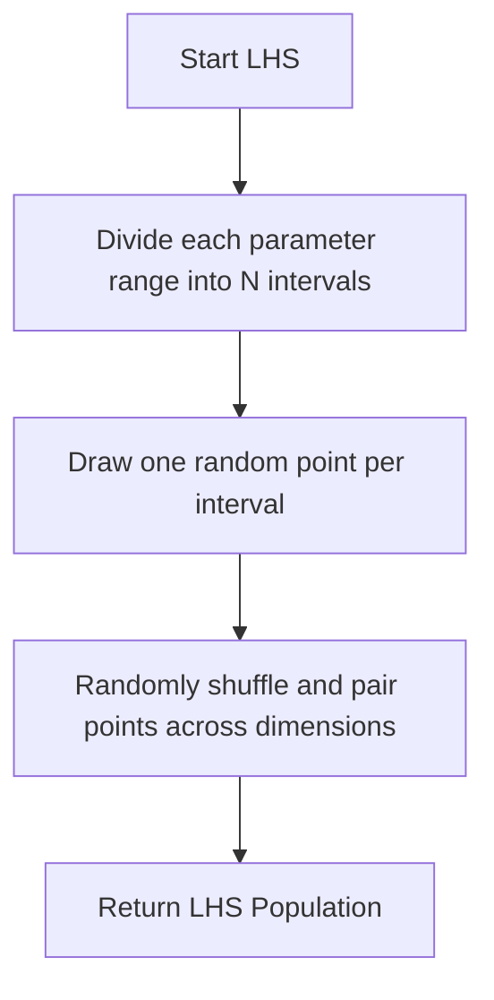
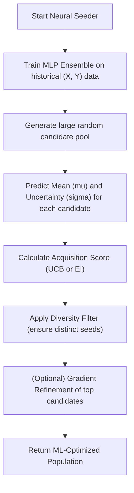

# Intelligent Seeding Strategies

## Overview
Population initialization (seeding) drastically impacts the convergence speed and final quality of evolutionary algorithms. DeVana offers a hierarchy of advanced seeding options to bypass pure random search and focus on high-potential regions immediately.

## Seeding Options Hierarchy

---

## 1. Uniform Random Seeding
The simplest approach. Values are drawn from a uniform distribution across the allowable bounds. Fast, but risks poor coverage in high-dimensional spaces.

## 2. Sobol Sequence Seeding
Utilizes low-discrepancy Sobol sequences to cover the parameter space much more uniformly than pseudo-random numbers, preventing "clusters" and "gaps" in the initial population.

## 3. Latin Hypercube Sampling (LHS)
Divides the range of each parameter into $N$ equal intervals (where $N$ is population size) and ensures exactly one sample is drawn from each interval. This guarantees perfectly uniform marginal distributions for every individual parameter.

## 4. Neural Seeding (Online ML)
An advanced surrogate-assisted approach. An ensemble of Multi-Layer Perceptrons (MLPs) learns the fitness landscape from past evaluations. It generates a massive pool of random candidates, predicts their performance, and selects the best ones using an acquisition function.

## 5. Memory-Based Seeding
Learns across different optimization runs by saving the best performing solutions to a JSON file. Reuses top candidates with a slight Gaussian jitter to explore near proven local optima.
