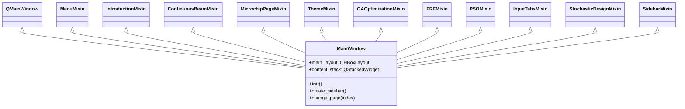
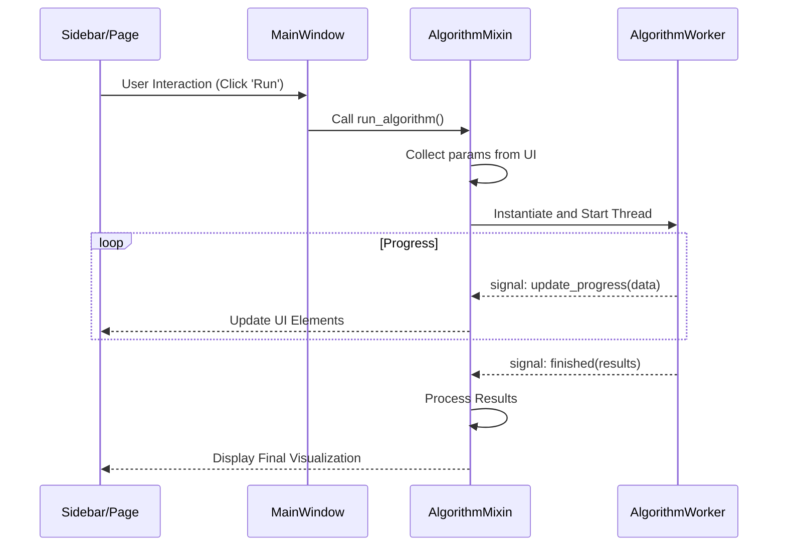

# DeVana Software Architecture: The Mixin Revolution

## Overview
DeVana employs a sophisticated **Mixin-based Software Architecture** to manage the complexity of its multi-objective optimization suite. Instead of a monolithic class or deep inheritance hierarchy, the `MainWindow` is composed of specialized, decoupled functional units (Mixins).

This architecture allows for:
- **Separation of Concerns**: Each algorithm and UI section has its own dedicated Mixin.
- **Extensibility**: New optimization algorithms can be added by creating a new Mixin and adding it to the `MainWindow` inheritance list.
- **Maintainability**: Bugs in the GA implementation are isolated to the `GAOptimizationMixin`, not affecting PSO or the physics engine.

## The Mixin Composition Pattern

The `MainWindow` class in `codes/mainwindow.py` acts as the **Orchestrator**. It inherits from dozens of Mixins, effectively "assembling" its functionality at class definition time.

### Mixin Hierarchy Diagram



## Core Architectural Components

### 1. The Orchestrator (`MainWindow`)
Located in `codes/mainwindow.py`, it initializes the core UI framework:
- **Central Widget**: A `QHBoxLayout` containing the Sidebar and the Content Area.
- **Content Area**: A `QScrollArea` containing a `QStackedWidget` (`content_stack`).
- **Initialization Sequence**: It calls `create_sidebar()`, then page creation methods (e.g., `create_introduction_page()`), and finally sets the default page.

### 2. Navigation & Layout (`SidebarMixin`)
Handles the primary navigation. It uses a custom `SidebarButton` widget and communicates with the `content_stack` to switch pages.

### 3. Functional Mixins
- **UI Mixins**: `IntroductionMixin`, `ContinuousBeamMixin`, `MicrochipPageMixin`. These define the visual structure of specific pages.
- **Algorithm Mixins**: `GAOptimizationMixin`, `PSOMixin`, `NSGA2Mixin`, etc. These handle the specific parameters, UI tabs, and worker coordination for each optimization algorithm.
- **Analysis Mixins**: `SobolAnalysisMixin`, `OmegaSensitivityMixin`. Focused on post-optimization or pre-optimization analysis.

### 4. The Worker Pattern (Threading)
To keep the UI responsive, all long-running tasks (optimization, FRF calculation) are offloaded to **Workers** located in `codes/workers/`.
- The Mixin creates a `Worker` instance (inheriting from `QThread`).
- Signals (e.g., `progress`, `finished`, `error`) are connected to Mixin methods.
- The Mixin handles UI updates (progress bars, result text) based on these signals.

## Data Flow & Signal Architecture



## Dynamic Integration Case: Differential Evolution (DE)
DeVana demonstrates an advanced dynamic integration technique for its DE algorithm. Instead of standard inheritance, it uses a manual method injection approach in `integrate_de_functionality()` to handle specific lifecycle requirements and placeholder management.

```python
# Simplified logic from mainwindow.py
def integrate_de_functionality(self):
    temp_de_mixin = DEOptimizationMixin()
    method_list = ['run_de', 'initialize_de_parameter_table', ...]
    for method_name in method_list:
        method = getattr(DEOptimizationMixin, method_name)
        setattr(self, method_name, types.MethodType(method, self))
```

This ensures that even if the Mixin is not fully inherited in the traditional sense, its functionality is surgically attached to the `MainWindow` instance.
