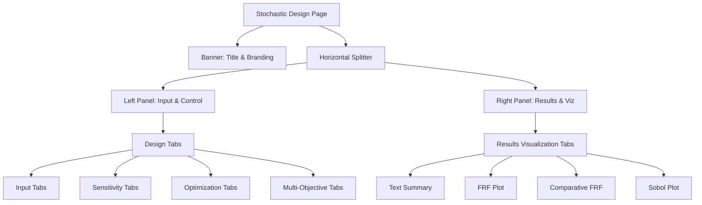

# DeVana GUI Components: A Modular Breakdown

## Overview
The DeVana user interface is designed for high-density engineering data entry and multi-faceted visualization. It follows a modular structure where major functional areas are isolated into their own UI pages and sub-tabs.

## 1. The Sidebar Navigation
The sidebar is the primary navigation hub, implemented in `SidebarMixin`.

| Button | Target Page | Description |
|--------|-------------|-------------|
| **Intro & Paradigm** | Introduction | High-level workflow and project mission. |
| **Stochastic Design** | Stochastic Design | The core optimization and analysis workspace. |
| **Microchip Controller** | Microchip | Specialized UI for microchip parameter control. |
| **Continuous Beam** | Continuous Beam | Interface for continuous system analysis. |
| **PINN Discretisizer** | PINN | Physics-Informed Neural Network configuration. |
| **REST API Access** | API Key | Headless server and API key management. |
| **CoPilot AI** | Drawer | Integrated AI assistant for engineering support. |

## 2. Stochastic Design Page (The Hub)
Implemented in `StochasticDesignMixin`, this page is a complex assembly of nested tabs and panels.

### UI Structure


#### Pseudo-code
```text
BEGIN
  EXECUTE Stochastic Design Page
  EXECUTE Banner: Title & Branding
  EXECUTE Horizontal Splitter
  EXECUTE Left Panel: Input & Control
  EXECUTE Right Panel: Results & Viz
  EXECUTE Design Tabs
  EXECUTE Input Tabs
  EXECUTE Sensitivity Tabs
  EXECUTE Optimization Tabs
  EXECUTE Multi-Objective Tabs
  EXECUTE Results Visualization Tabs
  EXECUTE Text Summary
  EXECUTE FRF Plot
  EXECUTE Comparative FRF
  EXECUTE Sobol Plot
END
```

### Input Sub-Tabs (`InputTabsMixin`)
- **Main System**: Global parameters ($\mu$, $\lambda_i$, $\nu_i$) and boundary conditions.
- **DVA Parameters**: Extensive grid of $\beta$, $\lambda$, $\mu$, and $\nu$ parameters for the Dynamic Vibration Absorbers.
- **Targets & Weights**: Granular objective definition for each mass, including peak positions, bandwidths, and slopes.
- **Frequency & Plot**: Frequency range $(\omega_{start}, \omega_{end})$ and resolution configuration.

## 3. Visualization Engine
DeVana uses `Matplotlib` with the `Qt5Agg` backend for all engineering plots.

### Key Plot Types:
1. **Frequency Response Function (FRF)**: Displays Magnitude vs. Frequency.
2. **Comparative FRF**: Overlays multiple optimization results for benchmarking.
3. **Sobol Sensitivity Indices**: Bar charts showing parameter influence on system behavior.
4. **Convergence Plots**: Track optimization progress (Fitness vs. Generation).

## 4. Custom Widgets (`codes/gui/widgets.py`)
- **`ModernQTabWidget`**: A styled `QTabWidget` that supports document mode, movable tabs, and scroll buttons for high-density tab environments.
- **`SidebarButton`**: An animated, icon-supported button designed for the sidebar, featuring hover effects and active state styling.

## 5. Theme Management
The `ThemeMixin` (and `ThemeMixin` in `main_window/`) provides global switching between **Dark** and **Light** modes. This affects:
- Background and foreground colors.
- Matplotlib plot styles (using `whitegrid` or custom dark styles).
- GroupBox and Card styling.
