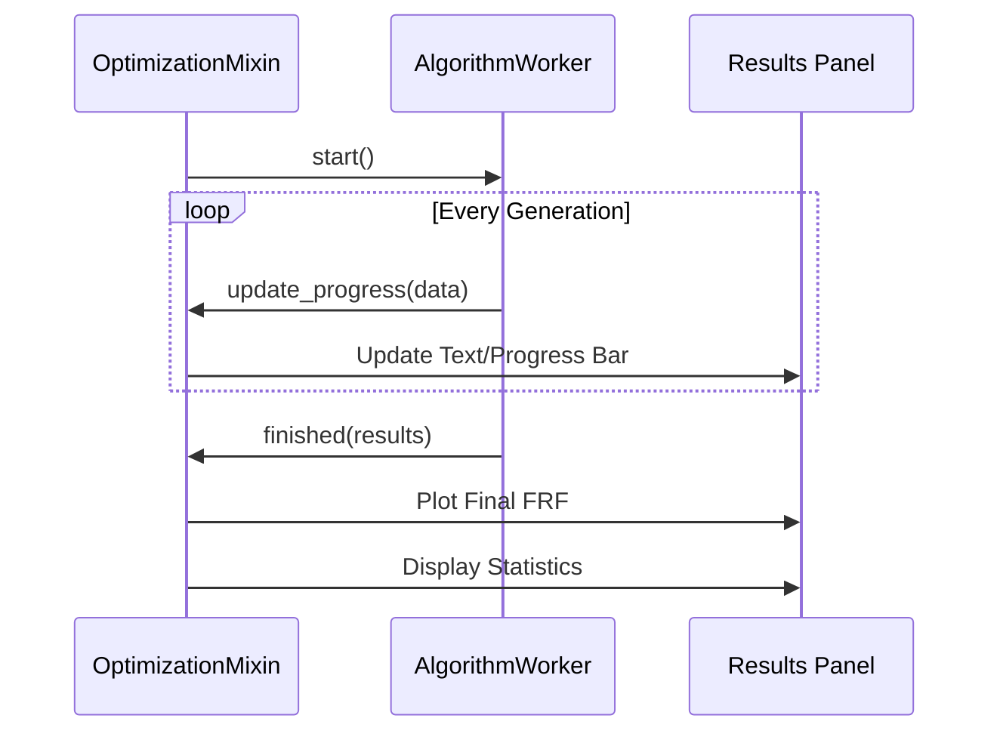

# DeVana Event Flow: Signal & Slot Architecture

## Overview
DeVana relies on the robust Signal/Slot mechanism of PyQt5 to handle user interactions and asynchronous data processing. The event flow is categorized into **Synchronous UI Transitions** and **Asynchronous Worker Execution**.

## 1. UI Navigation & Page Switching
Navigation events are triggered in the `SidebarMixin` and executed within the `MainWindow` orchestrator.

```mermaid
graph LR
    User["User Click"] -->|mousePressEvent| Sidebar["SidebarButton"]
    Sidebar -->|change_page("index")| Orchestrator["MainWindow"]
    Orchestrator -->|setCurrentIndex| Stack["QStackedWidget"]
    Stack -->|Trigger| Page["Target Page"]
    Page -->|Apply| Theme["Theme Refresh"]
```

#### Pseudo-code
```text
BEGIN
  EXECUTE User Click
  EXECUTE SidebarButton
  EXECUTE index
  EXECUTE MainWindow
  EXECUTE QStackedWidget
  EXECUTE Target Page
  EXECUTE Theme Refresh
END
```

## 2. Optimization Workflow (The Core Cycle)
The most critical event flow occurs when a user starts an optimization algorithm.

### Phase A: Setup & Launch
1. **User Action**: Click "Run GA" or "Run PSO".
2. **Parameter Collection**: The Mixin (e.g., `GAOptimizationMixin`) calls `get_main_system_params()` and `get_dva_params()` from `InputTabsMixin`.
3. **Worker Preparation**: The Mixin instantiates a `GAWorker` (or equivalent).
4. **Signal Connection**:
   - `worker.update_progress.connect(self.handle_progress)`
   - `worker.finished.connect(self.handle_finished)`
   - `worker.error.connect(self.handle_error)`

### Phase B: Asynchronous Execution
The worker runs in a separate thread.
1. **Physics Engine**: Calls `FRF.py` to calculate system response.
2. **Optimization Logic**: Executes the metaheuristic (DEAP, CMA, etc.).
3. **Progress Updates**: Periodically emits `update_progress` with the current best fitness and generation count.

### Phase C: UI Synchronization
The Mixin receives signals and updates the `results_text` and `frf_canvas`.



## 3. Comparative Visualization Flow
The Comparative FRF feature involves a complex data-gathering flow:
1. **Cache Results**: Every optimization run stores its results in `self.frf_plots` (a dictionary).
2. **User Selection**: User selects multiple results from the `available_plots_list`.
3. **Plot Update**: `StochasticDesignMixin.update_frf_plot()` clears the canvas and overlays the selected curves.

## 4. Error Handling & Feedback
Errors occurring in background threads are captured and emitted as signals.
- **Worker Level**: Exceptions are caught in the `run()` method.
- **Mixin Level**: The `handle_error` slot displays a `QMessageBox` and resets the "Run" button state to ensure the UI remains interactive.

## 5. Theme Sync Flow
When the user toggles the theme:
1. `SidebarMixin.toggle_theme()` is called.
2. It updates `self.current_theme`.
3. It calls `apply_dark_theme()` or `apply_light_theme()`.
4. These methods recursively apply stylesheets to all children (Sidebar, Tabs, Inputs, Plots).
