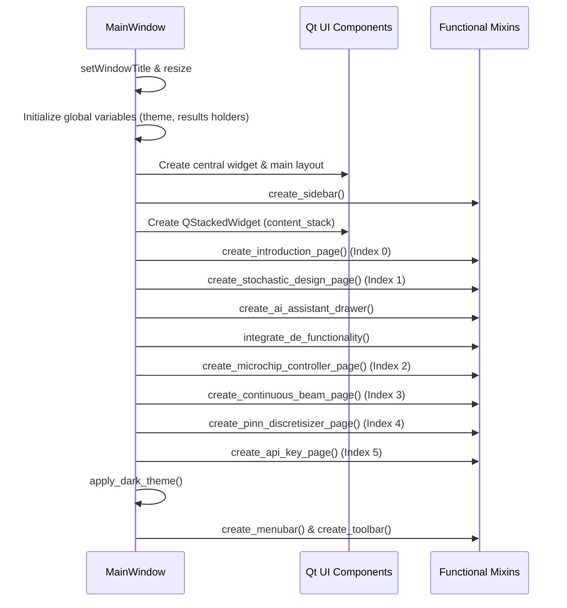

# Core Architecture: MainWindow

## Purpose
`MainWindow` is the central orchestrator of the DeVana application. It serves as the primary container for the GUI, managing the lifecycle of the window, coordinating between various functional Mixins, and handling the global application state. It bridges the UI with backend calculation engines and workers.

## Inheritance Structure
DeVana follows a "Super-Mixin" pattern where `MainWindow` inherits from dozens of specialized classes to aggregate functionality.

```mermaid
classDiagram
    class QMainWindow
    class MenuMixin
    class IntroductionMixin
    class ContinuousBeamMixin
    class MicrochipPageMixin
    class ThemeMixin
    class FRFMixin
    class PSOMixin
    class GAOptimizationMixin
    class InputTabsMixin
    class ExtraOptimizationMixin
    class SidebarMixin
    class StochasticDesignMixin
    class SobolAnalysisMixin
    class OmegaSensitivityMixin
    class AdaVEAOptimizationMixin
    class MOGAOptimizationMixin
    class PINNIdentificationMixin
    class AIAssistantMixin
    class ApiKeyMixin
    
    QMainWindow <|-- MainWindow
    MenuMixin <|-- MainWindow
    IntroductionMixin <|-- MainWindow
    ContinuousBeamMixin <|-- MainWindow
    MicrochipPageMixin <|-- MainWindow
    ThemeMixin <|-- MainWindow
    FRFMixin <|-- MainWindow
    PSOMixin <|-- MainWindow
    GAOptimizationMixin <|-- MainWindow
    InputTabsMixin <|-- MainWindow
    ExtraOptimizationMixin <|-- MainWindow
    SidebarMixin <|-- MainWindow
    StochasticDesignMixin <|-- MainWindow
    SobolAnalysisMixin <|-- MainWindow
    OmegaSensitivityMixin <|-- MainWindow
    AdaVEAOptimizationMixin <|-- MainWindow
    MOGAOptimizationMixin <|-- MainWindow
    PINNIdentificationMixin <|-- MainWindow
    AIAssistantMixin <|-- MainWindow
    ApiKeyMixin <|-- MainWindow
```



### Pseudo-code: Inheritance Map
```python
# Definition of MainWindow using multi-inheritance
class MainWindow(QMainWindow, MenuMixin, IntroductionMixin, ...):
    def __init__(self):
        super().__init__()
        # Initialize UI components from various Mixins
        self.create_sidebar()
        self.create_menubar()
        self.create_introduction_page()
        # ... and more
```

## Initialization Sequence
The `__init__` method of `MainWindow` performs a precise sequence of operations to set up the environment.



### Pseudo-code: Initialization Logic
```python
FUNCTION __init__():
    SET title = APP_NAME + version
    SET window_size = 1600x900
    
    # UI Layout setup
    CREATE central_widget
    SET main_layout = QHBoxLayout(central_widget)
    
    # Component Generation
    CALL create_sidebar()
    CREATE content_stack = QStackedWidget()
    
    # Page Creation (Ordering is critical for StackedWidget indices)
    CALL create_introduction_page()      # Index 0
    CALL create_stochastic_design_page() # Index 1
    CALL integrate_de_functionality()   # Dynamic binding for DE
    CALL create_microchip_controller_page() # Index 2
    
    # Global State
    CALL apply_dark_theme()
    CALL create_menubar()
    CALL create_toolbar()
END FUNCTION
```

## Significant Methods

### `integrate_de_functionality(self)`
- **Purpose**: Dynamically attaches methods from `DEOptimizationMixin` to the `MainWindow` instance and sets up the DE UI tab.
- **Logic**: 
    1. Creates a temporary instance of `DEOptimizationMixin`.
    2. Iterates through a predefined list of methods (`run_de`, `handle_de_progress`, etc.).
    3. Uses `types.MethodType` to bind these methods to the current `MainWindow` instance.
    4. Manually adds the DE tab to the `optimization_tabs` widget.
- **Outputs**: Bound methods on `self` and a new tab in the UI.

### `set_default_values(self)`
- **Purpose**: Resets all UI inputs across all mixins to their baseline engineering values.
- **Parameters**: None.
- **Logic**: Hardcodes default values for PSO, FRF, and DVA parameters. Clears previous results and plots.

### `get_calculation_config(self)`
- **Purpose**: Aggregates the engine settings (PINN vs Physics) for worker threads.
- **Outputs**: Dictionary containing `use_pinn`, `pinn_model_path`, and `pinn_online_learning`.

### `open_playground_clone(self)`
- **Purpose**: Implements the "Playground" feature, allowing users to spawn independent, cloned instances of the application for side-by-side comparison of different optimization runs.

## Signal/Slot Registry Integration
`MainWindow` acts as the primary receiver for signals from Workers (e.g., `ga_worker.progress`, `pso_worker.finished`). It routes these signals to the corresponding Mixin methods to update the UI.
