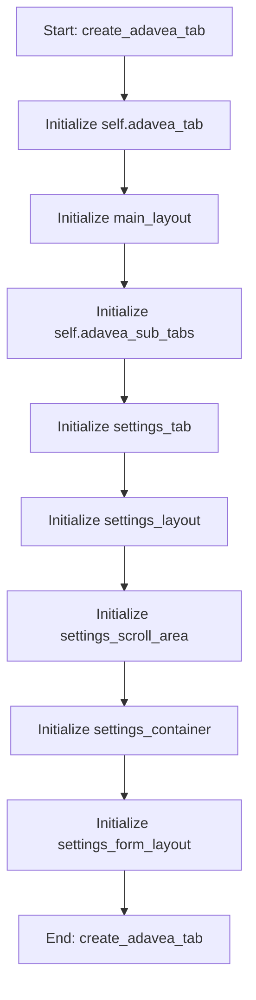

# AdaVEAOptimizationMixin

## Purpose
Core implementation of AdaVEAOptimizationMixin logic.

## Internal Logic Flow: `create_adavea_tab`


### Flowchart Pseudo-code
```python
FUNCTION create_adavea_tab(self):
    DO "Initialize self.adavea_tab"
    DO "Initialize main_layout"
    DO "Initialize self.adavea_sub_tabs"
    DO "Initialize settings_tab"
    DO "Initialize settings_layout"
    DO "Initialize settings_scroll_area"
    DO "Initialize settings_container"
    DO "Initialize settings_form_layout"
END FUNCTION
```

## Methods & Functions

### `create_adavea_tab`
- **Arguments**: `self`
- **Returns**: `None`
- **Logic**: Assigns self.adavea_tab; Assigns main_layout; Assigns self.adavea_sub_tabs; Assigns settings_tab; Assigns settings_layout...

### `run_adavea`
- **Arguments**: `self`
- **Returns**: `None`
- **Logic**: Conditional: self.adavea_worker_thread and ; Assigns self.adavea_all_runs_results; Assigns pop_size; Assigns generations; Assigns cxpb...

### `adavea_finished_wrapper`
- **Arguments**: `self, all_runs_data`
- **Returns**: `None`
- **Logic**: Simple function logic.

### `pause_adavea`
- **Arguments**: `self`
- **Returns**: `None`
- **Logic**: Conditional: self.adavea_worker

### `resume_adavea`
- **Arguments**: `self`
- **Returns**: `None`
- **Logic**: Conditional: self.adavea_worker

### `stop_adavea`
- **Arguments**: `self`
- **Returns**: `None`
- **Logic**: Conditional: self.adavea_worker

### `update_adavea_progress`
- **Arguments**: `self, run_idx, current_gen, total_gens, metrics`
- **Returns**: `None`
- **Logic**: Assigns total_progress

### `adavea_finished`
- **Arguments**: `self, all_runs_data`
- **Returns**: `None`
- **Logic**: Assigns self.adavea_all_runs_results

### `adavea_error`
- **Arguments**: `self, message`
- **Returns**: `None`
- **Logic**: Simple function logic.

### `reset_adavea_buttons`
- **Arguments**: `self`
- **Returns**: `None`
- **Logic**: Simple function logic.

### `display_adavea_results`
- **Arguments**: `self`
- **Returns**: `None`
- **Logic**: Conditional: not self.adavea_all_runs_resul; Assigns summary_text; Assigns final_hvs; Assigns final_igds; Assigns final_gds...

### `plot_adavea_convergence`
- **Arguments**: `self`
- **Returns**: `None`
- **Logic**: Assigns ax; Conditional: not self.adavea_all_runs_resul; Assigns hv_data_per_run; Loops over self.adavea_all_runs_results; Conditional: not hv_data_per_run or not hv_...

### `plot_adavea_pareto_3d`
- **Arguments**: `self`
- **Returns**: `None`
- **Logic**: Assigns ax; Conditional: not self.adavea_all_runs_resul; Assigns final_pareto_objectives; Conditional: self.adavea_all_runs_results; Conditional: not final_pareto_objectives...

### `plot_adavea_boxplot`
- **Arguments**: `self`
- **Returns**: `None`
- **Logic**: Conditional: not self.adavea_all_runs_resul; Assigns final_hvs; Assigns final_igds; Assigns final_pareto_sizes; Assigns final_times...

### `plot_adavea_pareto_2d`
- **Arguments**: `self`
- **Returns**: `None`
- **Logic**: Conditional: not self.adavea_all_runs_resul; Assigns final_pareto_objectives; Conditional: self.adavea_all_runs_results; Conditional: not final_pareto_objectives; Assigns objectives_array...

### `plot_adavea_robustness`
- **Arguments**: `self`
- **Returns**: `None`
- **Logic**: Assigns ax; Conditional: not self.adavea_all_runs_resul; Loops over enumerate(self.adavea_all_runs; Assigns hv_data_per_run; Loops over self.adavea_all_runs_results...

### `export_adavea_metrics`
- **Arguments**: `self`
- **Returns**: `None`
- **Logic**: Conditional: not self.adavea_all_runs_resul; Assigns (path, _); Conditional: path

### `export_adavea_pareto`
- **Arguments**: `self`
- **Returns**: `None`
- **Logic**: Conditional: not self.adavea_all_runs_resul; Assigns (path, _); Conditional: path

