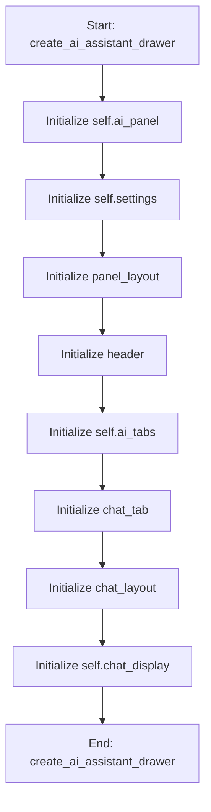

# AIAssistantMixin

## Purpose
Mixin for the DeVana AI CoPilot (Assistant B).
Handles chat interface, state bridge, and model settings.

## Internal Logic Flow: `create_ai_assistant_drawer`


### Flowchart Pseudo-code
```python
FUNCTION create_ai_assistant_drawer(self):
    DO "Initialize self.ai_panel"
    DO "Initialize self.settings"
    DO "Initialize panel_layout"
    DO "Initialize header"
    DO "Initialize self.ai_tabs"
    DO "Initialize chat_tab"
    DO "Initialize chat_layout"
    DO "Initialize self.chat_display"
END FUNCTION
```

## Methods & Functions

### `create_ai_assistant_drawer`
- **Arguments**: `self`
- **Returns**: `None`
- **Logic**: Assigns self.ai_panel; Assigns self.settings; Assigns panel_layout; Assigns header; Assigns self.ai_tabs...

### `fetch_gemini_models`
- **Arguments**: `self`
- **Returns**: `None`
- **Logic**: Assigns api_key; Conditional: not api_key; Conditional: not GENAI_AVAILABLE

### `update_model_list`
- **Arguments**: `self, models`
- **Returns**: `None`
- **Logic**: Conditional: not models; Assigns current; Conditional: current in models

### `save_ai_settings`
- **Arguments**: `self`
- **Returns**: `None`
- **Logic**: Simple function logic.

### `collect_system_state`
- **Arguments**: `self`
- **Returns**: `Dict[str, Any]`
- **Logic**: Assigns state; Returns result

### `send_ai_query`
- **Arguments**: `self`
- **Returns**: `None`
- **Logic**: Assigns query; Conditional: not query; Assigns api_key; Assigns model_name; Assigns doc_context...

### `handle_ai_response`
- **Arguments**: `self, text`
- **Returns**: `None`
- **Logic**: Simple function logic.

