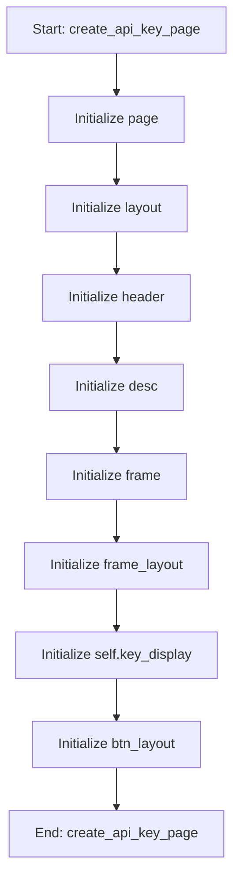

# ApiKeyMixin

## Purpose
Mixin to add API Key management to the MainWindow.

## Internal Logic Flow: `create_api_key_page`


### Flowchart Pseudo-code
```python
FUNCTION create_api_key_page(self):
    DO "Initialize page"
    DO "Initialize layout"
    DO "Initialize header"
    DO "Initialize desc"
    DO "Initialize frame"
    DO "Initialize frame_layout"
    DO "Initialize self.key_display"
    DO "Initialize btn_layout"
END FUNCTION
```

## Methods & Functions

### `create_api_key_page`
- **Arguments**: `self`
- **Returns**: `None`
- **Logic**: Assigns page; Assigns layout; Assigns header; Assigns desc; Assigns frame...

### `handle_generate_key`
- **Arguments**: `self`
- **Returns**: `None`
- **Logic**: Assigns new_key

### `handle_copy_key`
- **Arguments**: `self`
- **Returns**: `None`
- **Logic**: Assigns key; Conditional: key

