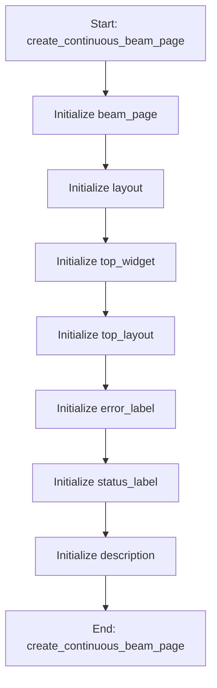

# ContinuousBeamMixin

## Purpose
Core implementation of ContinuousBeamMixin logic.

## Internal Logic Flow: `create_continuous_beam_page`


### Flowchart Pseudo-code
```python
FUNCTION create_continuous_beam_page(self):
    DO "Initialize beam_page"
    DO "Initialize layout"
    DO "Initialize top_widget"
    DO "Initialize top_layout"
    DO "Initialize error_label"
    DO "Initialize status_label"
    DO "Initialize description"
END FUNCTION
```

## Methods & Functions

### `create_continuous_beam_page`
- **Arguments**: `self`
- **Returns**: `None`
- **Logic**: Assigns beam_page; Assigns layout; Assigns top_widget; Assigns top_layout; Assigns error_label...

