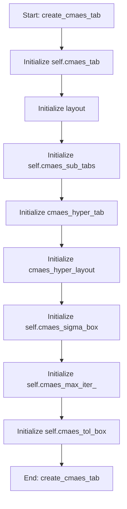

# CMAESOptimizationMixin

## Purpose
Core implementation of CMAESOptimizationMixin logic.

## Internal Logic Flow: `create_cmaes_tab`


### Flowchart Pseudo-code
```python
FUNCTION create_cmaes_tab(self):
    DO "Initialize self.cmaes_tab"
    DO "Initialize layout"
    DO "Initialize self.cmaes_sub_tabs"
    DO "Initialize cmaes_hyper_tab"
    DO "Initialize cmaes_hyper_layout"
    DO "Initialize self.cmaes_sigma_box"
    DO "Initialize self.cmaes_max_iter_"
    DO "Initialize self.cmaes_tol_box"
END FUNCTION
```

## Methods & Functions

### `create_cmaes_tab`
- **Arguments**: `self`
- **Returns**: `None`
- **Logic**: Assigns self.cmaes_tab; Assigns layout; Assigns self.cmaes_sub_tabs; Assigns cmaes_hyper_tab; Assigns cmaes_hyper_layout...

### `toggle_cmaes_fixed`
- **Arguments**: `self, state, row, table`
- **Returns**: `None`
- **Logic**: Conditional: table is None; Assigns fixed; Assigns fixed_value_spin; Assigns lower_bound_spin; Assigns upper_bound_spin

### `run_cmaes`
- **Arguments**: `self`
- **Returns**: `None`
- **Logic**: Simple function logic.

### `handle_cmaes_finished`
- **Arguments**: `self, results, best_candidate, parameter_names, best_fitness`
- **Returns**: `None`
- **Logic**: Loops over zip(parameter_names, best_cand; Assigns singular_response; Conditional: singular_response is not None; Loops over results.items()

### `handle_cmaes_error`
- **Arguments**: `self, err`
- **Returns**: `None`
- **Logic**: Simple function logic.

### `handle_cmaes_update`
- **Arguments**: `self, msg`
- **Returns**: `None`
- **Logic**: Simple function logic.

