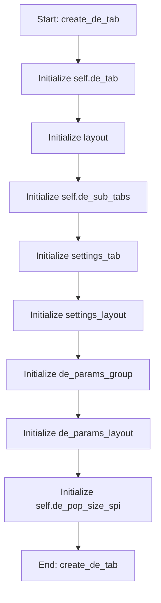

# DEOptimizationMixin

## Purpose
Core implementation of DEOptimizationMixin logic.

## Internal Logic Flow: `create_de_tab`


### Flowchart Pseudo-code
```python
FUNCTION create_de_tab(self):
    DO "Initialize self.de_tab"
    DO "Initialize layout"
    DO "Initialize self.de_sub_tabs"
    DO "Initialize settings_tab"
    DO "Initialize settings_layout"
    DO "Initialize de_params_group"
    DO "Initialize de_params_layout"
    DO "Initialize self.de_pop_size_spi"
END FUNCTION
```

## Methods & Functions

### `create_de_tab`
- **Arguments**: `self`
- **Returns**: `None`
- **Logic**: Assigns self.de_tab; Assigns layout; Assigns self.de_sub_tabs; Assigns settings_tab; Assigns settings_layout...

### `initialize_de_parameter_table`
- **Arguments**: `self`
- **Returns**: `None`
- **Logic**: Simple function logic.

### `get_parameter_data`
- **Arguments**: `self`
- **Returns**: `None`
- **Logic**: Assigns parameter_data; Loops over range(1, 16); Loops over range(1, 16); Loops over range(1, 4); Loops over range(1, 16)...

### `toggle_de_fixed`
- **Arguments**: `self, state, row, table`
- **Returns**: `None`
- **Logic**: Conditional: table is None; Assigns fixed; Assigns lower_bound_item; Assigns upper_bound_item; Conditional: fixed

### `toggle_de_dva_fixed`
- **Arguments**: `self, state, row, table`
- **Returns**: `None`
- **Logic**: Conditional: table is None; Assigns fixed; Assigns fixed_value_spin; Assigns lower_bound_spin; Assigns upper_bound_spin...

### `run_de`
- **Arguments**: `self`
- **Returns**: `None`
- **Logic**: Simple function logic.

### `handle_de_progress`
- **Arguments**: `self, generation, best_fitness, diversity`
- **Returns**: `None`
- **Logic**: Simple function logic.

### `update_de_visualization`
- **Arguments**: `self`
- **Returns**: `None`
- **Logic**: Simple function logic.

### `handle_de_multi_run_progress`
- **Arguments**: `self, current_run, total_runs`
- **Returns**: `None`
- **Logic**: Simple function logic.

### `handle_de_finished`
- **Arguments**: `self, results, best_individual, parameter_names, best_fitness, statistics`
- **Returns**: `None`
- **Logic**: Simple function logic.

### `create_de_final_visualization`
- **Arguments**: `self, statistics, parameter_names`
- **Returns**: `None`
- **Logic**: Simple function logic.

### `save_de_visualization`
- **Arguments**: `self`
- **Returns**: `None`
- **Logic**: Simple function logic.

### `export_de_results_to_file`
- **Arguments**: `self`
- **Returns**: `None`
- **Logic**: Simple function logic.

### `visualize_de_benchmark_results`
- **Arguments**: `self, stats`
- **Returns**: `None`
- **Logic**: Simple function logic.

### `handle_de_error`
- **Arguments**: `self, error_msg`
- **Returns**: `None`
- **Logic**: Simple function logic.

### `handle_de_update`
- **Arguments**: `self, msg`
- **Returns**: `None`
- **Logic**: Simple function logic.

### `tune_de_hyperparameters`
- **Arguments**: `self`
- **Returns**: `None`
- **Logic**: Assigns reply; Conditional: reply == QMessageBox.No

### `_apply_tuning_results`
- **Arguments**: `self, best_params, dialog`
- **Returns**: `None`
- **Logic**: Conditional: not best_params; Conditional: 'strategy' in best_params

