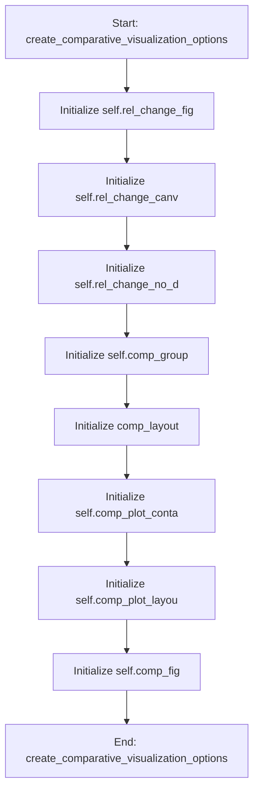

# FRFMixin

## Purpose
Core implementation of FRFMixin logic.

## Internal Logic Flow: `create_comparative_visualization_options`


### Flowchart Pseudo-code
```python
FUNCTION create_comparative_visualization_options(self, parent_layout):
    DO "Initialize self.rel_change_fig"
    DO "Initialize self.rel_change_canv"
    DO "Initialize self.rel_change_no_d"
    DO "Initialize self.comp_group"
    DO "Initialize comp_layout"
    DO "Initialize self.comp_plot_conta"
    DO "Initialize self.comp_plot_layou"
    DO "Initialize self.comp_fig"
END FUNCTION
```

## Methods & Functions

### `__init__`
- **Arguments**: `self`
- **Returns**: `None`
- **Logic**: Assigns self.plot_window; Assigns self.comp_canvas; Assigns self.comp_toolbar; Assigns self.comp_fig; Assigns self.zones

### `create_comparative_visualization_options`
- **Arguments**: `self, parent_layout`
- **Returns**: `None`
- **Logic**: Assigns self.rel_change_fig; Assigns self.rel_change_canvas; Assigns self.rel_change_no_data_label; Assigns self.comp_group; Assigns comp_layout...

### `_update_legend_table_from_selection`
- **Arguments**: `self`
- **Returns**: `None`
- **Logic**: Assigns selected_items; Conditional: not selected_items; Loops over enumerate(selected_items)

### `_choose_color`
- **Arguments**: `self, row`
- **Returns**: `None`
- **Logic**: Assigns color_button; Assigns color_dialog; Conditional: color_dialog.exec_()

### `clear_all_frf_plots`
- **Arguments**: `self`
- **Returns**: `None`
- **Logic**: Assigns self.legend_map; Conditional: hasattr(self, 'zones')

### `export_frf_data`
- **Arguments**: `self`
- **Returns**: `None`
- **Logic**: Conditional: self.available_plots_list.coun; Assigns (filename, _); Conditional: not filename; Assigns export_data; Loops over range(self.available_plots_lis

### `import_frf_data`
- **Arguments**: `self`
- **Returns**: `None`
- **Logic**: Assigns (filename, _); Conditional: not filename

### `add_zone`
- **Arguments**: `self`
- **Returns**: `None`
- **Logic**: Conditional: not hasattr(self, 'zones'); Assigns dialog; Assigns layout; Assigns name_layout; Assigns name_label...

### `remove_zone`
- **Arguments**: `self`
- **Returns**: `None`
- **Logic**: Conditional: not hasattr(self, 'zones'); Assigns current_row; Conditional: current_row >= 0 and current_r

### `clear_all_zones`
- **Arguments**: `self`
- **Returns**: `None`
- **Logic**: Conditional: not hasattr(self, 'zones')

### `_update_zone_table`
- **Arguments**: `self`
- **Returns**: `None`
- **Logic**: Conditional: not hasattr(self, 'zones'); Loops over enumerate(self.zones)

### `_add_zone_highlights`
- **Arguments**: `self, ax`
- **Returns**: `None`
- **Logic**: Conditional: not hasattr(self, 'zones'); Assigns (y_min, y_max); Loops over self.zones

### `_is_dark_color`
- **Arguments**: `self, color`
- **Returns**: `None`
- **Logic**: Conditional: color.startswith('#'); Assigns luminance; Returns result

### `create_sobol_analysis_tab`
- **Arguments**: `self`
- **Returns**: `None`
- **Logic**: Returns result

### `run_frf`
- **Arguments**: `self`
- **Returns**: `None`
- **Logic**: Conditional: self.omega_start_box.value() >; Assigns main_params; Assigns dva_params; Loops over range(15); Loops over range(15)...

### `handle_frf_finished`
- **Arguments**: `self, results_with_dva, results_without_dva`
- **Returns**: `None`
- **Logic**: Assigns self.frf_results; Assigns key_params; Assigns main_params; Conditional: len(main_params) >= 2; Assigns dva_params...

### `handle_frf_error`
- **Arguments**: `self, err`
- **Returns**: `None`
- **Logic**: Simple function logic.

### `run_sobol`
- **Arguments**: `self`
- **Returns**: `None`
- **Logic**: Simple function logic.

### `run_sa`
- **Arguments**: `self`
- **Returns**: `None`
- **Logic**: Simple function logic.

### `update_frf_plot`
- **Arguments**: `self`
- **Returns**: `None`
- **Logic**: Assigns key; Conditional: key in self.frf_plots

### `save_plot`
- **Arguments**: `self, figure, plot_type`
- **Returns**: `None`
- **Logic**: Conditional: figure is None; Assigns options; Assigns file_types; Assigns default_name; Assigns (file_path, selected_filter)...

### `save_sobol_results`
- **Arguments**: `self`
- **Returns**: `None`
- **Logic**: Simple function logic.

### `create_comparative_plot`
- **Arguments**: `self`
- **Returns**: `None`
- **Logic**: Assigns selected_items; Conditional: not selected_items; Assigns ax; Loops over range(self.legend_table.rowCou; Conditional: hasattr(self, 'zones') and sel...

