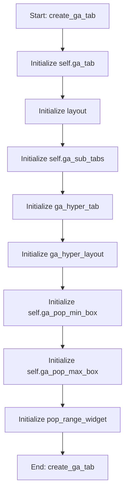

# GAOptimizationMixin

## Purpose
Core implementation of GAOptimizationMixin logic.

## Internal Logic Flow: `create_ga_tab`


### Flowchart Pseudo-code
```python
FUNCTION create_ga_tab(self):
    DO "Initialize self.ga_tab"
    DO "Initialize layout"
    DO "Initialize self.ga_sub_tabs"
    DO "Initialize ga_hyper_tab"
    DO "Initialize ga_hyper_layout"
    DO "Initialize self.ga_pop_min_box"
    DO "Initialize self.ga_pop_max_box"
    DO "Initialize pop_range_widget"
END FUNCTION
```

## Methods & Functions

### `_ensure_frf_overlay_state`
- **Arguments**: `self`
- **Returns**: `None`
- **Logic**: Conditional: not hasattr(self, '_frf_group_; Conditional: not hasattr(self, '_frf_overla; Conditional: not hasattr(self, '_frf_select; Conditional: not hasattr(self, '_frf_baseli

### `_build_group_frf_overlay_tab`
- **Arguments**: `self, plot_tabs, df`
- **Returns**: `None`
- **Logic**: Assigns frf_tab; Assigns frf_layout; Assigns ctrl_group; Assigns ctrl_layout; Assigns self.frf_mass_combo...

### `_frf_auto_select_runs_from_df`
- **Arguments**: `self, df`
- **Returns**: `None`
- **Logic**: Assigns groups; Assigns counts; Assigns selected; Conditional: not selected; Conditional: 0 not in selected...

### `_refresh_frf_selected_runs_table`
- **Arguments**: `self, df`
- **Returns**: `None`
- **Logic**: Assigns by_run; Assigns tbl; Loops over enumerate(self._frf_selected_r

### `_frf_move_selected_row`
- **Arguments**: `self, delta, df`
- **Returns**: `None`
- **Logic**: Assigns row; Conditional: row < 0 or row >= len(self._fr; Assigns new_row; Conditional: new_row < 0 or new_row >= len(; Assigns (self._frf_selected_runs[row], self._frf_selected_runs[new_row])

### `_frf_remove_selected_run`
- **Arguments**: `self, df`
- **Returns**: `None`
- **Logic**: Assigns row; Conditional: row < 0 or row >= len(self._fr

### `_frf_add_run_via_dialog`
- **Arguments**: `self, df`
- **Returns**: `None`
- **Logic**: Assigns all_runs; Assigns avail; Conditional: not avail; Assigns dlg; Assigns lay...

### `_frf_region_row_to_dict`
- **Arguments**: `self, row`
- **Returns**: `None`
- **Logic**: Assigns name; Assigns start_x; Assigns end_x; Assigns color_item; Assigns color...

### `_refresh_frf_region_table`
- **Arguments**: `self`
- **Returns**: `None`
- **Logic**: Assigns tbl; Loops over enumerate(self._frf_overlay_re

### `_sync_regions_from_table_and_replot`
- **Arguments**: `self, df`
- **Returns**: `None`
- **Logic**: Assigns regs; Loops over range(self.frf_region_table.ro; Assigns self._frf_overlay_regions

### `_frf_add_region_and_replot`
- **Arguments**: `self, df`
- **Returns**: `None`
- **Logic**: Simple function logic.

### `_frf_remove_selected_region_and_replot`
- **Arguments**: `self, df`
- **Returns**: `None`
- **Logic**: Assigns row; Conditional: row >= 0 and row < len(self._f

### `_frf_clear_regions_and_replot`
- **Arguments**: `self, df`
- **Returns**: `None`
- **Logic**: Assigns self._frf_overlay_regions

### `_on_frf_region_cell_double_clicked`
- **Arguments**: `self, row, col`
- **Returns**: `None`
- **Logic**: Simple function logic.

### `_last_group_summary_df_placeholder`
- **Arguments**: `self`
- **Returns**: `None`
- **Logic**: Returns result

### `_get_main_params_targets_weights`
- **Arguments**: `self`
- **Returns**: `None`
- **Logic**: Simple function logic.

### `_get_frf_mag_for_run_and_mass`
- **Arguments**: `self, run_record, mass_key`
- **Returns**: `None`
- **Logic**: Assigns rn; Assigns cache; Conditional: mass_key in cache; Assigns (main_params, target_values, weights, omega_start, omega_end, omega_points); Conditional: main_params is None or target_...

### `_get_frf_mag_for_zero_dva`
- **Arguments**: `self, mass_key`
- **Returns**: `None`
- **Logic**: Conditional: mass_key in self._frf_baseline; Assigns (main_params, target_values, weights, omega_start, omega_end, omega_points); Conditional: main_params is None or target_; Assigns ZERO_DVA_LEN; Assigns dva_tuple

### `_update_group_frf_overlay_plot`
- **Arguments**: `self, df`
- **Returns**: `None`
- **Logic**: Assigns ax; Assigns mass_key; Assigns group_colors; Conditional: not self._frf_selected_runs; Assigns grouped...

### `_attach_open_in_new_window`
- **Arguments**: `self, toolbar, fig, title`
- **Returns**: `None`
- **Logic**: Simple function logic.

### `_get_ga_parameters_from_table`
- **Arguments**: `self`
- **Returns**: `None`
- **Logic**: Assigns params; Returns result

### `_apply_ranges_to_ga_table`
- **Arguments**: `self, ranges_by_name`
- **Returns**: `None`
- **Logic**: Simple function logic.

### `_build_current_ga_config_with_ranges`
- **Arguments**: `self, source_table`
- **Returns**: `None`
- **Logic**: Simple function logic.

### `import_ga_config`
- **Arguments**: `self`
- **Returns**: `None`
- **Logic**: Simple function logic.

### `export_ga_config`
- **Arguments**: `self`
- **Returns**: `None`
- **Logic**: Simple function logic.

### `_extract_cell_text`
- **Arguments**: `self, table, row, col`
- **Returns**: `None`
- **Logic**: Simple function logic.

### `_qtable_to_dataframe`
- **Arguments**: `self, table, selected_only`
- **Returns**: `None`
- **Logic**: Simple function logic.

### `_save_dataframe_to_path`
- **Arguments**: `self, df, file_path`
- **Returns**: `None`
- **Logic**: Simple function logic.

### `_export_table_via_dialog`
- **Arguments**: `self, table, default_basename, selected_only, forced_ext`
- **Returns**: `None`
- **Logic**: Simple function logic.

### `_show_table_context_menu`
- **Arguments**: `self, table, default_basename, pos`
- **Returns**: `None`
- **Logic**: Simple function logic.

### `_copy_table_selection_to_clipboard`
- **Arguments**: `self, table`
- **Returns**: `None`
- **Logic**: Simple function logic.

### `_attach_table_export`
- **Arguments**: `self, table, default_basename`
- **Returns**: `None`
- **Logic**: Simple function logic.

### `create_ga_tab`
- **Arguments**: `self`
- **Returns**: `None`
- **Logic**: Assigns self.ga_tab; Assigns layout; Assigns self.ga_sub_tabs; Assigns ga_hyper_tab; Assigns ga_hyper_layout...

### `toggle_fixed`
- **Arguments**: `self, state, row, table`
- **Returns**: `None`
- **Logic**: Conditional: table is None; Assigns fixed; Assigns fixed_value_spin; Assigns lower_bound_spin; Assigns upper_bound_spin

### `toggle_ga_fixed`
- **Arguments**: `self, state, row, table`
- **Returns**: `None`
- **Logic**: Conditional: table is None; Assigns fixed; Assigns fixed_value_spin; Assigns lower_bound_spin; Assigns upper_bound_spin...

### `toggle_adaptive_rates_options`
- **Arguments**: `self, state`
- **Returns**: `None`
- **Logic**: Conditional: state == Qt.Checked

### `_get_current_ga_param_config`
- **Arguments**: `self`
- **Returns**: `None`
- **Logic**: Assigns param_names; Assigns bounds; Assigns fixed_flags; Assigns fixed_values; Assigns name_to_row...

### `_render_figure_into_widget`
- **Arguments**: `self, target_widget, fig, include_toolbar`
- **Returns**: `None`
- **Logic**: Assigns layout; Conditional: layout is None; Assigns canvas; Conditional: include_toolbar

### `run_random_validation`
- **Arguments**: `self`
- **Returns**: `None`
- **Logic**: Conditional: hasattr(self, '_rv_worker') an; Conditional: self.omega_start_box.value() >; Assigns self.rv_frf_curves; Assigns self.rv_frf_omega; Assigns main_params...

### `cancel_random_validation`
- **Arguments**: `self`
- **Returns**: `None`
- **Logic**: Conditional: hasattr(self, '_rv_worker') an

### `_handle_random_validation_finished`
- **Arguments**: `self, payload`
- **Returns**: `None`
- **Logic**: Assigns self._rv_worker; Assigns df; Assigns frf_curves; Assigns omega_vector; Conditional: isinstance(payload, dict) and ...

### `_rv_frf_populate_run_list`
- **Arguments**: `self, df, preserve_selection`
- **Returns**: `None`
- **Logic**: Conditional: not hasattr(self, 'rv_frf_run_; Conditional: df is None or getattr(df, 'emp; Loops over sorted_df.iterrows(); Conditional: preserve_selection and current

### `_rv_frf_select_top`
- **Arguments**: `self, count`
- **Returns**: `None`
- **Logic**: Conditional: not hasattr(self, 'rv_frf_run_; Loops over range(self.rv_frf_run_list.cou; Loops over range(min(count, self.rv_frf_r

### `_rv_frf_clear_selection`
- **Arguments**: `self`
- **Returns**: `None`
- **Logic**: Conditional: not hasattr(self, 'rv_frf_run_; Loops over range(self.rv_frf_run_list.cou

### `update_random_validation_frf_plot`
- **Arguments**: `self`
- **Returns**: `None`
- **Logic**: Conditional: not hasattr(self, 'rv_frf_plot; Assigns omega; Conditional: omega is not None; Assigns mass_combo; Assigns mass_key...

### `_rv_frf_add_zone`
- **Arguments**: `self`
- **Returns**: `None`
- **Logic**: Simple function logic.

### `_rv_frf_remove_zone`
- **Arguments**: `self`
- **Returns**: `None`
- **Logic**: Simple function logic.

### `_rv_frf_clear_zones`
- **Arguments**: `self`
- **Returns**: `None`
- **Logic**: Simple function logic.

### `_update_zone_table`
- **Arguments**: `self`
- **Returns**: `None`
- **Logic**: Conditional: not hasattr(self, 'zones'); Assigns tbl; Conditional: tbl is None

### `update_random_validation_scatter`
- **Arguments**: `self`
- **Returns**: `None`
- **Logic**: Conditional: self.rv_results_df is None or ; Assigns param; Conditional: not param; Assigns df; Assigns fig...

### `export_random_validation_results`
- **Arguments**: `self`
- **Returns**: `None`
- **Logic**: Conditional: self.rv_results_df is None or ; Assigns (path, _); Conditional: path

### `refresh_random_validation_views`
- **Arguments**: `self`
- **Returns**: `None`
- **Logic**: Simple function logic.

### `update_random_validation_kde`
- **Arguments**: `self`
- **Returns**: `None`
- **Logic**: Simple function logic.

### `_rv_kde_update_zone_table`
- **Arguments**: `self`
- **Returns**: `None`
- **Logic**: Conditional: not hasattr(self, 'zones'); Assigns self._rv_kde_updating_table

### `_rv_kde_on_zone_cell_changed`
- **Arguments**: `self, item`
- **Returns**: `None`
- **Logic**: Conditional: self._rv_kde_updating_table

### `_rv_kde_add_zone`
- **Arguments**: `self`
- **Returns**: `None`
- **Logic**: Simple function logic.

### `_rv_kde_remove_zone`
- **Arguments**: `self`
- **Returns**: `None`
- **Logic**: Simple function logic.

### `_rv_kde_clear_zones`
- **Arguments**: `self`
- **Returns**: `None`
- **Logic**: Simple function logic.

### `toggle_ga_fixed`
- **Arguments**: `self, state, row, table`
- **Returns**: `None`
- **Logic**: Conditional: table is None; Assigns fixed; Assigns fixed_value_spin; Assigns lower_bound_spin; Assigns upper_bound_spin...

### `toggle_adaptive_rates_options`
- **Arguments**: `self, state`
- **Returns**: `None`
- **Logic**: Conditional: state == Qt.Checked

### `run_ga`
- **Arguments**: `self`
- **Returns**: `None`
- **Logic**: Conditional: hasattr(self, 'ga_worker') and; Conditional: self.omega_start_box.value() >; Assigns (target_values, weights); Assigns pop_size; Assigns num_gen...

### `pause_ga`
- **Arguments**: `self`
- **Returns**: `None`
- **Logic**: Conditional: hasattr(self, 'ga_worker') and

### `resume_ga`
- **Arguments**: `self`
- **Returns**: `None`
- **Logic**: Conditional: hasattr(self, 'ga_worker') and

### `stop_ga`
- **Arguments**: `self`
- **Returns**: `None`
- **Logic**: Conditional: hasattr(self, 'ga_worker') and

### `check_ga_worker_health`
- **Arguments**: `self`
- **Returns**: `None`
- **Logic**: Conditional: hasattr(self, 'ga_worker') and

### `update_ga_progress`
- **Arguments**: `self, value`
- **Returns**: `None`
- **Logic**: Conditional: hasattr(self, 'ga_progress_bar

### `handle_ga_finished`
- **Arguments**: `self, results, best_ind, parameter_names, best_fitness`
- **Returns**: `None`
- **Logic**: Conditional: hasattr(self, 'ga_watchdog_tim; Conditional: hasattr(self, 'benchmark_runs'; Conditional: hasattr(self, 'export_ga_resul; Conditional: not hasattr(self, 'benchmark_r; Conditional: isinstance(results, dict) and ...

### `handle_ga_error`
- **Arguments**: `self, error_msg`
- **Returns**: `None`
- **Logic**: Conditional: hasattr(self, 'ga_watchdog_tim; Conditional: hasattr(self, 'ga_progress_bar; Conditional: hasattr(self, 'ga_worker')

### `handle_ga_update`
- **Arguments**: `self, msg`
- **Returns**: `None`
- **Logic**: Simple function logic.

### `run_next_ga_benchmark`
- **Arguments**: `self`
- **Returns**: `None`
- **Logic**: Conditional: hasattr(self, 'ga_worker'); Assigns (target_values, weights); Assigns pop_size; Assigns num_gen; Assigns crossover_prob...

### `_open_plot_window`
- **Arguments**: `self, fig, title`
- **Returns**: `None`
- **Logic**: Assigns plot_window; Conditional: not hasattr(self, '_plot_windo

### `visualize_ga_benchmark_results`
- **Arguments**: `self`
- **Returns**: `None`
- **Logic**: Conditional: not hasattr(self, 'ga_benchmar; Conditional: not isinstance(self.ga_benchma; Assigns df; Assigns required_cols; Loops over required_cols...

### `generate_parameter_statistical_analysis`
- **Arguments**: `self, df`
- **Returns**: `None`
- **Logic**: Simple function logic.

### `add_multi_parameter_comparison_button`
- **Arguments**: `self`
- **Returns**: `None`
- **Logic**: Assigns compare_button; Returns result

### `open_multi_parameter_comparison_window`
- **Arguments**: `self`
- **Returns**: `None`
- **Logic**: Conditional: not hasattr(self, 'current_par; Assigns param_names; Assigns dialog_result; Conditional: not dialog_result; Assigns selected_params...

### `update_parameter_dropdowns`
- **Arguments**: `self, parameter_data`
- **Returns**: `None`
- **Logic**: Simple function logic.

### `on_parameter_selection_changed`
- **Arguments**: `self`
- **Returns**: `None`
- **Logic**: Assigns selected_param

### `on_plot_type_changed`
- **Arguments**: `self`
- **Returns**: `None`
- **Logic**: Assigns plot_type; Conditional: plot_type == 'Scatter Plot'

### `on_comparison_parameter_changed`
- **Arguments**: `self`
- **Returns**: `None`
- **Logic**: Simple function logic.

### `on_stats_view_changed`
- **Arguments**: `self`
- **Returns**: `None`
- **Logic**: Conditional: hasattr(self, 'current_paramet

### `update_parameter_plots`
- **Arguments**: `self`
- **Returns**: `None`
- **Logic**: Simple function logic.

### `extract_parameter_data_from_runs`
- **Arguments**: `self, df`
- **Returns**: `None`
- **Logic**: Simple function logic.

### `create_professional_violin_plot`
- **Arguments**: `self, selected_param`
- **Returns**: `None`
- **Logic**: Simple function logic.

### `create_box_plot`
- **Arguments**: `self, selected_param`
- **Returns**: `None`
- **Logic**: Simple function logic.

### `create_histogram_plot`
- **Arguments**: `self, selected_param`
- **Returns**: `None`
- **Logic**: Simple function logic.

### `create_correlation_heatmap`
- **Arguments**: `self`
- **Returns**: `None`
- **Logic**: Simple function logic.

### `_get_distribution_interpretation`
- **Arguments**: `self, skewness, kurtosis, p_normal, cv`
- **Returns**: `None`
- **Logic**: Assigns interpretation; Conditional: p_normal > 0.05; Conditional: abs(skewness) < 0.5; Conditional: cv < 10; Returns result

### `add_enhanced_plot_buttons`
- **Arguments**: `self, fig, plot_type, selected_param`
- **Returns**: `None`
- **Logic**: Simple function logic.

### `save_enhanced_plot`
- **Arguments**: `self, fig, filename`
- **Returns**: `None`
- **Logic**: Simple function logic.

### `_open_enhanced_plot_window`
- **Arguments**: `self, fig, title`
- **Returns**: `None`
- **Logic**: Simple function logic.

### `export_parameter_data`
- **Arguments**: `self, param_name`
- **Returns**: `None`
- **Logic**: Simple function logic.

### `create_distribution_plot`
- **Arguments**: `self, selected_param`
- **Returns**: `None`
- **Logic**: Simple function logic.

### `create_scatter_plot`
- **Arguments**: `self, selected_param, comparison_param`
- **Returns**: `None`
- **Logic**: Simple function logic.

### `create_parameter_vs_run_scatter`
- **Arguments**: `self, param_name`
- **Returns**: `None`
- **Logic**: Simple function logic.

### `create_multi_parameter_visualization`
- **Arguments**: `self, param_names`
- **Returns**: `None`
- **Logic**: Conditional: not param_names; Assigns dialog_result; Conditional: not dialog_result; Assigns selected_params; Assigns comparison_type...

### `create_scatter_matrix`
- **Arguments**: `self, param_names`
- **Returns**: `None`
- **Logic**: Simple function logic.

### `create_two_parameter_scatter`
- **Arguments**: `self, param_x, param_y`
- **Returns**: `None`
- **Logic**: Simple function logic.

### `create_qq_plot`
- **Arguments**: `self, selected_param`
- **Returns**: `None`
- **Logic**: Simple function logic.

### `create_parameter_statistics_tables`
- **Arguments**: `self, parameter_data`
- **Returns**: `None`
- **Logic**: Simple function logic.

### `create_detailed_statistics_tables`
- **Arguments**: `self, parameter_data`
- **Returns**: `None`
- **Logic**: Simple function logic.

### `create_equations_display`
- **Arguments**: `self`
- **Returns**: `None`
- **Logic**: Simple function logic.

### `export_ga_benchmark_data`
- **Arguments**: `self`
- **Returns**: `None`
- **Logic**: Simple function logic.

### `import_ga_benchmark_data`
- **Arguments**: `self`
- **Returns**: `None`
- **Logic**: Simple function logic.

### `export_ga_results_to_file`
- **Arguments**: `self`
- **Returns**: `None`
- **Logic**: Simple function logic.

### `show_run_details`
- **Arguments**: `self, item`
- **Returns**: `None`
- **Logic**: Conditional: not hasattr(self, 'ga_benchmar; Assigns row; Assigns run_number_item; Conditional: not run_number_item; Assigns run_number_text...

### `create_selected_run_visualizations`
- **Arguments**: `self, run_data`
- **Returns**: `None`
- **Logic**: Conditional: not hasattr(self, 'selected_ru; Conditional: self.selected_run_widget.layou; Assigns run_analysis_tabs

### `update_all_visualizations`
- **Arguments**: `self, run_data`
- **Returns**: `None`
- **Logic**: Simple function logic.

### `setup_widget_layout`
- **Arguments**: `self, widget`
- **Returns**: `None`
- **Logic**: Conditional: widget.layout()

### `create_fitness_evolution_plot`
- **Arguments**: `self, tab_widget, run_data`
- **Returns**: `None`
- **Logic**: Assigns fig; Assigns ax; Assigns metrics; Conditional: 'benchmark_metrics' in run_dat; Assigns fitness_history...

### `create_parameter_convergence_plot`
- **Arguments**: `self, tab_widget, run_data`
- **Returns**: `None`
- **Logic**: Assigns fig; Assigns ax; Assigns metrics; Conditional: 'benchmark_metrics' in run_dat; Assigns best_individual_per_gen...

### `create_adaptive_rates_plot`
- **Arguments**: `self, tab_widget, run_data`
- **Returns**: `None`
- **Logic**: Assigns fig; Assigns ax; Assigns metrics; Conditional: 'benchmark_metrics' in run_dat; Assigns adaptive_rates_history...

### `create_computational_efficiency_plot`
- **Arguments**: `self, tab_widget, run_data`
- **Returns**: `None`
- **Logic**: Assigns fig; Assigns ax; Assigns metrics; Conditional: 'benchmark_metrics' in run_dat; Assigns cpu_usage...

### `save_plot`
- **Arguments**: `self, fig, plot_name`
- **Returns**: `None`
- **Logic**: Simple function logic.

### `add_plot_buttons`
- **Arguments**: `self, fig, plot_type, selected_param, comparison_param`
- **Returns**: `None`
- **Logic**: Simple function logic.

### `create_run_fitness_evolution_plot`
- **Arguments**: `self, layout, run_data, metrics`
- **Returns**: `None`
- **Logic**: Assigns fig; Assigns ax; Conditional: 'fitness_history' in metrics a; Assigns canvas; Assigns toolbar

### `create_run_rl_controller_plots`
- **Arguments**: `self, layout, run_data, metrics`
- **Returns**: `None`
- **Logic**: Assigns fig; Assigns ax1; Assigns ax2; Assigns ax3; Assigns ax4...

### `create_run_performance_plot`
- **Arguments**: `self, layout, run_data, metrics`
- **Returns**: `None`
- **Logic**: Assigns fig; Assigns ax1; Assigns ax2; Assigns ax3; Assigns ax4...

### `create_run_timing_analysis_plot`
- **Arguments**: `self, layout, run_data, metrics`
- **Returns**: `None`
- **Logic**: Assigns fig; Assigns ax1; Assigns ax2; Assigns timing_operations; Assigns timing_keys...

### `create_run_ml_bandit_plots`
- **Arguments**: `self, layout, run_data, metrics`
- **Returns**: `None`
- **Logic**: Assigns fig; Assigns ax1; Assigns ax2; Assigns ax3; Assigns ml_hist...

### `create_run_surrogate_plots`
- **Arguments**: `self, layout, run_data, metrics`
- **Returns**: `None`
- **Logic**: Assigns fig; Assigns ax1; Assigns ax2; Assigns surr_info; Conditional: surr_info...

### `create_run_parameter_convergence_plot`
- **Arguments**: `self, layout, run_data, metrics`
- **Returns**: `None`
- **Logic**: Assigns control_panel; Assigns control_layout; Assigns param_label; Assigns param_dropdown; Assigns view_label...

### `create_run_adaptive_rates_plot`
- **Arguments**: `self, layout, run_data, metrics`
- **Returns**: `None`
- **Logic**: Assigns fig; Assigns ax; Conditional: 'adaptive_rates_history' in me; Assigns canvas; Assigns toolbar

### `create_run_generation_breakdown_plot`
- **Arguments**: `self, layout, run_data, metrics`
- **Returns**: `None`
- **Logic**: Assigns fig; Assigns ax1; Assigns ax2; Conditional: 'time_per_generation_breakdown; Conditional: 'convergence_rate' in metrics ...

### `create_run_fitness_components_plot`
- **Arguments**: `self, layout, run_data, metrics`
- **Returns**: `None`
- **Logic**: Assigns best_solution; Assigns param_names; Assigns active_names; Conditional: active_names; Assigns num_active_params...

### `create_run_seeding_visualizations`
- **Arguments**: `self, layout, run_data, metrics`
- **Returns**: `None`
- **Logic**: Assigns fig; Assigns method; Assigns method; Conditional: method == 'neural'; Assigns canvas...

### `show_parameter_selection_dialog`
- **Arguments**: `self, param_names`
- **Returns**: `None`
- **Logic**: Assigns dialog; Assigns layout; Assigns instruction_label; Assigns scroll_area; Assigns scroll_widget...

### `create_statistical_summary`
- **Arguments**: `self, selected_params`
- **Returns**: `None`
- **Logic**: Assigns html; Loops over selected_params; Loops over selected_params; Loops over selected_params; Conditional: len(selected_params) > 1...

### `create_correlation_matrix`
- **Arguments**: `self, param_names`
- **Returns**: `None`
- **Logic**: Assigns fig; Assigns n_params; Assigns corr_matrix; Assigns p_values; Loops over enumerate(param_names)...

### `_build_comprehensive_group_summary`
- **Arguments**: `self, df`
- **Returns**: `None`
- **Logic**: Simple function logic.

