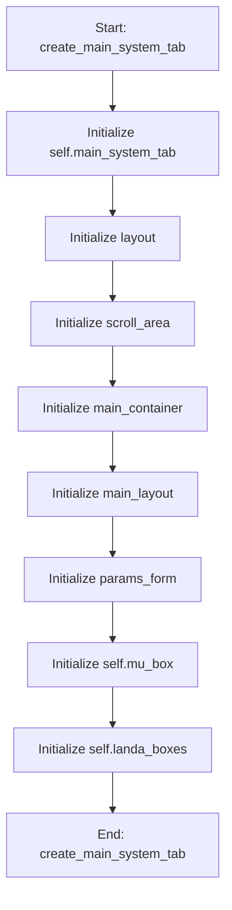

# InputTabsMixin

## Purpose
Core implementation of InputTabsMixin logic.

## Internal Logic Flow: `create_main_system_tab`


### Flowchart Pseudo-code
```python
FUNCTION create_main_system_tab(self):
    DO "Initialize self.main_system_tab"
    DO "Initialize layout"
    DO "Initialize scroll_area"
    DO "Initialize main_container"
    DO "Initialize main_layout"
    DO "Initialize params_form"
    DO "Initialize self.mu_box"
    DO "Initialize self.landa_boxes"
END FUNCTION
```

## Methods & Functions

### `create_main_system_tab`
- **Arguments**: `self`
- **Returns**: `None`
- **Logic**: Assigns self.main_system_tab; Assigns layout; Assigns scroll_area; Assigns main_container; Assigns main_layout...

### `create_dva_parameters_tab`
- **Arguments**: `self`
- **Returns**: `None`
- **Logic**: Assigns self.dva_tab; Assigns layout; Assigns scroll_area; Assigns main_container; Assigns main_layout...

### `create_target_weights_tab`
- **Arguments**: `self`
- **Returns**: `None`
- **Logic**: Assigns self.tw_tab; Assigns layout; Assigns scroll_area; Assigns main_container; Assigns main_layout...

### `create_omega_sensitivity_tab`
- **Arguments**: `self`
- **Returns**: `None`
- **Logic**: Assigns self.omega_sensitivity_tab; Assigns layout; Assigns self.sensitivity_tabs; Assigns params_tab; Assigns params_layout...

### `get_main_system_params`
- **Arguments**: `self`
- **Returns**: `None`
- **Logic**: Returns result

### `get_dva_params`
- **Arguments**: `self`
- **Returns**: `None`
- **Logic**: Assigns dva_params; Returns result

### `get_target_values_weights`
- **Arguments**: `self`
- **Returns**: `None`
- **Logic**: Assigns target_values_dict; Assigns weights_dict; Loops over range(1, 6); Returns result

### `create_frequency_tab`
- **Arguments**: `self`
- **Returns**: `None`
- **Logic**: Assigns self.freq_tab; Assigns layout; Assigns scroll_area; Assigns main_container; Assigns main_layout...

### `refresh_sensitivity_plot`
- **Arguments**: `self`
- **Returns**: `None`
- **Logic**: Simple function logic.

