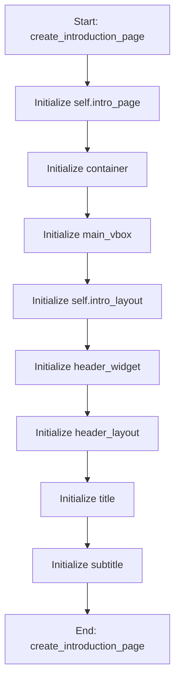

# IntroductionMixin

## Purpose
Core implementation of IntroductionMixin logic.

## Internal Logic Flow: `create_introduction_page`


### Flowchart Pseudo-code
```python
FUNCTION create_introduction_page(self):
    DO "Initialize self.intro_page"
    DO "Initialize container"
    DO "Initialize main_vbox"
    DO "Initialize self.intro_layout"
    DO "Initialize header_widget"
    DO "Initialize header_layout"
    DO "Initialize title"
    DO "Initialize subtitle"
END FUNCTION
```

## Methods & Functions

### `create_introduction_page`
- **Arguments**: `self`
- **Returns**: `None`
- **Logic**: Assigns self.intro_page; Assigns container; Assigns main_vbox; Assigns self.intro_layout; Assigns header_widget...

### `_create_modern_card`
- **Arguments**: `self, title, body, accent_color`
- **Returns**: `None`
- **Logic**: Assigns card; Assigns layout; Assigns t; Assigns b; Assigns card._title_label...

### `update_introduction_theme`
- **Arguments**: `self`
- **Returns**: `None`
- **Logic**: Assigns theme; Assigns is_dark; Assigns text_main; Assigns text_sec; Assigns card_bg...

