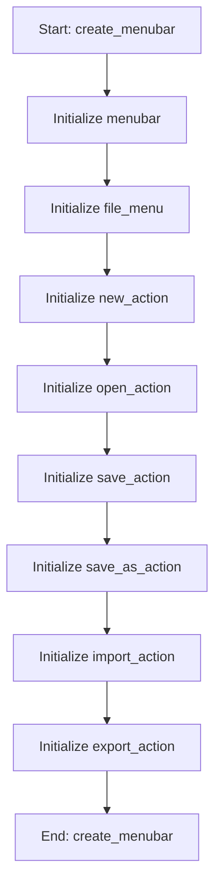

# MenuMixin

## Purpose
Mixin providing menubar and toolbar creation

## Internal Logic Flow: `create_menubar`


### Flowchart Pseudo-code
```python
FUNCTION create_menubar(self):
    DO "Initialize menubar"
    DO "Initialize file_menu"
    DO "Initialize new_action"
    DO "Initialize open_action"
    DO "Initialize save_action"
    DO "Initialize save_as_action"
    DO "Initialize import_action"
    DO "Initialize export_action"
END FUNCTION
```

## Methods & Functions

### `create_menubar`
- **Arguments**: `self`
- **Returns**: `None`
- **Logic**: Assigns menubar; Assigns file_menu; Assigns new_action; Assigns open_action; Assigns save_action...

### `show_about`
- **Arguments**: `self`
- **Returns**: `None`
- **Logic**: Simple function logic.

### `create_toolbar`
- **Arguments**: `self`
- **Returns**: `None`
- **Logic**: Assigns toolbar; Assigns spacer; Assigns new_button; Assigns open_button; Assigns save_button...

### `switch_theme`
- **Arguments**: `self, theme`
- **Returns**: `None`
- **Logic**: Assigns self.current_theme; Conditional: theme == 'Dark'; Loops over self.findChildren(QAction)

### `import_parameters`
- **Arguments**: `self`
- **Returns**: `None`
- **Logic**: Simple function logic.

### `export_parameters`
- **Arguments**: `self`
- **Returns**: `None`
- **Logic**: Simple function logic.

### `_collect_parameters_to_dict`
- **Arguments**: `self`
- **Returns**: `None`
- **Logic**: Simple function logic.

### `_apply_parameters_from_dict`
- **Arguments**: `self, params`
- **Returns**: `None`
- **Logic**: Simple function logic.

