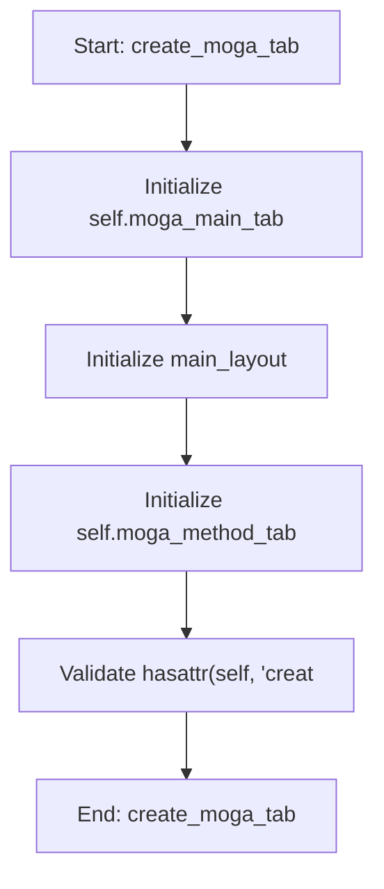

# MOGAOptimizationMixin

## Purpose
Core implementation of MOGAOptimizationMixin logic.

## Internal Logic Flow: `create_moga_tab`


### Flowchart Pseudo-code
```python
FUNCTION create_moga_tab(self):
    DO "Initialize self.moga_main_tab"
    DO "Initialize main_layout"
    DO "Initialize self.moga_method_tab"
    DO "Validate hasattr(self, 'creat"
END FUNCTION
```

## Methods & Functions

### `create_moga_tab`
- **Arguments**: `self`
- **Returns**: `None`
- **Logic**: Assigns self.moga_main_tab; Assigns main_layout; Assigns self.moga_method_tabs; Conditional: hasattr(self, 'create_adavea_t; Returns result

### `create_nsga2_sub_tab`
- **Arguments**: `self`
- **Returns**: `None`
- **Logic**: Assigns self.nsga2_tab; Assigns main_layout; Assigns self.nsga2_sub_tabs

### `create_nsga2_settings_tab`
- **Arguments**: `self`
- **Returns**: `None`
- **Logic**: Assigns self.nsga2_settings_tab; Assigns layout; Assigns nsga2_params_group; Assigns nsga2_params_layout; Assigns self.nsga2_pop_size_box...

### `toggle_nsga2_fixed`
- **Arguments**: `self, state, row`
- **Returns**: `None`
- **Logic**: Assigns fixed

### `get_nsga2_parameter_data`
- **Arguments**: `self`
- **Returns**: `None`
- **Logic**: Assigns parameters; Loops over range(self.nsga2_param_table.r; Returns result

### `create_nsga2_live_calc_tab`
- **Arguments**: `self`
- **Returns**: `None`
- **Logic**: Assigns self.nsga2_live_calc_tab; Assigns layout; Assigns self.nsga2_live_table

### `create_nsga2_statistics_tab`
- **Arguments**: `self`
- **Returns**: `None`
- **Logic**: Assigns self.nsga2_statistics_tab; Assigns layout; Assigns self.stats_summary_text; Assigns self.runs_summary_table; Assigns self.calculate_stats_button

### `calculate_and_display_statistics`
- **Arguments**: `self`
- **Returns**: `None`
- **Logic**: Assigns results_dir; Conditional: not os.path.exists(results_dir; Assigns all_results; Loops over os.listdir(results_dir); Conditional: not all_results...

### `display_selected_run_results`
- **Arguments**: `self`
- **Returns**: `None`
- **Logic**: Assigns selected_items; Conditional: not selected_items; Assigns selected_row; Assigns file_path; Conditional: os.path.exists(file_path)

### `create_nsga2_results_tab`
- **Arguments**: `self`
- **Returns**: `None`
- **Logic**: Assigns self.nsga2_results_tab; Assigns layout; Assigns self.nsga2_results_plot_tabs; Assigns self.nsga2_pareto_plot_widget; Assigns pareto_layout...

### `run_nsga2`
- **Arguments**: `self`
- **Returns**: `None`
- **Logic**: Simple function logic.

### `stop_nsga2`
- **Arguments**: `self`
- **Returns**: `None`
- **Logic**: Assigns self.nsga2_abort; Conditional: hasattr(self, 'nsga2_worker') 

### `update_nsga2_progress_multi`
- **Arguments**: `self, run_idx, current_gen, total_gens, metrics`
- **Returns**: `None`
- **Logic**: Assigns progress

### `update_nsga2_progress`
- **Arguments**: `self, progress, metrics`
- **Returns**: `None`
- **Logic**: Assigns row_position

### `nsga2_finished`
- **Arguments**: `self, run_id, file_path`
- **Returns**: `None`
- **Logic**: Conditional: not self.nsga2_multi_run_check

### `calculate_and_display_statistics`
- **Arguments**: `self`
- **Returns**: `None`
- **Logic**: Assigns results_dir; Conditional: not os.path.exists(results_dir; Assigns all_results; Loops over os.listdir(results_dir); Conditional: not all_results...

### `display_selected_run_results`
- **Arguments**: `self`
- **Returns**: `None`
- **Logic**: Assigns selected_items; Conditional: not selected_items; Assigns selected_row; Assigns file_path; Conditional: os.path.exists(file_path)

### `display_run_results`
- **Arguments**: `self, file_path`
- **Returns**: `None`
- **Logic**: Assigns pareto_front; Loops over pareto_front; Assigns ax; Assigns fitnesses; Conditional: fitnesses.size > 0

### `nsga2_error`
- **Arguments**: `self, error_message`
- **Returns**: `None`
- **Logic**: Simple function logic.

