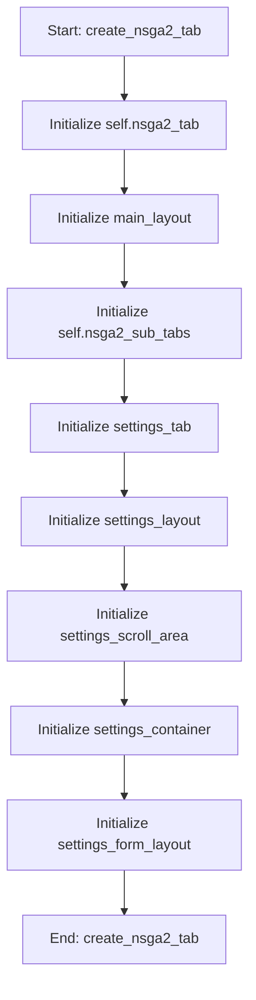

# NSGA2OptimizationMixin

## Purpose
Core implementation of NSGA2OptimizationMixin logic.

## Internal Logic Flow: `create_nsga2_tab`


### Flowchart Pseudo-code
```python
FUNCTION create_nsga2_tab(self):
    DO "Initialize self.nsga2_tab"
    DO "Initialize main_layout"
    DO "Initialize self.nsga2_sub_tabs"
    DO "Initialize settings_tab"
    DO "Initialize settings_layout"
    DO "Initialize settings_scroll_area"
    DO "Initialize settings_container"
    DO "Initialize settings_form_layout"
END FUNCTION
```

## Methods & Functions

### `create_nsga2_tab`
- **Arguments**: `self`
- **Returns**: `None`
- **Logic**: Assigns self.nsga2_tab; Assigns main_layout; Assigns self.nsga2_sub_tabs; Assigns settings_tab; Assigns settings_layout...

### `run_nsga2`
- **Arguments**: `self`
- **Returns**: `None`
- **Logic**: Conditional: self.nsga2_worker_thread and s; Assigns self.nsga2_all_runs_results; Assigns pop_size; Assigns generations; Assigns cxpb...

### `pause_nsga2`
- **Arguments**: `self`
- **Returns**: `None`
- **Logic**: Conditional: self.nsga2_worker

### `resume_nsga2`
- **Arguments**: `self`
- **Returns**: `None`
- **Logic**: Conditional: self.nsga2_worker

### `stop_nsga2`
- **Arguments**: `self`
- **Returns**: `None`
- **Logic**: Conditional: self.nsga2_worker

### `update_nsga2_progress`
- **Arguments**: `self, run_idx, current_gen, total_gens, metrics`
- **Returns**: `None`
- **Logic**: Assigns total_progress

### `nsga2_finished`
- **Arguments**: `self, all_runs_data`
- **Returns**: `None`
- **Logic**: Assigns self.nsga2_all_runs_results

### `nsga2_error`
- **Arguments**: `self, message`
- **Returns**: `None`
- **Logic**: Simple function logic.

### `reset_nsga2_buttons`
- **Arguments**: `self`
- **Returns**: `None`
- **Logic**: Simple function logic.

### `display_nsga2_results`
- **Arguments**: `self`
- **Returns**: `None`
- **Logic**: Conditional: not self.nsga2_all_runs_result; Assigns summary_text; Assigns final_hvs; Assigns final_igds; Assigns final_gds...

### `plot_nsga2_convergence`
- **Arguments**: `self`
- **Returns**: `None`
- **Logic**: Assigns ax; Conditional: not self.nsga2_all_runs_result; Assigns hv_data_per_run; Loops over self.nsga2_all_runs_results; Conditional: not hv_data_per_run or not hv_...

### `plot_nsga2_pareto_3d`
- **Arguments**: `self`
- **Returns**: `None`
- **Logic**: Assigns ax; Conditional: not self.nsga2_all_runs_result; Assigns final_pareto_objectives; Conditional: self.nsga2_all_runs_results; Conditional: not final_pareto_objectives...

### `plot_nsga2_boxplot`
- **Arguments**: `self`
- **Returns**: `None`
- **Logic**: Conditional: not self.nsga2_all_runs_result; Assigns final_hvs; Assigns final_igds; Assigns final_pareto_sizes; Assigns final_times...

### `plot_nsga2_pareto_2d`
- **Arguments**: `self`
- **Returns**: `None`
- **Logic**: Conditional: not self.nsga2_all_runs_result; Assigns final_pareto_objectives; Conditional: self.nsga2_all_runs_results; Conditional: not final_pareto_objectives; Assigns objectives_array...

### `plot_nsga2_robustness`
- **Arguments**: `self`
- **Returns**: `None`
- **Logic**: Assigns ax; Conditional: not self.nsga2_all_runs_result; Loops over enumerate(self.nsga2_all_runs_; Assigns hv_data_per_run; Loops over self.nsga2_all_runs_results...

### `export_nsga2_metrics`
- **Arguments**: `self`
- **Returns**: `None`
- **Logic**: Conditional: not self.nsga2_all_runs_result; Assigns (path, _); Conditional: path

### `export_nsga2_pareto`
- **Arguments**: `self`
- **Returns**: `None`
- **Logic**: Conditional: not self.nsga2_all_runs_result; Assigns (path, _); Conditional: path

