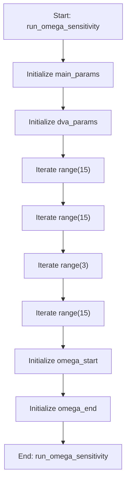

# OmegaSensitivityMixin

## Purpose
Core implementation of OmegaSensitivityMixin logic.

## Internal Logic Flow: `run_omega_sensitivity`


### Flowchart Pseudo-code
```python
FUNCTION run_omega_sensitivity(self):
    DO "Initialize main_params"
    DO "Initialize dva_params"
    DO "Iterate range(15)"
    DO "Iterate range(15)"
    DO "Iterate range(3)"
    DO "Iterate range(15)"
    DO "Initialize omega_start"
    DO "Initialize omega_end"
END FUNCTION
```

## Methods & Functions

### `run_omega_sensitivity`
- **Arguments**: `self`
- **Returns**: `None`
- **Logic**: Assigns main_params; Assigns dva_params; Loops over range(15); Loops over range(15); Loops over range(3)...

### `handle_sensitivity_finished`
- **Arguments**: `self, results`
- **Returns**: `None`
- **Logic**: Assigns self.sensitivity_results; Assigns optimal_points; Assigns converged; Assigns convergence_point; Assigns all_analyzed...

### `handle_sensitivity_error`
- **Arguments**: `self, error_msg`
- **Returns**: `None`
- **Logic**: Simple function logic.

### `save_sensitivity_plot`
- **Arguments**: `self`
- **Returns**: `None`
- **Logic**: Assigns current_tab_idx; Conditional: current_tab_idx == 0

