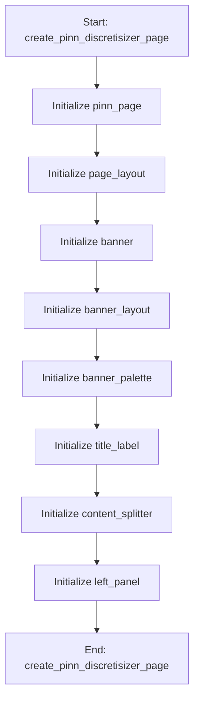

# PINNIdentificationMixin

## Purpose
Core implementation of PINNIdentificationMixin logic.

## Internal Logic Flow: `create_pinn_discretisizer_page`


### Flowchart Pseudo-code
```python
FUNCTION create_pinn_discretisizer_page(self):
    DO "Initialize pinn_page"
    DO "Initialize page_layout"
    DO "Initialize banner"
    DO "Initialize banner_layout"
    DO "Initialize banner_palette"
    DO "Initialize title_label"
    DO "Initialize content_splitter"
    DO "Initialize left_panel"
END FUNCTION
```

## Methods & Functions

### `create_pinn_discretisizer_page`
- **Arguments**: `self`
- **Returns**: `None`
- **Logic**: Assigns pinn_page; Assigns page_layout; Assigns banner; Assigns banner_layout; Assigns banner_palette...

### `update_topology_table`
- **Arguments**: `self`
- **Returns**: `None`
- **Logic**: Assigns P; Assigns headers

### `set_topology_pattern`
- **Arguments**: `self, pattern`
- **Returns**: `None`
- **Logic**: Assigns P; Loops over range(P)

### `load_pinn_data`
- **Arguments**: `self`
- **Returns**: `None`
- **Logic**: Assigns (file_path, _); Conditional: file_path

### `get_topology_mask`
- **Arguments**: `self`
- **Returns**: `None`
- **Logic**: Assigns P; Assigns mask; Loops over range(P); Returns result

### `run_pinn_identification`
- **Arguments**: `self`
- **Returns**: `None`
- **Logic**: Conditional: not TORCH_AVAILABLE; Conditional: self.pinn_data is None

### `stop_pinn_identification`
- **Arguments**: `self`
- **Returns**: `None`
- **Logic**: Conditional: hasattr(self, 'pinn_worker')

### `update_pinn_progress`
- **Arguments**: `self, epoch, loss, params`
- **Returns**: `None`
- **Logic**: Assigns total_epochs; Assigns progress

### `pinn_finished`
- **Arguments**: `self, results`
- **Returns**: `None`
- **Logic**: Simple function logic.

### `pinn_error`
- **Arguments**: `self, message`
- **Returns**: `None`
- **Logic**: Simple function logic.

### `display_pinn_results`
- **Arguments**: `self, results`
- **Returns**: `None`
- **Logic**: Assigns M; Assigns C; Assigns K

