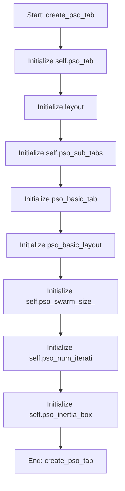

# PSOMixin

## Purpose
Core implementation of PSOMixin logic.

## Internal Logic Flow: `create_pso_tab`


### Flowchart Pseudo-code
```python
FUNCTION create_pso_tab(self):
    DO "Initialize self.pso_tab"
    DO "Initialize layout"
    DO "Initialize self.pso_sub_tabs"
    DO "Initialize pso_basic_tab"
    DO "Initialize pso_basic_layout"
    DO "Initialize self.pso_swarm_size_"
    DO "Initialize self.pso_num_iterati"
    DO "Initialize self.pso_inertia_box"
END FUNCTION
```

## Methods & Functions

### `create_pso_tab`
- **Arguments**: `self`
- **Returns**: `None`
- **Logic**: Assigns self.pso_tab; Assigns layout; Assigns self.pso_sub_tabs; Assigns pso_basic_tab; Assigns pso_basic_layout...

### `toggle_pso_fixed`
- **Arguments**: `self, state, row, table`
- **Returns**: `None`
- **Logic**: Conditional: table is None; Assigns fixed; Assigns fixed_value_spin; Assigns lower_bound_spin; Assigns upper_bound_spin

### `run_pso`
- **Arguments**: `self`
- **Returns**: `None`
- **Logic**: Conditional: hasattr(self, 'pso_worker') an; Conditional: hasattr(self, 'pso_worker')

### `handle_pso_finished`
- **Arguments**: `self, results, best_particle, parameter_names, best_fitness`
- **Returns**: `None`
- **Logic**: Conditional: hasattr(self, 'pso_progress_ba; Conditional: hasattr(self, 'pso_benchmark_r; Conditional: hasattr(self, 'pso_worker') an; Conditional: not hasattr(self, 'pso_benchma

### `handle_pso_error`
- **Arguments**: `self, err`
- **Returns**: `None`
- **Logic**: Conditional: hasattr(self, 'pso_progress_ba; Conditional: hasattr(self, 'pso_worker') an

### `handle_pso_update`
- **Arguments**: `self, msg`
- **Returns**: `None`
- **Logic**: Simple function logic.

### `handle_pso_convergence`
- **Arguments**: `self, iterations, fitness_values`
- **Returns**: `None`
- **Logic**: Simple function logic.

### `update_pso_progress`
- **Arguments**: `self, value`
- **Returns**: `None`
- **Logic**: Simple function logic.

### `visualize_pso_benchmark_results`
- **Arguments**: `self`
- **Returns**: `None`
- **Logic**: Conditional: not hasattr(self, 'pso_benchma; Loops over enumerate(self.pso_benchmark_d; Assigns df; Assigns self.pso_current_parameter_data; Conditional: self.pso_current_parameter_dat...

### `export_pso_benchmark_data`
- **Arguments**: `self`
- **Returns**: `None`
- **Logic**: Simple function logic.

### `import_pso_benchmark_data`
- **Arguments**: `self`
- **Returns**: `None`
- **Logic**: Simple function logic.

### `pso_show_run_details`
- **Arguments**: `self, item`
- **Returns**: `None`
- **Logic**: Conditional: not hasattr(self, 'pso_benchma; Assigns row; Assigns run_number_item; Conditional: not run_number_item; Assigns run_number_text...

### `run_next_pso_benchmark`
- **Arguments**: `self`
- **Returns**: `None`
- **Logic**: Conditional: hasattr(self, 'pso_worker'); Assigns params; Assigns use_ml; Assigns use_adaptive; Assigns self.pso_worker

### `pso_on_parameter_selection_changed`
- **Arguments**: `self`
- **Returns**: `None`
- **Logic**: Simple function logic.

### `pso_on_plot_type_changed`
- **Arguments**: `self`
- **Returns**: `None`
- **Logic**: Assigns plot_type; Conditional: plot_type == 'Scatter Plot'

### `pso_on_comparison_parameter_changed`
- **Arguments**: `self`
- **Returns**: `None`
- **Logic**: Simple function logic.

### `pso_extract_parameter_data_from_runs`
- **Arguments**: `self, df`
- **Returns**: `None`
- **Logic**: Assigns parameter_data; Loops over df.iterrows(); Loops over parameter_data; Returns result

### `pso_update_parameter_dropdowns`
- **Arguments**: `self, parameter_data`
- **Returns**: `None`
- **Logic**: Assigns names

### `pso_update_parameter_plots`
- **Arguments**: `self`
- **Returns**: `None`
- **Logic**: Conditional: not hasattr(self, 'pso_current; Assigns param; Assigns plot_type; Assigns comp_param; Conditional: self.pso_param_plot_widget.lay...

### `pso_create_violin_plot`
- **Arguments**: `self, param`
- **Returns**: `None`
- **Logic**: Assigns values; Conditional: values is None or len(values) ; Assigns fig; Assigns ax; Assigns canvas

### `pso_create_distribution_plot`
- **Arguments**: `self, param`
- **Returns**: `None`
- **Logic**: Assigns values; Conditional: values is None or len(values) ; Assigns fig; Assigns ax; Assigns canvas

### `pso_create_scatter_plot`
- **Arguments**: `self, param, comp_param`
- **Returns**: `None`
- **Logic**: Conditional: comp_param == 'None' or comp_p; Assigns values_x; Assigns values_y; Conditional: len(values_x) == 0 or len(valu; Assigns fig...

### `pso_create_qq_plot`
- **Arguments**: `self, param`
- **Returns**: `None`
- **Logic**: Assigns values; Conditional: values is None or len(values) ; Assigns fig; Assigns ax; Assigns ((osm, osr), (slope, intercept, _))...

### `create_de_tab`
- **Arguments**: `self`
- **Returns**: `None`
- **Logic**: Simple function logic.

### `save_plot`
- **Arguments**: `self, fig, plot_name`
- **Returns**: `None`
- **Logic**: Simple function logic.

### `_open_plot_window`
- **Arguments**: `self, fig, title`
- **Returns**: `None`
- **Logic**: Assigns plot_window

### `update_pso_visualizations`
- **Arguments**: `self, run_data`
- **Returns**: `None`
- **Logic**: Simple function logic.

### `pso_create_selected_run_visualizations`
- **Arguments**: `self, run_data`
- **Returns**: `None`
- **Logic**: Simple function logic.

### `pso_select_run_for_analysis`
- **Arguments**: `self, run_number`
- **Returns**: `None`
- **Logic**: Simple function logic.

### `setup_widget_layout`
- **Arguments**: `self, widget`
- **Returns**: `None`
- **Logic**: Conditional: not widget.layout()

### `create_fitness_evolution_plot`
- **Arguments**: `self, tab_widget, run_data`
- **Returns**: `None`
- **Logic**: Simple function logic.

### `create_parameter_convergence_plot`
- **Arguments**: `self, tab_widget, run_data`
- **Returns**: `None`
- **Logic**: Simple function logic.

### `create_pso_parameter_convergence_plot`
- **Arguments**: `self, layout, run_data, metrics`
- **Returns**: `None`
- **Logic**: Assigns control_panel; Assigns control_layout; Assigns param_label; Assigns param_dropdown; Assigns view_label...

### `create_computational_efficiency_plot`
- **Arguments**: `self, tab_widget, run_data`
- **Returns**: `None`
- **Logic**: Simple function logic.

### `create_pso_performance_plot`
- **Arguments**: `self, layout, run_data, metrics`
- **Returns**: `None`
- **Logic**: Assigns fig; Assigns ax1; Assigns ax2; Assigns ax3; Assigns ax4...

### `create_pso_timing_analysis_plot`
- **Arguments**: `self, layout, run_data, metrics`
- **Returns**: `None`
- **Logic**: Assigns fig; Assigns ax1; Assigns ax2; Assigns ops; Assigns keys...

### `create_pso_rates_plot`
- **Arguments**: `self, tab_widget, run_data`
- **Returns**: `None`
- **Logic**: Simple function logic.

### `create_pso_ml_bandit_plots`
- **Arguments**: `self, layout, run_data, metrics`
- **Returns**: `None`
- **Logic**: Assigns fig; Assigns ax1; Assigns ax2; Assigns ax3; Assigns ml_hist...

### `create_pso_surrogate_plots`
- **Arguments**: `self, layout, run_data, metrics`
- **Returns**: `None`
- **Logic**: Assigns fig; Assigns ax1; Assigns ax2; Assigns surr_info; Conditional: surr_info...

### `create_pso_fitness_components_plot`
- **Arguments**: `self, layout, run_data, metrics`
- **Returns**: `None`
- **Logic**: Assigns fig; Assigns ax1; Assigns ax2; Assigns best_solution; Assigns best_fitness...

### `create_pso_generation_breakdown_plot`
- **Arguments**: `self, tab_widget, run_data`
- **Returns**: `None`
- **Logic**: Simple function logic.

### `pso_extract_parameter_data_from_runs`
- **Arguments**: `self, df`
- **Returns**: `None`
- **Logic**: Assigns parameter_data; Loops over df.iterrows(); Returns result

### `pso_update_parameter_dropdowns`
- **Arguments**: `self, parameter_data`
- **Returns**: `None`
- **Logic**: Assigns names

### `pso_create_violin_plot`
- **Arguments**: `self, selected_param`
- **Returns**: `None`
- **Logic**: Simple function logic.

### `pso_create_distribution_plot`
- **Arguments**: `self, selected_param`
- **Returns**: `None`
- **Logic**: Simple function logic.

### `pso_create_scatter_plot`
- **Arguments**: `self, selected_param, comparison_param`
- **Returns**: `None`
- **Logic**: Simple function logic.

### `pso_create_two_parameter_scatter`
- **Arguments**: `self, param_x, param_y`
- **Returns**: `None`
- **Logic**: Simple function logic.

### `pso_create_parameter_vs_run_scatter`
- **Arguments**: `self, param_name`
- **Returns**: `None`
- **Logic**: Simple function logic.

### `pso_create_qq_plot`
- **Arguments**: `self, selected_param`
- **Returns**: `None`
- **Logic**: Simple function logic.

### `pso_update_parameter_plots`
- **Arguments**: `self`
- **Returns**: `None`
- **Logic**: Conditional: not hasattr(self, 'pso_current; Assigns param; Assigns plot_type; Assigns comp_param; Conditional: self.pso_param_plot_widget.lay...

### `add_plot_buttons`
- **Arguments**: `self, fig, plot_type, selected_param, comparison_param`
- **Returns**: `None`
- **Logic**: Simple function logic.

