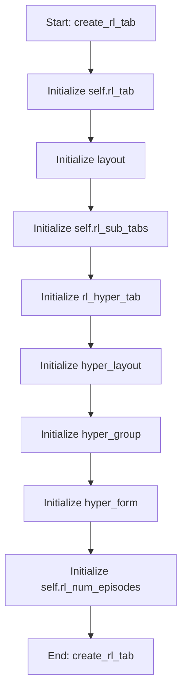

# RLOptimizationMixin

## Purpose
Core implementation of RLOptimizationMixin logic.

## Internal Logic Flow: `create_rl_tab`


### Flowchart Pseudo-code
```python
FUNCTION create_rl_tab(self):
    DO "Initialize self.rl_tab"
    DO "Initialize layout"
    DO "Initialize self.rl_sub_tabs"
    DO "Initialize rl_hyper_tab"
    DO "Initialize hyper_layout"
    DO "Initialize hyper_group"
    DO "Initialize hyper_form"
    DO "Initialize self.rl_num_episodes"
END FUNCTION
```

## Methods & Functions

### `create_rl_tab`
- **Arguments**: `self`
- **Returns**: `None`
- **Logic**: Assigns self.rl_tab; Assigns layout; Assigns self.rl_sub_tabs; Assigns rl_hyper_tab; Assigns hyper_layout...

### `run_rl_optimization`
- **Arguments**: `self`
- **Returns**: `None`
- **Logic**: Simple function logic.

### `handle_rl_finished`
- **Arguments**: `self, results, best_params, param_names, best_fitness`
- **Returns**: `None`
- **Logic**: Assigns best_dict; Assigns self.current_rl_best_params; Assigns self.current_rl_best_fitness; Conditional: self._rl_bench_active

### `handle_rl_error`
- **Arguments**: `self, err`
- **Returns**: `None`
- **Logic**: Simple function logic.

### `handle_rl_update`
- **Arguments**: `self, msg`
- **Returns**: `None`
- **Logic**: Assigns cursor

### `handle_rl_metrics`
- **Arguments**: `self, metrics`
- **Returns**: `None`
- **Logic**: Assigns episode; Assigns reward; Conditional: not hasattr(self, 'rl_reward_h; Conditional: self._rl_bench_active; Assigns ax...

### `toggle_rl_fixed`
- **Arguments**: `self, state, row`
- **Returns**: `None`
- **Logic**: Assigns fixed; Assigns fixed_value_spin; Assigns lower_spin; Assigns upper_spin; Conditional: fixed

### `start_rl_benchmark`
- **Arguments**: `self`
- **Returns**: `None`
- **Logic**: Simple function logic.

### `run_next_rl_benchmark`
- **Arguments**: `self`
- **Returns**: `None`
- **Logic**: Assigns self._rl_current_episode_history; Assigns self._rl_run_start_time

### `_append_rl_benchmark_row`
- **Arguments**: `self, run_record`
- **Returns**: `None`
- **Logic**: Assigns row; Assigns eps_final; Assigns btn

### `show_rl_run_details`
- **Arguments**: `self, run_data`
- **Returns**: `None`
- **Logic**: Simple function logic.

### `export_rl_benchmark_data`
- **Arguments**: `self`
- **Returns**: `None`
- **Logic**: Conditional: not self.rl_benchmark_data; Assigns (path, _); Conditional: not path

### `import_rl_benchmark_data`
- **Arguments**: `self`
- **Returns**: `None`
- **Logic**: Assigns (path, _); Conditional: not path

### `compute_rl_parameter_recommendations`
- **Arguments**: `self`
- **Returns**: `None`
- **Logic**: Conditional: not self.rl_benchmark_data; Assigns param_to_values; Assigns param_names; Loops over self.rl_benchmark_data; Conditional: not param_to_values...

### `apply_rl_recommended_ranges_to_table`
- **Arguments**: `self`
- **Returns**: `None`
- **Logic**: Assigns rows; Conditional: rows == 0; Assigns rec_map; Loops over range(rows); Loops over range(self.rl_param_table.rowC

