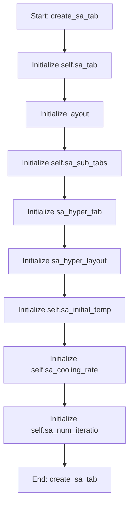

# SAOptimizationMixin

## Purpose
Core implementation of SAOptimizationMixin logic.

## Internal Logic Flow: `create_sa_tab`


### Flowchart Pseudo-code
```python
FUNCTION create_sa_tab(self):
    DO "Initialize self.sa_tab"
    DO "Initialize layout"
    DO "Initialize self.sa_sub_tabs"
    DO "Initialize sa_hyper_tab"
    DO "Initialize sa_hyper_layout"
    DO "Initialize self.sa_initial_temp"
    DO "Initialize self.sa_cooling_rate"
    DO "Initialize self.sa_num_iteratio"
END FUNCTION
```

## Methods & Functions

### `create_sa_tab`
- **Arguments**: `self`
- **Returns**: `None`
- **Logic**: Assigns self.sa_tab; Assigns layout; Assigns self.sa_sub_tabs; Assigns sa_hyper_tab; Assigns sa_hyper_layout...

### `toggle_sa_fixed`
- **Arguments**: `self, state, row, table`
- **Returns**: `None`
- **Logic**: Conditional: table is None; Assigns fixed; Assigns fixed_value_spin; Assigns lower_bound_spin; Assigns upper_bound_spin

### `run_sa`
- **Arguments**: `self`
- **Returns**: `None`
- **Logic**: Simple function logic.

### `run_cmaes`
- **Arguments**: `self`
- **Returns**: `None`
- **Logic**: Simple function logic.

### `_handle_sa_finished`
- **Arguments**: `self, results, best_candidate, parameter_names, best_fitness`
- **Returns**: `None`
- **Logic**: Simple function logic.

