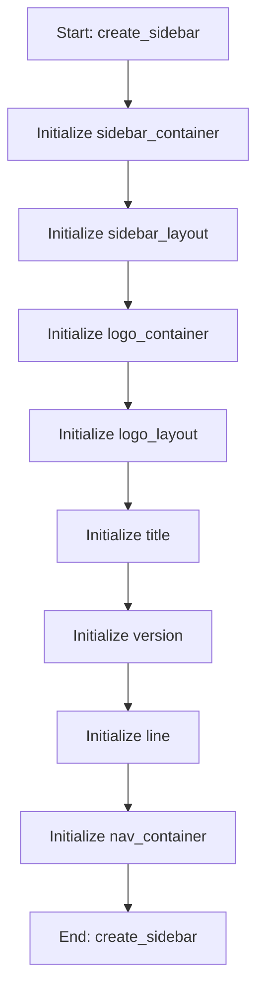

# SidebarMixin

## Purpose
Core implementation of SidebarMixin logic.

## Internal Logic Flow: `create_sidebar`


### Flowchart Pseudo-code
```python
FUNCTION create_sidebar(self, BEAM_IMPORTS_SUCCESSFUL):
    DO "Initialize sidebar_container"
    DO "Initialize sidebar_layout"
    DO "Initialize logo_container"
    DO "Initialize logo_layout"
    DO "Initialize title"
    DO "Initialize version"
    DO "Initialize line"
    DO "Initialize nav_container"
END FUNCTION
```

## Methods & Functions

### `create_sidebar`
- **Arguments**: `self, BEAM_IMPORTS_SUCCESSFUL`
- **Returns**: `None`
- **Logic**: Assigns sidebar_container; Assigns sidebar_layout; Assigns logo_container; Assigns logo_layout; Assigns title...

### `change_page`
- **Arguments**: `self, index`
- **Returns**: `None`
- **Logic**: Loops over [self.intro_btn, self.stochast; Conditional: index == 0

### `toggle_theme`
- **Arguments**: `self`
- **Returns**: `None`
- **Logic**: Conditional: self.current_theme == 'Dark'

