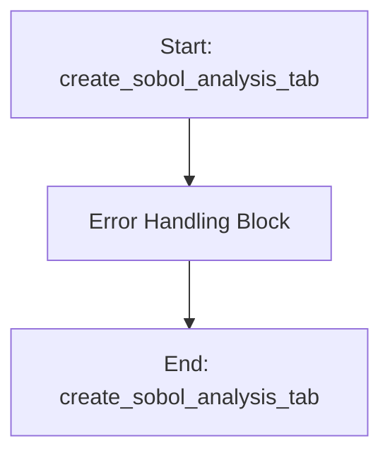

# SobolAnalysisMixin

## Purpose
Core implementation of SobolAnalysisMixin logic.

## Internal Logic Flow: `create_sobol_analysis_tab`


### Flowchart Pseudo-code
```python
FUNCTION create_sobol_analysis_tab(self):
    DO "Error Handling Block"
END FUNCTION
```

## Methods & Functions

### `_run_sobol_implementation`
- **Arguments**: `self`
- **Returns**: `None`
- **Logic**: Conditional: self.omega_start_box.value() >; Assigns (target_values, weights); Assigns num_samples_list; Assigns n_jobs; Assigns main_params...

### `run_sobol`
- **Arguments**: `self`
- **Returns**: `None`
- **Logic**: Simple function logic.

### `get_num_samples_list`
- **Arguments**: `self`
- **Returns**: `None`
- **Logic**: Simple function logic.

### `handle_sobol_error`
- **Arguments**: `self, err`
- **Returns**: `None`
- **Logic**: Simple function logic.

### `display_sobol_results`
- **Arguments**: `self, all_results, warnings`
- **Returns**: `None`
- **Logic**: Simple function logic.

### `generate_sobol_plots`
- **Arguments**: `self, all_results, param_names`
- **Returns**: `None`
- **Logic**: Assigns fig_last_run; Assigns self.sobol_plots['Last Run Results']; Assigns fig_grouped_ST; Assigns self.sobol_plots['Grouped Bar (Sorted by ST)']; Assigns conv_figs...

### `visualize_last_run`
- **Arguments**: `self, all_results, param_names`
- **Returns**: `None`
- **Logic**: Assigns last_run_idx; Assigns S1_last_run; Assigns ST_last_run; Assigns sorted_indices_S1; Assigns sorted_param_names_S1...

### `visualize_grouped_bar_plot_sorted_on_ST`
- **Arguments**: `self, all_results, param_names`
- **Returns**: `None`
- **Logic**: Assigns last_run_idx; Assigns S1_last_run; Assigns ST_last_run; Assigns sorted_indices_ST; Assigns sorted_param_names_ST...

### `visualize_convergence_plots`
- **Arguments**: `self, all_results, param_names`
- **Returns**: `None`
- **Logic**: Assigns sample_sizes; Assigns S1_matrix; Assigns ST_matrix; Assigns plots_per_fig; Assigns total_params...

### `visualize_combined_heatmap`
- **Arguments**: `self, all_results, param_names`
- **Returns**: `None`
- **Logic**: Assigns last_run_idx; Assigns S1_last; Assigns ST_last; Assigns df; Assigns df...

### `visualize_comprehensive_radar_plots`
- **Arguments**: `self, all_results, param_names`
- **Returns**: `None`
- **Logic**: Assigns last_run_idx; Assigns S1; Assigns ST; Assigns num_vars; Assigns angles...

### `visualize_separate_radar_plots`
- **Arguments**: `self, all_results, param_names`
- **Returns**: `None`
- **Logic**: Assigns last_run_idx; Assigns S1; Assigns ST; Assigns num_vars; Assigns angles...

### `visualize_box_plots`
- **Arguments**: `self, all_results`
- **Returns**: `None`
- **Logic**: Assigns data; Assigns df; Assigns fig; Assigns ax; Returns result

### `visualize_violin_plots`
- **Arguments**: `self, all_results`
- **Returns**: `None`
- **Logic**: Assigns data; Assigns df; Assigns fig; Assigns ax; Returns result

### `visualize_scatter_S1_ST`
- **Arguments**: `self, all_results, param_names`
- **Returns**: `None`
- **Logic**: Assigns last_run_idx; Assigns S1_last_run; Assigns ST_last_run; Assigns fig; Assigns ax...

### `visualize_parallel_coordinates`
- **Arguments**: `self, all_results, param_names`
- **Returns**: `None`
- **Logic**: Assigns data; Loops over enumerate(all_results['samples; Assigns df; Assigns fig; Assigns ax...

### `visualize_histograms`
- **Arguments**: `self, all_results`
- **Returns**: `None`
- **Logic**: Assigns last_run_idx; Assigns S1_last_run; Assigns ST_last_run; Assigns fig_s1; Assigns ax_s1...

### `get_main_system_params`
- **Arguments**: `self`
- **Returns**: `None`
- **Logic**: Returns result

### `save_sobol_results`
- **Arguments**: `self`
- **Returns**: `None`
- **Logic**: Assigns options; Assigns (file_path, _); Conditional: file_path

### `update_sobol_plot`
- **Arguments**: `self`
- **Returns**: `None`
- **Logic**: Simple function logic.

### `create_sobol_analysis_tab`
- **Arguments**: `self`
- **Returns**: `None`
- **Logic**: Simple function logic.

### `save_sobol_plot`
- **Arguments**: `self`
- **Returns**: `None`
- **Logic**: Simple function logic.

### `toggle_sobol_fixed`
- **Arguments**: `self, state, row`
- **Returns**: `None`
- **Logic**: Assigns fixed; Assigns fixed_value_spin; Assigns lower_bound_spin; Assigns upper_bound_spin; Conditional: fixed

### `get_target_values_weights`
- **Arguments**: `self`
- **Returns**: `None`
- **Logic**: Assigns target_values; Assigns weights; Loops over range(1, 6); Returns result

