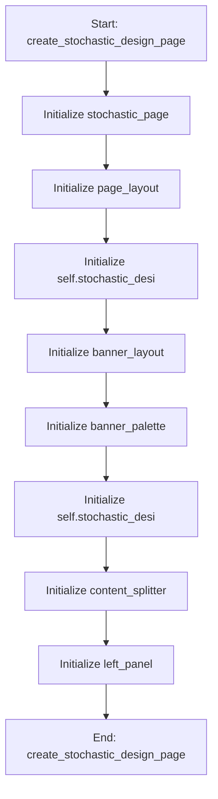

# StochasticDesignMixin

## Purpose
Core implementation of StochasticDesignMixin logic.

## Internal Logic Flow: `create_stochastic_design_page`


### Flowchart Pseudo-code
```python
FUNCTION create_stochastic_design_page(self):
    DO "Initialize stochastic_page"
    DO "Initialize page_layout"
    DO "Initialize self.stochastic_desi"
    DO "Initialize banner_layout"
    DO "Initialize banner_palette"
    DO "Initialize self.stochastic_desi"
    DO "Initialize content_splitter"
    DO "Initialize left_panel"
END FUNCTION
```

## Methods & Functions

### `create_stochastic_design_page`
- **Arguments**: `self`
- **Returns**: `None`
- **Logic**: Assigns stochastic_page; Assigns page_layout; Assigns self.stochastic_design_banner; Assigns banner_layout; Assigns banner_palette...

### `apply_optimized_dva_parameters`
- **Arguments**: `self`
- **Returns**: `None`
- **Logic**: Assigns selected_optimizer; Assigns best_params; Conditional: 'Genetic Algorithm' in selecte; Conditional: best_params is None

### `create_de_tab`
- **Arguments**: `self`
- **Returns**: `None`
- **Logic**: Conditional: hasattr(self, 'de_tab') and se; Assigns self.de_tab; Assigns layout; Assigns info_label; Assigns description...

### `run_de`
- **Arguments**: `self`
- **Returns**: `None`
- **Logic**: Conditional: hasattr(self, '__class__') and

### `run_moo_ga`
- **Arguments**: `self`
- **Returns**: `None`
- **Logic**: Simple function logic.

