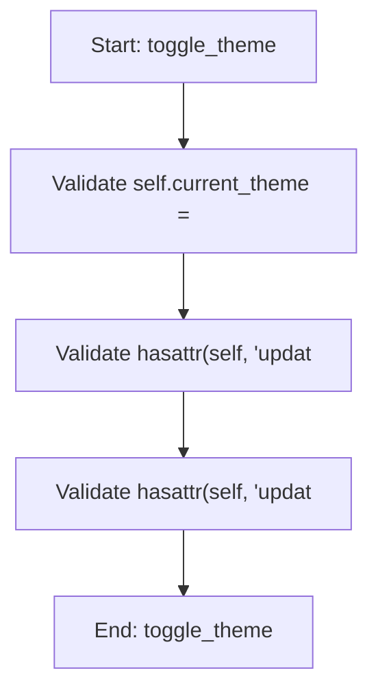

# ThemeMixin

## Purpose
Mixin handling light/dark theme support with enhanced elegant styling

## Internal Logic Flow: `toggle_theme`


### Flowchart Pseudo-code
```python
FUNCTION toggle_theme(self):
    DO "Validate self.current_theme ="
    DO "Validate hasattr(self, 'updat"
    DO "Validate hasattr(self, 'updat"
END FUNCTION
```

## Methods & Functions

### `toggle_theme`
- **Arguments**: `self`
- **Returns**: `None`
- **Logic**: Conditional: self.current_theme == 'Dark'; Conditional: hasattr(self, 'update_beam_int; Conditional: hasattr(self, 'update_introduc

### `apply_current_theme`
- **Arguments**: `self`
- **Returns**: `None`
- **Logic**: Conditional: self.current_theme == 'Dark'; Conditional: hasattr(self, 'update_beam_int; Conditional: hasattr(self, 'update_introduc

### `apply_dark_theme`
- **Arguments**: `self`
- **Returns**: `None`
- **Logic**: Assigns dark_palette; Assigns dark_color; Assigns darker_color; Assigns medium_color; Assigns light_color...

### `apply_light_theme`
- **Arguments**: `self`
- **Returns**: `None`
- **Logic**: Assigns light_palette; Assigns light_color; Assigns lighter_color; Assigns medium_color; Assigns dark_color...

