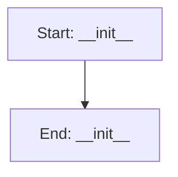

# ModernQTabWidget

## Purpose
Custom TabWidget with modern styling

## Internal Logic Flow: `__init__`


### Flowchart Pseudo-code
```python
FUNCTION __init__(self, parent):
END FUNCTION
```

## Methods & Functions

### `__init__`
- **Arguments**: `self, parent`
- **Returns**: `None`
- **Logic**: Simple function logic.

### `__init__`
- **Arguments**: `self, icon_path, text, parent`
- **Returns**: `None`
- **Logic**: Assigns layout; Conditional: icon_path; Assigns label

### `enterEvent`
- **Arguments**: `self, event`
- **Returns**: `None`
- **Logic**: Simple function logic.

### `leaveEvent`
- **Arguments**: `self, event`
- **Returns**: `None`
- **Logic**: Simple function logic.

