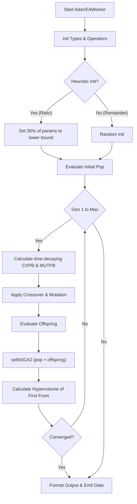

# AdaVEA (Adaptive Value-Encoded Algorithm) Documentation

## Overview
AdaVEA is a highly specialized, adaptive multi-objective optimization algorithm. It incorporates heuristic initialization to bias the initial search space towards sparse/zero-valued configurations, and it features time-decaying/adaptive crossover and mutation rates based on generation progress. It minimizes the same three objectives as NSGA-II/MOGA but uses its unique adaptation mechanisms to traverse the search space.

## Class: `AdaVEAWorker` (inherits `QObject`)

### Purpose
Executes the AdaVEA optimization logic asynchronously. It integrates FRF evaluation, optional PINN acceleration, and calculates hypervolume (HV) to track convergence dynamically.

### Key Initialization Parameters
*   `main_system_parameters`, `dva_parameters`, `target_values_weights`.
*   `pop_size`, `generations`.
*   `cxpb`, `mutpb` (Initial rates that will decay/adapt).
*   `eta_c`, `eta_m` (Crowding factors for bounded operators).
*   **Convergence:** `convergence_epsilon`, `convergence_window`, `convergence_min_gen`, `hv_ref_point`.
*   **AdaVEA Specifics:** `heuristic_init_ratio` (fraction of population initialized with bias toward lower bounds).
*   **Acceleration:** `use_pinn_solver`.

### Methods

#### 1. `_evaluate_objectives(self, individual)`
**Purpose:** Calculates the three optimization objectives.
**Logic:**
- $f_1$ (Performance): Computed via `frf()` or `PINNSolver`.
- $f_2$ (Sparsity): Unique internal hardcoding: `tau = 0.1`, `alpha = 1.0`, `beta = 0.5`. 
  `f2 = alpha * (count > tau) + beta * sum(abs(xi))`
- $f_3$ (Cost): Dot product of individual and `cost_coeffs`.
**Output:** Tuple `(f1, f2, f3)`.

#### 2. `_heuristic_initialization(self)`
**Purpose:** Biases the initial parameter values.
**Logic:** Iterates over a newly generated random individual. For each parameter, there is a 30% chance (`random.random() < 0.3`) that it is hard-set to its lower bound (`self.low_bounds[i]`).

#### 3. `run(self)`
**Purpose:** Main execution loop.
**Logic Flow:**
1.  **Setup:** Registers DEAP multi-objective types.
2.  **Population Initialization:** 
    - Fills `num_heuristic` slots using `_heuristic_initialization()`.
    - Fills the rest using standard random initialization.
3.  **Iteration Loop:**
    - **Adaptive Rates:**
        - Crossover decays: `tau_crossover = self.generations / 4.0`, `current_cxpb = 0.5 + 0.5 * np.exp(-gen / tau_crossover)`.
        - Mutation adapts: `current_mutpb = initial_mutpb * (1.0 - gen / max_gen) + (1.0/num_params) * (gen / max_gen)`.
    - Applies `algorithms.varAnd` using `current_cxpb` and `current_mutpb`.
    - Evaluates invalid offspring via `_evaluate_objectives`.
    - Selects the next generation using `tools.selNSGA2`.
    - **Metrics:** Computes Hypervolume (HV) of the `first_front_only`. Checks convergence against the sliding window of HVs.
4.  **Finalization:** Emits a dictionary containing runtime metrics, final Pareto front parameters, and objectives.

---

## Architectural Flowchart



#### Pseudo-code
```text
BEGIN
  EXECUTE Start AdaVEAWorker
  EXECUTE Init Types & Operators
  EXECUTE Heuristic Init?
  EXECUTE Set 30% of params to lower bound
  EXECUTE Random Init
  EXECUTE Evaluate Initial Pop
  EXECUTE Gen 1 to Max
  EXECUTE Calculate time-decaying CXPB & MUTPB
  EXECUTE Apply Crossover & Mutation
  EXECUTE Evaluate Offspring
  EXECUTE selNSGA2 (pop + offspring)
  EXECUTE Calculate Hypervolume of First Front
  EXECUTE Converged?
  EXECUTE Format Output & Emit Data
END
```
