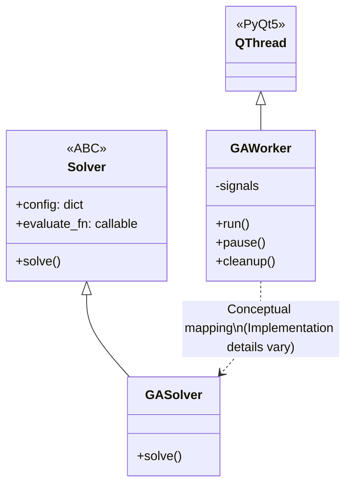
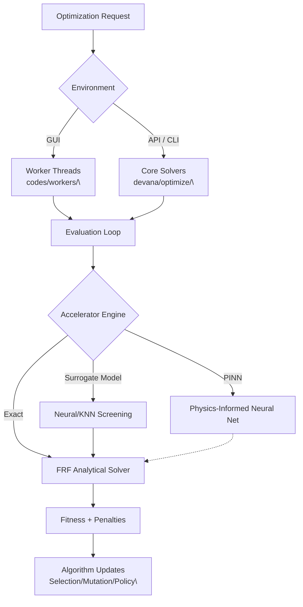

# Optimization Architecture Overview

The DeVana framework employs a **two-tiered architecture** for optimization routines, providing both rich GUI interactivity and lightweight headless execution capabilities. This architecture ensures high cohesion and low coupling between the evolutionary algorithms and the user interface.

## 1. Two-Tiered Optimization Architecture

### 1.1 Core Solvers (`devana/optimize/`)
The foundation of the optimization suite is located in `devana/optimize/`, offering GUI-independent classes.

- **`Solver` Base Class (`base.py`)**: An abstract base class (ABC) that all algorithms implement. It provides standardized initialization for configuration, bounds extraction, fixed parameter handling, and a unified `callback` interface for progress reporting.
- **Implementations**: `GASolver`, `PSOSolver`, `NSGA2Solver`, `RLSolver`, etc.
- **Purpose**: Primarily used by the headless REST API (`codes/api/`) and automated testing scripts. They ensure the mathematical core is decoupled from PyQT dependencies.

### 1.2 Worker Threads (`codes/workers/`)
The GUI execution layer utilizes `QThread` subclasses located in `codes/workers/`.

- **Inheritance**: Subclasses `QThread` from `PyQt5.QtCore`.
- **Communication**: Emits PyQT signals (`finished`, `progress`, `update`, `error`, `benchmark_data`, `generation_metrics`) to interact safely with the UI thread.
- **Features**: Wraps the core optimization logic with robust exception handling (`@safe_deap_operation`), resource monitoring (`psutil`), pausing/resuming mechanisms, and a watchdog timer (usually 10 minutes) for infinite loop protection.



## 2. Universal Fitness and Penalty Formulation

Regardless of the selected metaheuristic, the evaluation heavily relies on the Frequency Response Function (FRF) and enforces structural constraints.

The generalized fitness scalar $F$ (for single-objective algorithms like GA, DE, PSO) is formulated as:

$$ F = O_{primary} + P_{sparsity} + P_{error} + P_{activation} + C_{cost} $$

Where:
- **Primary Objective ($O_{primary}$)**: Distance from the normalized ideal response.
  $$ O_{primary} = | R_{singular} - 1.0 | $$
- **Sparsity Penalty ($P_{sparsity}$)**: L1 regularization to favor simpler absorber topologies (Occam's Razor).
  $$ P_{sparsity} = \alpha \sum_{i} |x_i| $$
- **Percentage Error ($P_{error}$)**: Scaled sum of percentage deviations across all masses.
- **Activation Penalty ($P_{activation}$)**: Penalizes active variables above a certain threshold.
- **Cost Term ($C_{cost}$)**: Evaluates manufacturing/material costs (can be a standard normalized cost or an advanced Cost-Benefit Ratio formulation).

For **Multi-Objective Algorithms** (e.g., NSGA-II, MOGA), these elements are decoupled into orthogonal objectives:
1. $f_1(x) = R_{singular}$ (or distance)
2. $f_2(x) = P_{sparsity}$
3. $f_3(x) = \sum C_i x_i$

## 3. Supported Algorithms & Frameworks
- **DEAP-based**: GA, NSGA-II, MOGA.
- **Custom / NumPy implementations**: RL (DDPG-inspired Policy Gradient), AdaVEA.
- **Hybrid Integrations**: Algorithms are infused with ML surrogates, QMC initialization, and PINN accelerators.



#### Pseudo-code
```text
BEGIN
  EXECUTE Optimization Request
  EXECUTE Environment
  EXECUTE Worker Threads<br>
  EXECUTE Core Solvers<br>
  EXECUTE Evaluation Loop
  EXECUTE Accelerator Engine
  EXECUTE Neural/KNN Screening
  EXECUTE Physics-Informed Neural Net
  EXECUTE FRF Analytical Solver
  EXECUTE Fitness + Penalties
  EXECUTE Algorithm Updates<br>
END
```