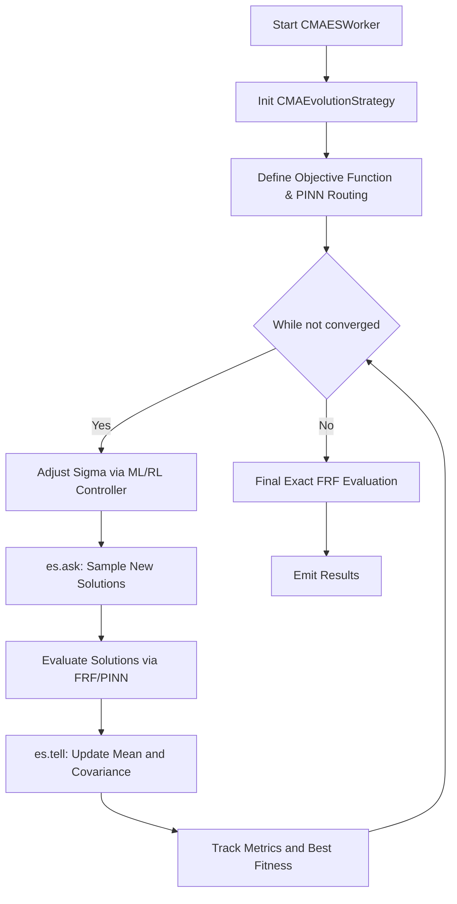

# CMA-ES (Covariance Matrix Adaptation Evolution Strategy) Documentation

## Overview
CMA-ES is a highly effective, advanced stochastic optimization algorithm designed for non-linear, non-convex, continuous domain problems. In DeVana, it is primarily used for fine-tuning dynamic vibration absorber (DVA) parameters. CMA-ES iteratively updates a multivariate normal distribution (characterized by a mean and a covariance matrix) based on the successful candidate solutions from the previous generation.

## Class: `CMAESWorker` (inherits `QThread`)

### Purpose
Executes the `cma` package's CMA-ES implementation in a background Qt thread. It translates the parameter bounds and configuration, connects to the FRF (Frequency Response Function) engine for evaluation, and supports PINN acceleration and ML/RL rate adaptations.

### Key Initialization Parameters
*   `cma_initial_sigma`: Initial standard deviation ($\sigma$) governing the step size.
*   `cma_max_iter`: Maximum generations/iterations.
*   `cma_tol`: Tolerance (`tolx`) for early convergence.
*   `cma_parameter_data`: Parameter definitions including boundaries and fixed status.
*   `alpha`, `percentage_error_scale`: Constants for sparsity penalty and error scaling.
*   **Controllers:** `use_ml_adaptive`, `use_rl_controller` (modulates $\sigma$ over time).
*   **Acceleration:** `use_pinn_solver` (PINN forward solver surrogate).

### Methods

#### 1. `objective(x)`
**Purpose:** Serves as the fitness function for a given candidate vector `x`.
**Logic:**
- Forces fixed parameters to their set values.
- **Evaluation Engine:**
    - If `use_pinn_solver` is active, queries the PINN for an instant scalar prediction. It uses a 5% random probability (`random.random() < 0.05`) to fall back to the true FRF for online fine-tuning.
    - Otherwise, runs the full `frf()` function.
- **Fitness calculation:** 
    `fitness = primary_objective + sparsity_penalty + percentage_error_scaled`
- **Online Learning:** If evaluated using FRF and PINN online learning is enabled, it calls `pinn_solver.train_step` with the true fitness.

#### 2. `run()`
**Purpose:** Main execution loop.
**Logic Flow:**
1.  **Setup:**
    - Generates the initial guess `x0` randomly within the parameter bounds (excluding fixed parameters).
    - Initializes `cma.CMAEvolutionStrategy(x0, sigma0, options)` where options include `bounds` and `maxiter`.
2.  **Adaptive Controllers (Optional):**
    - Defines `ml_select` or `rl_select` functions to modify the step size ($\sigma$) dynamically based on an Upper Confidence Bound (ML) or Q-Learning (RL) strategy.
3.  **Iteration Loop:**
    - Modifies `es.sigma` using the active controller.
    - `solutions = es.ask()`: Samples a new population of candidate solutions from the multivariate normal distribution.
    - `fitnesses = [objective(x) for x in solutions]`: Evaluates the population.
    - `es.tell(solutions, fitnesses)`: Updates the mean and covariance matrix based on the evaluated fitnesses.
    - Tracks metrics and best fitness.
    - Stops if `es.stop()` conditions are met or if `best_fitness <= cma_tol`.
4.  **Finalization:**
    - Extracts `best_candidate` (either manually tracked or `es.result.xbest`).
    - Performs one final exact FRF evaluation and emits results.

---

## Architectural Flowchart



### Flowchart Pseudo-code
```text
function run_cmaes():
    x0 = generate_initial_guess()
    es = CMAEvolutionStrategy(x0, initial_sigma, bounds)
    
    while not es.stop():
        if controllers_active:
            es.sigma = adapt_sigma(es.sigma)
            
        candidates = es.ask()
        
        fitnesses = []
        for x in candidates:
            if PINN_enabled and not random(5%):
                fit = predict_pinn(x)
            else:
                fit = evaluate_frf(x)
                if PINN_enabled: train_pinn(x, fit)
            fitnesses.append(fit)
            
        es.tell(candidates, fitnesses)
        update_metrics_and_rewards()
        
    best_x = es.result.xbest
    final_result = evaluate_frf(best_x)
    return final_result
```
