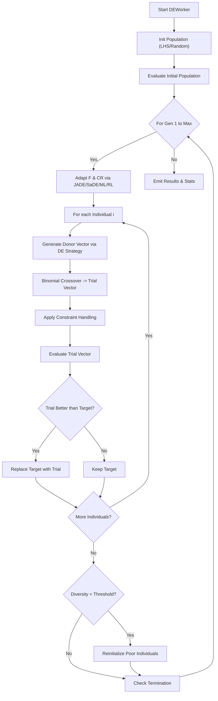

# Differential Evolution (DE) Documentation

## Overview
Differential Evolution (DE) is a stochastic, population-based optimization algorithm. It optimizes a problem by maintaining a population of candidate solutions and creating new candidate solutions by combining existing ones according to specific mathematical formulas, and then keeping whichever candidate solution has the best score or fitness on the optimization problem.

DeVana's implementation includes several advanced strategies (e.g., `rand/1`, `best/1`, `current-to-best/1`), adaptive mechanisms for crossover and mutation factors (JADE, SaDE), multi-run statistical analysis, and support for PINN and ML/RL controllers.

## Class: `DEWorker` (inherits `QThread`)

### Purpose
Executes the DE algorithm in a background thread. Manages population initialization, multiple mutation/crossover strategies, constraint handling, and integration with the overall DeVana acceleration/control ecosystem.

### Key Initialization Parameters
*   `de_pop_size`, `de_num_generations`: Population size and maximum generations.
*   `de_F`, `de_CR`: Default Mutation factor (F) and Crossover Probability (CR).
*   `strategy`: Determines how donor vectors are created (`RAND_1`, `RAND_2`, `BEST_1`, `BEST_2`, `CURRENT_TO_BEST_1`, `CURRENT_TO_RAND_1`).
*   `adaptive_method`: Dynamic adjustment of F and CR (`NONE`, `JITTER`, `DITHER`, `SaDE`, `JADE`, `SUCCESS_HISTORY`).
*   `constraint_handling`: Method to handle bounds (`penalty`, `reflection`, `projection`).
*   `diversity_preservation`: Triggers reinitialization of poor individuals if diversity drops too low.
*   `use_parallel`: Option to use `multiprocessing.Pool` for evaluating fitness.
*   `num_runs`: Number of independent runs for statistical robustness.
*   **Controllers:** `use_ml_adaptive`, `use_rl_controller` (To control F, CR, and Pop Size dynamically).
*   **Acceleration:** `use_pinn_solver` (PINN forward solver surrogate).

### Methods

#### 1. `_apply_de_strategy(self, i, population, global_best, fitnesses, parameter_bounds, fixed_parameters, num_params)`
**Purpose:** Creates a trial vector for the $i$-th individual based on the selected `DEStrategy`.
**Logic:**
- Selects random distinct indices $r_1, r_2, \dots$ from the population.
- Computes a mutated donor vector. For example, in `RAND_1`: $v = x_{r1} + F \cdot (x_{r2} - x_{r3})$.
- Applies binomial crossover (`_apply_crossover`) mixing the target vector with the donor vector based on probability `CR`.
- Enforces bounds via `_handle_constraints`.

#### 2. `evaluate_individual(self, individual)`
**Purpose:** Calculates the scalar fitness.
**Logic:** Evaluates using `frf()` or `PINNSolver`. Includes a smoothness penalty (`beta`) which penalizes large differences between adjacent parameter values in the array, on top of the standard primary objective, sparsity penalty, and percentage error sum.

#### 3. `_run_single(self, return_convergence=False)`
**Purpose:** Executes a single optimization run.
**Logic Flow:**
1.  **Initialization:** LHS (Latin Hypercube Sampling) if available, otherwise random uniform.
2.  **Evaluation:** Parallel (`mp.Pool`) or sequential evaluation.
3.  **Evolution Loop:**
    - `_adapt_control_parameters()`: Update F and CR according to `AdaptiveMethod` (e.g., JADE updates means based on successful F/CR values).
    - Or use `ml_select` / `rl_select` to update F, CR, and optionally resize population.
    - For each individual:
        - Generate trial vector via `_apply_de_strategy`.
        - Evaluate trial vector.
        - **Selection:** If the trial vector is better than the target, replace the target.
    - Diversity preservation check: Reinitialize a subset of the population if diversity falls below a threshold.
4.  **Completion:** Check termination criteria and emit results.

#### 4. `perform_sensitivity_analysis(...)`
**Purpose:** A built-in feature to run Sobol sensitivity analysis on the parameters around the optimal solution discovered by DE, leveraging `modules.sobol_sensitivity`.

---

## Architectural Flowchart



#### Pseudo-code
```text
BEGIN
  EXECUTE Start DEWorker
  EXECUTE Init Population (LHS/Random)
  EXECUTE Evaluate Initial Population
  EXECUTE For Gen 1 to Max
  EXECUTE Adapt F & CR via JADE/SaDE/ML/RL
  EXECUTE For each Individual i
  EXECUTE Generate Donor Vector via DE Strategy
  EXECUTE Binomial Crossover -> Trial Vector
  EXECUTE Apply Constraint Handling
  EXECUTE Evaluate Trial Vector
  EXECUTE Trial Better than Target?
  EXECUTE Replace Target with Trial
  EXECUTE Keep Target
  EXECUTE More Individuals?
  EXECUTE Diversity < Threshold?
  EXECUTE Reinitialize Poor Individuals
  EXECUTE Check Termination
  EXECUTE Emit Results & Stats
END
```
