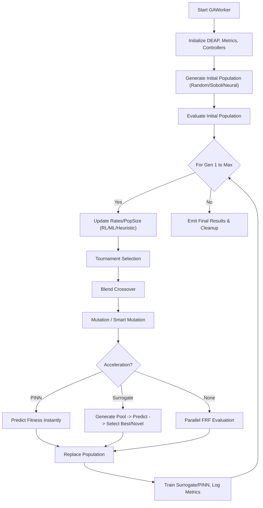

# Genetic Algorithm (GA) Documentation

## Overview
The Genetic Algorithm (GA) implementation in DeVana is a highly advanced, multi-faceted optimization engine. It is designed to optimize Dynamic Vibration Absorber (DVA) parameters by minimizing a composite fitness function based on Frequency Response Function (FRF) analysis.

The algorithm leverages the DEAP (Distributed Evolutionary Algorithms in Python) framework and extends it with cutting-edge features:
- **Adaptive Rates:** Heuristic, Machine Learning (ML Bandit), and Reinforcement Learning (RL) controllers.
- **Advanced Seeding:** Random, Sobol (QMC), Latin Hypercube Sampling (LHS), Memory-based, Best-of-Pool, and Neural Network seeding.
- **Acceleration:** Neural Surrogate screening and PINN (Physics-Informed Neural Network) forward solver acceleration.
- **Smart Mutation:** Physics-guided gradient descent mutation.
- **Enhanced Cost-Benefit Analysis:** Multi-objective fitness landscape handling operational, material, maintenance, and manufacturing costs.

## Class: `GAWorker` (inherits `QThread`)

### Purpose
Executes the heavy optimization work in a background thread to keep the PyQt5 GUI responsive. It orchestrates the entire evolutionary process, managing the population, operators, and integration with advanced ML/RL sub-systems.

### Key Initialization Parameters
*   `main_params`: Core configuration of the primary system.
*   `target_values_dict`, `weights_dict`: Objectives for each mass.
*   `omega_start`, `omega_end`, `omega_points`: Frequency range for analysis.
*   `ga_pop_size`: Number of candidate solutions.
*   `ga_num_generations`: Number of evolution cycles.
*   `ga_cxpb`, `ga_mutpb`: Initial crossover and mutation probabilities.
*   `ga_parameter_data`: Bounds and fixed states for the DVA parameters.
*   `alpha`, `percentage_error_scale`, `cost_scale_factor`: Weights for fitness components (sparsity, accuracy, cost).
*   **Controllers:** `adaptive_rates`, `use_ml_adaptive`, `use_rl_controller`.
*   **Acceleration:** `use_surrogate`, `use_pinn_solver`.
*   **Seeding:** `seeding_method` ("random", "sobol", "lhs", "neural", "memory", "best").
*   **Smart Mutation:** `use_smart_mutation`, `smart_mutation_eta`.

### Methods

#### 1. `_attach_frf_peak_positions(self, results_dict)`
**Purpose:** Computes and attaches FRF peak positions and magnitudes for each mass.
**Parameters:** `results_dict` (Output of FRF evaluation).
**Logic:** Uses `scipy.signal.find_peaks` on the magnitude data of each mass to locate resonant peaks. Filters by prominence and appends arrays of positions and values.
**Outputs:** Modifies `results_dict` in place.

#### 2. `_update_and_train_pinn_solver(self, individuals, fitnesses)`
**Purpose:** Online training of the PINN forward solver using true evaluated results.
**Parameters:** `individuals` (list of param vectors), `fitnesses` (list of fitness scores).
**Logic:** Appends vectors to a historical dataset. Executes a training step on the `PINNSolver` mapping parameter inputs to fitness scalars.
**Outputs:** None (Updates internal PINN weights).

#### 3. `_update_and_train_surrogate(self, individuals, fitnesses)`
**Purpose:** Updates the Neural Surrogate (MLP) model with new data points.
**Parameters:** `individuals`, `fitnesses`.
**Logic:** Normalizes the input vectors using parameter bounds. Caps the dataset size to prevent memory leaks (`surrogate_dataset_max`). Calls `train()` on `NeuralSurrogate`.
**Outputs:** None (Updates internal surrogate weights).

#### 4. `run(self)`
**Purpose:** The main execution loop of the GA, decorated with `@safe_deap_operation` for robust error recovery.
**Logic Flow:**
1.  **Setup:** Register DEAP types (`FitnessMin`, `Individual`). Initialize the toolbox with random parameter generation bounded by `parameter_bounds`.
2.  **Seeding:** Generates the initial population using `generate_seed_individuals()` (supports QMC or Neural models). Evaluates the initial batch.
3.  **Evolution Loop:** For each generation up to `ga_num_generations`:
    *   **Controller Update:** Updates `current_cxpb`, `current_mutpb`, and `pop_size` via the active controller (RL, ML Bandit, or Heuristic).
    *   **Selection:** Selects parents using Tournament Selection (`tournsize=3`).
    *   **Crossover:** Applies `cxBlend` with the current crossover probability.
    *   **Mutation:** Applies custom bounds-respecting mutation. If `use_smart_mutation` is active, queries the neural surrogate for the gradient and applies a downhill step.
    *   **Evaluation:** Evaluates invalid individuals. If PINN is active, predicts fitness instantly. If surrogate screening is active, generates a larger pool, predicts fitness, and evaluates only the top/most novel candidates. Otherwise, runs standard parallel FRF evaluations.
    *   **Replacement:** Replaces the population with offspring.
    *   **Metrics:** Computes diversity, convergence, and success rate. Updates controller history.
4.  **Finalization:** Emits the best individual found and detailed benchmark metrics via `finished` signal.

---

## Detailed Component Logic

### Fitness Evaluation (`evaluate_individual`)
The fitness function is a weighted sum designed to be minimized:
```python
fitness = (
    primary_objective +           # |singular_response - 1.0|
    sparsity_penalty +            # L1 norm of parameters * alpha
    percentage_error_sum / scale + # Sum of % errors from targets
    activation_penalty +          # Penalty for active parameters > threshold
    cost_term                     # Normalized or Enhanced Cost-Benefit ratio
)
```

### Sub-System: ML Bandit Controller
Uses an Upper Confidence Bound (UCB) algorithm to tune parameters.
**Logic:**
- Action space: Deltas for Crossover/Mutation (`[-0.3, -0.15, 0.0, 0.15, 0.3]`) and Population size (`[0.75, 1.0, 1.25]`).
- Reward: Computes an improvement score normalized by generation time and computational effort, penalized by deviation from a target diversity.
- Update: Action statistics are blended between historical averages and the current generation's reward.

### Sub-System: RL Controller
Uses Q-Learning to select hyperparameter adjustments.
**Logic:**
- State: Binary (0 = No improvement, 1 = Improvement).
- Policy: Epsilon-greedy.
- Update Rule: Standard Q-learning Bellman equation.
- Reward: Defined by a weighted sum of objective improvement, diversity change, speed, and diversity targeting (coefficient of variation).

### Sub-System: Surrogate Screening
**Logic:**
When evaluating, it generates a candidate pool much larger than the required population (e.g., 2x). It predicts fitness using `NeuralSurrogate`. It then selects the top candidates (exploitation) and a fraction of the most novel candidates based on distance to the training set (exploration) for actual costly FRF evaluation.

---

## Architectural Flowchart



### Flowchart Pseudo-code
```text
function run_ga():
    initialize_controllers()
    population = generate_seeds()
    evaluate(population)
    
    for gen in range(1, num_generations):
        cxpb, mutpb, pop_size = update_controller()
        if pop_size changed: resize_population()
        
        offspring = select(population)
        apply_crossover(offspring, cxpb)
        apply_mutation(offspring, mutpb)
        
        if PINN_enabled:
            predict_fitness_pinn(offspring)
        else if Surrogate_enabled:
            pool = generate_large_pool(offspring)
            predicted = predict_surrogate(pool)
            offspring = select_top_and_novel(pool, predicted)
            evaluate_frf(offspring)
        else:
            evaluate_frf(offspring)
            
        population = offspring
        update_models_and_metrics()
        
    return best_individual
```
