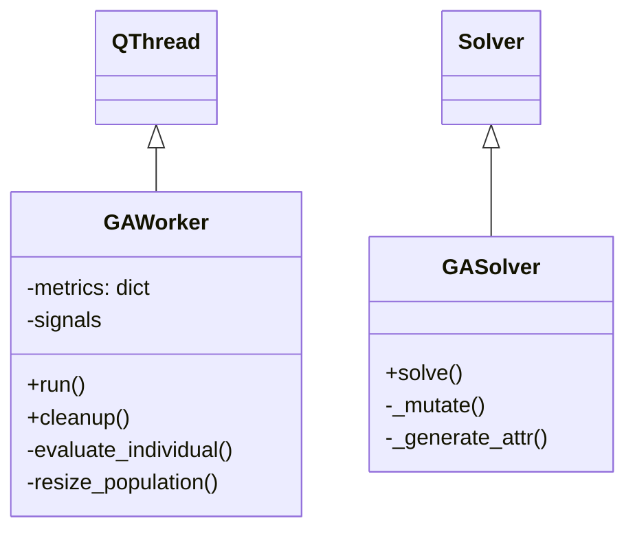
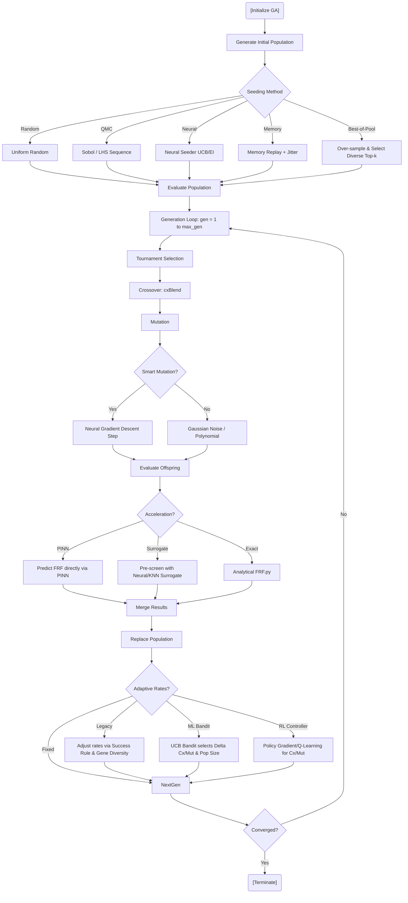

# Genetic Algorithm (GA) Deep Dive

The Genetic Algorithm (GA) implementation in DeVana is a highly advanced, highly extensible evolutionary optimizer. It is constructed to handle standard DVA parameter optimization, while providing an arsenal of advanced plugins for population seeding, rate adaptation, multi-objective aggregation, and computational acceleration.

## 1. Class Hierarchy and Encapsulation

The GA logic exists in two parallel tracks depending on the execution context:
1. `GAWorker` (`codes/workers/GAWorker.py`): The heavy, GUI-bound implementation. It subclasses `QThread` and manages UI signals, threading mutexes, and real-time resource tracking.
2. `GASolver` (`devana/optimize/ga.py`): The lightweight, headless implementation. It subclasses `Solver` from `devana/optimize/base.py`.



## 2. GA Operational Flowchart

The standard GA relies on the **DEAP** (Distributed Evolutionary Algorithms in Python) framework.



#### Pseudo-code
```text
BEGIN
  EXECUTE [Initialize GA]
  EXECUTE Generate Initial Population
  EXECUTE Seeding Method
  EXECUTE Uniform Random
  EXECUTE Sobol / LHS Sequence
  EXECUTE Neural Seeder UCB/EI
  EXECUTE Memory Replay + Jitter
  EXECUTE Over-sample & Select Diverse Top-k
  EXECUTE Evaluate Population
  EXECUTE Generation Loop: gen = 1 to max_gen
  EXECUTE Tournament Selection
  EXECUTE Crossover: cxBlend
  EXECUTE Mutation
  EXECUTE Smart Mutation?
  EXECUTE Neural Gradient Descent Step
  EXECUTE Gaussian Noise / Polynomial
  EXECUTE Evaluate Offspring
  EXECUTE Acceleration?
  EXECUTE Predict FRF directly via PINN
  EXECUTE Pre-screen with Neural/KNN Surrogate
  EXECUTE Analytical FRF.py
  EXECUTE Merge Results
  EXECUTE Replace Population
  EXECUTE Adaptive Rates?
  EXECUTE Adjust rates via Success Rule & Gene Diversity
  EXECUTE UCB Bandit selects Delta Cx/Mut & Pop Size
  EXECUTE Policy Gradient/Q-Learning for Cx/Mut
  EXECUTE Converged?
  EXECUTE [Terminate]
END
```

## 3. Side Options and Variants

The `GAWorker` contains extensive "knobs" and sub-modules to alter the search behavior:

### 3.1 Initial Seeding Strategies
Instead of simple random numbers, DeVana offers:
- **Quasi-Monte Carlo (QMC)**: Uses `scipy.stats.qmc.Sobol` and `qmc.LatinHypercube` to ensure low-discrepancy initial coverage of the parameter space.
- **Neural Seeding (`NeuralSeeder`)**: A PyTorch-based neural network trained to predict promising parameter regions. Uses acquisition functions like UCB (Upper Confidence Bound) and EI (Expected Improvement).
- **Memory Seeder**: Loads a JSON cache of past successful parameters and injects them with a small jitter.
- **Best-of-Pool**: Generates an initially massive QMC pool, evaluates all, and selects the initial population based on a "diversity stride" to ensure both high fitness and broad spatial distribution.

### 3.2 Adaptive Rate Controllers
To solve the exploration-exploitation dilemma dynamically:
- **Legacy Heuristic**: Adapts mutation and crossover probabilities based on a 1/5th success rule and an exponential moving average (EMA) of gene diversity.
- **ML Bandit (Multi-Armed Bandit)**: Uses Upper Confidence Bound (UCB) to choose discrete actions (deltas for $P_{cx}$, $P_{mut}$, and population size multiplier). Rewards are calculated based on fitness improvement divided by computation time, minus a diversity penalty.
- **Reinforcement Learning (RL) Controller**: An embedded Q-learning/epsilon-greedy agent. 

### 3.3 Evaluation Accelerators
Because analytical FRF evaluation is computationally expensive:
- **Surrogate Screening**: Trains a Neural Network or KNN on evaluated individuals. When new offspring are created, an over-sampled pool is generated, screened by the surrogate, and only the top $Q$ candidates (balancing exploitation and novelty) are sent to the exact FRF solver.
- **PINN (Physics-Informed Neural Network)**: A neural solver that directly maps DVA parameters to FRF scalar outputs (at $\omega=0$ approximation). Includes an `online_learning` flag to fine-tune the PINN continuously during the GA loop.
- **Smart Mutation**: If a neural surrogate is active, the mutation step requests the local gradient $\nabla F(x)$ from the surrogate and takes a gradient-descent step before adding minor Gaussian noise.

## 4. Mathematical Formulation of the GA Fitness

Within `evaluate_individual()`, the raw scalar response $R_{singular}$ (from `FRF.py`) is combined with multiple regularizers:

$$
\text{Fitness}(x) = | R_{singular} - 1.0 | + \alpha_{sparsity} \sum_{i} |x_i| + \frac{\sum E_{\%}}{\beta_{scale}} + P_{act} + C_{cost}
$$

Where:
- $E_{\%}$ is the percentage error of the peaks relative to target limits.
- $P_{act}$ applies a discrete penalty if a parameter crosses an activation threshold $\tau$.
- $C_{cost}$ calculates a Cost-Benefit Ratio weighting material/manufacturing metrics.

**Goal:** The GA attempts to minimize this composite fitness via `creator.FitnessMin, base.Fitness, weights=(-1.0,)`.